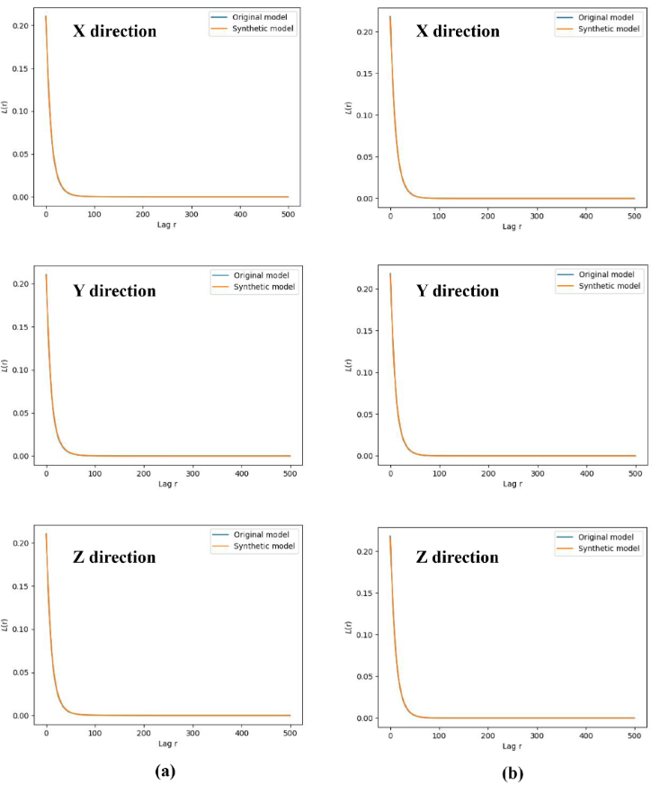

# 多维信息融合重建大尺寸数字岩石的智能方法

数据集：

代码：

主要内容：***时空长短期记忆细胞的U-Net***（ST-UNet）来重建具有复杂孔隙结构的3D大尺寸数字岩石根据连续的一维孔隙度分布，从间隔样本中有限数量的离散二维数字岩石图像中提取

Geoenergy Science and Engineering  5.1

23年

---

科学钻探通过在感兴趣区域（ROI）取芯完整样本，帮助人们了解有关流体传输的完整地下信息，但由于技术有限和岩石的脆弱特征，这些样本总是不连续或破碎的。地球物理数据测量的孔隙度易于获取，反映了岩石的某些孔隙空间信息，因此我们提出了一种具有***时空长短期记忆细胞的U-Net***（ST-UNet）来重建具有复杂孔隙结构的3D大尺寸数字岩石根据连续的一维孔隙度分布，从间隔样本中有限数量的离散二维数字岩石图像中提取。结果表明，重构样品在***结构相似度（SSIM）、峰值信噪比（PSNR）、精度、均方误差（MSE）等***方面均优于均相算法，重构孔隙空间与原始样品基本一致。形态学方面的基本事实。另外，重构模型渗透率与真实模型渗透率在输运特性上的差距仅为0.03D，在弹性特性上，声速误差仅为3.0%，孔隙度误差仅为0.07%。***当大量二维信息缺失时，仅通过一维孔隙度分布来重建数字样本，其孔隙度变化与地面真实情况保持较强的一致性，总孔隙度误差仅为0.8%***

---

## 1.介绍

取心对于帮助人们了解地下信息非常重要，可以有效指导人们为CO2封存、石油工业开发、地下水输送等服务(Blunt et al., 2013; Saenger et al., 2016; Yu et al., 2016)。 ，2019），也是科学钻探的基本要求之一，但实际上获得感兴趣区域（ROI）的完整岩石是非常困难的。这是因为取芯技术的限制导致岩心损失，特别是对于某些极其脆弱的岩性。此外，勘探和开发成本限制了从地下完全取芯。然而，这些缺失的岩石对于研究力学性质和运移特征或直观地了解地下信息可能非常重要，因此重建岩石的完整结构非常重要和有意义。

即使不考虑取芯成本和人工修复成本，通过物理手段获得完整的目标岩石也是非常困难的。然而，近年来受益于扫描技术的发展，人们可以通过扫描仪器获得岩石的数字孪生体，并以新的方式重建ROI的目标样本。这是因为数字岩石技术具有很高的重复性，人们可以根据不同的目的对数据进行重新处理，这与一些物理方法截然不同(Karimpouli and Tahmasebi, 2019)，并且该技术提供了从部分或区间重建目标样本的可能性。

重建数字岩石的常见数值方法包括基于对象的方法、基于过程的方法和基于像素的方法，这些方法在不同的数字岩石建模任务中表现出不同的结果(Feng et al., 2019; Liu et al., 2018; Luo等，2020；Zhang，2015），但这些方法都存在不足。模拟退火算法等基于对象的重建方法常采用两点概率函数、线性路径函数等形态学参数作为约束来构造数字样本，由于以显示函数为目标函数，因此具有收敛速度快的优点但构建的样品孔隙连通性往往不理想(Ji et al., 2019)。基于过程的数值方法通过模拟获得数值样本岩石通过特定半径颗粒的随机堆积而发生沉积、压实和成岩作用，其孔隙结构相对于基于对象的方法更加合理，但对于沉积过程复杂的岩石（Pyrcz 和德语，2014）。基于像素的方法（例如多点统计）主要适用于规则网格中的像素阵列，并使用统计建模来表示遵循特定地理统计约束的空隙颗粒结构（Biswal 等，2007；Wu 等， 2018）。尽管构建的数值模型结构合理，但它们对于构建长连通孔隙效果不佳（Fu et al., 2021）

近年来，受益于计算能力的快速增长，深度学习方法为数字岩石建模提供了新的途径(Cao等，2022；Da Wang等，2021)。生成对抗网络（GAN）是最流行的孔隙尺度数字岩石智能建模方法，在数字岩石扩展、数字岩石修复等工作中取得了丰硕的成果（Feng等，2020；Shams等，2020）。 ，2020）。基于GAN的方法基于零和博弈思想，利用3D卷积核构建潜在空间与真实样本之间的映射关系，以获得丰富的数字样本（You et al., 2021）。莫塞尔等人。首先对这项工作进行了尝试，之后多项相关研究如雨后春笋般出现（Mosser et al., 2017）。然而，由于GAN运行机制的限制，GAN需要大量样本来训练模型，并且构建样本的大小是固定的（Zhang et al., 2021）。这是因为大尺寸模型的构建依赖于海量的计算资源。

*一些研究尝试以视频流的形式从 2D 图像重建 3D 数字岩石，以解决重建岩石尺寸的限制（Zhang et al., 2021；Zheng and Zhang, 2021）。由于网络从学习潜在因素与真实样本之间的映射关系转变为学习两个相邻图像之间的变化关系，因此使用二维图像构建三维样本减少了对训练样本数量的需求，并减少了构建的限制模型尺寸已解决。这种以二维图像为基本元素的数据序列与一维时间序列非常相似，一些基于时间序列的深度学习方法经常应用于其上。但这些方法只关注如何丰富数字岩石结构，而不是如何恢复或重建它，这些方法也有其自身的局限性。*

卷积长短期记忆网络（ConvLSTM）是一种常见的深度学习方法，用于从 2D 数字岩石图像构建 3D 数字岩石。值得注意的是，在我们的工作中，两个相邻图像之间的局部细节变化被定义为空间信息变化，而整体图像在时间流方向上的变化被定义为时间信息变化。与传统的LSTM相比，ConvLSTM由于其串行结构可以有效地集中空间信息的变化，并且可以通过设置记忆机制有效防止梯度消失（Wang et al., 2017, 2018）。但这种方法的每个存储单元都是独立的，很容易忽略前面的内容。然而，这种方法很容易忽略之前的内容，因为每个存储单元都是独立的，从而导致生成的图像逐渐平滑（Wang et al., 2020）。为了解决这个问题，一些工作在网络中引入了自我关注机制，以更好地捕获长时间序列的空间变化信息，即时间变化信息（Zhang et al.，2021；Zheng and Zhu，2021）。但是，这种方法通常需要大量的计算资源。此外，上述研究仅集中于小尺寸数字岩石建模，而大尺寸数字岩石建模对于获取大规模地下信息非常重要。

为了重建完整的目标岩石样本，***提出了具有时空长短期记忆细胞的 U-Net（ST-UNet）基于一维孔隙度分布，从有限数量的离散二维图像中重建大尺寸数字岩石样本***，工作流程如图 1 所示。传统的 LSTM 单元水平连接，以关注时间信息变化，最后一个神经元前一个深度点的神经元连接到下一个深度点的第一个神经元，旨在关注空间信息的变化。这种关注时间和空间信息的 LSTM 单元结构被定义为时空 LSTM 单元（ST-LSTM）。使用编码器-解码器结构，使得网络具有较少的计算资源消耗，并且在编码器-解码器过程中使用跳跃连接来帮助图像恢复。此外，与无指导的模型相比，孔隙度分布可以有效指导孔隙空间的变化。结果表明，重建模型在结构相似性（SSIM）、峰值信噪比（PSNR）、准确性、均方误差（MSE）方面优于同构算法。此外，重建的孔隙空间在形态上与地面真实的孔隙空间基本相同。另外，重构模型渗透率在输运特性方面与真实模型渗透率的差距仅***为0.03 D，在声学特性方面，声学误差仅为3.0%，孔隙度误差仅为0.07%***。当大量图像缺失时，仅通过一维孔隙度分布重建数字模型，其孔隙度变化与地面真实情况保持较强的一致性，总孔隙度误差仅为0.8%。我们将在下面详细展示我们的方法和实验过程，并在讨论中讨论 ST-UNet 的局限性

图 1 大尺寸数字岩石连接间隔二维取心图像和测井数据测得的一维连续孔隙度曲线施工流程

## 2.方法

尽管与视频相比，数字核心样本并不是真实的时间序列，但当我们验证核心深度方向播放二维图像时，它***具有时间序列变化的特征***。因此，我们可以将 3D 数字岩心样本作为时间序列进行处理，Zhang 等人。证明了这种处理的可行性（Zhang et al., 2021）。

### 2.1从二维数据构建 3D 数字样本

利用2D图像构建3D图像可以看作是一种视频播放过程，2D图像构建3D图像时可以获得3D数据序列沿着时间流动的方向堆叠。然而，数字岩石图像没有时间维度，但图像可以直接沿深度变化，因此我们可以将数字岩石图像的***深度视为时间序列***。通过前一个2D图像序列得到下一个深度点的2D图像序列的过程简化如下：

其中 Xd 是 d 深度点处的 2D 图像， $\^X_{d+1}$ 是下一个深度点处的预测图像

基于视频的3D数据构建方法要求相邻2D图像之间具有较高的相似度，因此我们计算了不同深度点的相邻图像的结构相似度，结果表明相邻图像的结构相似度（SSIM）保持在0.8。 SSIM是两幅图像相似度的度量，广泛用于评估数字图像的相关性（Wang et al., 2004）。随着深度的增加，最新图像的SSIM与初始图像显着不同，但在四次图像变化内结构相似度仍能保持在0.6左右。因此，对于从2D图像生成3D样本的问题，可以简化为视频预测问题

### 2.2 连接多维数据的 3D 数字样本构建的网络架构

在实践中，我们可以很容易地从地球物理数据中获得孔隙度分布，Hertel等人的研究表明，数字岩心孔隙度分布能够与测井数据推断的孔隙度相匹配（Hertel等，2018）。因此，我***们利用一维孔隙率来指导二维图像孔隙率变化趋***势，旨在可控地指导三维数字样本的重建。为了实现这一目标，我们的研究提出了一种以时空 LSTM 单元为核心的网络。常见的2D到3D重建方法可以分为传统的空间ConvLSTM方法和时间ConvLSTM方法。我们所知道的传统ConvLSTM网络是基于提取空间变化特征的网络。如图2（b）所示，多个LSTM单元堆叠起来逐层提取图像特征来预测未来图像，并通过在水平方向添加限制来预测未来图像关注相邻时刻的空间变化。然而，这种结构限制了对原始序列时间信息的关注，因此提出了时间ConvLSTM（见图2（b）），通过设计zigzag结构来统一时间信息，并使用共享时间存储单元使网络具有时间信息捕获能力（见图3（b））

图 2. 基于 LSTM Cell 使用 2D 数字图像构建 3D 数字样本。 (a) 传统的时间 ConvLSTM 网络。 (b) 传统的空间ConvLSTM网络

然而，Zigzag ConvLSTM 失去了空间 ConvLSTM 的相邻时间的相关性，因此提出了结合两种网络优点的时空 LSTM 单元，如图 3 所示。***将孔隙率信息 pt 作为先验信息添加到输入图像中Xt 引导网络学习深度流中孔隙度的变化模式或时间流方向***，过程可以表述如下：

其中 σ 是激活函数，* 和 ⊙ 分别是卷积运算和 Hadamard 乘积。 ST-LSTM 单元由输入门 it、遗忘门 ft、输出门 ot、输入调制门 gt 和存储单元 Ct 组成。数字l表示节点数，t表示时间，但本文中t表示深度点数，可以认为是时间。

图 3. (a) ST-UNet Cell 和 (b) ST-LSTM Cell 的结构

通常，使用2D图像生成3D数字岩石需要大量的计算资源和计算时间，因此我们引入编码器-解码器架构来减少计算量，并在编码器-解码器过程中使用跳跃连接来帮助信息恢复。因此，我们提出根据1D孔隙度分布从2D图像重建3D大尺寸数字岩石，网络细节如表1和图4所示

### 2.3 数据集

在实际应用中，与获取整个ROI核心相比，获得层间岩石和离散二维图像或岩石的大部分图像相对容易，而且这些岩心通常尺寸较大，因此我们使用了大尺寸分段数字岩石一个名为 Digital Rock 的开放网站承担了这一案件。如图 5 所示，样品为 Bentheimer 砂岩，孔隙度约为 20%，采自 Zeiss Versa 510 X 射线显微镜，分辨率为 6 μm，扫描电压为 80 kV，功率为 7 W（Jackson 等）等，2019）。其尺寸为 1950 × 1950 × 10800 体素（1.17 厘米 × 1.17 厘米 × 6.48 厘米），通常由约 95% 的石英以及少量长石和粘土组成，并且具有分类良好的粒度分配。本研究中使用的样品的平均孔径经实验室测定约为 80 μm，总体积为 8769 mm3（Jackson et al., 2020）。此外，原始样本通过算法被分割成两部分：孔隙和骨架。然后，从B1样本中选取7168张1024×1024连续2D图像作为训练集，从B2样本中选取2048张1024×1024连续2D图像作为测试集来测试网络性能

### 2.4 训练网络

我们以d0图像为参考图像计算后面图像的结构相似度，结果表明d1到d7的图像与d0图像具有较高的相似度，而d7图像与目标图像的相似度较高图像仍然大于0.5。因此，我们选择***八张二维数字岩石图像作为一个批次***，也称为训练单元，前四张图像的工作方式是输入到输出，而后四张图像的工作方式是输出到输出，如图6所示。因此，训练批次中的真实数据是 dn+1 深度的图像，前四个 2D 图像是输入数据，最后 7 个 2D 图像作为预测结果。此外，我们还测试了另一种分辨率（27 μm）的碳酸盐样品，八张图像中的相似性显示出与本文中使用的样品相似的结果。因此，使用八张图像作为一个批次是非常合理的。并且我们定义了在一个训练单元中训练网络的数学过程

图 6 ST-UNet 在训练或测试单元中重建数字岩石图像的工作流程

其中，xd是输入图像，$\^x_{d+1}$是合成图像，d是深度点数

此外，我们还测试了批次内的图像数量。***当输入长度小于4时，网络无法有效地根据当前图像生成下一张图像***。并且生成的图像与上一个图像相比几乎没有发生变化。***当输入长度超过4时，GPU内存的成本急剧增加，ST-UNet的性能下降***。这是因为随着输入长度的增加，图像的 SSIM 正在下降

我们使用监督学习来训练网络模型。沿着图像变化的方向提取孔隙度数据，并将当前深度点图像与下一个深度点孔隙度数据组合并输入网络进行训练。为了充分训练网络模型，我们使用***图像损失和先验损失构建了目标损失函数***，如方程所示

其中，y是真实值，$\^y$是生成的样本，p(y)表示y的孔隙率。生成图像与未来图像之间的误差值被认为是关注图像空间变化的损失函数，其计算形式广泛用于计算机视觉任务（Hou et al., 2021a；You et al., 2021）。此外，从真实孔隙率提取生成的图像序列的孔隙率变化的误差被认为是时间信息误差，这里也可以将其视为先验信息。

网络测试表明，使用表2中的参数时网络表现出良好的性能。我们使用没有孔隙率指导的ConvLSTM和ST-UNet来与所提出方法的结果进行比较，并且这些网络使用相同的配置和超参数

### 2.5验证准则

在我们的研究中，我们使用***图像特征、形态特征和物理特性***来评估重建样本。为了评估图像特征，我们计算了***结构相似度（SSIM）、峰值信噪比（PSNR）、精度、均方误差（MSE）和孔隙率***。 SSIM和PSNR是评价图像质量的重要指标。当这些参数的值越大时，意味着重建图像的质量越好，数字岩石的显微结构越接近地面真实情况。准确率和MSE是评价网络准确率的重要指标，MSE低、准确率高意味着网络的误差很小。孔隙度是整个图像中孔隙相占据多少的指标，它与岩石的物理性质密切相关。由于该方法重建了两相分割图像，因此我们计算图像的平均值以获得岩心的孔隙度。然而，网络误差低并不意味着网络能够表现良好，而是取决于网络是否能够重建数字岩石的关键信息。该部分将在下一节中讨论。

为了评价形态特征，我们使用***孔喉直径分布和多点连通性***。对于孔喉直径分布，我们使用了一个名为 OPENPNM 的开放 PYTHON 项目，它可以提取孔隙网络建模（PNM）框架（Gostick 等，2016）。对于多点连通性，就是计算连续孔隙空间占整体孔隙空间的比例(Hou et al., 2021b)，其数学形式为：

其中I表示像素的相位，r是滞后向量。当滞后r为零时，L(0)代表岩石的孔隙度。

对于物理特性，我们计算了***渗透率和声速***。岩石的渗透性能与孔隙结构有关，计算岩石的渗透率可以评价岩石是否具有相同或相似的孔隙结构。我们使用格子玻尔兹曼方法模拟原始和重建样品的渗透率，以评估孔隙结构中的细间隙（Landry等，2014；Santos等，2020）。首先，我们在样本Z方向（生成模型方向）进行单向流动模拟，进出口端压力差为0.2 MPa，经过200万次迭代得到原始数字岩石和重建数字岩石渗透率（约28小时）。对于声速而言，可以有效评价孔隙结构。在岩石物理领域，岩石的声学性质不仅受岩性、流体性质和矿物成分的控制，还受孔隙纵横比等孔隙结构的控制(Wang和Tang，2021)。因此，对两种岩性和孔隙度相同的岩石进行声波模拟时，声速的差异可以有效反映孔隙空间形态的差异

我们使用***有限元方法（FEM）来获得岩石的力学特性***。将初始应力应变应用于数字岩石图像，然后通过共轭梯度法迭代更新弹性势能方程，得到数字岩石图像的应力应变关系（Cui等，2021； Garboczi 和 Day，1995；Hou 和 Cao，2022）。***根据计算出的应力-应变，计算体积模量和剪切模量，然后根据体积模量和剪切模量计算纵波和横波速度（分别为 VP 和 VS***）。

## 3.结果

我们使用表 2 中相同的配置和超参数来训练 ConvLSTM、无孔隙率指导的 STUNet，并将其结果与有孔隙率指导的 ST-UNet 进行比较。从视觉上看，图 7 所示的三种方法重建的结果与真实情况非常相似。因此，为了探索图像的变异性，我们计算了平均结构相似度（SSIM）、峰值信噪比（PSNR）、准确率、MSE，并对它们进行比较。如表3所示，ST-UNet的性能（包括孔隙度指导和无孔隙度指导）优于ConvLSTM方法。

图 7. 不同方法结果和地面实况的二维视图

为了显示这些指标的详细信息，我们展示了重建单元（7 个地面实况和 7 个重建图像）中重建结果的比较。如图8（a）和（b）所示，不同方法重建的图像在短距离处与地面真实情况具有较高的相似度，而相似度随着深度的增加而降低，但ST-UNET的结果更好比 ConvLSTM 的结果。这表明 ST-LSTM 单元在重建更多样本方面优于 ConvLSTM 单元。换句话说，ST-LSTM模块具有出色的时间信息捕获能力。这里，相邻两幅图像之间局部细节的变化被定义为空间信息的变化，而整体图像在时间流上的变化被定义为空间信息的变化方向被定义为时间信息变化

图 8. 计算结果的比较 (a) SSIM、(b) PSNR、(c) 精度、(d) MSE 和 (e) 孔隙率

如图8（c）和（d）所示，所有方法在短长度重建上都保持了高精度，而ST-UNET算法在长长度重建上优于ConvLSTM方法。这一结论与相似性分析的结果是一致的。然而，有孔隙度指导的 ST-UNet 方法的结果比没有孔隙度指导的结果要差，结论出乎意料。数字岩心重建的主要目的是重建岩石的微观结构，而岩石的孔隙信息是影响岩石不同物理性质的主要因素。因此，我们比较了不同方法的孔隙率，结果如图8（e）所示。具有孔隙率引导的 ST-UNet 的孔隙率与真实图像的孔隙率最为相似，而其余结果则相差很大。这说明，由于颗粒空间占据了岩石的主要空间，因此两种没有孔隙度指导的方法更多地侧重于主要颗粒空间的重建，而忽略了孔隙空间。总体而言，具有孔隙度引导的重建方法优于其他方法

## 4.讨论

在本节中，我们讨论了 ST-UNet 是否能够准确地重构孔隙空间，为什么一维孔隙度数据可以有效指导岩石物理重构以及该方法的未来应用

### 4.1孔隙空间精确重建

#### 4.1.1孔隙形态比较

我们利用两个1024×1024×1024数字样本S1和S2对网络在孔隙空间上的性能进行了精细测试，如图9所示，并通过形态学和岩石物理模拟对模型进行了评估。如图 9 所示，在 3D 视图中，重建样本和地面实况在视觉上是一致的。为了准确评估生成的模型与原始模型之间的差异，我们使用一个名为 ***OPENPNM 的开放项目提取了两个样品的孔隙结构***，该项目可以提取孔隙网络建模框架（Gostick 等，2016）。我们计算了两个样品的孔隙和喉道直径，并绘制了孔隙和喉道直径分布。

对于S1样品，原始样品的平均孔径为82μm，重构样品的平均孔径为80μm，喉道直径为分别为 48 微米和 47 微米。具体孔径和喉道直径在空间分布的位置如图 10 所示，其中 A 部分和 B 部分红色部分为 S1 样品的大孔径和大尺寸喉道示例。可以发现，重建模型准确地重建了 S1 样品的这些孔喉特征，不同直径的孔喉分布与原模型基本一致，如图 10 所示。对于 S2 样品，平均原始模型和重构模型的孔径均为84 μm，喉道直径分布分别为50 μm和51 μm，具体孔径和喉道直径分布在空间中的位置如图11所示

图 10. S1 样品中 (a) 原始模型和 (b) 重建样品之间的孔径分布以及 (c) 原始模型和 (d) 重建样品之间的喉部直径分布。 A部分和B部分分别显示了S1样品中的大尺寸孔隙和大尺寸喉道

图 11. S2 样品中 (a) 原始模型和 (b) 重建样品之间的孔径分布以及 (c) 原始模型和 (d) 重建样品之间的喉部直径分布。 C 部分显示 S2 样品中的中等大小的孔。

从图 10（a）、（b）和图 11（a）可以看出，该方法能够有效重建空间中原始孔隙分布位置信息，能够准确恢复大尺寸孔隙区域(A)、大尺寸喉部区域(B)和中等尺寸孔隙区域(C)。孔隙和喉道的大小影响岩石的流体流动特性，因此准确地重建孔隙空间结构对于获得准确的岩石输运特性具有重要意义。样品 S1 中的 A 部分和 B 部分以及样品 S2 中的 C 部分均表现出良好的孔喉重构效果，并且样品 S2 的孔径和喉道直径分布频率均优于 S1 样品，如图 1 所示。图 12 总体而言，ST-UNet 在孔径和喉道直径两个评价指标上都表现出了完美的结果，并且重建样本在所有指标上都非常接近原始样本。

为了评估重建不同长度孔隙空间的有效性，我们使用了多点连通性。多点连通性是计算连续孔隙空间占整体孔隙空间的比例。我们计算了三个方向（即 X、Y 和 Z 方向）的多点连通性。如图13所示，生成的模型完美地重建了约60像素（360μm）长的最长孔隙结构。当lag为0时，多点连通性意味着孔隙率，因此生成的模型的孔隙率与原始模型一致，***该方法解决了当前深度学习方法构建的模型仍然存在百分之十左右误差的问题原始模型***

图 12. (a) S1 样品和 (c) S2 样品的孔径分布以及 (c) S1 样品和 (d) S2 样品的喉部直径分布比较

图 13. (a) S1 样本和 (b) S2 sa 不同方向 X、Y 和 Z 的多点连通性比较

#### 4.1.2岩石物理模拟对比

我们使用格子玻尔兹曼方法模拟原始和重建样品的渗透率，以评估孔隙结构中的细间隙（Landry等，2014；Santos等，2020）。首先，我们在样本Z方向（生成模型方向）进行单向流动模拟，进出口端压力差为0.2 MPa，经过200万次迭代得到原始数字岩石和重建数字岩石渗透率（约28小时）。

渗透率可以有效地反映岩石的输运特性，通常与孔隙空间和输运途径有关。当原始模型和重建模型具有相似的渗透率时，这意味着两者具有相似的孔隙结构。对于S1样品，原始模型和生成模型的绝对渗透率分别为0.13 D和0.10 D。对于S2样品，原始模型和生成模型的绝对渗透率分别为0.18 D和0.16 D。总体而言，渗透率重建模型的略小比真实模型的。我们选取出口处和二分之一位置处的二维流速场切片进行比较，如图 14所示，其中亮度大小表示快慢流速场，亮度越大代表流速越大。经过比较，原始S1模型和重构模型在流速场上视觉上没有明显差异，如图 14所示，S2模型的流速场也得到了相同的结果

图 14. 入口处的流速场 2D 切片以及 (a) S1 原始样本、(b) S1 重建样本、(c) S2 原始样本和 (d) S2 重建样本的一半。亮度代表流速，亮度越大流速越快

为了更详细地观察岩石孔隙空间内流速场的差异，我们在Z方向相同压差下提取了尺寸为2563的代表元素体积（REV）进行渗流模拟。图 15 对比两个样品的流速场，可以发现重构样品与真实样品整体流路速度没有显着差异，但重构模型流速比真实模型慢某些孔隙和喉道连接处的流速。我们推断，在2D转3D的过程中，ST-UNet只能根据已知信息重建岩石样本，而无法针对未来图像中突然出现的孔隙空间，根据现有信息预测孔隙空间，导致产生一些孤立的孔隙空间，因此这些孔隙降低了流体速度，使整体渗透率略低于原始样品的渗透率。然而，在生成过程中添加离散的二维图像会逐渐校正生成的图像，并且大部分孔隙空间都会得到恢复。

图 15. S1 样本中 REV 原始样本和重构样本的 3D 流速场分布以及 S2 样本中 REV 原始样本和重构样本的流速场分布。红色部分为流速场差分部分

这个想法可以通过图12得到验证。***对于S1样品，重建模型中的大孔隙数量略少于真实模型中的大孔隙数量，但总体孔隙数量也大于真实模型中的大孔隙数量。真实样品的孔隙数为 101,954 个，重建模型的孔隙数为 110,923 个，但重建模型的渗透率小于真实模型的渗透率。原因是这些孔隙不参与渗透，多为孤立孔隙***。另一方面，S2样品的孔隙分布和孔隙数量基本相同，但渗透率仍存在差异，这也证明了重构模型中存在一些孤立的孔隙。这是由于未来生成的图像中存在突然出现或突然消失的孔隙，而即使根据现有图像预测未来图像，ST-UNet也无法预测这些孔隙空间，从而导致孤立孔隙的生成。孔隙率分布曲线虽然可以指导图像的走向，但能为网络提供这种突变信息，只能指导存在的孔隙的时间信息的变化，这一论点将在讨论部分得到验证。虽然这些孤立的孔隙对重构岩石的渗透率有一定的影响，但重构模型的整体孔隙空间结构与原始模型孔隙空间结构基本相同，但受到离散二维图像的约束

此外，声速可以有效评价孔隙结构。在岩石物理领域，岩石的声学性质不仅受岩性、流体性质、矿物成分的控制，还受孔隙纵横比等孔隙结构的控制。所以，我们利用有限元法获得了岩石的声速，结果如图 16 所示。总体而言，重建模型在孔隙度分布方面与真实模型保持一致，纵波和横波结果差异不大。对于 S1 样品，模拟孔隙度以及纵波和横波误差分别为 0.06%、2.2%、2.8%。对于S2样本，各参数的误差保持稳定，分别为0.07%、2.2%、2.9%。模拟结果表明，该方法能够完美控制重构岩石的孔隙空间，在孔隙结构方面与原始模型差距特别小

图 16 S1样品和S2样品中(a)、(d)孔隙率、(b)、(e)P波速度和(c)、(f)S波速度的模拟结果

### 4.2孔隙度信息的约束

ST-UNet网络性能优于其他方法的根本原因在于其优异的时空信息获取能力。 ST-LSTM 单元捕获时空信息的能力已在之前的研究中得到证明，一维孔隙率分布的添加增强了这种能力，并以受控方式生成样本。在图像重建过程中，我们将当前深度的图像以及下一个深度点的孔隙率输入到网络中，目的是让网络做出增减决策基于孔隙率变化信息的孔隙空间。当下一个深度点的孔隙度减小时，意味着孔隙空间减小；反之，它代表孔隙空间的增加。我们对训练单元的图像特征进行了详细的分析。如图17（a）和（b）所示，我们分别从原始S1数据和重建数据中提取了两个不同的孔隙度变化序列。为了可视化孔隙空间的变化，计算了生成图像的最终二维图像与第一张二维图像之间的差异

图 17. 训练单元内预测结果的不同孔隙度变化的详细信息。 (a) 原始样品和 (b) 构造样品的孔隙率变化示意图。上半部分显示孔隙空间增加，下半部分显示孔隙空间减少（c）孔隙率，（d）变化面积统计直方图，以及（e）原始样品和（f）构造样品的二维视图细节。

如图17(e)和(f)所示，上半部分显示了下图为孔隙率增大时孔隙空间的变化，下部为孔隙率减小时孔隙空间的变化。灰色部分（标记为0）表示未改变的部分，白色部分（标记为1）表示被颗粒替换的孔隙空间，黑色部分（标记为1）表示被孔隙替换的颗粒部分。当孔隙率增大时，黑色部分明显多于白色部分；当孔隙率降低时，黑色部分小于白色部分。但图像整体被灰色部分占据，这意味着不同深度点的图像变化不大，未来深度点的图像是在当前深度点图像的基础上针对孔隙边缘进行改变的。这种现象可以在图17（c）和（d）中观察到，生成的样本与原始样本变化（标签）数量的百分比基本一致。这意味着图像变化可以通过孔隙率变化来引导，这就是ST-UNet的结果优于没有1D孔隙率引导的ST-UNet的原因

### 4.3 ST-UNe 的局限性

ST-UNET方法依赖于二维信息量，当二维图像信息过少时，网络无法精确重建数字岩石的微观结构，只能粗略地推断其孔隙空间变化过程基于预测的二维图像和已知的孔隙度信息。为了讨论 ST-UNet 的局限性，我们可以根据 4 个带有孔隙度信息的 2D 数字岩心图像来预测 3068 个 2D 图像的数字岩心结构，并将它们堆叠为 3D 数字岩石。

仅使用一维孔隙率分布重建未添加到训练集中的 1024 × 1024 × 3072 矩形数字样本。如图 18 所示，重建图像在视觉上与真实图像不同，孔隙比原始样本稍大一些。但从孔隙度来看，原始模型总孔隙度为 21.72%，重构模型总孔隙度为 21.91%，两者误差仅为 0.8%。另外，我们提取二维图像的孔隙度分布，如图 18（e）所示，各切片的孔隙度与原始数据的孔隙度存在一定差异，但整体孔隙度变化趋势保持一致，这表明意味着所设计的网络模型引导了孔隙度的远距离图像变化，再次验证了网络获取时空信息的能力。

图 18. (a) 原始样品和 (b) 合成样品的 3D 视图，(c) 原始样品和 (d) 合成样品的 2D 视图，以及模型的孔隙率分布

此外，我们还计算了输入的二维信息与完整的二维信息，结果如图 19所示。随着比值减小，重构精度呈现下降趋势，而孔隙率相对误差呈现上升趋势。当该比值达到0.35左右时，变化趋势变得剧烈，而该值在0.35以内时，孔隙度相对误差变化很小，但图像精度的变化幅度大于孔隙度相对误差。因此我们可以推断，二维信息提供了更详细的孔隙结构，这就是孔隙率误差变化小于精度的原因。另一个重要的信息是，当输入的二维信息与完整的二维信息的比率高于0.35时，重建样本的准确性急剧下降

图 19 不同二维提议图像比（输入二维信息与完整二维信息的比例）的重建精度和孔隙度相对误差的变化

总体而言，通过少量的二维信息和连续的一维信息引导，网络可以更好地恢复岩心的孔隙度变化。这意味着 ST-UNet 可以使用较少的信息来预测 3D 数字岩石结构，并且预测精度依赖于 2D 图像的数量。虽然与使用足够的 2D 图像的结果相比，没有 2D 信息的结果并不准确，但当大量数字岩石样本丢失或采样间隔为取芯很大

## 5.结论

在我们的工作中，ST-UNet 被提出使用不同维度的数据重建大尺寸数字岩石，并被证明是恢复数字岩心结构的有效方法。由于孔隙度的引导，当二维数字岩心信息充足时，ST-UNet 可以准确地重建数字岩心结构；而当二维信息严重缺乏时，网络可以根据孔隙度分布预测数字岩心结构。 ST-LSTM单元的使用使网络具有更强的时空变化信息获取能力，使得网络构建的长尺度数字样本即使在信息量引导的极端情况下也能更好地完整孔隙度信息。另外，UNet网络框架的使用大大降低了计算资源的消耗

利用图像特征、形态参数和物理模拟对重建模型进行综合评价。结果表明，重建模型在结构相似性（SSIM）、峰值信噪比（PSNR）、准确性、均方误差（MSE）方面优于同质算法。此外，重建的孔隙空间与地面的孔隙空间基本相同形态学上的真理。另外，重构模型渗透率在输运特性方面与真实模型渗透率的差距仅为0.03 D，在声学特性方面，声学误差仅为3.0%，孔隙度误差仅为0.07%。当大量图像缺失时，仅通过一维孔隙度分布重建数字模型，其孔隙度变化与地面真实情况保持较强的一致性，总孔隙度误差仅为0.8%。这意味着该方法可以根据不同数量的信息有效地重建或预测3D数字岩石结构。此外，它还可以为利用地球物理信息构建不同尺度的数字孪生提供有效的工具，以便进一步应用通过模拟重建或预测的数值模型来预测真实情况，从而降低工程开发的风险。
