# 用高斯过程回归模型预测碳酸盐岩岩心的渗透率

数据集：

代码：

主要内容：

SPE Reservoir Characterisation and Simulation Conference and Exhibition

23年

---

机器学习（ML）方法被广泛应用于受各种因素影响的预测中***。本文提出了应用机器学习方法根据岩心样本 CT 图像开发异质渗透率预测模型的分步工作流程***。在这项工作中，从两个非均质碳酸盐岩心样品的 CT 图像中随机提取了超过一万张 3D 子图像。使用孔隙网络建模（PNM）方法模拟每个子图像的渗透率。通过统计方法从子图像中提取孔隙率、孔径、表面积、比表面积和连接系数等10个特征。构建了三个具有特征和渗透性的训练数据集。每组训练数据被输入到一个ML模型池中，其中包含5种类型的19个回归模型，包括线性回归模型、回归树、支持向量机、高斯过程回归模型和树集成。然后，训练回归模型以确定可以产生最佳渗透率预测的模型。选择具有最高 R 平方值的训练模型用于二值 CT 图像的渗透率预测。总体而言，比较训练输出表明高斯过程回归模型 (GPR) 可以很好地关联特征和渗透率。对于测试的异构核心插头，指数高斯过程模型表现最好。三组训练数据的R平方值分别为0.88、0.87和0.91。随后，使用额外的数据对所选的 ML 模型进行测试，每个测试数据集的 R 平方值均大于 0.85，证实了强大的预测性能。基于ML方法训练的模型消除了传统的耗时操作，包括距离变换和分水岭分割。它还避免了过多的内存消耗，这使得该方法适合大尺寸的图像。本文提供了一种开发另一种 PNM 模拟方法的方法，用于根据 CT 图像预测渗透率。

---

## 1.介绍

渗透率是表征岩石性质的重要参数之一，与石油工程的广泛应用密切相关。它取决于复杂的微观结构岩石孔隙空间（Pape 等，1999）。许多研究表明，***绝对渗透率与岩石物理性质密切相关，如孔隙度、孔隙几何形状、孔径、连通性、比表面积、曲折度***等(Carman 1956; Bear 1972; Katz and Thompson 1986; Sahimi 2011, Fu等，2021）。然而，没有一种分析或经验模型能够考虑所有这些特征来准确估计多孔介质的渗透率，而无需求解微观尺度的流动。 （Pan 等人，2001 年；Arns 等人，2004 年；Mostaghimi 等人，2013 年）。同时，很难量化其中一些石油物理特性

近年来，数字岩石物理（DRP）技术的快速发展促进了微观结构特征的表征（Andra等，2013；Fu等，2011）。 DRP技术应用先进的显微成像设施（Blunt等，2013；Anovitz和Cole，2015），例如X射线计算机断层扫描（CT），这是一种获得孔隙微结构3D几何形状的非破坏性和非侵入性手段（Hazlett，1995；Lindquist 等，1996；Wildenschild 等，2013；Schluter 等，2014）。目前 CT 图像的分辨率可以低至几微米，足以描绘常规岩石的孔隙空间（Flannery 等，1987；Coenen 等，2004）。这些处理后的图像用于通过不同的方法估计岩石特性

***孔隙网络建模（PNM）和直接数值模拟（DNS）是计算孔隙尺度渗透率的两种主要方法***。 PNM将复杂的孔隙空间简化为由具有假设形状的孔喉互连的具有拓扑代表性的孔体网络。孔隙和喉道之间的传输行为由半解析定律（例如哈根-泊肃叶定律）描述，这大大降低了计算成本，并使多尺度建模能够纳入大量的严重异质性。相反，DNS通过保留孔隙几何形状（一般计算元素为体素），直接将原始孔隙空间离散化为计算元素，然后在计算网格上对输运方程（如纳维-斯托克斯或拉普拉斯方程）进行数值求解或近似（ Andrä 等人，2013 年；Blunt 等人，2013 年）。***许多方法如有限差分法、有限元法、有限体积法、平滑粒子流体动力学法和格子玻尔兹曼法（LBM）等都是直接数值模拟方法***。一般来说，DNS 可以直接洞察孔隙微观结构对传输特性的影响，但它受到计算强度的限制。具有大代表性尺寸和高分辨率的3D数字微结构通常包含数亿个计算元素，这导致计算成本很高（Liu et al., 2016; Saxena et al., 2017）。首选孔隙网络建模，而不是更密集的直接数值模拟，因为简化的几何形状使得可以有效地模拟更大的 3D 数字岩石体积（Moussa 等人，2021）

人工智能的进步促使研究人员尝试应用机器学习（ML）来估计渗透率，该方法可以在保持准确性水平的同时显着降低计算成本。吴等人。 (2018) 使用 ML 方法基于简单的二维合成图像预测了渗透率。苏达科夫等人。 (2019) 测试了利用梯度提升和深度神经网络预测渗透率的适用性。 Araya-Polo 等人 (2020) 使用卷积神经网络 (CNN) 估计了 11 个碎屑岩储层的二维剖面图像的渗透率。拉巴尼等人。 （2019）训练了一个人工神经网络，以基于图像特征来模拟喉部渗透性的趋势，并降低总体计算成本。卡姆拉瓦等人。 (2020) 使用深度学习算法将多孔介质的形态与其渗透性联系起来。 Moussa 等人 (2021) 应用深度神经网络和卷积神经网络来预测 3-D CT 图像的渗透率。这些研究结果表明机器学习 (ML) 是一种以较低计算成本从 CT 图像预测渗透率的强大方法。

在本文中，从 CT 图像中提取子图像来构建数据集，用于训练一系列基于机器和深度学习的模型。目的是找到一种能够以较低的计算成本实现相当精度的模型，用于预测非均质碳酸盐岩心塞的渗透率。通过统计方法获得子图像的特征，并利用孔隙模拟子图像的渗透率网络建模方法。每组的特征和模拟渗透率被输入到机器学习模型池中，以训练不同的机器或深度学习模型。基于这四个指标，具有指数核的高斯过程回归模型产生了最佳的渗透率预测性能。最后，我们用额外的测试数据测试找到的模型，确认强大的预测性能

## 2.图像处理和渗透率模拟

对两个碳酸盐样品进行成像以用于工作流程开发。两个圆柱形样品的直径为10毫米，长度也为10毫米。每幅图像由大约数千个大小为 1000×1024 体素的切片组成。切片的分辨率为10.53 um。其他属性列于表1中。通过阈值法对图像进行分割，并以测量的孔隙率作为图像分割的基准。***图 1 显示了样本图像和相应的分割二值图像。可以看出，图像捕获了95%以上的孔隙，采用阈值分割的方法可以有效分离孔隙和岩石。***分割的图像被输入用于孔隙网络提取和渗透率模拟。基于PoreSpy开源工具包(Gostick, 2017; Gostick et al., 2019)的改进算法用于孔隙网络提取，***渗透率使用OpenPNM开源***工具包(Gostick, et al., 2016)模拟。

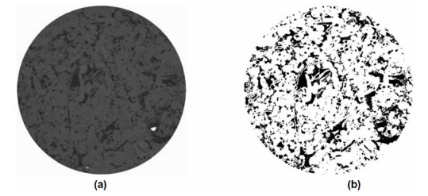

图。 1—样本图像和对应的二值图像（a）灰度图像和（b）二值图像（黑色代表毛孔）

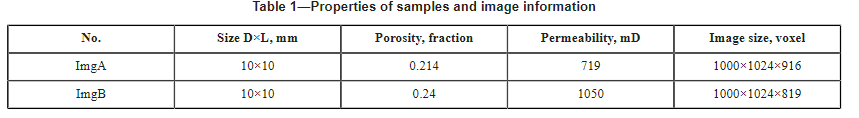

### 2.1PoreSpy和孔隙网络模型提取

***PoreSpy***是Python包的一个用于多孔介质图像定量分析的工具包，用于提取孔隙网络模型。使用该工具包对二值图像进行操作，包括距离变换、高斯平滑和标记控制的分水岭分割。分水岭分割后，孔隙体素被标记为整数，称为标记，用于孔隙网络模型提取。孔隙空间由具有理想几何形状的键（喉部）和节点（孔隙）网络来近似。在我们的作品中，球代表毛孔，棒代表喉咙。测量孔隙位置、体积、表面积和连接信息并保存在孔隙网络中

在孔隙网络提取算法中，使用高斯模糊滤波器来平滑图像并去除或最小化虚假孔隙（Gostick，2017）。球形结构元素的半径和高斯分布的标准差（Sigma）是高斯滤波器的两个重要参数。在为了找到能够最好地表示孔隙结构的参数，通过灵敏度研究对过滤器的半径和西格玛进行了优化。球形高斯滤波器的半径从 1 到 5 个体素变化，sigma 范围从 0.2 到 0.6。使模拟渗透率和测量渗透率之间的差异最小化的参数是最佳的。敏感性研究表明，半径为3、西格玛为0.4模拟的渗透率与实测渗透率吻合良好。

### 2.2OpenPNM 和渗透率模拟

OpenPNM 工具包用于模拟渗透率，它是一个开源包，为多孔材料中的传输的孔隙网络模拟提供现成的框架（Gostick 等，2016）。该工具包是基于孔隙网络模型（PNM）开发的，该模型描述了孔隙尺度上的流动和传输。在本研究中，流体的输送是用斯托克斯流来模拟的。组成孔隙网络的喉道中的流体速度由泊肃叶抛物线轮廓给出。指定整个网络的恒定压降并计算流量，然后根据达西定律确定渗透率。与 PNM 方法相关的详细信息可以从各地发表的论文中找到

## 3.数据

在这项工作中，使用回归方法来开发渗透率预测模型。图2显示了数据采集的工作流程，包括子图像准备、特征提取、孔隙网络构建、渗透率模拟和训练数据构建。输入是提取的二值子图像。该工作流有两个分支。顶部分支使用孔隙网络模型来模拟渗透率，底部分支通过统计分析方法提取孔隙特征作为特征。将模拟的渗透率和提取的特征组合在一起作为训练输入数据。这里需要强调的是孔隙分割和孔隙检测之间的区别。孔隙分割是通过分水岭法将连通的孔隙分割成单个孔隙，而孔隙检测是检测分离的物体，将连通的孔隙视为一个孔隙。

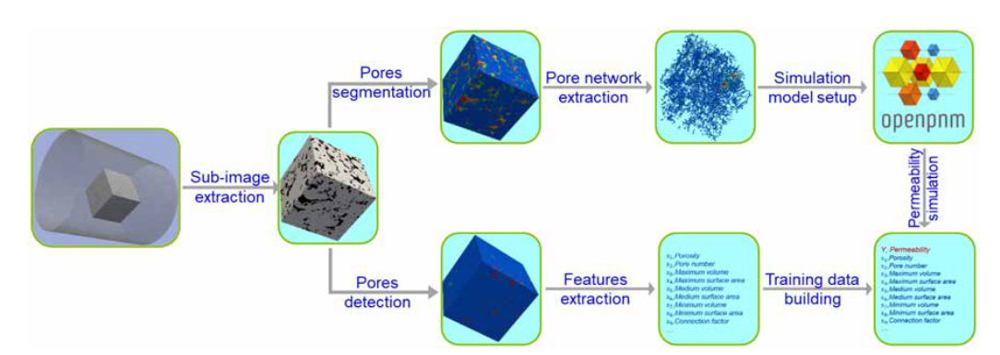

图2—训练数据构建的工作流程

### 3.1子图像准备

如前所述，使用两个碳酸盐样品来准备训练数据集。为了生成数据集，从原始图像中随机提取子图像。子图像由 300×300×300 体素组成。分别从每个样本中提取一组子图像。从样本ImgA中提取了6002个子图像，从样本ImgB中提取了4568个子图像。每个子图像都可以被认为是一个独立的岩石图像，并保留了母样本的一些几何特征

### 3.2特征提取

输入二值子图像来提取特征，如图2的底部分支所示。在不进行孔隙分割操作的情况下，二值子图像中连通孔隙的体素被视为一个孔隙。因此，该孔隙数与分段孔隙数不同，且远小于分段孔隙数。我们考虑了许多网络模型特征，这些特征可能会影响给定样本的渗透性。这些特征是孔隙率、孔数、最大孔体积、最大表面积、平均孔体积、平均表面积、中值孔体积、中值表面积、最小孔体积、最小表面积、比表面积和连接系数。连接系数定义为最大孔隙体积与总孔隙体积的比值

### 3.3 构建GT数据

孔隙尺度网络建模方法用于计算数据集中子图像的渗透率。该网络模型是岩石几何形状的简化表示，由通过圆柱形喉道连接的球形孔隙组成。然后使用网络表示来计算每个子图像的渗透性，利用达西定律并将流类型设为斯托克斯流。

作为图2所示工作流程的顶部分支，使用分水岭分割算法对输入二值子图像的连通孔进行分割。该算法使用二进制对象的欧几里得距离变换来检测不同节点之间连接的最窄部分。分水岭分割的输出是具有孤立片段的图像，每个片段代表一个独特的孔隙体。有关分水岭分割算法的方法和验证的更多详细信息，请参阅论文（Rabbani 等人，2014 年；Gostick，2017 年）。孔隙网络模型是使用改进的 PoreSpy 工具包和之前优化的参数从分割的子图像创建的。生成的孔隙网络被输入 OpenPNM 工具包来模拟不同的物理和过程，并且模拟结果被假设为训练渗透率模型的基本事实

### 3.4回归模型

我们应用回归方法来开发渗透率预测模型，与前面提到的模拟方法相比，可以降低计算成本。在该方法中，子图像被简化为表示毛孔特征的矢量（特征）。通过这种方式，训练后的模型的应用变得快速且容易。将线性回归模型、回归树、支持向量机、高斯过程回归模型和树集成等 5 种类型的 19 个回归模型放入 ML 模型池中，以寻找能够产生最佳渗透率预测性能的模型

### 3.5模型训练

按照上述数据采集过程，构建了 3 组训练数据。训练数据集 A 和 B 分别包含 6002 个和 4568 个数据对。数据集A是从样本ImgA生成的，数据集B是从样本ImgB生成的。数据集AB包含10570个数据对，是数据集A和B的组合。每个数据对包含一个描述子图像孔隙特征的向量，以及通过孔隙网络建模方法模拟的相应渗透率。每个数据集都被输入到模型池中，以找到能够产生最佳渗透率预测性能的模型。

## 4.结果和讨论

### 4.1评估指标和分数

我们使用 Matlab Regression Learner 应用程序训练所有模型。在训练过程中，监控四个指标来评估模型的可靠性：均方根误差（RMSE）、确定系数（R-Squared）、均方误差（MSE）和平均绝对误差（MAE）。 RMSE 衡量差异模型预测值与观测值之间的关系。 R 平方表示由线性回归模型中的自变量解释的响应变量的变化量的比例。 R 平方越大，线性回归模型解释的变异性就越大。 RMSE 和 R 平方是回归问题监控的非常常见的标准

在本研究中，使用 5 倍交叉验证来估计基于均方误差的损失。这种方法将观测值和响应变量分为 5 组，每组具有大致相同数量的观测值。 5组中的每组将仅作为测试数据一次，其余组作为训练数据。最佳模型由 RMSE 评分确定，并以 R-Squared、MSE 和 MAE 作为附加标准。指标得分如表 2 所示。由于表大小的限制，MAE 被忽略，MAE 等于 RMSE 的平方。三个数据集的训练结果显示出相同的趋势。使用高斯过程回归 (GPR) 模型预测的渗透率表现出最小 RMSE 和最高 R 平方。在此类模型中，指数 GPR 模型表现出最佳性能。对于三组训练数据，指数 GPR 模型的 R 平方值为 0.88、0.87 和 0.91。为了方便起见，我们将数据集 A、B 和 AB 训练的模型分别标记为 Ma、Mb 和 Mab

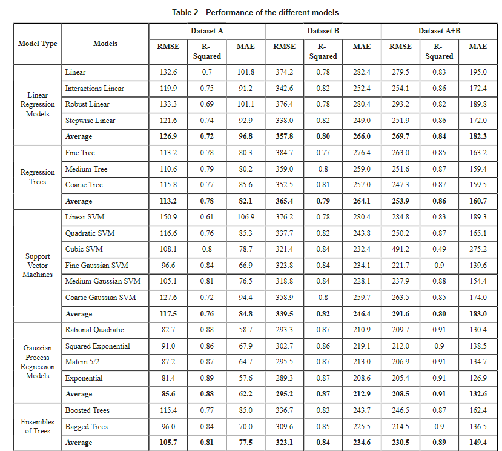

### 4.2高斯过程回归模型

高斯过程是随机变量的集合，其中任何有限数量的随机变量都具有联合高斯分布。它完全由其均值函数 m(x) 和协方差函数 k(x,x′) 指定（Rasmussen，2006）。如果 {f(x),xi Rd} 是高斯过程，则：

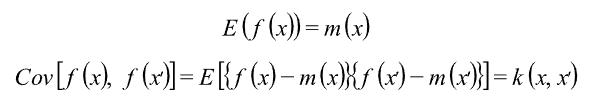

考虑以下模型

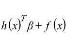

其中 f(x)~GP(0,k(x,x′))，即 f(x) 来自具有协方差函数 k(x,x′) 的零均值 GP。 h(x) 是一组基函数，将 Rd 中的原始特征向量 x 变换为 Rp 中的新特征向量 h(x)，β 是基函数系数的 p ×1 向量。该模型代表探地雷达模型。响应 y 的实例可以建模为

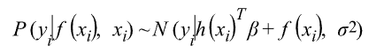

因此，探地雷达模型是一种概率模型。每个观测值 xi 都会引入一个潜在变量 f(xi)，这使得 GPR 模型成为非参数的（Matlab，2020b）。训练 GPR 模型是根据数据估计核函数的基函数系数 β、噪声方差 σ2 和超参数 θ

对于监督学习，期望具有相似预测值 xi 的点，并且自然具有接近的响应值 yi 。在高斯过程中，协方差函数表达了这种相似性（Rasmussen，2006），并且可以通过核函数来定义。在这项研究中，我们发现具有指数核的高斯过程模型对于测试的异构核心插头表现最好。指数核函数定义为

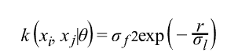

其中 σf 是信号标准差，σl 是特征长度尺度，并且

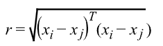

### 4.3模型表现

之前，我们给出了不同模型的分数，这表明具有指数核的高斯过程模型表现出最佳性能。图3显示了三个训练数据集的预测和观察的比较。可以看出，三个数据集的预测结果呈现出相似的趋势。模型Mab的R平方高于Ma和Mb，这表明训练数据对模型有重要影响。训练数据在更大范围内的渗透性可以生成具有强大预测能力的模型。 Mb 的 RMSE 值为 295.2，高于 Ma 的 85.6。这种明显的差异是由于样品的渗透性和非均质性的差异造成的。样品ImgB和ImgA的渗透性分别为1014mD和787mD。看起来渗透率差异不是很明显，但是训练数据的渗透率范围却相差很大。数据集A的最大渗透率约为1600 mD，但数据集B的最大渗透率约为4000 mD。这种差异也影响了模型Mab的RMSE值，该值介于模型Ma和Mb之间

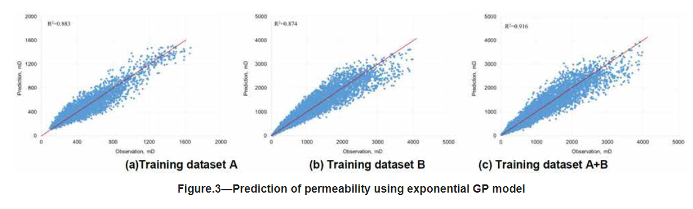

图 4-6 显示了预测渗透率与从三个数据集的训练图像中提取的特征之间的相关性。这些特征包括（a）孔隙率、（b）比表面积、（c）连接系数、（d）最大孔体积、（e）平均孔径和（f）平均表面积。在本研究中，为了节省计算时间，连接的孔隙没有被分割成单独的孔隙。这里讨论的孔隙大部分是由许多相互连通的孔隙组成的，只有一小部分是孤立的不连通的孔隙。因此，这里的个体孔容与一般的孔容概念有些不同。连通系数是最大孔隙体积与总孔隙体积的比值。考察这些特征与渗透率的相关性，可以发现一些特征与渗透率相关性较强，如孔隙度、最大孔容、连通系数等，而其他特征则相关性较弱。检查相关性发现，线性关系很难描述特征与渗透率之间的关系。从图4（a）、图5（e）和（f）、图6（e）和图6（f）可以看出，对于具有相同值的特征，渗透率变化很大，并且数据点的分布表现出集群特征。这些发现证明了孔隙结构的多样性和渗透率的严重非均质性

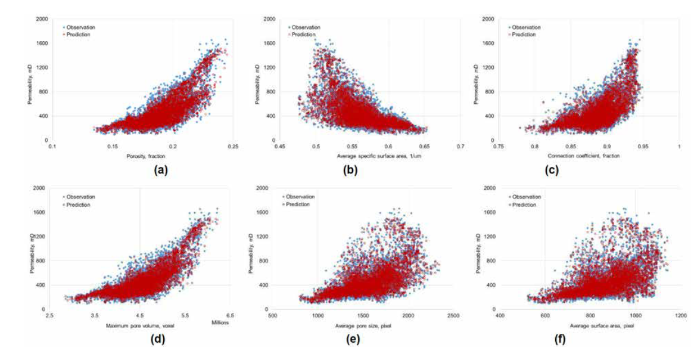

图4——预测渗透率与训练数据集A的6个提取特征值的散点图（a）孔隙率，（b）比表面积，（c）连接系数，（d）最大孔隙体积，（e）平均孔隙尺寸，以及 (f) 平均表面积

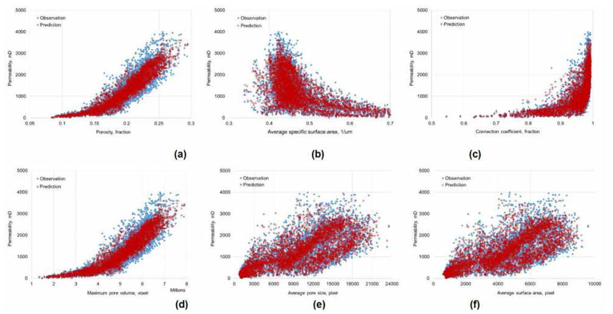

图 5——预测渗透率与训练数据集 B 的 6 个提取特征值的散点图 (a) 孔隙率，(b) 比表面积，(c) 连接系数，(d) 最大孔隙体积，(e) 平均孔隙尺寸，以及 (f) 平均表面积

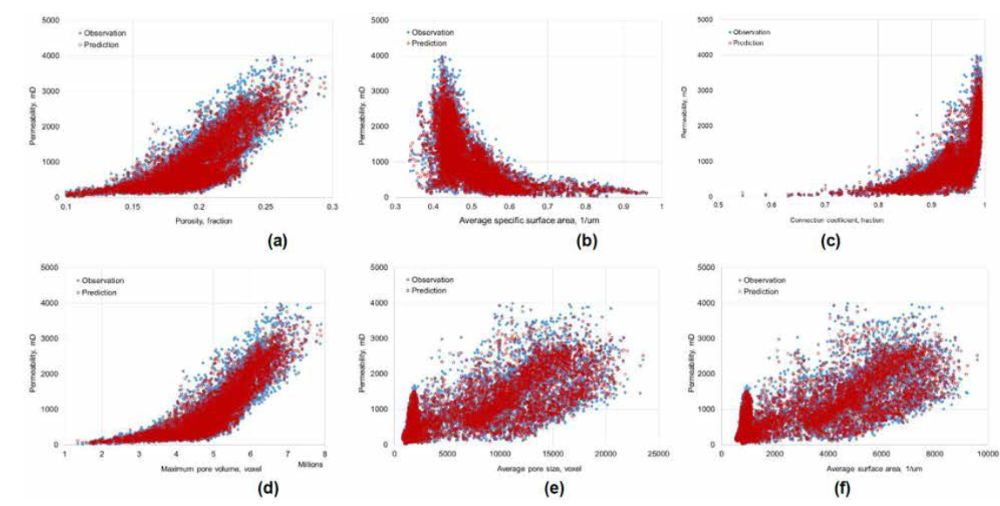

图 6——预测渗透率与训练数据集 AB 6 个提取特征值的散点图 (a) 孔隙率，(b) 比表面积，(c) 连接系数，(d) 最大孔隙体积，(e) 平均孔隙尺寸，以及 (f) 平均表面积

### 4.4渗透率预测

为了测试训练后的渗透率预测模型的可靠性。分别从原始核心图像ImgA和ImgB中提取两组子图像Tsa和Tsb。子图像的大小与之前使用的训练数据的大小相同。分别用模型 Ma 和 Mb 预测集合 Tsa 和 Tsb 的渗透率。同时，模型Mab也用于预测Tsa和Tsb组的渗透率。图 7 所示为分别用模型 Ma 和 Mab 预测的测试数据 Tsa 的渗透率。预测的 R 平方值为 0.929 和 0.933，显示出更好的预测结果。图 8 给出了模型 Mb 和 Mab 预测的 Tsb 的预测结果以及 R 平方值预测值分别为 0.859 和 0.857。对于每组测试数据，两个模型的预测结果非常相似。根据R平方值，测试数据Tsa的预测结果略好于测试数据Tsb。从图8中可以看出，预测的高渗透率值（3000-4000 mD）与观测值存在明显偏差。回顾图。从图3(b)和(c)可以发现，在3000-4000mD范围内，训练数据点相对较少，这可能导致训练模型对该范围数据的预测能力较弱。

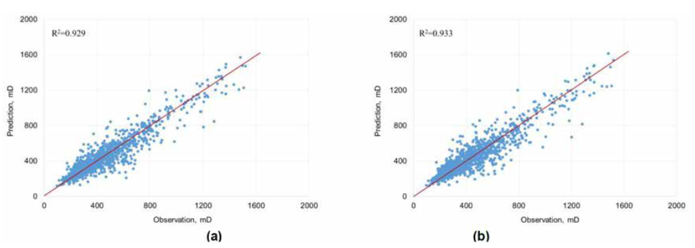

图 7 — 使用训练模型预测渗透率 (a) 使用数据集 A 训练，(b) 使用数据集 AB 训练

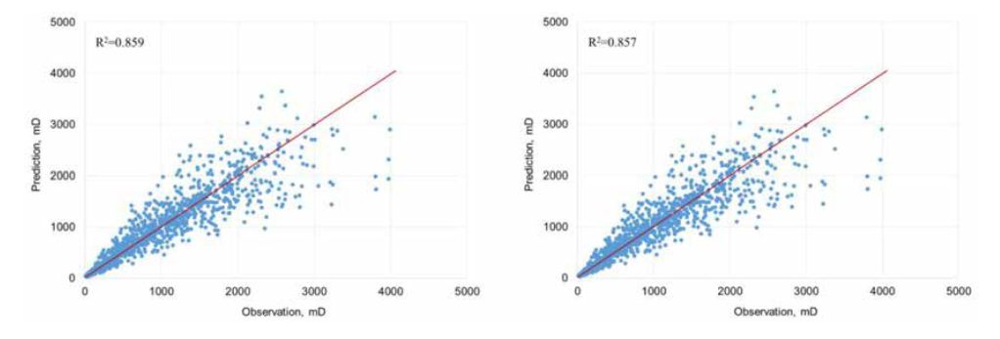

图 8——使用训练模型预测渗透率 (a) 使用数据集 B 训练，(b) 使用数据集 AB 训练

## 5.结论

在这项研究中，我们从 CT 图像中提取子图像来构建训练数据集，以找到一个机器或基于深度学习的模型来预测 CT 图像的渗透性。为此，构建了3个数据集并训练了19个回归模型。主要结论如下：

1.基于机器学习的回归建模可以作为 PNM 模拟方法的替代方法，用于根据 CT 图像预测渗透率。

 2. 对于目标 CT 图像，指数高斯过程回归模型在 19 个模型中表现出最佳性能。 

3. 训练数据对训练模型影响很大，更广泛的训练数据可以生成具有更好预测能力的模型。 

4、特征与渗透率的相关性表明孔隙结构的多样性和渗透率的非均质性。
