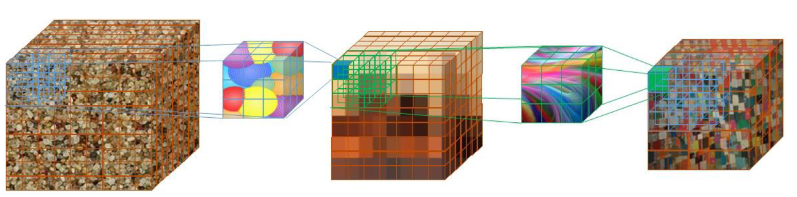
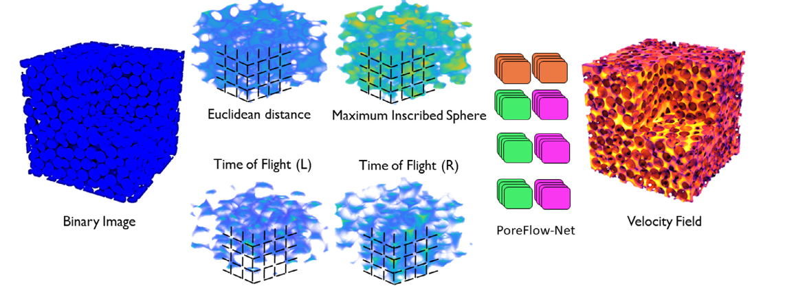
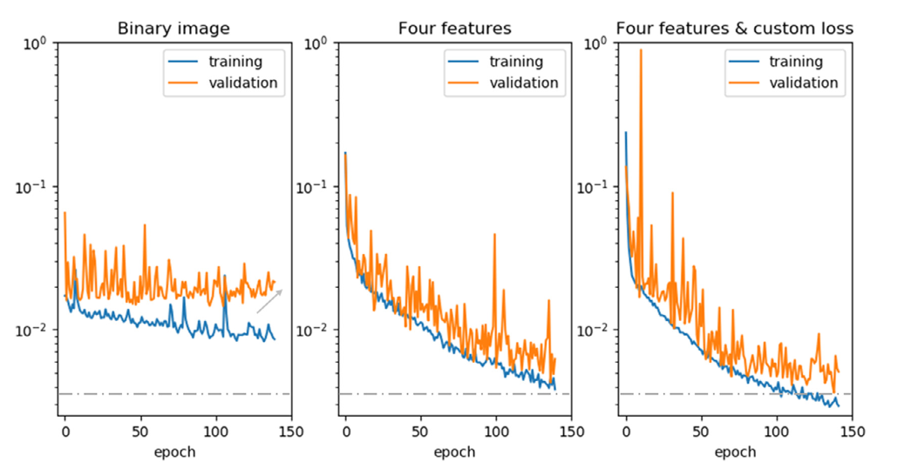

# PoreFlow-Net：用于预测穿过多孔介质的流体流动的 3D 卷积神经网络

数据集：Bentheimer 砂岩

代码：

主要内容：有降低运算量的方法图3

Advances in Water Resources 5.361

23年

---

我们提出了 PoreFlow-Net，这是一种 3D 卷积神经网络架构，可为 3D 数字岩石图像提供快速、准确的流体流动预测。我们训练我们的网络来提取多孔介质形态和流体速度场之间的空间关系。我们的工作流程从 3D 二值图像计算简单的几何信息，以训练深度神经网络（PoreFlow-Net），该网络经过优化以概括多孔材料的流动问题。我们的结果表明，提取的信息足以在不到一秒的时间内获得准确的流场预测，而无需执行昂贵的数值模拟，从而提供几个数量级的加速。我们还证明，我们的模型经过简单的合成几何形状训练，***能够在跨越粒状岩石、碳酸盐和来自各种地下地层的轻微固结介质的真实样品中提供准确的结果，***这凸显了该模型概括多孔性的能力。媒体流问题。这里介绍的工作流程展示了颠覆性技术（基于物理的机器学习模型训练）在数字岩石物理社区的成功应用

---

## 1.介绍

了解流体如何穿过地下岩层的多孔结构对于设计地下水管理、碳氢化合物提取（Raeini 等，2014）、二氧化碳封存（Chen 等，2018）和污染物修复项目（Kang）至关重要。等，2007）。目前，我们使用的大部分能源来自从油气藏中提取的碳氢化合物，人类消耗的大部分水都通过地下含水层流动，首个地下二氧化碳封存试点项目正在取得积极成果。 。由于这些原因，准确描述这些流体的流动物理学对于维护能源安全、水的可用性并潜在地避免气候变化至关重要

上述领域的决策过程中最有影响力的属性之一是感兴趣的地下储层的渗透率。该量提供了流体流经特定岩石体积的难易度的定向体积平均几何测量。渗透率由地层多孔结构的拓扑结构决定，通过计算平均速度（基于通过孔隙空间的流体速度）并将其与达西定律进行比较来计算（见方程（1））。这个数量是研究主要是为了评估地下优先流动通道（污染物示踪、油藏中的碳氢化合物运动）、流体流动瓶颈，并估计井流量（碳氢化合物和水的提取以及二氧化碳封存）。渗透率是由形成岩石的过程以及整个地质时期随后的变化决定的。盆地中颗粒的沉积、上覆压力引起的层压实、胶结、再结晶和溶解等过程会改变岩石的微观结构，从而改变可用流动路径的形状和尺寸。这些影响（范围可达数公里）会改变岩层的渗透性。由于较小尺度下流体的行为是推断较大域的关键，因此在本文中，我们将***重点关注微观尺度下的流体流动***

有多种方法可以获得岩石的流动特性。实验室测量能够通过直接测量获得样品的平均渗透率。然而，不可能在孔隙尺度上观察微观物理现象。这些测量往往需要更长的时间，甚至在致密多孔介质（孔隙率较低）中失败。另一方面，现有的分析表达式基于考虑岩石类型（岩性）、粒度分布和沉积过程等。这些需要最少的信息，但仅限于特定的岩石（有时甚至来自特定的地理位置）（Xu 和 Yu，2008）。最后，有几种数值模拟方法可以重现流体流动物理现象（Blunt 等人，2013 年；Mehmani 等人，2020 年）。其中，直接模拟方法（DSM）非常有吸引力，因为它们可以解决不规则几何形状的流动问题，为最终用户提供流体如何流过地下地层孔隙的真实快照。由于地下在多个尺度上具有高度非均质性，因此对从井或储层露头或感兴趣的类似岩石中提取的各种尺度的各种样品进行直接模拟可以为调查和模拟地下流动以改进地下管理提供有价值的信息

随着 X 射线扫描仪和其他无损成像技术的快速发展（Mees 等，2003），通过多孔材料 3D 图像模拟流体流动成为人们越来越感兴趣的话题。执***行直接模拟的典型工作流程从灰度体积（X 射线扫描仪的输出）开始，然后将其分割为两个阶段（二值图像），并离散化为体素（3D像素）的固体或流体流动的空***间。这些模拟提供了流体如何流过复杂几何形状的精确图像（分辨率为微米甚至更小）。随着计算性能的进步，可以实际模拟更大的域。然而，计算时间（即使在超级计算机集群上）可能很长，并且所需的计算资源也很大。这些方法的计算需求至少在均匀立方样本的域边长的立方上增长，因此在大多数情况下，使用典型桌面在代表性基本体积上运行直接模拟是不可行的。此外，真实材料往往具有跨越多种尺度并变化的孔径分布，这增加了代表性单元体积的大小，从而增加了执行模拟的计算时间。

有几种数值方法可用于直接从 3D 图像获取流动特性：***有限体积法（Jenny 等，2003）、平滑粒子流体动力学（Tartakovsky 和 Meakin，2005）、有限元法（White 等，2005）。 ，2006）、格子玻尔兹曼方法（LBM）***等。对其中一些方法及其运行时间的比较可以在 Yang 等人的文章中找到。 （2016）。在这项工作中，我们使用 LBM，因为它在不规则域中执行模拟很简单，并且其模拟多孔材料流动的能力经过充分测试（Pan 等人，2004 年；Santos 等人，2018 年）。尽管该方法很容易并行化，但其计算时间尺度随着域复杂性的增加而增加（图 1），这对于在多孔材料上运行的每种方法都是常见的。然而，我们强调，这里提出的工作流程并不依赖于获得流体速度场所选择的方法。

最近，深度学习方法被引入作为计算机从物理现象的观测数据中学习以预测感兴趣的变量的框架。这些方法已应用于研究图像分割、模式识别和图像描述以及自然语言处理中的许多问题。深度学习方法受益于基准数据集，因为：（1）有监督的深度学习方法需要大量经过验证的数据来训练模型； (2) 必须对经过训练的分类器的能力进行定量评估。这些算法已成功应用于数字岩石应用，例如图像分割（Andrew，2018；Bihani 等人，2019；Karimpouli 和 Tahmasebi，2019b）、计算通过固体矩阵的波传播（Karimpouli 和 Tahmasebi，2019a）、使用生成模型进行 3D 岩石重建（Mosser 等，2018），以及小域渗透率的 2D 计算（Wu 等，2018）。直接模拟流动需要分割的真实图像或多孔介质重建。在应用深度神经网络来预测多孔介质的流动（或多孔介质的放大传输特性）时遇到了一些挑战。最大的挑战是大量带标签的数据对（即可以以训练模型所需的解释地震剖面、分段图像、模拟结果等形式出现。此外，对多孔体积进行数值模拟可能需要在超级计算机的数百个核心上进行数天的计算才能收敛（图 1）。此外，获取大量类似地层的先决条件通常具有挑战性，因为所需的成像技术（即 X 射线扫描仪）的获取是有限的，并且最后，如果可以访问大型训练集，仍然存在内存限制的挑战（以下各节将详细介绍这一点）。为了规避上述困难，我们重用来自 Digital Rocks Portal（Prodanovic 等人，2015）的公开图像创建了基准数据集，并提出了一个***全面的工作流程来获取 3D 二值图像和体积解之间的函数关系纳维-斯托克斯方程***。

具体来说，在深度学习和流体流动的背景下，Carrillo 等人。 （2017）训练了一个人工神经网络来预测阻塞 2D 管道的遮挡物的形状和坐标，仅使用沿水平方向的点（代表传感器）的速度作为输入数据。此外，郭等人。 （2016）训练了一个卷积神经网络（CNN）来预测具有封闭边界的小域的带有障碍物（由简单几何形状表示）的稳态流的速度场，他们使用二值图像的距离变换作为模型输入。对于单相、时间相关问题，Hennigh（2017）提出了 Lat-Net，这是一种卷积神经网络架构，它压缩 LBM 模拟的输出（以提高内存效率），并学习后续模型之间的关系。 （压缩）时间步长。具体来说，对于多孔介质应用，Wu 等人。 (2018) 应用具有全连接层的 CNN 架构来预测 2D 图像的渗透性。苏达科夫等人。 （2018）应用简单的 2D/3D 架构来预测通过孔隙网络模型获得的系统的绝对渗透率（一种将孔隙空间简化为由圆柱体互连的球体网络的技术，丢失了图像的所有复杂特征）。本文的作者（Santos et al., 2018）最初提出了一种使用欧几里德距离作为输入来预测速度场的 CNN。尽管如此，网络还是无法泛化以预测更多异质的孔隙几何形状。卡姆拉瓦等人。 (2020) 表明，通过使用 3D 卷积，他们的模型能够预测实际孔隙几何形状的渗透率。该论文还详细解释了卷积神经网络的所有主要组件，我们将其推荐给任何不熟悉神经网络基本结构的读者。我们工作的主要区别在于，我们能够使用具有比之前发表的工作更复杂的孔隙几何形状的大型 3D 域。此外，与迄今为止的其他多孔介质工作相比，我们能够预测流体 3D 速度场，而不仅仅是尝试预测渗透率值

在这项工作中，我们的主要贡献是一种新的 3D 深度学习工作流程，它能够概括流体通过颗粒材料的单相流动。我们证明，通过结合特征提取算法、自定义损失函数和新的网络架构，我们的模型可以使用非常简单的 3D 几何形状进行训练，并在不同大小和复杂性的示例中进行准确预测。这些预测在具有图形处理单元 (GPU) 的典型台式计算机上需要不到一秒的计算，并且在准确性上与可能需要在超级计算机集群上处理数天的完整物理模拟相当。我们还将提供涵盖全球各种岩层的全面 3D 数据集

图 1. 相同计算尺寸（5003 个单元的球包和致密砂岩）的不同域的 LBM 运行时间（以秒为单位），表明孔隙度（我们的特定域）对计算时间的影响。在这些域中，较低孔隙率的样品具有更复杂的路径（具有更高表面积和更高弯曲度的孔隙空间），这增加了实现收敛所需的 LBM 迭代次数。我们在八个 Xeon E5-2690 v3 (Haswell) 处理器上运行模拟，总共 96 个计算核心 (https://portal.tacc.utexas.edu/user-guides/lonestar5)。水平虚线代表一小时，虚线代表一天，实线代表两天的运行时间。耗时最长的样本具有非常紧密的孔喉和孔之间的配位数低（导致连通性非常差），这需要大量迭代才能达到动量平衡。

## 2.方法

在本节中，我们介绍用于模拟流动物理的数值方法、形态特征提取算法和 PoreFlow-Net 的架构。

### 2.1速度场模拟

为了模拟通过感兴趣域的流体流动，***我们选择了格子玻尔兹曼方法***（LBM）（Sukop 和 Thorne，2007）。然而，这项工作的结果与用于求解流动物理的数值方法无关。 ***LBM 是对不规则几何形状的流体***进行直接模拟的最流行的方法之一。该方法模拟了网格上粒子的流动和碰撞，并且已被证明能够恢复完整的纳维-斯托克斯方程解（Frisch，1991）。 LBM的优点是算法相对容易实现、并行性高、可以对图像进行直接模拟。

[纳维-斯托克斯方程 - 维基百科，自由的百科全书 (wikipedia.org)](https://zh.wikipedia.org/wiki/%E7%BA%B3%E7%BB%B4-%E6%96%AF%E6%89%98%E5%85%8B%E6%96%AF%E6%96%B9%E7%A8%8B)

我们使用了 Pan 等人提出的相同模型。 (2006) 松弛时间（与流体粘度相关）等于 1。它是一个轻微可压缩的模型，其中应用非常小的压力梯度（1e-6 晶格单位，与域的渗透率无关）来驱动流体前进。所有模拟均在层流流态下进行（其中雷诺数远小于 1）。这与远离裂缝或钻孔的地下地层的典型流态一致。

收敛后，LBM 模拟输出图像的 3D 速度场张量。为了计算域的渗透性，我们使用达西定律

其中$\_v$表示压力梯度方向上速度场的平均值，指流体的动力粘度。为了计算 dp/dz，我们计算流动方向上 3D 速度矩阵的平均值。渗透率将流速表示为压力梯度的函数，单位为长度平方，通常以 m2 或达西表示

### 2.2特征提取

深度学习应用的典型瓶颈是：(1) 训练模型所需的大量数据，以及 (2) 执行深度学习训练的计算系统的内存限制.为了克服这些问题，我们在工作流程中添加了***预训练特征提取步骤***，在该步骤中提取岩石体积的相关形态特征。

由于我们的模拟非常耗时（在我们的集群中从几小时到几天），运行托管每个可能的 3D 结构的域是不切实际的。通过向模型添加额外的输入特征，我们的网络经过训练，可以找到图像与流场之间更稳健的函数关系。值得注意的是，与流体流动模拟相比，这些特征在几分钟内即可计算完毕（在台式计算机中），所需的计算量极少。此外，由于使用整个模拟域（> 500^3 体素）训练模型在计算上很困难，因此我们将输入和输出图像分割为子样本以执行训练过程。由于二次采样体积与来自不同领域的其他示例一起存放在训练池中，因此包括边界信息（欧几里德距离的局部信息，以及飞行时间的全局信息），为模型提供了有关物体原始空间位置的知识单个子样本（这个过程在图5）

我们从二值图像中计算出四个几何特征（图 2）。 1）为了表示二值图像的局部特征，我们提取了每个样本的欧氏距离图（也称为距离变换）。这是用以下等式计算的

其中x1和2、y1和2、z1和2分别是固体和流体边界各点的坐标。该图提供了可用于流体流动的空间分布以及到最近固体（无流动）边界的距离的紧凑表示。 2) 接下来，计算水流方向上的最大内切球（MIS）图（即 MIS 洪水）。该图是沿流动方向注入非润湿流体的简化且轻量级的表示。虽然 MIS 洪水通常用于描述两相流，但在这里它充当几何形状（孔隙空间的大小）和拓扑（与相邻孔隙结构的相似尺寸的连通性）的度量。 MIS 图提供了有关局部孔隙空间特征以及全局模拟条件的信息。它充当整个域与其子样本之间的桥梁。 3) 和 4) 最后，为了在二次采样之前向网络通报域的全局条件，我们采用了去趋势飞行时间 (ToF)。我们使用***快速行进算法***（Hassouna 和 Farag，2007）来计算域中所有点到点源（在本例中，位于入口或出口处的 XY 平面）的最短距离。该方法解决了 Eikonal 方程（Hassouna 和 Farag，2007）的边值问题，表示为：

其中 t 代表飞行时间，f(x) 代表图像每个位置的速度（在我们的例子中是一个常数）。我们将空隙空间的速度设置为 1，而固体基质设置为零（不可渗透）。此操作的结果是一个映射，其中空隙空间的每个体素都用一个数字标记，该数字描述了到边界的最短距离（以体素为单位）（z 坐标中的前几层将被连续指定）从 1 开始编号，直到找到坚固的障碍物，然后数字序列将围绕障碍物继续进行）。然后，我们减去没有固体障碍物的图像图（孔隙率为 100% 的图像）的飞行时间，以计算去趋势（归一化）图，如图 2 所示。该功能提供了有关物体弯曲度的数据。域内的全局路径。此外，它还为模型提供有关相邻子采样块的隐式信息。我们使用这种方法计算两个特征。一是点源位于数值模拟的入口，二是源位于出口（均为压力梯度边界条件）

图 2. 我们根据二值图像（Liu et al., 2017）来训练网络。矩阵值为零的区域（即固相体）以黑色显示。

***图 3. 使用 3 × 3 × 3 滤波器和步幅（执行下一个卷积运算的核距离）为 2 的三个后续卷积运算的示意图。网络经过训练以创建更紧凑（潜在）的表示，同时保留原始图像的相关特征。尽管图像在人眼看来失去了结构，但它为网络保留了最重要的信息。此操作允许通过对前一个卷积块的输出进行卷积来捕获局部和全局空间关系。与完全连接的网络相比，它的训练成本也更低，因为它具有更少的参数（更小的过滤器）***

这些特征已在文献中用于表征多孔材料。尽管如此，由于这些特征与由于速度场是高度非线性的，因此上面显示的最终特征集的选择是一个反复试验的过程。这些特征并未提供 3D 多孔材料的详尽描述。然而，它们向我们的模型提供了有关域的局部和全局边界条件的足够信息，以便能够在这些输入和纳维-斯托克斯解之间构建关系（以卷积神经网络模型的形式）

### 2.3网络

#### 2.3.1卷积神经网络

卷积神经网络 (CNN) 在计算机视觉领域的表现优于经典机器学习方法（Krizhevsky 等人，2012 年；LeCun 等人，2015 年）。这些模型表现出了在大数据集中发现复杂关系的非凡能力。通过利用离散卷积运算而不是常规矩阵乘法（即完全连接的前馈网络），它们概括了整个域的局部空间关系（稀疏交互）。 CNN 使用比输入图像小得多的滤波器，可以有效地提取有关该领域的一般且有意义的信息。通过堆叠卷积层，网络提取不同抽象级别的特征，感受野越来越宽（图 3）。最后，卷积层与平移是等变的，这意味着如果输入特征发生偏移，它们的输出也将发生相同的偏移量（在本例中，通过创建 3D 特征图）。这在模式识别中特别有用，因为它们允许可变大小的输入。使用这种结构，可以训练网络使用反向传播算法来学习输入和输出之间复杂的非线性关系。

#### 2.3.2PoreFlow-Net

最近的研究表明，网络的性能可以从增加的深度（更长的层堆栈）。除了计算上更加密集之外，更深的网络还存在梯度消失和爆炸等问题（Pascanu et al., 2012），以及通过高度相关的特征过滤饱和度，使得它们非常难以训练。为了改进梯度传播并加强训练，He 等人。 (2016)提出了残差网络(ResNet)。 ResNet 将恒等映射连接到卷积层堆栈（残差单元）的输出以方便训练。作者表明，通过针对这个新的参考残差输出，可以简化训练，避免梯度消失或饱和。此外，Ronneberger 等人。 (2015)提出了UNet。这种架构将编码分支不同层的特征映射连接到解码器，显着提高了分割精度。这样做的主要优点之一是网络结构保留高级特征（即线条和边缘）和低级特征（即整个对象）来重建输出。他们表明，由于跳跃连接（编码和解码分支之间的直接路径）提供了更好的信息流（在前向和后向计算中），网络可以轻松地进行训练，并且参数更少。在这两种架构的基础上，Zhang 等人。 (2018) 提出了深度残差 U-Net (ResUnet)，它使用残差单元作为构建块并跳过它们之间的连接。该网络被证明易于训练（与需要大量数据增强或预训练模型的 U-Net 相比），具有高效的参数数量，并使用小型训练集显示准确的结果

图 4. PoreFlow-Net 架构由四个输入分支和一个解码器组成。每个卷积层后面都有一个批量归一化层和一个激活层。解码器不使用反卷积层，而是使用上采样来调整图像大小。研究表明（Gauthier，2015），反卷积层中的像素重叠会导致伪影在更高维度上增加。在 3D 反卷积的情况下，与相邻体素相比，某些体素将获得六倍的输入信息数量（因为过滤器多次访问这些位置）。由于这些操作具有多个通道，因此网络很难学习适当的权重来重建没有伪影的输出图像。为了避免这些伪影并提高内存效率，我们使用上采样层调整图像大小，该层在所有坐标方向上以两倍重复输入（没有可训练的参数，使其更便宜）。

在本文中，我们提出了对 ***ResUnet*** 的修改，它通过使用跳跃连接将它们传递到单独的编码分支（专用于第 2.2 节中提取的每个特征），从而从所有输入特征的信息中受益。***我们为四个分支中的每一个使用三个残差单元、一个桥和一个解码器来恢复速度场。每个部分都是用剩余单元构建的（*图 4）***。我们使用缩放指数线性单元 (SeLu) (Klambauer et al., 2017) 作为激活函数。这是由以下等式：

由于速度分布跨越几个数量级（图6），由于存在大量异常值（在晶界附近速度趋于零），我们使用L1（平均绝对误差）作为成本函数。为了增加对更紧密几何形状的关注，我们计算损失如下：

其中 M 是权重向量，说明流动方向上的孔隙大小，* 代表逐元素乘法。计算 M 的算法可以在附录 A1 中找到。损失函数（方程（5））对真实值和预测之间的差异进行加权，以便训练池中的所有体素具有相同的相关性（高和低孔隙率子样本）。

图 5.我们的工作流程。从二元 3D 矩阵（左）开始，我们计算四个几何特征（第 2.2 节）。顶部的两个描述本地介质，而底部的两个提供有关全局域的信息。这些特征是针对每个样本即时计算的。然后，对这些特征进行二次采样（黑线）以训练神经网络模型。输出是压力梯度方向的流体速度场。我们用不同的颜色突出显示了速度场预测的不同数量级。

图 6. 左侧是带符号的速度对数（较小的绝对值代表较高的速度，符号代表方向）与欧几里得距离的热图。速度具有双峰（正向和负向）分布；因此它与欧几里得距离有非唯一的关系。因此，该图显示小速度和欧几里德距离周围的散布程度较高。右侧是最大内切球和飞行时间与速度的散点图。观察到异方差、多模态行为和非线性相关性。

### 2.4训练数据

#### 2.4.1数据集创建

我们使用由无序封闭的球形颗粒组成的珠包作为我们的初始域，最初由芬尼通过实验成像（可以在芬尼和普罗达诺维奇，2016年下载）。对原始 spherepack 的 5003 个子集进行离散化和分段以生成训练数据

我们对原始样本进行了四次单像素晶粒膨胀，获得了四张孔隙率递减的图像（越来越紧）模仿地下的胶结过程，但保留了原始球包的简单特征。这些样品的孔隙率范围为 29.8% 至 11%。最后，我们在这四个样本中进行了单相 LBM 流动模拟，其中平行于 z 坐标方向的压力梯度应用于其他面的无流动边界条件。由于这些域是均匀的球体包，因此与真实岩石 X 射线扫描相比，模拟收敛速度要快得多（大约几个小时）。我们使用这四个样本来训练卷积神经网络。

#### 2.4.2输入和输出之间的关系

格子玻尔兹曼模拟在网格的每个点输出压力矩阵和速度张量。在这项工作中，我们重点关注决定渗透率的流体速度的 z 分量（平行于压力梯度）。在图6中，我们显示了速度分布及其与从二值图像中提取的形态特征的关系。

从图6所示的关系中，我们可以确认，由于输入和目标输出之间复杂的、高度非线性的关系，传统的机器学习方法将无法获得准确的模型。

## 3.结果

### 3.1所提出的 3D 特征提取的影响

如上所述，在整个模拟域上训练我们的网络是不可行的。因此，有必要将 3D 矩阵二次采样为更小的体积，以便用批量数据训练模型。其背后的原因是 GPU 的内存量有限，模型参数、输入和输出、梯度等必须本地存储。在我们的实验中，传统硬件可以在内存中容纳的最大子集大小不大于 80^3 。如图 4 所示，该模型需要 2.7 GB 内存才能以一个样本的批量大小进行训练。要在整个模拟域中训练 CNN，需要大约 660 Gb 的可用内存，这大大超出了图形处理单元当前的能力。

空间感知神经网络从固定样本中获益匪浅，因为更容易在数据中找到匹配模式。理论上，3D 样本的子集大小应等于或大于代表性单元体积 (REV)（Bachmat 和 Bear，1987），以表现出感兴趣的属性（在本例中为速度）的静态行为，以积极的方式影响神经网络的训练性能。如果子集数据大小小于 REV，由于数据中存在非平稳性（以空间异质性的形式），我们不能期望获得稳定的测量结果。

为了显示我们提出的特征提取步骤在网络训练中的重要性，我***们进行了移动窗口分析来评估不同体积大小的域的可变性（Pyrcz 和 Deutsch，2014）。使用尺寸长度不断增加的窗口，我们计***算子集中孔隙度和流体速度的变异系数（平均值与标准差之比）。我们在原始球包中进行了该实验（在进行颗粒膨胀之前，孔隙率为 36%）。我们迭代地执行这个过程，直到变化变得不显着。我们在图 7 中绘制了移动窗口分析的结果。两个子图都显示，随着窗口尺寸的增加（由于样品的均匀性），孔隙率和速度的变异性分别减小。 3D 子集大小比较如图 8 所示。只有在每边 2003 个体素（图像边长的 40%）之后，速度场才稳定（变化系数小于 1%）。这种行为在更紧密且不太同质的样本中更为显着

图 7. 用孔隙率和速度的变异系数 (CV) 评估代表性单元体积。孔隙度和速度的变化随着窗口尺寸的增加而减小

图 8. 平稳性分析的移动窗口大小的 3D 可视化。灰色区域表示颗粒，而白色部分表示孔隙。蓝色立方体代表高度非平稳的窗口大小（图 7），红色立方体是我们选择的子集大小（803），绿色立方体显示图中域的静态窗口大小。 （为了解释该图例中对颜色的引用，读者可以参考本文的网络版本。

仅使用固体和孔隙的二值图像作为输入来训练神经网络会阻碍训练过程，导致过度拟合（它无法泛化，导致训练和验证曲线出现分歧），并且预测性能较差（我们进行了这个实验，结果如图 9 所示）。由于我们有兴趣创建一个能够在不同几何形状中执行的预测模型，因此我们展示了使用附加输入（添加有关子体积的附加信息，以及它与周围图像部分的关系） （后者以飞行时间的形式）在 2.2 节中描述，该模型提高了其训练性能，并具有足够的泛化能力来预测包含各种几何形状的测试集中的流场（在可接受的误差范围内）。换句话说，该模型能够找到独特的模式来构造一个鲁棒的函数，将图像与流体速度进行映射。

### 3.2模型训练

我们使用 Keras python 库 (Chollet, 2015) 和 TensorFlow (Abadi et al., 2015) 作为后端来实现模型。该模型通过使用 Adam（Kingma 和 Ba，2014）以 1e-4 的学习率最小化成本函数（方程（5））来优化。我们使用了四个球体包（它呈现了原始样本的四个后续颗粒膨胀，如第 2.4.1 节中突出显示的），并将它们二次采样到 1080 80^3 个立方体中，以 20% 的随机验证分割（216 个立方体）进行训练。该模型在配备 NVIDIA Quadro M6000 GPU 的桌面上以 5 的小批量进行了 140 个周期的训练。模型训练过程花了十二个小时。输入和输出使用 minmax 进行转换，将它们从负一限制为一。图 9 绘制了三种不同模型设置（仅使用二值图像进行训练、使用四个提出的几何特征进行训练以及利用这些特征加上自定义损失函数进行训练）的性能比较。我们观察到使用提取的特征和建议的损失时，损失值的性能显着提高

为了评估上面指定的三个训练模型泛化训练数据的能力，我们首先使用原始球体包测试模型（模型看不到，这些模型仅使用具有扩张颗粒的样本进行训练）。使用二进制输入训练的模型给出了几个数量级的渗透率相对误差。而使用四个输入特征的模型返回的误差为 15%，而最终使用这些特征加上自定义损失训练的模型与格子玻尔兹曼模拟相比，相对误差为 13%。我们在下面的部分中对后一个训练模型进行了广泛的测试

图 9. 三种不同情况的训练和验证损失值。左图显示了仅使用二值图像执行的训练，中图显示了使用四个特征（欧几里得距离、MIS 和两个 ToF）的位置，右图显示了所提出的自定义损失函数的应用。通过使用二值图像作为唯一的输入，模型会过度拟合（验证曲线上升）并且其最小值仍然很高。通过使用自定义损失函数进行训练，性能得到了提高（损失的斜率更高），并且达到了比其余函数更小的值（虚线）。

### 3.3模型测试

使用使用四个膨胀球包训练的模型（第 3.2 节），我们测试了其在不同大小和复杂度的域上的能力（与 LBM 近似的纳维-斯托克斯方程解相比）

#### 3.3.1枫丹白露砂岩数据集

第一个测试集是通过模拟沉积岩形成过程（即沉积、压实、成岩作用和胶结作用）获得的，以获得类似于法国枫丹白露砂岩形成的 3D 体积（Berg，2016）。这些图像有 4803 个体素，孔隙率从 8% 到 26% 不等。我们展示了四个样品中间的横截面图10

图 10. 测试组枫丹白露砂岩的 XY 横截面。孔隙空间以黑色显示。在胶结和压实过程中，一些结构已与主体断开，使得该测试集与我们训练集中的均质球包孔隙空间非常不同

我们在表 1 中列出了结果。这些结果与全物理模拟（用于比较我们模型的性能）非常一致。为了更仔细地分析误差，我们选择了性能最差的样本（孔隙度为 24% 的砂岩）进行进一步分析。在图 11 中，我们展示了格子玻尔兹曼解与我们的模型的视觉比较（与流动方向正交的 3D 体积的横截面）。可以看出，大部分相关的流动特征都被保留了。速度直方图的比较如图 12 所示。值得注意的是，流动流线并不总是连续的，并且 3D 解没有经过训练以满足质量平衡（因此存在相对误差）。可以添加其他约束来满足这一点，但超出了本工作的范围。在这里，我们最感兴趣的是捕获影响渗透率的主要流动特征（首选路径和死角）。

图11。  对于孔隙度为 24% 的枫丹白露砂岩，Z 方向流体流动模拟速度的 XY 横截面（左）、PoreFlow-Net 预测（中）以及这两者之间的相对误差（右）。速度以从一到负一的无量纲标度显示（最小最大变换）。如表 1 所示，孔隙空间的平均误差为 4.36%。最高误差（体素方向）出现在孔喉中（这也与速度直方图 i 一致）

图 12. 域中每个点在 z 方向上的真实速度和预测速度（晶格单元中的 4803 个点）的直方图。比较结果表明，在高速下具有良好的一致性，而在较低的范围内则略有不同。我们假设，由于训练是使用球体包进行的，因此通过具有更曲折的路径、容纳更多数量的死端孔和更多的固体表面积，网络的性能不那么准确。由于速度的最高数量级对渗透率的影响更大，因此渗透率大小具有良好的一致性

#### 3.3.2不同岩石类型的测试

为了进一步测试我们的模型，我们预测了数字岩石门户中可用的不同岩石类型的流场（Prodanovic 等，2015）。我们首先创建了一个与原始训练相似（形状）的样本通过执行数值颗粒侵蚀来生成图像。这会产生较大孔隙率的样品，其中晶界对流体流动的限制较小（渗透率较高）。这个案例与灌溉有关（Garnier et al., 1998）。我们进一步测试了原始球体包（经过数值扩展以生成我们的训练集的球体包）。我们的模型在这两个样本中产生了准确的预测，即使关系比训练集更大（速度也高出几个数量级）。然后，我们在两个露头砂岩、一个石灰岩和人工创建的多尺度微砂图像上测试了训练后的模型。其中，相对误差不高于 28%（Yang et al., 2016），表明不同的流体流动求解器之间会有相当的差异，即使提供相同的几何形状）。

我们在表 2 中展示了我们的结果，在图 14 中显示了测试集的不同 3D 域，在图 15 中显示了结果的横截面。这些几何形状具有不同的孔隙形状，并且在石灰石和微砂与训练集相比，它们具有更宽的孔径分布（图 13）。它们也有不同的绝对体积大小。虽然两个砂岩具有相似的绝对体积大小（一侧 500 个体素），但预测的相对误差却非常不同（1.06% 和 27.30%），这可能是因为它们具有不同的颗粒/孔隙分布以及不同数量的单个颗粒每面（这决定了颗粒或毛孔的解决程度）。请注意，我们的训练集以及上一节中的枫丹白露砂岩测试都具有相似的分辨率水平，因此我们在表 1 中看到了对所有情况的非常好的预测。鉴于训练集相对简单，我们发现结果与全物理模拟非常一致

图 13. 我们的三个样品的最大内切球分布。橙色是训练集，其分布是高斯分布且相对较窄。红色和蓝色分别是本泰默砂岩和微砂的 MIS 分布。这些分布具有对数正态形状，这是由于孔隙结构更加不均匀。 （为了解释该图例中对颜色的引用，读者可以参阅本文的网络版本。）

图 14. 其他测试包括：(a) 轻微固结介质，(b) Estillades 石灰岩（Muljadi，2015b），(c) Castlegate 砂岩（Sheppard 和 Prodanovic，2015），(d) 多尺度微砂（Mohammadmoradi） , 2017) 和 (e) Bentheimer 砂岩 (Muljadi, 2015a)，所有这些都可以在 Digital Rocks Portal 上找到

图 15. Castlegate 地层砂岩的模拟速度 XY 截面（左）、PoreFlow-Net 预测（中）以及这两者之间的相对误差（右）。速度以从一到负一的无量纲标度显示（最小最大变换）。孔隙空间的平均相对误差仅为 1%，如表2

## 4.结论

我们训练深度神经网络架构作为快速代理，以准确预测数字岩石样本中基于 3D 物理的流体流速场。孔隙几何形状细节和流场（及其渗透率的积分测量）之间的关系很复杂，并且仅根据几何统计数据不容易预测。然而，这种基本关系可以描述流体如何穿过地下地层，并且是环境、土木、石油工程以及地质科学领域许多研究项目的基石。

图 16. 渗透率预测与真实值。 PoreFlow-Net 能够预测各种数量级

图 17. 权重矩阵 (M) 的横截面。孔隙率较低的区域具有较高的权重（以较亮的颜色表示），因此网络“集中”在这些区域以及较大的通道中。

我们证明了我们的卷积神经网络概括了流动问题来预测岩石中的流速，这些岩石的结构比原始训练集复杂得多。这归因于网络能够模拟孔隙形状和域特征与速度场之间的复杂关系。该模型对于不同类型（不同岩性）、不同颗粒分布和孔隙度的岩石表现良好，其中渗透率在几个数量级范围内（图16）。 PoreFlow-Net 在典型桌面上计算流体流场的时间不到一秒，而标准模拟程序在超级计算机设施中需要数小时到数天（取决于所使用的硬件以及数字化孔隙空间几何形状的复杂性） ）。此外，该模型是轻量级表示（大约 25 Mb），而完整的模拟结果需要 20 倍的硬盘空间。该模型可以在任何给定的几何结构中重复使用，而模拟必须根据具体情况进行运行。未来的工作应该集中于寻找适用于裂缝区域和超致密岩石的特征。

该方法为不同的进一步应用提供了一个框架，例如成分传输、相对渗透率、岩石力学应用、地层因子或电阻率。这些模型提供了一种直接的方法来评估改善地下管理的重要特征，而无需运行昂贵的物理模型，并且考虑到数字岩石门户或在线中所证明的数字岩石图像的激增，这些模型可能是基于数据的升级的途径不同研究小组提供的数据
