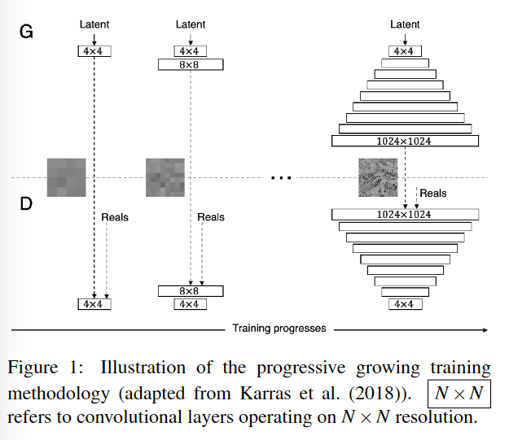
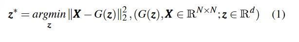
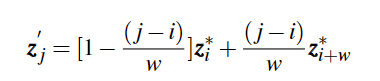
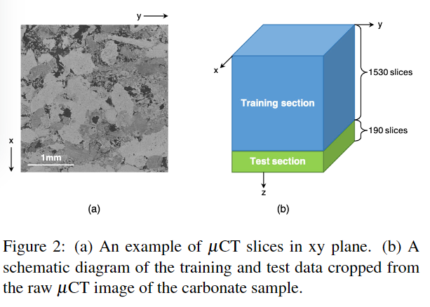
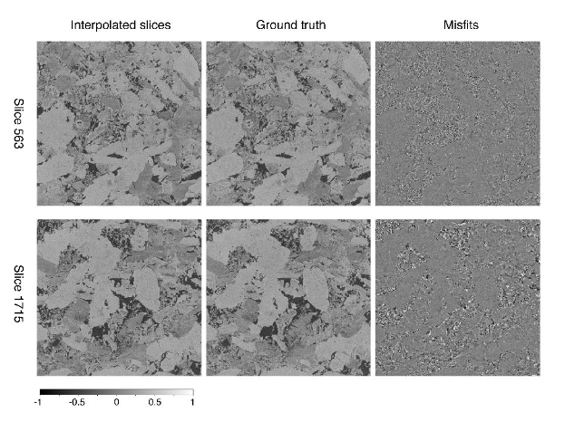
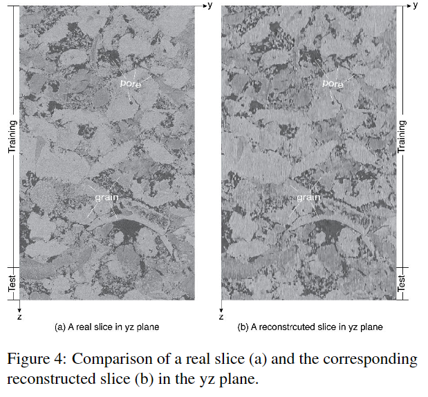
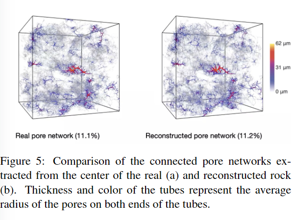

# 使用渐进生长 GAN 对碳酸盐数字岩石进行 2D 到 3D 重建

数据集：[Decane and brine injected into Estaillades carbonate - steady-state experiments - Project - Digital Rocks (digitalrocksportal.org)](https://www.digitalrocksportal.org/projects/344)

代码：

主要内容：首先，训练渐进式生长的 GAN (PG-GAN)，以根据正态分布的潜在向量生成碳酸盐岩的高质量 2D 横截面图像。接下来，通过梯度下降算法处理从扫描的二维切片到潜在向量的逆映射。最后，PG-GAN 的生成器根据反转向量之间的内插潜在向量来重建扫描切片之间缺失的切片。

First International Meeting for Applied Geoscience & Energy Expanded Abstracts第一届应用地球科学与能源国际会议

21年

---

数字岩石物理依赖于高分辨率、大尺寸 3D 数字岩石图像。在实践中，所获取图像的大小和分辨率之间总是存在权衡。此外，使用X射线微计算机断层扫描（μCT）和扫描电子显微镜（SEM）等成像技术获取高质量的数字岩石图像非常耗时。在本文中，我们提出了一种机器学习辅助的 3D 重建方法，该方法允许在图像采集过程中***降低沿轴向的采样率***。考虑到***渐进生长生成对抗网络（PG-GAN）***学习的潜在空间的线性，我们通过***在PG-GAN学习的潜在空间中的线性插值来重建***以大恒定间隔扫描的切片之间的缺失部分。我们应用我们的方法重建 Estaillades 碳酸盐岩石样本的 3D 图像。重建图像和提取的孔隙网络在视觉上与地面真实情况没有区别。总的来说，我们的方法显着节省了成像时间和成本，能够在 PG-GAN 的线性潜在空间中进行高效的成像编辑，***并在 3D 重建中利用 SEM 图像来增强图像质量，提供图像数据的高效压缩，并且扩大了用于机器学习研究的数字岩石存储库。***

## 1.介绍

随着成像技术和计算能力的进步，数字岩石物理（DRP）在表征多孔介质性质方面变得越来越准确和有效，从而在水文地质、石油开采和生产中发挥着重要作用。 CO2 捕获和储存（Blunt 等人，2013 年；Singh 等人，2017 年；Berg 等人，2017 年；Nur 等人，2011 年）。数字岩石模型通常是根据 X 射线微计算机断层扫描 (μCT) 或扫描电子显微镜 (SEM) 获取的数字岩石图像构建的。 µCT 成像可在直径为毫米到厘米级的小岩心样本上提供分辨率为微米级的 3D 图像。它受到分辨率和样本大小之间权衡的限制，这意味着更大的样本大小是以较低分辨率为代价获得的。 SEM 通过提供亚微米级更高分辨率和厘米级更大覆盖范围来弥补 µCT 成像的局限性。然而，SEM 只能对薄片的 2D 结构进行成像，这阻碍了其针对岩石的 3D 流动、力学或其他特性进行 DRP 研究的潜力。

***由于 µCT 和 SEM 成像相辅相成，因此通过将它们结合形成高分辨率、大尺寸 3D 图像，可以获得更准确的岩石特性***。桥接它们的一种方法是根据岩石样本横截面的可用 2D 图像构建 3D 图像，这通常称为 2D 到 3D 重建（Andrâ等人，2013；Berg 等人） .，2017；Blunt 等人，2013）。 2D 到 3D 重建的传统方法有两种：***随机方法和基于过程的方法***。**随机方法根据 2D 横截面图像中包含的空间统计信息重建 3D 数字岩石**（Quiblier，1984；Adler 等，1990；Blair 等，1996）。一般来说，随机方法需要几个小时才能重建数百万体素的数字岩石（Pant et al., 2014; Okabe and Blunt, 2004; ˇCapek et al., 2009）。岩石结构的简化也限制了随机方法的应用。因此，***基于过程的方法被开发出来，通过模拟沉积和成岩过程来生成具有更真实和复杂结构的数字岩石***（Øren和Bakke，2002）。然而，它们不适用于沉积和成岩过程未知的岩石，特别是碳酸盐岩。

最近，越来越多的机器学习（ML）技术被用于 2D 到 3D 重建。尽管神经网络（NN）的训练可能非常耗时且计算量大，但神经网络一旦训练完毕，就可以重复使用以快速生成数字岩石图像。大多数机器学习辅助重建方法采用生成对抗网络（GAN）（Goodfellow 等，2014）来生成 2D 或 3D 数字岩石图像（例如，Mosser 等，2017、2018；Volkhonskiy 等，2019； Shams 等人，2020）。白等人。 (2020)提出了一种不同类型的机器学习辅助方法，该方法通过降低μCT扫描中沿轴向的采样率来节省成像成本。沿轴向丢失的信息通过超分辨率卷积神经网络（SRCNN）恢复（Dong et al., 2015）。根据文献，现有的 2D 到 3D 重建的 ML 辅助方法仅成功重建包含球形到椭圆形颗粒的小尺寸数字岩石（< $200^3$）。现有方法是否能够处理结构复杂的岩石，特别是油气藏丰富的碳酸盐岩和页岩，值得怀疑。

为了克服重建碳酸盐中具有复杂结构的大规模高分辨率 3D 岩石图像的挑战，我们提出了一种机器学习辅助方法，可以根据沿轴向以大恒定间隔扫描的 2D 切片重建 3D 岩石。我们的方法分为三个步骤。******首先，训练渐进式生长的 GAN (PG-GAN)（Karras 等人，2018），以根据正态分布的潜在向量生成碳酸盐岩的高质量 2D 横截面图像。接下来，通过梯度下降算法处理从扫描的二维切片到潜在向量的逆映射。最后，PG-GAN 的生成器根据反转向量之间的内插潜在向量来重建扫描切片之间缺失的切片。******我们的方法在成像过程中沿岩样轴向降低采样率，有效地重建大尺寸、高分辨率的3D碳酸盐图像，从而显著节省成像时间和成本。此外，我们的方法可以在 PG-GAN 的潜在空间中进行高效的图像编辑，***允许在 2D 到 3D 重建中集成 SEM 图像***，实现高效的数据压缩，并扩大用于 ML 研究的数字岩石存储库。

## 2.方法

在本节中，详细解释了方法中采用的关键技术。

### 2.1 PG-GAN

PG-GAN 是 GAN 的高级变体，可以稳定合成多样化的高分辨率图像。它与其他 GAN 变体的区别在于一种新颖的训练策略，即***在训练过程中逐步增长神经网络***。如图 1 所示，网络从 4 × 4 的低分辨率图像开始，逐渐增加到 1024 × 1024 的高分辨率图像。在每个分辨率级别，神经网络都经过一定次数的迭代训练。在将较大空间分辨率同步运行的卷积层插入到生成器和鉴别器之前。通过平均池对真实图像进行下采样以匹配当前分辨率。这种渐进式增长的训练策略极大地加速了训练过程，因为大多数迭代都是在低于目标分辨率（< 1024^2）的分辨率下执行的。它还通过将具有挑战性的最终目标分解为更简单的子任务，实现并稳定了清晰的高分辨率图像的合成。

### 2.2 GAN反转

PG-GAN 训练之后是 GAN 反转，即求解给定 2D 切片对应的潜在向量。为了实现特定图像的精确一对一映射，我们采用梯度下降算法来优化像素图像重建误差的潜在向量。 X、z 和 G 分别表示图像、潜在向量和生成器，GAN 反演的目标函数为:

其中 z* 表示反转的潜在向量，N 和 d 表示图像分辨率和潜在向量维度。采用 Adam 优化器（Kingma 和 Ba，2015）来求解方程 。与网络训练的反向传播算法（Rumelhart 等，1986）类似，损失函数的梯度 $‖X − G(z) ‖^2_2$ 相对于 z 是通过基于链式法则的生成器向后计算的。

由于生成器非常深且高度非线性，因此反演问题可能是高度非凸的。因此，我们需要仔细初始化 z 以避免反转陷入局部极小值。为此，我们使用来自潜在空间的 1000 个随机采样向量中提供最低 L2 范数重建误差的 z进行初始化。

### 2.3潜在空间插值和 3D 重建

我们方法的基本思想是通过插值重建扫描层之间的夹层。实验上，由于数字岩石图像之间的非线性，图像空间中的直接线性插值会产生模糊且不可靠的重建。另一种方法是在 PG-GAN 学习的***潜在向量之间进行插值***，这已被证明与图像空间中的语义和属性是线性的（Radford 等人，2016）。具体来说，潜在空间插值可以表示为：

其中 z′ 、 w 表示插值向量和扫描间隔。 z′ 和 z* 的下标是切片索引。最后一步是使用 PG-GAN (G) 的生成器从 z′ j 生成插值图像 (X′ j)。

## 3.实验设计

本文使用 Estaillades 碳酸盐样品 (Bultreys, 2016) 的 µCT 图像。它们可以从 Digital Rocks Portal (https://www.digitalrocksportal.org/) 免费下载。我们从 3D µCT 图像的中心裁剪出一个 1024 × ×1024 × 1720 的长方体。体素沿三个维度的长度为 3.1 µm。

假设沿 z 轴以 w 的降低采样率扫描提取的 3D 长方体，则我们的方法应用于从用 $X_{1+wi}$ (i ∈ N, 1 ≤ 1 + wi ≤ 1720)表示的 xy 平面切片的子集重建 3D 长方体。以 3D 长方体作为基本事实，我们可以评估我们的方法在 3D 重建中的性能。为简单起见，除非另有说明，以下文本中的所有 2D 切片均为 xy 平面切片。我们的实验按以下步骤进行。

1. 将 3D 长方体分为训练部分（切片 1 ∼ 1530）和测试部分（切片 1531 ∼ 1720），如图 2（b）所示。
2. 使用训练部分的所有切片和测试部分的假设稀疏扫描切片（间隔为 w）训练 PG-GAN 以合成 1024 × 1024 灰度碳酸盐切片。
3. 反转对应于假设扫描切片 $X_{1+wi}$的潜在向量 (i ∈ N, 1 ≤ 1 + wi ≤ 1720)
4. 在反转的潜在向量之间进行线性插值，然后使用 PG-GAN 的生成器将潜在向量映射到图像空间来重建 3D 图像
5. 通过比较不同平面和截面（即训练和测试截面）的重建图像和真实图像来评估重建精度。测试部分旨在检查 PG-GAN 是否可以恢复训练数据之外的图像，从而评估我们方法的通用性。此外，还从真实和重建的 3D 图像中提取和比较孔隙网络。

## 4.结果

使用 Estaillades 碳酸盐样品的 µCT 图像，训练 PG-GAN 从 512 维潜在向量生成真实的碳酸盐图像。在一台 Tesla V100 GPU 上训练 PG-GAN 需要 10 天。我们尝试了从 6 到 16 的各种扫描间隔（w）。当 w 从 6 增加到 9 时，重建精度并没有出现显着的提高。然而，当 w 超过 9 时，重建图像中会出现不切实际的不连续性。因此，我们认为 9 是这块岩石样本的最佳间隔，因为它最大限度地提高了效率，同时最大限度地减少了插值伪影。

当w设为最优值9时，总共采样了192个切片，记为$X_{1+9i}$(i = 0, 1, 2, ..., 191)。然后使用梯度下降方法反转与这些切片相对应的潜在向量。收敛后，反演切片与真实切片之间的平均像素级 L2 范数重建误差低至 0.06，表明反演是准确且成功的。图 3 将两个插值切片与真实情况进行了比较。切片563和切片1715分别是来自训练部分和测试部分的某些扫描间隔的中间切片。它们是由学习生成器在给定相应的内插潜在向量的情况下生成的。两个插值切片（图 3 的第 1 列）看起来都很真实，并且在视觉上与地面真实情况（图 3 的第 2 列）没有区别。如图 3 第 3 列的错配图所示，像素错配几乎为零，并且随机分布在孔隙和晶粒内，仅在孔隙-晶粒边界处存在较小的错配。 Slice 1715 的失配比 Slice 563 稍高。这意味着可以通过更丰富的训练数据进一步减少重建误差。

图3分别来自训练部分和测试部分的切片 563 和 1715 的第一列上的插值切片 (Xrec) 与第二列上的真实值 (Xtrue) 的比较。错配 (Xrec - Xtrue) 显示在第三列。所有切片均按照方程 Xnorm = X/127.5 − 1 在 -1 和 1 之间归一化。切片和失配的灰度颜色条显示在图的底部。

3D 数字岩石图像是通过沿 z 轴串联重建的 2D 切片来实现的。图 4 将 yz 平面中的一个重建切片与地面实况进行了比较。如图 4 所示，重建切片中的孔隙和颗粒得到了很好的恢复。潜在空间中的插值过程会稍微降低图像分辨率，并在重建切片中造成轻微的线性伪影。训练部分和测试部分之间的重建性能几乎没有差异，这表明我们的方法具有令人满意的通用性。

通过数字岩石的复杂孔隙网络进行流动模拟是 DRP 的一个重要应用，用于估计岩石的流体传输特性，包括相对渗透率和毛管压力（Berg 等，2017[数字岩石技术的工业应用 - 科学直通 (sciencedirect.com)](https://www.sciencedirect.com/science/article/pii/S0920410517305600?via%3Dihub#sec2)）。因此，孔隙网络的准确重建保证了岩石流体传输特性的准确估计。这里对从真实和重建的数字岩石图像中提取的孔隙网络进行了比较。由于整个孔隙网络太大而无法清晰地可视化，因此我们仅在图 5 中呈现从岩石中心开始的 512 × 512 × 512 子网络。一般来说，真实的孔隙网络和重建的孔隙网络看起来相似且一致，特别是对于毛孔粗大的红色。除此之外，它们的有效孔隙率几乎相同，真实孔隙网络和重建孔隙网络分别为 11.1% 和 11.2%。

## 5.讨论

方法始终处理 2D xy 平面切片。 z 轴上的结构信息是通过与稀疏间隔的 xy 平面切片相对应的潜在向量之间的线性插值来获得的。这证明语义概念和像素模式是在 PG-GAN 学习的潜在空间中线性编码的，这已在之前的研究中得到证明和利用（例如，Radford 等人，2016）。因此，图像编辑在潜在空间中可能会变得更简单、更高效（Zhu et al., 2016；Perarnau et al., 2016；Zhu et al., 2020）。我们也许能够通过潜在向量的线性变换来模拟岩石变形、胶结和破坏等自然过程。

我们的方法适用于同一岩石的稀疏间隔二维横截面图像可用的条件。最近的 SEM 成像技术满足了这样的条件，这就是聚焦离子束 SEM (FIB-SEM)。它逐渐从样品中蚀刻出薄片，同时通过 SEM 依次获取新暴露的表面（Briggman 和 Bock，2012）。 FIB-SEM 的成像深度受到采集时间和内存的限制（Kelly et al., 2016）。因此，与 µCT 图像的 3D 重建相比，我们的方法具有巨大的潜力，可以从沿深度稀疏采样的 FIB-SEM 图像重建更高分辨率、更大尺寸的 3D 数字岩石图像。

数据压缩是我们的方法带来的额外好处。在我们的实验中，1720 × 1024 × 1024 的图像由 192 512 维的潜在向量表示。如果图像数据和潜在向量分别存储为 uint8 和 float32 数据，则使用我们的方法，数据大小将从 1720 MB 压缩到 0.375 MB。虽然训练后的 PG-GAN 消耗 261 MB 内存，但它比节省的内存小得多，并且随着同一个 PG-GAN 重复应用于其他碳酸盐图像的压缩，它会变得越来越微不足道。

正如许多研究中提到的，缺乏训练数据是阻碍 ML 应用到 DRP 的一个常见原因（例如，Cang 等人，2018 年；Karimpouli 和 Tahmasebi，2019 年；Santos 等人，2020 年）。我们证明 PG-GAN 可以被训练来生成逼真的高分辨率碳酸盐图像。同样，可以训练更多的 PG-GAN 来生成其他岩石类型的横截面图像。这样的 PG-GAN 存储库可用于以可忽略的计算成本快速生成任何所需数量的岩石图像，从而极大地扩大了未来机器学习研究的数字岩石存储库。

在PG-GAN的训练中，没有考虑z轴的结构信息。包含三维信息的一种方法是直接训练 3D GAN 来合成 3D 图像。然而，这种方法是不切实际的，因为与 2D GAN 相比，3D GAN 具有更多的可训练参数，并且消耗更多的内存和计算能力，使得训练过程极其缓慢，甚至容易出现内存不足（OOM）问题。因此，如何在保持合理的计算和内存成本的同时考虑各个维度的结构信息，需要在神经网络架构或训练策略设计上取得突破

## 6.结论

在本文中，我们提出了一种新方法，可以根据沿岩石样本轴向以大恒定间隔扫描的 2D 切片重建高分辨率大尺寸 3D 数字岩石图像，以节省成像成本和时间。我们准确地重建了碳酸盐岩石样本的 3D 微观结构，并将图像数据从 1720 MB 大幅压缩到 0.375 MB。我们的方法还证明了在潜在空间中有效编辑数字岩石图像的可行性，并能够在 3D 重建中利用 SEM 图像。 PG-GAN 有潜力扩大数字岩石数据库，并为 DRP 中大数据的进步做出贡献。
