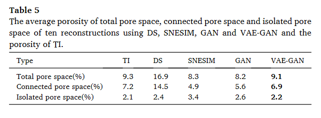

# 基于使用生成对抗网络和变分自动编码器的模型对数字核心进行 3D 重建

数据集：可以问作者要。。。

主要内容：***本文提出了一种结合变分自动编码器（VAE）和生成对抗网络（GAN）的重建方法，以实现两者优缺点的平衡。***此外，***还添加了使用行列式点过程（GDPP）的学习不同世代，***以提高生成结果的质量。与一些数值模拟方法和GAN相比，证明了该方法的有效性和实用性

代码：无

发表：Journal of Petroleum Science and Engineering 5.168 JCR工程Q1区 中科院石油Q2区

21年

---

岩心数字化，即数字岩心重构，是通过重构微观结构信息，在孔隙尺度上描述岩心微观结构，反映岩心真实内部结构的方法，已成为定量分析孔隙的有效方法。岩石物理和石油科学岩心中的结构和其他物质。数字岩心建模方法可分为物理实验方法和数值模拟方法。物理实验方法通常耗时且昂贵，因为物理实验的钻孔和岩心取样成本相当高，并且实验样品的制造有时难以实施。由于不需要复杂的物理准备和昂贵的设备，数值模拟方法相对具有成本效益，但仍然存在处理时间较长的问题。最近，深度学习及其变体可以有效地从训练图像（TI）中提取特征，为数字核心的快速重建带来光明。***本文提出了一种结合变分自动编码器（VAE）和生成对抗网络（GAN）的重建方法，以实现两者优缺点的平衡。***此外，***还添加了使用行列式点过程（GDPP）的学习不同世代，***以提高生成结果的质量。与一些数值模拟方法和GAN相比，证明了该方法的有效性和实用性

## 1.介绍

在现实世界中，通常地核原本处于地下高温高压的环境中，处于相对稳定的状态。岩心被带到地表后，由于自然条件的变化，不断受到风化和侵蚀，逐渐改变其颜色和物理化学特性。同时，在实验过程中，由于岩心的反复移动、切割或取样，岩心的内部结构很容易受到损坏(Grachev，2012)。岩心数字化是解决上述问题的一种流行方法，因为在这种情况下岩心信息可以很容易地重复使用，而不存在任何物理损坏和侵蚀的风险，从而提高效率并降低实验成本。数字岩心重构可以定量研究微观因素（如孔隙结构、润湿性、水膜等）对油气藏宏观性质的影响，因此在许多工程学科和领域发挥着重要作用。油气渗流机理研究。数字岩心重构的一般方法有***物理实验法和数值重构法两类***（Lin et al., 2017；Zhang et al., 2015）。

物理实验方法的原理是利用一些高精度扫描仪器对岩心样本进行扫描，获得一些二维切片。***对这些图像进行后处理后，通过连续堆叠这些2D图像来建立3D数字岩心模型。***典型的物理实验方法(Zhang et al., 2015, 2016)包括序列切片成像、聚焦离子束(FIB)、CT扫描等。序列切片成像方法研究孔隙空间的几何形状，从而使孔隙中的不同段将空间合理划分为空腔和喉道，得到空腔直径、喉道尺寸和喉道长度的分布(Lymberopoulos和Payatakes，1992)，近年来也被用于致密油藏建设(Tomutsa等，2007)。但由于容易破坏岩心孔隙结构，该方法的适用性受到限制(Lymberopoulos and Payatakes，1992；Vogel and Roth，2001)。弗雷德里克等人。 (1995)利用聚焦扫描显微成像技术建立了数字岩心，但通过该方法获得的数字岩心规模很小。 Fredrich 和 Lindquist (1997) 使用 FIB 来重建3D数字岩心，初步研究了不同体积砂岩孔隙度与渗透率的关系。邓斯缪尔等人。 (1991)将CT技术引入石油开发领域并加以改进。基于CT扫描的数字岩心重建可以获得高分辨率图像，但实验仪器或成本昂贵(Hou等，2007)

物理实验方法可以准确描述岩石样品的真实内部结构，但往往成本较高，且视野有限，在实际实验情况下受到高分辨率的限制，很难同时获得岩石样品的真实内部结构。生成的图像分辨率高，有效视野大。为了以较低的成本分析和获取数字岩心的大尺度结构，数值重建方法得到了广泛研究，该方法利用从岩石或其他材料的真实 2D 或 3D 图像中提取的统计信息来重建数字岩心，理论上可以不受重建规模限制。

下面介绍一些数值重构方法。 Hazlett(1997)提出了***模拟退火方法***，以包含更多的岩石统计信息，使数字岩心模型更接近真实岩心。希达贾特等人。 (2002)将***高斯模拟方法和模拟退火方法结合起来***，将高斯模拟的结果作为模拟退火方法优化的输入数据，大大提高了整个方法的计算速度。 Bryant 和 Blunt (1992) 通过***模拟岩石的真实沉积***过程建立了数字岩心。在此基础上，Bakke和Øren（2002，2003）同时考虑了***岩石粒径分布、岩石物理性质、颗粒形状和填料类型，以改进模拟***。 Okabe 和 blunt (2004, 2005) 提出了用于***重建数字核心的多点统计***（MPS）。 MPS构建的数字岩心具有良好的孔隙连通性，但模拟过程相当缓慢。吴等人。 （2004，2006）使用基于***马尔可夫链的随机网络模型构建数字核心***，其中通过模板测量相邻体素是孔隙或骨骼的概率。然而，上述数值重建方法，例如MPS，通常非常占用 CPU 资源，并且无法重用之前提取的统计信息

近年来，深度学习的快速发展为数字核心的重构带来了曙光，因为它具有从训练图像（TI）中提取特征的强大能力，并且基于GPU框架的实现可以大大加速重构过程。由于不同领域的不同需求和实际需求，深度学习的许多变体和分支蓬勃发展。作为流行的深度学习方法之一，GAN（生成对抗网络）是一种无监督生成方法，具有很强的学习数据特征的能力，可以生成与原始训练数据相似的数据（Goodfellow et al., 2014），已应用于多孔介质的重建（Mosser et al., 2017; Feng et al., 2019）。虽然GAN模拟的图像比较清晰，但有时GAN很容易出现梯度消失和模型崩溃的情况，使得训练过程相当不稳定

变分自动编码器（VAE）是 Kingma 和 Welling（2014）提出的另一个重要的生成模型。理论上，由于梯度噪声（Roeder et al., 2017）以及其损失函数引起的近似分布与真实后验分布之间的差异（Rezende and Mohamed, 2015；Kingma et al., 2015），VAE生成的图像往往有点模糊。等人，2016 年；Ranganath 等人，2016 年；Cremer 等人，2018 年）。对于 GAN，生成的图像更清晰，但模拟会出现模型崩溃和梯度消失的问题。总体而言，GAN 和 VAE 都有各自的缺点和优点，但它们可能可以结合起来以实现优缺点的平衡。因此，本文提出了一种用于数字核心重建的 VAE-GAN 模型，将 GAN 与 VAE 相结合，以在重建过程中扬长避短。与原始GAN和传统重建方法相比，我们的方法在重建效率和重建质量方面表现出一些优势。

## 2.主要思想

### 2.1 VAE介绍

VAE 是一个神经网络，由两部分组成：编码器和解码器。编码器将输入图像 x 压缩到潜在向量空间 z 中，然后解码器将 z 中的编码向量解码为输出图像 x’。潜在空间 z 服从标准正态分布，公式为 p(z)~N(0,1)。 VAE的结构如图1所示，其中神经元为基本节点单元，用“○”表示

编码器计算输入图像x的概率分布$q_\phi(z|x)$，解码器通过从z作为输入采样来计算输出图像x'的概率分布$p_θ(x'|z)$，其中$\phi$和θ分别表示编码器计算潜在空间z的概率分布的参数和解码器计算生成图像x'的概率分布的参数。 $q_ψ(z|x)$ 和 $p_θ(x’|z)$ 定义如下

其中Encoder(.)和Decoder(.)分别是编码器函数和解码器函数。 VAE的损失函数写:

其中 KL(.) 是散度函数（Kingma 和 Welling，2014）。从等式可以看出。 VAE的损失函数由两部分组成。第一部分（即“$q_\phi(z|x)[logp_θ(x'|z)]$”）表示重建误差，其目标是使输入图像和重建图像尽可能相似在反复的训练过程中。第二部分（即“$KL(q_\phi(z|x) ||p(z))$”）是表示两个概率分布之间的误差的KL散度，其目的是使输入的分布图像（即 $q_\phi(z|x)）$尽可能接近标准正态分布 p(z)

### 2.2 GAN介绍

GAN是深度学习的生成模型，如图2所示，包括生成器G和判别器D两部分。G是一个卷积神经网络，接收服从高斯分布pz(z)的随机噪声z来生成虚假数据。 D的输入是G生成的假样本或者真实样本。 D的目的是判断输入样本是G生成的真实样本还是假样本。重复上述“G输入并由D判断”训练过程足够轮次后，G最终学习到数据真实样本的分布，然后生成与真实样本相似的假样本，使得D无法判断输入是否真实。至此，整个训练结束。 GAN的损失函数定义如下：

其中$p_{data}(x)$表示真实样本x的分布； pz(z)表示噪声z的分布； G(z)是假样本； D(x)代表D判断x来自真实样本分布的概率； D(G(z))是D判断G(z)来自假样本的概率，因此G生成x的概率为1-D(G(z))； E 是数学期望。在等式中，L部分可以认为是先固定G，然后最大化D判断x来自真实样本分布的概率。那么min G L 可以看作是在D固定的情况下最小化真实样本和生成样本之间的差异的G。

GAN的目标是找到一个能够区分真实数据和生成的假数据的二元分类器，并使G拟合真实数据的分布。二元交叉熵函数通常用于 0 和 1 标签的二元分类 (Semenov et al., 2019)。因此，根据方程的二元交叉熵函数。  定义如下:

根据方程。GAN的目标是找到一个二元损失函数来减少生成的假样本与真实样本之间的误差

### 2.3 本文的主要思想

如前所述，VAE生成的图像模糊主要是由于VAE损失函数引起的梯度噪声以及近似分布与真实后验分布之间的差异。原始GAN的问题是训练过程不稳定，容易发生模型崩溃，这意味着G经常会产生与TI相同的图像。为了解决这个问题，我们提出的 VAE-GAN 模型引入了使用行列式点过程（GDPP）学习不同代。 GDPP将复杂的概率计算转化为简单的行列式计算，通过核矩阵的行列式计算概率。

假设N为采样集合Y中的元素总数，矩阵K(N×N)作为GDPP的核矩阵。 K 中的元素 Ki,j (i, j = 1, 2, …, N) 表示 Y 中第 i 个和第 j 个元素之间的相似度。由于 Ki,j 等于 Kj,i，所以 K 是实数N × N 的对称方阵。可以推断，Ki,j 越大，第 i 个样本与第 j 个样本越相似。在网络的每次迭代中，G一次总共生成b张假图像输入到网络中，用Sb = G(zb)表示，其中Sb表示G生成的b张假图像。假设得到的核矩阵为b张假图像Sb的采样为LSb，b张真实图像Rb采样得到的核矩阵为LRb。对于真实图像或生成的假图像，定义特征提取函数 phi(∙) 来提取图像信息。由于核矩阵 LSb 和 LRb 是实对称方阵，可以定义如下

其中 phi(Sb) 和 phi(Rb) 分别表示生成的假图像和真实图像的提取特征； T 是矩阵的转置。我们的目标是学习接近真实内核 LRb 的假内核 LSb。因此，核矩阵的损失函数是

等式被认为是一个无约束优化问题，其解是匹配LSb和LRb的特征值和特征向量(Li et al., 2009)。因此，损失函数方程用于衡量两个GDPP的核矩阵可以变换为：

其中 λi real 和 λi fake 分别是 LRb 和 LSb 的第 i 个特征值； ̂ λi real 表示第 i 个归一化特征值； vi real 和 vi fake 分别是 LRb 和 LSb 的第 i 个特征向量； cos(vi realvi fake) 代表特征向量 vi real 和 vi fake 之间的余弦相似度。

根据方程。 (3)，等式。 (5) 和等式。 (9)、VAE-GAN模型的整体损失函数定义为：

与 VAE 和 GAN 相比，所提出的 VAE-GAN 使用等式： (10)通过添加式(10)进一步减小生成的假样本与真实样本之间的特征值距离。 (9)，其目标是学习接近真实核矩阵LRb的核矩阵LSb。

在我们的 VAE-GAN 模型的实际实验中，网络结构如图 3 所示，其中特征提取函数 phi(∙) 用作判别器的倒数第二个卷积层，如绿色块所示。为了方便起见，网络结构中的编码器、生成器和判别器均设置相同的层数。在图3中，编码器和鉴别器分别包括六个卷积层、六个正则化函数和六个激活函数。生成器包含六个反卷积层、六个正则化函数和六个激活函数。首先将 TI 输入到编码器中。编码器将低维数据变换到高维空间，并计算潜在空间 z 服从标准正态分布的概率分布，即 z ~ N(0,1)。从潜在空间 z 采样作为生成器的输入，并输出重建图像。然后将TI和重建图像输入到判别器进行判断输入数据是来自真实数据（即TI）还是生成器生成的假数据

### 2.4 VAE-GAN主要功能及参数

根据图3，我们的VAE-GAN模型中的功能和主要参数如表1-3所示，其中一些功能和参数的含义如下所述

1. Conv3d：3D卷积运算，用于提取3D数据的局部特征。
2. BatchNorm3d：正则化函数，对数据进行归一化处理，缓解数据特征分布分散的问题，使网络模型更加稳定可靠。
3. LeakyReLU：缓解梯度消失问题的激活函数。
4. Tanh：激活函数，将生成器的输出值归一化为[-1, 1]。
5. Sigmoid：激活函数，用于对判别器的输出进行分类，并将判别器的输出值归一化为[0, 1]。
6. ConvTranspose3d：3D反卷积操作，其作用是恢复卷积特征的大小。
7. 过滤器：网络一层中过滤器的数量。
8. Kernel：一层卷积核的大小。
9. Stride：卷积核每次的步幅大小。

### 3.5 所提出方法的流程

VAE-GAN方法的流程描述如下。

步骤1.设计VAE-GAN的结构并初始化所有参数。

步骤2.将数字核心的TI输入到VAE-GAN的编码器中，计算潜在空间z的概率分布。

步骤3.将潜在空间z的采样输入到VAE-GAN的生成器并输出重建图像。

步骤4.输入数字核的TI和重建图像作为VAE-GAN判别器的输入，输出判别器的二值分类结果。

步骤 5. 使用梯度下降来最小化方程 1 的损失函数。 (10)并通过反向传播更新模型参数。

步骤 6. 如果方程的损失函数： (10)未能达到网络收敛条件，修改训练次数然后继续训练；否则，转至下一步。

步骤7.保存模型参数并输出数字岩心重建图像。

## 3.实验结果与分析

在本节中，我们的方法将与几种典型的重建方法进行比较，以评估其有效性。在我们的实际实验中，采用了图3所示的结构以及2.4节中描述的主要功能和参数，其中编码器、生成器和判别器的层数均为六层。

### 3.1 实验数据

页岩是一种结构复杂的多孔介质，适合数字岩心重建评价。由于页岩储层中的流动主要与有机质（OM）、无机质（iOM）和孔隙有关，因此在下面的试验中研究这三个相的重建。实验数据取自真实的纳米CT扫描圆柱形页岩样品，分辨率为64 nm。截取具有 64 × 64 × 64 体素的页岩作为 TI（孔隙度 = 0.0926）。 TI的外观和横截面（X = 32，Y = 32，Z = 32）如图5所示，其中黑色代表孔隙空间，浅灰色代表OM，深灰色代表iOM.

### 3.2 重建结果分析

#### 3.2.1 使用 SNESIM、DS、GAN 和 VAE-GAN 重建图像

使用SNESIM、DS、GAN和VAE-GAN重建图像单法方程模拟（SNESIM）（Strebelle，2002）和直接采样（DS）（Mariethoz等，2010）是典型的MPS方法，两者都广泛用于重建图像多孔介质和储层随机模拟。我们的VAE-GAN方法是在GAN的基础上改进的。因此，将SNESIM、DS、GAN与VAE-GAN进行比较。基于图5所示的TI，使用SNESIM、DS、GAN和VAE-GAN重建的图像如图5所示。 图6-9（每一个有 64 × 64 × 64 体素），它们都具有与 TI 类似的不规则形状的孔隙空间

#### 3.2.2 各相比例比较

为了获得平均性能，使用 SNESIM、DS、GAN 和 VAE-GAN 进行了另外 10 次重建。 TI和重建图像中共有三种相（孔隙、OM和iOM）。四种方法重建结果中各相在TI中所占的比例及平均各相所占比例如表4所示，其中与TI最接近的数据以粗体显示。从表4可以看出，VAE-GAN重建图像的iOM和孔隙空间比例与TI最接近，而VAE-GAN和GAN在OM比例上表现同样出色。此外，TI与DS和SNESIM重建图像的iOM、孔隙空间和OM比例存在明显差异。

#### 3.2.3 孔隙空间比较

TI和重建中的孔隙空间可分为连通孔隙空间和孤立孔隙空间，但只有连通孔隙才被视为对渗透率有贡献的有效孔隙。 TI 的总孔隙空间、连通孔隙空间和孤立孔隙空间以及使用 DS、SNESIM、GAN 和 VAE-GAN 的重建如图 所示。图 5-9 是使用软件 Avizo (2015) 提取的。 10-14图中蓝色部分是孔隙空间。一般来说，连通孔隙空间所占比例大于孤立孔隙空间。

孔隙率是多孔介质的重要参数，定义为多孔介质中孔隙体积Vp与总体积V的比值，用符号表示

另外十次重建分别由 DS、SNESIM、GAN 和 VAE-GAN 进行。计算这十次重构中的总孔隙空间、连通孔隙空间和孤立孔隙空间的平均孔隙率以及TI孔隙率，如表5所示。注意，除了TI之外，这四种方法的孔隙率值均为十次重建的平均值。总孔隙率等于连通孔隙空间和孤立孔隙空间的孔隙率之和。从表5可以看出，VAE-GAN重建图像的总孔隙空间、连通孔隙空间和孤立孔隙空间的孔隙率值与TI的孔隙率值最接近。 SNESIM和GAN重建的图像的总孔隙空间孔隙率相似，仅与TI的总孔隙空间孔隙率略有不同。然而，DS重建图像的总孔隙空间和连通孔隙空间的孔隙率值与其他三种方法和TI的孔隙率值有很大不同。

#### 3.2.4 孔径及分布比较

使用软件 Avizo (2015) 进行比较，分析 TI 的孔隙分布和重建。 TI的孔径和平均直径以及重建的平均值如表6所示。重建图像的所有统计数据均为SNESIM、DS、GAN和VAE-GAN 10次重建的平均值。孔径定义为:

其中 V 是孔隙的体积。从表 6 可以看出，DS 重建图像的孔径和孔径与 TI 有较大差异。使用SNESIM和GAN重建图像的孔径和孔径相似，比DS重建图像更接近TI。显然 VAE-GAN 优于其他三种方法，因为它具有与 TI 相似的孔径和直径。

另外，孔径分布如图15所示。VAE-GAN重建显示与TI更相似的孔径分布.

#### 3.2.5 使用格子玻尔兹曼方法估计绝对渗透率

数字岩心的绝对渗透率是指允许单相流体通过的能力，通常与孔隙度、液体渗透方向孔隙的几何形状等因素有关(Singh and Mohanty，2000)，是一个参数。它表征了土壤或岩石等多孔介质传导单相液体的能力。格子玻尔兹曼法（LBM）的 3D 19 速度模型（称为 D3Q19）用于计算重建页岩的绝对渗透率，演化方程（Okabe 和 Blunt，2004）定义为：

其中 τ 是无量纲弛豫时间； fi(x, t) 为晶格位置 x 和时间 t 处第 i 个速度方向的密度分布函数； Δt和Δx分别是时间和空间的增量。均衡分布函数为：

其中 c = Δx/Δt 是晶格速度，μ 是流体速度。 wi 表示权重，其值为 wi = 1/3 (i = 0)、wi = 1/18 (i = 1, 2, …, 6) 和 wi = 1/36 (i = 7, …, 18)，分别。 ei 是离散速度

该模型共定义了19个速度矢量。通过反弹方案达到无滑移速度的条件。由于我们的实验中重建的结果是立方体，当假设流体垂直通过两个开放的平行面时，两个平行面是开放的，另外四个是密封的。因此，在迭代收敛时，利用达西定律（Zhang et al., 2016）计算绝对渗透率共有三个方向。

TI 数据和重建的数字岩心数据分别作为 LBM 模拟的输入文件，计算 64 × 64 × 64 体素大小模型的绝对磁导率。如表7所示，通过LBM计算了TI的绝对磁导率以及使用SNESIM、DS、GAN和VAE-GAN在三个方向上的十个重建图像的平均绝对磁导率。从表 7 可以看出，利用 SNESIM 和 DS 重建图像在三个方向上的绝对磁导率与 TI 的绝对磁导率相差较大。 GAN 在重建图像的绝对磁导率方面表现优于 SNESIM 和 DS。 VAE-GAN 在所有三个方向上的绝对磁导率最接近 TI，显示出良好的重建质量。

#### 3.2.6 多点连接比较

多点连接（MPC）可以测量空间中多个点之间的联合变异性或连接性（Krishnan and Journel，2003；Strebelle，2002），因此本文使用MPC来评估数字核心的内部结构，定义作为：

其中 u 是数字核心中的位置； h 表示滞后距离； n是h的最大值； I(u) 是属性值。当u位于研究相（如孔隙空间）时，I(u) = 1；否则I(u) = 0。由于TI和重建中存在3个相，因此本文绘制了比例较大的2个相（孔隙空间和iOM）的MPC曲线。 TI 的 MPC 曲线以及 SNESIM、DS、GAN 和 VAE-GAN 重建的图像如图 2 和 3 中的 X、Y 和 Z 方向所示。如图 16 和 17 所示，可以看出，SNESIM 重建图像的 MPC 曲线与 TI 的 MPC 曲线差异较大，尤其是图 17 中孔隙相。总体来说，VAE 重建图像的 MPC 曲线从孔隙相和iOM相三个方向的MPC曲线形状来看，-GAN与TI最接近。 GAN 和 DS 的性能优于 SNESIM。

#### 3.2.7 运行时间和CPU/GPU/内存使用情况比较

十次重建的实验使用 Intel Core i5-6200U CPU (2.40 GHz) 和 8 GB 内存、带有 8 GB 视频 RAM 的 NVIDIA GeForce RTX 2080 GPU 进行。十个结果的平均内存使用率、CPU/GPU利用率和运行时间如表8所示。传统的重建方法如SNESIM和DS，其模拟是基于CPU的，需要重复扫描TI以获得概率信息。每次重建都会进行训练，而概率信息暂时存储在内存中，无法在下次重建中重复使用，因此每次重建的训练过程都是必不可少的，并且每次重建的训练时间几乎相同。与SNESIM和DS不同，深度学习方法GAN和VAE-GAN都是基于CPU和GPU的，在第一次训练中花费大量时间来学习TI的特性，但参数和模型可以保存在文件并在第一次训练后重复使用。因此，GAN和VAE-GAN的后续重建中，重建时间大大缩短。这也是表8中运行时间分为两部分的原因：第一次重建的时间和其他九次重建的时间。结果表明，VAE-GAN 在“其他九次重建的时间”方面优于其他方法，显示了其在数字核心的大量重建方面的优势。虽然理论上SNESIM和DS也可以将其概率信息存储在文件中，但概率信息的复杂结构和基于CPU的模拟很可能限制模拟速度

#### 3.2.8 不同网络层的影响

在本节中，我们将讨论编码器、生成器和鉴别器的不同层数对重建结果的影响。为了方便讨论，我们在实验中为编码器、生成器和鉴别器设置了相同的层数，这意味着编码器、生成器和鉴别器中的层数都是相同的。表9分别显示了i（分别=3、4、5、6）层的重建时间，其中i是VAE-GAN的编码器、生成器和鉴别器的层数。可以看出，随着i的增加，重建时间也增加。无花果。图 18 和图 19 分别给出了两相（iOM 和孔隙空间）三个方向的 MPC 曲线。通常更多的层数可以提高重建质量，但相应的重建时间也会急剧增加，这意味着在实际模拟中应该平衡重建时间和质量。从图1、图2可以看出。从图18和图19可以看出，随着层数从三层增加到六层，重建图像的MPC曲线明显变得更接近TI的MPC曲线。因此，在我们的实验中，编码器、生成器和鉴别器的 6 层网络似乎是重建质量和时间的适当平衡.

### 4.结论

目前，一些传统的3D重建方法已广泛应用于数字岩心的重建中。传统的随机重建方法往往仅依赖CPU，可能无法成功提取训练数据的内部特征，导致重建时间长且结果不理想。随着深度学习的发展，基于GPU框架的生成模型具有应用于数字核3D重建的潜力。将GAN与VAE相结合，提出了一种基于VAE-GAN的数字核心3D重建方法，提高了GAN的重建质量。此外，GDPP也被用在VAE-GAN模型的损失函数中，以提高生成结果的质量。特别是，训练模型和参数在第一次训练后被保存，这意味着它们可以在后续重建中轻松重复使用，从而大大减少大批量重建中的重建时间。实验结果表明，我们的方法具有良好的重建质量和良好的计算效率，总结如下：

（1）通过各相比例的比较，VAE-GAN 重建图像中 iOM、孔隙空间和 OM 的比例与 TI 的比例最接近。

 (2)比较DS、SNESIM、GAN、VAE-GAN重建图像的总孔隙空间、连通孔隙空间和孤立孔隙空间。在所有这些方法中，VAE-GAN 表现最好，因为它的总孔隙空间、连通孔隙空间和孤立孔隙空间的孔隙率值最接近 TI 的孔隙率值。 

(3)VAE-GAN重建的孔径、孔隙分布、渗透率和MPC曲线与TI最相似，证明VAE-GAN具有良好的重建质量。 

(4)此外，比较了使用DS、SNESIM、GAN和VAE-GAN重建图像的CPU/GPU/内存使用率和运行时间。 VAE-GAN和GAN在第一次重建时花费了大量时间，但参数和模型可以保存在文件中并在第一次重建后重复使用。因此，在后续的改造中，改造时间大大缩短。在多个重建任务的情况下，VAE-GAN和GAN在计算效率上肯定会优于传统的重建方法。

在包括VAE-GAN在内的深度学习方法中使用GPU无疑可以加速整个重建过程，这与深度学习的特点密切相关。虽然深学习模型本身需要大量的计算，其计算组件中常见的矩阵乘法和卷积运算只是简单的并行运算，非常适合GPU的并行架构，导致GPU相对于CPU具有明显的速度优势。但使用GPU的缺点也很明显，相对昂贵的GPU显卡会增加硬件成本。
