# 利用深度学习进行 3D 致密砂岩数字岩石重建

数据集：中国西北部鄂尔多斯盆地延长组致密砂岩的 CT 图像

代码：

主要内容：提出了一种基于 DCGAN 的数字岩石重构新方法，在生成器和生成器中采用了 3D 卷积网络DCGAN 的判别器。（其他人有）

Journal of Petroleum Science and Engineering 5.168 JCR工程Q1区 中科院石油Q2区 

21年

---

近年来，***致密油气藏***越来越受到人们的关注，成为研究领域的热点之一。致密砂岩孔隙结构复杂，孔喉狭窄，孔径从纳米到微米不等，研究致密砂岩的流动机制对于致密油气藏开发具有重要意义。重建数字岩石可以全面表征致密砂岩的岩石物理性质，是***模拟微纳米孔隙中流体流动的关键***。本文提出了一种基于深度卷积生成对抗网络（DCGAN）的致密砂岩CT图像重建3D数字岩石的新方法，并在***生成器和判别器中采用3D卷积***，***实现从1D数据到3D数字岩石的重建模型***。该模型采用孔隙面积、体积、空间分布和连通性、Frechet 距离（FID）评分来评估所提出的模型。研究表明，当训练效果稍差时，生成的数字岩石模型会出现噪声，可以通过***后处理来降低噪声***；当训练效果良好时，DCGAN可以准确地重建致密砂岩3D数字岩石模型，重建的数字岩石与天然致密砂岩的孔径、几何结构和连通性非常一致。当使用多幅3D致密砂岩CT图像进行训练时，DCGAN可以学习整个致密砂岩体的孔隙结构特征，这些致密砂岩体具有很强的非均质性，并且从生成的数字岩石中获得的孔隙度分布与原始致密砂岩的孔隙度分布相似

PS：**致密油** （英语：Tight oil）（也称为[页岩油](https://zh.wikipedia.org/wiki/%E9%A1%B5%E5%B2%A9%E6%B2%B9 "页岩油")、页岩储层油或轻质致密油，简称 LTO）是在低渗透率而含油地层中的轻质原油，通常为页岩或致密砂岩 。 有经济效益的致密油地层生产，需要水力压裂和水平井技术，与生产页岩气相同。致密油与油页岩（富含[干酪根](https://zh.wikipedia.org/wiki/%E5%B9%B2%E9%85%AA%E6%A0%B9 "干酪根")的页岩）或页岩油（从油页岩中提取的油）常被混淆。

    [学习GAN模型量化评价，先从掌握FID开始吧 | 机器之心 (jiqizhixin.com)](https://www.jiqizhixin.com/articles/2019-10-14-13)

---

## 一、介绍

非常规石油和天然气是未来重要的替代能源。中国致密油气藏主要为陆相沉积，微纳米孔隙广泛发育，连通性差，结构复杂，非均质性强。因此，致密油气藏渗流机制相当复杂。为了高效、经济地开发致密油气藏，有必要研究该类储层的微观渗流机理，找出其影响因素。数字岩石是研究沉积岩内部物性和流动行为的先进技术，在致密油气藏勘探开发中发挥着重要作用。

在沉积岩特征研究中，构建能够准确表征微纳米孔隙结构的3D数字岩石模型至关重要。目前，可用于***3D数字岩石重建***的方法可分为两大类：***物理实验和数值重建***。物理实验需要使用高分辨率扫描仪器，这些方法既耗时又昂贵。常见的物理实验方法包括***连续切片、磁共振成像（MRI）、X射线计算机断层扫描和聚焦离子束（FIB）扫描电子显微镜（SEM）等***。数值重建方法是***根据孔隙结构的统计信息，通过计算机对数字岩石进行重建，可分为随机场法和基于过程的方法***。随机场方法有多种，包括***高斯随机场方法、模拟退火方法、马尔可夫链蒙特卡罗方法、序贯法**、**指标模拟法和多点统计法***。基于过程的方法可以用来模拟沉积岩的形成过程（沉积作用和成岩过程）构建数字岩石模型，具有独特的建模优势，适合对成岩作用简单的岩石进行建模。

近年来，人工智能在石油行业逐渐得到广泛应用，包括地震数据处理与解释、钻井、石油和天然气开采。智能化系统的发展是整个石油行业的发展趋势。生成对抗网络（GAN）是 Goodfellow 等人提出的一种神经网络模型，可以学习输入数据的分布并生成与输入数据的分布一致的样本。 GAN的主要思想来源于博弈论中的零和博弈。生成器可以通过生成器和判别器之间的不断博弈来学习数据的分布，从而可以产生与真实数据更加一致的输出。它已广泛应用于智能融合、智能生成、超分辨率重建、分类等。它还被用于构建 3D 心理模型，例如面部模型、床/椅子/桌子模型和考古模型对象模型。

如上所述，GAN为数字岩石重建提供了一种新的方法，不同的GAN模型已被用于数字岩石重建。莫塞尔等人首次引入GAN来重建数字岩石。他们生成了3D数字岩石模型（64×64×64），并使用自相关函数来评估重建的数字岩石，但模型训练的过程非常耗时。 ***DCGAN*** 采用卷积神经网络（CNN）作为生成器和判别器，这在处理图像处理问题时很有前景。 guan使用 DCGAN 来生成 2D 图像而不是 3D 模型，并且在他们的演示中引入了另一个 GAN 模型 Wasserstein GAN进行比较。查等人采用带有梯度惩罚的 ***Wasserstein GAN* **来重建页岩样本。刘等人使用 Berea 砂岩 (64 × 64 × 64) 和 Estaillades 碳酸盐岩 (128 × 128 × 128) 的二进制数据来训练用于 ***3D 数字岩石重建的 DCGAN 模型***。此外，Shams 等人将 GAN 和自动编码器神经网络 (AE) 结合起来，***用于重建具有颗粒间和颗粒内孔的多孔介质。 GAN的功能是产生具有晶间孔的3D多孔介质（64×64×64），AE（256×256）是在GAN输出的图像中生成晶内孔***。瓦尔塞基等人设计了一个具有3D卷积的生成器和一个具有2D卷积的鉴别器，用于***生成具有堆叠2D图像输出(64×64)的3D模型***，并使用三种类型的大脑图像数据来验证具有两点概率函数的模型和闵可夫斯基泛函。条件生成对抗网络（CGAN），它通过在生成模型和判别模型中引入条件变量“y”来指导数据的生成，从而在原始GAN的基础上添加约束，是使用的另一种模型用于数字岩石重建。冯等人应用CGAN基于较少的图像信息和真实岩石数据重建完整的2D岩心图像(128×128)。 Volkhonskiy 等人在CGAN的生成器之前添加自动编码器来提取孔隙结构信息并将其作为约束输入到生成器中，并使用不同的天然岩心样本来评估其性能，但生成模型训练消耗的时间约为10 h。

利用GAN进行数字岩石重建是一项新兴技术，当GAN经过充分训练时，通过调用预测模型可以非常容易地获得数字岩石模型。它已被用于重建常规数字岩石，但还有许多挑战需要克服，例如尚不清楚非常规油藏的应用效果如何。***本文提出了一种基于 DCGAN 的数字岩石重构新方法，在生成器和生成器中采用了 3D 卷积网络DCGAN 的判别器。***中国西北部鄂尔多斯盆地延长组致密砂岩的 CT 图像用于验证新提出的模型。通过三个案例研究分析了重建数字岩石中孔隙的几何形状和连通性。

## 二、方法

### 1. GAN

GAN作为典型的无监督学习模型，结合了博弈论和深度神经网络，具有其他生成模型所不具备的优势。它避免了训练过程中的推理，并且可以产生清晰的样本。如果判别器训练得好，生成器理论上可以通过训练完美地学习数据的分布。 GAN V(D, G) 的价值函数定义为：

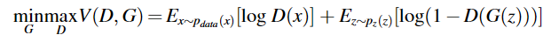

其中x是真实数据； z 是噪声； Pdata(x) 是真实数据的分布； Pz(z) 是噪声的分布； G(z)是生成器的输出； D(x)表示判别器判断x为真实数据的概率。

在训练过程中，使用反向传播算法来优化网络参数。当真实数据的分布和生成器的分布相等时，价值函数最低，生成模型可以完美地学习数据分布。为了避免生成器陷入局部极小值，鉴别器将被训练多次，同时生成器只更新一次。

DCGAN 使用 CNN 对 GAN 进行了扩展，并对 CNN 的结构和激活函数进行了三处更改。***首先，传统CNN中的池化层被卷积取代。然后，生成器对除输出层之外的所有层都使用 ReLU 激活，输出层使用 tanh 激活，但判别器使用 Leaky ReLU 激活 (f(x) = x,when x ≥ 0; f(x) = αx, α ε ( 0, 1)，当所有卷积层中 x < 0) 时。最后，生成器和鉴别器都应用批量归一化来稳定训练。***

### 2.网络结构

应用DCGAN进行3D数字岩石重建的示意图如图1所示，鉴别器和生成器的详细参数如表1所示，这些参数基于设备的计算能力和参数。

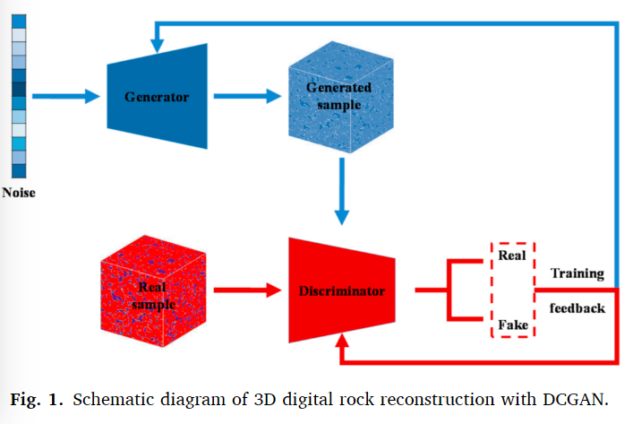

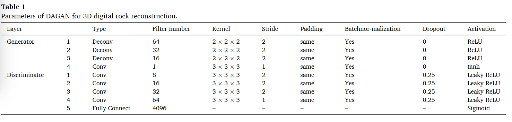

判别器是一个 CNN 模型，用于区分输入数据是真实数据还是来自生成器的数据。它有四个卷积层，每个卷积层由动量为0.8的批量归一化层、损失率为0.25的丢弃层drop layer和激活为0.2的Leaky ReLU组成。最后一层是全连接层，其激活是sigmoid函数。判别器的结构如图2所示，图2中的数字（32,32,32,1）代表该层的输出大小，其中32是3D图像的长、宽、深，1表示图像的通道，4096表示全连接层有4096个神经元。

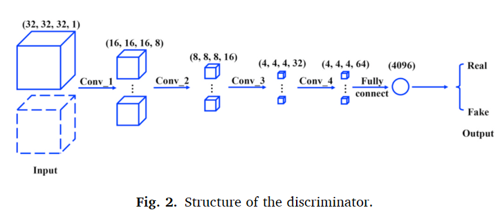

生成器接收符合正态分布的随机噪声，通过全连接层将随机噪声转换为 1D 向量，然后将随机噪声重塑为 4D 向量。三级上采样图层用于放大 3D 图像；每个上采样层后面的卷积层都可以通过训练来学习内核，然后将数据流进批量归一化层和ReLU激活层。最后一层是卷积层，激活函数是tanh函数。批量归一化层的动量设置为 0.8。本文采用的生成器结构如图3所示，图3中的数字与图2中的数字含义相同。

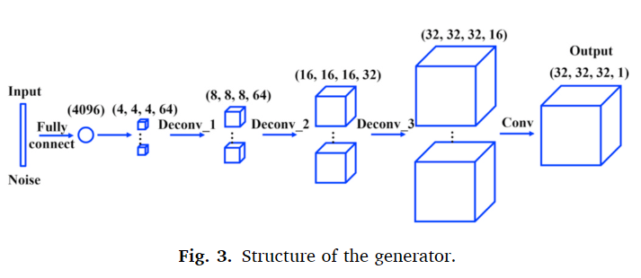

## 三、数据 平台

如图4所示，采用Micro XCT-510扫描仪获取了鄂尔多斯盆地致密砂岩延长组的CT图像，CT图像分辨率为1.22μm。

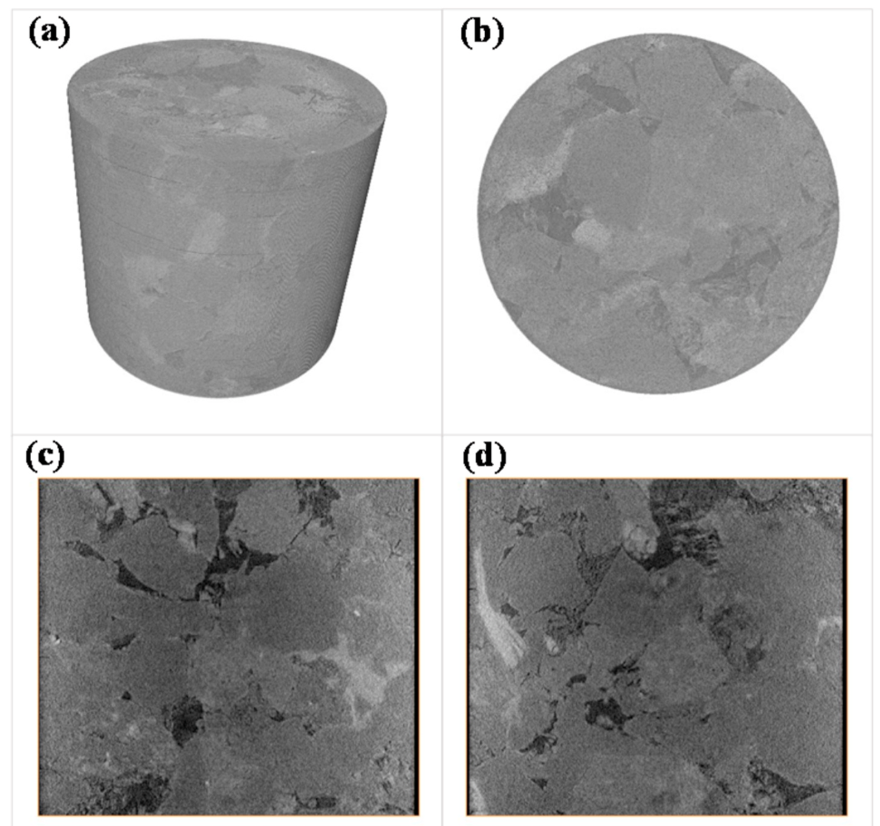

    图4.中国西北地区鄂尔多斯盆地延长组致密砂岩 CT 图像（(a) 岩心样品 3D 视图，(b) XY 方向 CT 切片，(c) XZ 方向 CT 切片，(d) CT YZ方向切片）

由于设备、环境以及岩石本身矿物质的影响，CT图像中总会存在一些噪声。图像噪声对孔隙结构分析有很大影响；因此，必须进行图像预处理。图像去噪的常用方法包括***高斯滤波、中值滤波、自适应维纳滤波、均值滤波和小波阈值处理***(Zhang and Desai, 1997; Buades et al., 2005)。这里，中值滤波器用于去除CT图像中的噪声。之后，图像将分为孔隙和基质成分，***二值图像***与灰度图像相比可以减少计算时间。

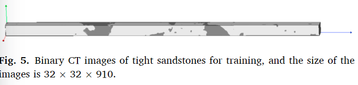

考虑到我们计算机的计算能力，训练数据是从二值CT图像中进行子采样的。用于训练的二值CT图像（32×32×910）如图5所示；黑色区域代表孔隙，灰色区域代表基质。根据910张岩心切片的孔隙度统计，孔隙度小于10%的二值图像占总CT图像的60%，表明大部分孔隙为小孔隙，反映了致密砂岩孔隙结构的强烈非均质性。 2D图像必须转换为3D数据，并且还需要对二进制数据（0-255）进行归一化。因为tanh函数的分布范围是1到1，所以归一化后的数据范围在1到1之间。

已经开发了多个用于机器学习的平台，例如 TensorFlow（Abadi 等人，2016）、Keras（Gulli 和 Pal，2017）、Caffe（Jia 等人，2014）、PyTorch（Paszke 等人，2017）、和 Theano（Al-Rfou 等人，2016）。本文使用 Keras 来构建 DCGAN 模型，这是一种用 Python 编写的高级神经网络应用编程接口（API），并与 TensorFlow 或 Theano 作为后端相结合。由于网络结构复杂、计算量大，计算机的配置会对深度学习的训练和应用产生很大的影响。本文使用具有单个 ***NVIDIA GTX 1050 GPU***（用于并行计算）的计算机。

## 四、结果与讨论

### 1.案例1

输入数据集是尺寸为32×32×32的3D二值图像，生成器和判别器的值函数通过Adam方法进行优化。学习率设置为0.002，矩估计的指数衰减率为0.5，训练epoch数为6000，批量数据大小为1。训练网络大约需要20分钟，生成的网络数字岩石如图 6 所示。与原始数字岩石相比，生成的数字岩石具有相似的孔隙，但也产生了一些孤立的孔隙。与原始数字岩石中总共 9 个孔隙相比，生成的数字岩石中有 30 个孔隙。图7给出了原始数字岩石和生成数字岩石的孔隙面积和孔隙体积分布，可以看出生成数字岩石中的孔隙大部分为小孔隙。

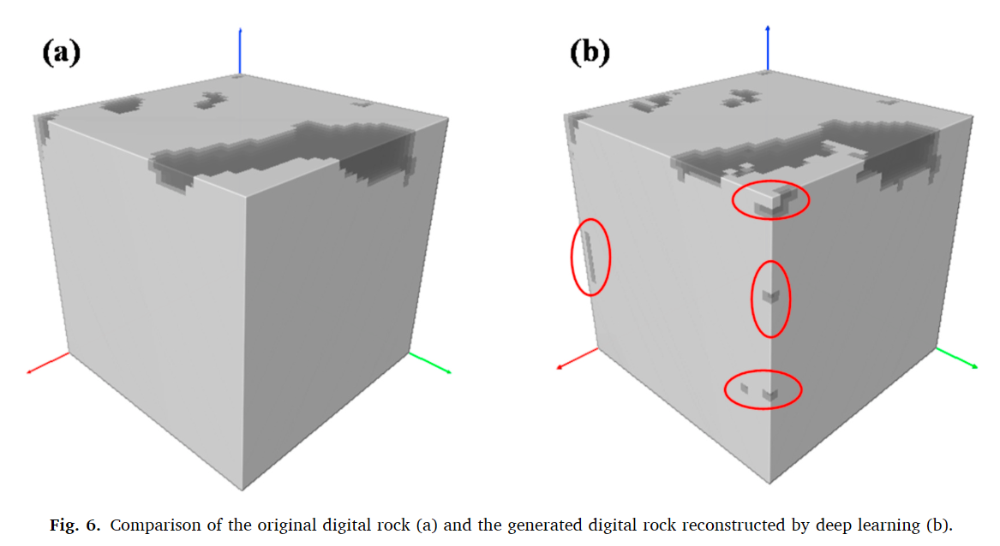

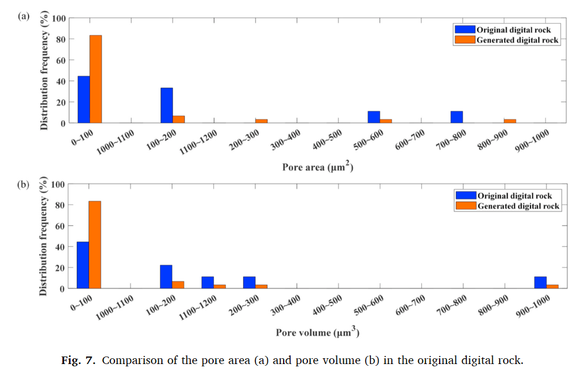

将生成的数字岩石中孔容小于$5μm^3$的孤立小孔隙全部去除，仅保留9个大孔隙，与原始数字岩石中的孔隙相同。如表 2 所示，生成的数字岩石中孔隙的重心坐标与原始岩石中的孔隙重心坐标非常接近，不包括 1、6、7号孔隙。对于其他孔隙，生成的孔隙与原始孔隙的距离均小于1μm。此外，原始数字岩石和生成的数字岩石的孔隙体积和孔隙面积分布非常接近，如图8所示。

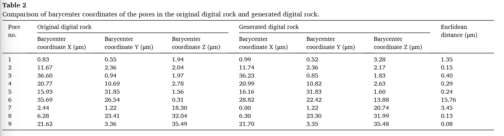

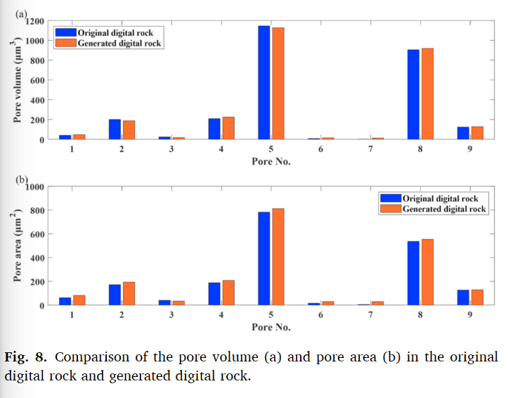

两点概率函数可以反映数字岩石内部的孔隙分布。如图 9 所示，原始数字岩石和生成的数字岩石的两点概率函数曲线非常接近，基于深度学习的数字岩石重构方法可靠，可以准确地重构数字岩石。原始岩石和生成的数字岩石的孔隙率约为4.5%，但生成的数字岩石的孔隙率略高，因为生成的数字岩石中存在多个孤立的小孔隙。即便如此，通过深度学习重建的数字岩石仍然可以准确地代表原始的数字岩石。

两点概率函数是衡量在给定结构中找到具有一定距离和方向的两个点的概率的函数。它可用于表征异质介质中不同相的空间分布和连通性。在网络模型中，两点概率函数可用于生成保留原始网络统计特性的合成网络。

[两点概率 - 两点概率函数 - 文件交换 - MATLAB 中心 (mathworks.com)](https://www.mathworks.com/matlabcentral/fileexchange/86852-twopointprobability-two-point-probability-functions)

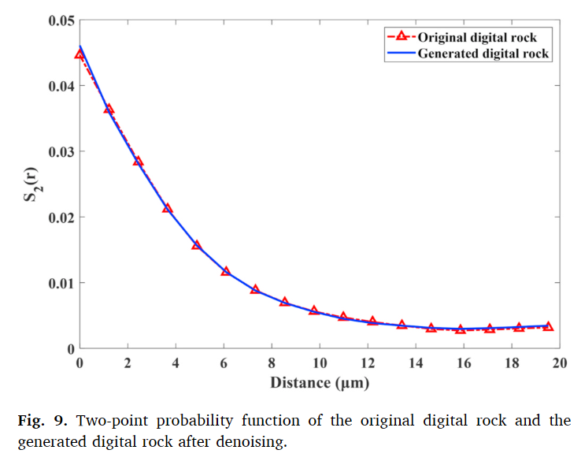

### 2.案例2

输入数据集来自另一幅尺寸为32×32×32的3D二值图像，原始数字岩石如图10（a）所示。利用上面训练得到的DCGAN的参数，训练网络花费了20分钟，生成的深度学习重建的数字岩石如图10（b）所示。如表3所示，原始数字岩石和生成的数字岩石中孔隙的重心坐标是相同的。如图11所示，原始数字岩石和生成的数字岩石的孔隙度均为46.8%，原始数字岩石和生成的数字岩石的两点概率函数曲线重合。可以得出结论，训练有素的 DCGAN 可以生成与原始输入数据集相同的数字岩石。

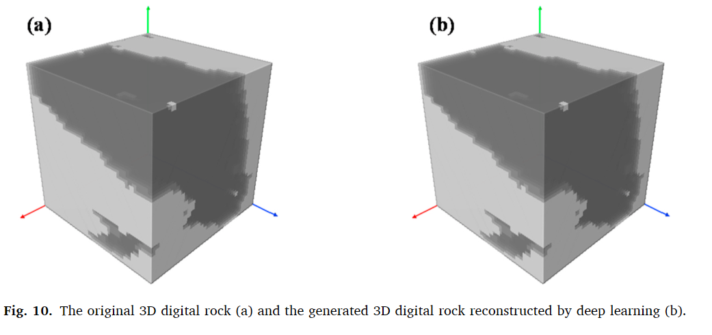

### 3.案例3

与案例2仅使用32片CT图像进行训练不同，本例中总共使用了910片CT图像来训练DCGAN。 DCGAN 的初始参数与情况 1 和 2 相同，只是情况 3 中的批量大小为 4 而不是 1。这意味着使用 4 个大小为 32 × 32 × 32 的数字岩石作为输入DCGAN训练数据；训练网络大约需要 30 分钟，生成了 4 个尺寸为 32 × 32 × 32 的数字岩石。图 12 显示了生成器和鉴别器的损失函数与迭代次数的关系。判别器的损失随着迭代而下降，而生成器的损失则随着进一步的迭代而增加。为了进一步评估DCGAN重建致密砂岩的效果，使用FID（Fr´echet inception distance）来评估重建过程，FID是计算真实图像和生成图像之间特征向量距离的度量。

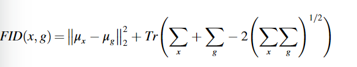

其中 μ 是来自真实数据 x 或生成器 g 的数据的平均值，Σ 是来自真实数据 x 或生成器 g 的数据的协方差，Tr 是求迹。 FID越小，重建的数字岩石越好

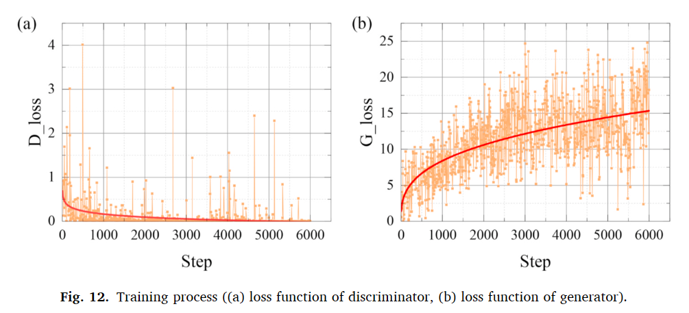

如图 13 所示，FID 分数相对较高，因为 VGG19 模型是在 ImageNet（自然图像）上训练的，而我们的 GAN 是在岩石图像数据集上训练的。 FID在训练过程中会降低，因此生成器可以通过训练生成更高质量的数字岩石。

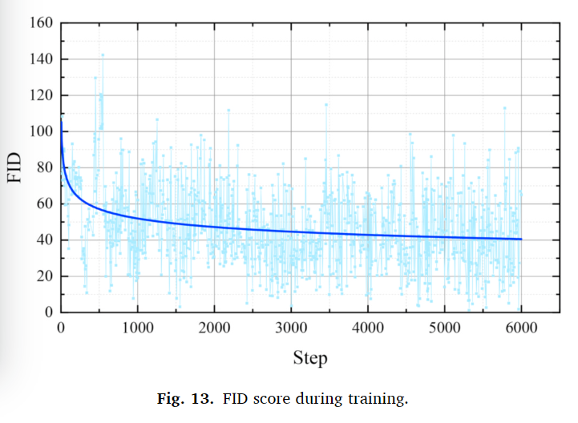

图14 展示了DCGAN 训练后生成的四块数字岩石。由于尺寸为32×32×910的原始数字岩石具有较强的异质性，生成的数字岩石的尺寸与原始数字岩石的尺寸不同；两点概率函数不适合比较生成的数字岩石与原始数字岩石之间孔径分布的差异。如图15所示，四个生成的数字岩石（32×4切片）的二维图像中的面积孔隙度分布与原始数字岩石（910切片）中的面积孔隙度分布相似。孔隙率在0%到10%之间的图像均约占总图像的60%，其中小孔隙所占比例较大。

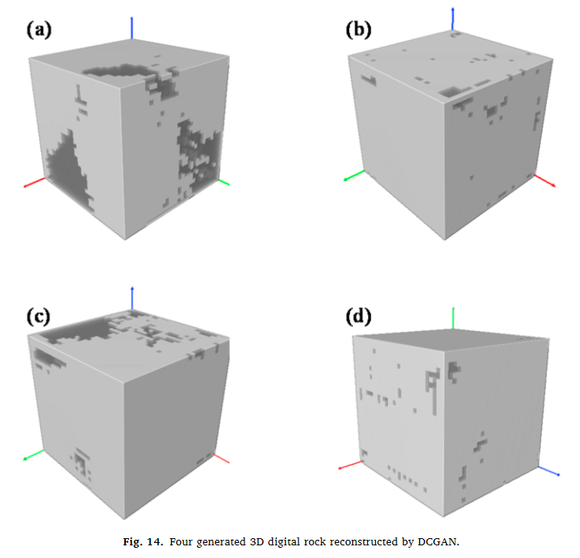

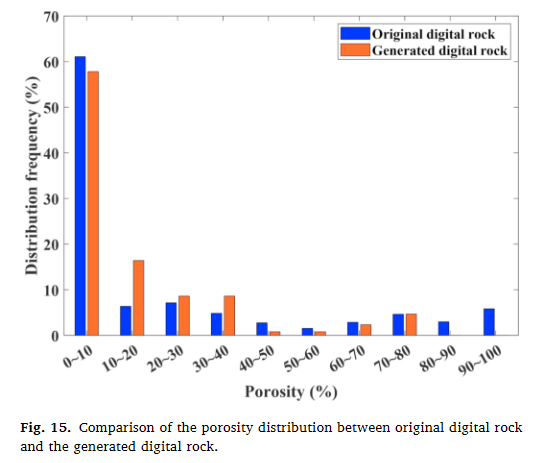

## 五、结论

提出了一种基于深度学习的3D数字岩石体重建新方法，构建了生成器和判别器中带有3D卷积的DCGAN用于3D数字岩石重建，并研究了DCGAN对非常规油藏数字岩石重建的性能。通过***孔径分布和两点概率函数***的统计结果对重建的数字岩石进行评价。结果表明，当 DCGAN 训练良好时，它可以生成与原始岩石相似的代表性数字岩石。当DCGAN没有得到很好的训练时， ******图像滤波等后处理（好像没有提到,可能说的是去除小孔孔隙？？）******可以提高数字岩石重建的精度。训练有素的DCGAN可以生成具有不同孔隙结构的数字岩石，但孔隙度分布与原始数字岩石相似。重建数字岩石有助于研究多孔介质内部的孔隙结构特征和流动机制。未来的工作可重点关注提高重建数字岩石的精度、减少训练时间、加强模型泛化能力以及模型的解释和评估
