# 从单个 2D 岩石图像生成尺寸不变的 3D

代码：

数据集：

主要内容：结合使用矢量量化变分自动编码器 (VQ-VAE)、尺寸不变的生成对抗网络 (GAN) 和图像转换器，提出了一种从单个 2D 图像生成尺寸不变的多步骤 3D 生成工作流程

发表：Journal of Petroleum Science and Engineering 5.168 JCR工程Q1区 中科院石油Q2区

22年

---

多孔介质中 3D 结构的表征对于预测许多行业的物理性质至关重要，例如二氧化碳捕获和储存、水文学、石油和天然气。与昂贵且耗时的 3D 图像采集相比，2D 成像可以提供廉价且快速的数据。然而，从单个 2D 图像重建 3D 图像是一个复杂的非确定性逆问题。过去已经引入了几种基于统计和深度学习的算法，然而，大多数算法不仅耗时且只能生成相对较小的图像（3003 个体素），而且无法概括不同类型岩石的结构和纹理。立方体）。

在这项工作中，我们结合使用矢量量化变分自动编码器 (VQ-VAE)、尺寸不变的生成对抗网络 (GAN) 和图像转换器，提出了一种从单个 2D 图像生成尺寸不变的多步骤 3D 生成工作流程。所提出的工作流程解决了 3D 图像生成中的几个主要挑战，因为它的设计不仅满足大尺寸约束（> 1000^3 体素立方体），而且还生成具有统计代表性的孔隙结构。这些不同生成技术的结合使我们能够克服与 GAN 方法相关的可扩展性、稳定性和复杂性。

我们使用具有不同物理特性、尺寸和分辨率的几种类型的岩石来训练所提出的工作流程。为了验证我们的方法，我们生成了几个大尺寸 3D 岩石图像，并将它们与真实 3D 图像的物理特性（孔隙度、渗透率和欧拉特征）进行比较。

## 1.介绍

多孔介质特性（例如传输特性、存储容量和毛细管捕集）的表征是许多重要应用中的重要步骤，包括二氧化碳捕获和存储、地下水管理、油气藏管理和材料科学。从三维计算机断层扫描 (CT) 图像中推导出这些特性是一项颠覆性技术，可以从根本上改变多孔介质的表征方式。然而，获取 CT 图像的过程昂贵、耗时，并且仅限于扫描仪给出的一定分辨率范围。从 2D 图像生成逼真的 3D 微结构的能力可以通过使用更便宜、更高分辨率的 SEM 或薄片图像等方式显着扩展该技术的功能。

文献中已经提出了几种从单个 2D 图像生成 3D 图像的数学方法；其中，基于过程的建模（Bakke和Øren，1997；Øren和Bakke，2002）和基于随机的方法（Strebelle，2002；Tahmasebi等人，2012，2014）多年来一直在使用和发展。基于过程的建模模拟岩石形成过程，在许多情况下可能极其复杂甚至未知。另一方面，基于随机的方法使用 2D 图像中的统计信息来随机填充 3D 体积。然而，这些过程非常耗时，并且通常会产生相当均匀的多孔结构（Pant，2016；Okabe 和 Blunt，2004；Čapek 等，2009）。此外，基于过程和基于随机的方法都需要与专家用户进行高度迭代交互，例如地质学家需要输入大量参数，这些参数通常通过反复试验进行调整。

近年来，几种基于深度学习的方法（主要是 GAN）已应用于 3D 多孔介质图像生成（Mosser 等人，2017、2018；Feng 等人，2019、2020）。尽管所提出的基于深度学习的方法有望提供一种更快、全自动的方式来生成 3D 图像，但这些研究仅限于每个模型的单一类型岩石，并且只能生成小型、固定尺寸的图像（643 到 2563体素立方体）。正如 Bruns 等人所描述的。 （2017），需要足够大的 3D 岩石图像才能获得代表性的物理性质，特别是对于复杂的非均质岩石，其中每个岩石的代表性大小可能是数千个体素方向（Ruspini 等人，2021）。因此，在将基于深度学习的方法应用于实际应用之前，需要显着增加生成规模。

因此，这项工作的主要目标是开发一个从单个 2D 岩石图像生成 3D 的自动工作流程。这个新工作流程的设计要求是：

• 它应该从单个2D 图像生成具有统计代表性的3D 图像。 

• 它应该能够生成任何尺寸的3D 图像，并且应该能够处理任何分辨率和尺寸的输入图像。

 • 由于不同地点的岩石样本因其形成过程而具有独特性；我们希望定期将新型岩石的图像添加到我们的训练数据集中。因此，我们的模型在训练过程中应该稳定且稳健，以便可以应用连续训练管道定期合并新的岩石类型。这一要求对基于 GAN 的方法造成了限制，众所周知，由于灾难性遗忘和模式崩溃，在数据集变化的训练过程中不稳定（Thanh-Tung 和 Tran，2020）。

 • 大图像（>2000^3 体素立方体）的总生成时间应限制在不超过一天

## 2.相关工作

### 2.1 3D 岩石图像生成

从单个 2D 图像生成具有统计代表性的 3D 岩石图像是数字岩石分析领域中长期存在的问题。传统上，***基于过程的建模（Bakke 和 Øren，1997；Øren 和 Bakke，2002）和随机方法***（Adler 等，1990；Strebelle，2002；Blair 等，1996；Tahmasebi 等，2012，2014）已用于使用 2D 图像的间接信息进行 3D 重建。

基于过程的建模基于模拟岩石形成过程（例如沉积、压实和成岩作用）。然而，该方法限制其用于相对简单且均质的岩石类型，例如本特海默砂岩。即使模拟过程继续针对更复杂的岩石类型（例如碳酸盐）演化（Ruspini 等，2021），它们也无法描述与大部分储集岩石本质上相关的多尺度结构和变化

另一方面，随机方法使用从 2D 图像提取的空间统计约束来构建 3D 结构。这些方法通常非常耗时（3003 个体素立方体需要数十个小时），并且需要简化岩石结构才能正常工作，也就是说，通常它们会生成看起来不真实的 3D 图像。

近年来，由于深度学习技术的兴起，基于深度学习的方法越来越受欢迎。有了足够的数据和计算能力，理论上可以训练基于深度学习的方法来概括单个 2D 图像中的信息，从而重建相应的 3D 图像。在深度学习方法中，GAN（Goodfellow et al., 2014）在最近的工作中受到了青睐。第一个提出的 GAN 模型仅适用于单一岩石类型，并没有为所有情况产生令人满意的结果（Mosser 等人，2017，2018）。在后来的工作中，条件 GAN 模型被用来生成 3D 岩石图像，并以 2D 图像作为输入（Volkhonskiy 等人，2019；Valsecchi 等人，2020；Zhao 等人，2021；Coiffier 等人，2020） ）。还提出了一种结合 GAN 和变分自动编码器 (VAE) 的混合模型（Zhang 等人，2021），以实现更稳定的训练过程。所有提到的工作都仅限于相对较小尺寸的图像生成（643 到 2563 体素立方体之间）。即使使用尺寸不变的 GAN 生成更大的图像是可能的，在包含多种类型岩石的大型数据集上进行训练仍然是一个极具挑战性的问题。这个问题是由于基于 GAN 的生成方法的隐式性质造成的，其中 3D 图像是根据从随机分布采样的潜在向量生成的。在大多数情况下，这个随机生成的潜在向量还定义了生成图像的结构。这提出了使用 GAN 的一个基本问题，因为 GAN 不是逐渐将结构信息从 2D 传播到 3D 图像，而是使用潜在向量直接生成 3D 图像的结构，然后调整结果以适应 2D 输入图像。此外，连续分布的潜在空间不适合描述由不同类型的岩石组成的数据集，其中每种类型都有独特的结构。

### 2.2 用于图像合成的自回归模型

传统上，GAN 模型在基于深度学习的图像合成领域占据主导地位。然而，由于模式崩溃问题，它们因难以训练而臭名昭著（Thanh-Tung 和 Tran，2020）。另一方面，具有易处理似然性的自回归模型，例如 PixelCNN (Oord et al., 2016)、VQ-VAE-2 (Razavi et al., 2019)、Image Transformer (Parmar et al., 2018) 和 ImageGPT ( Chen et al., 2020）训练起来更简单，并且可以更好地捕捉数据分布的多样性。除了 2D 图像合成之外，自回归模型还成功应用于单个图像的视频预测，其中 VQ-VAE 和 GPT 相结合以实现最先进的结果（Yan 等人，2021）。使用自回归模型的主要缺点是，由于需要逐像素顺序采样，它们的推理时间很慢，因此它们在可扩展性方面遇到困难，特别是对于大型图像生成.

在下一节中，我们提出了一种方法，使用 VQ-VAE 将大图像大规模压缩为紧凑的离散表示向量，即使以高信息损失为代价，以便更有效地应用自回归模型。为了补偿信息损失，我们还在我们的方法中采用了 GAN 模型。

## 3.方法

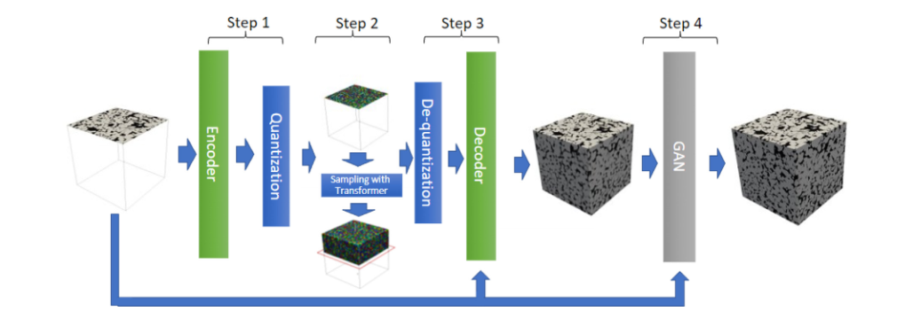

   图1 ：单个 2D 图像的 3D 生成工作流程 – 我们的生成工作流程由 4 个步骤组成：(1) 编码/量化，将图像压缩为尺寸小 163 倍的紧凑且离散的表示向量； (2) 使用转换器迭代采样量化向量的下一个数据点，直到满足所需的大小； (3)对该生成的向量进行解压缩和反量化； (4)用GAN重新获得细节纹理。此外，我们还为解码器和 GAN 提供 2D 输入作为附加信息。

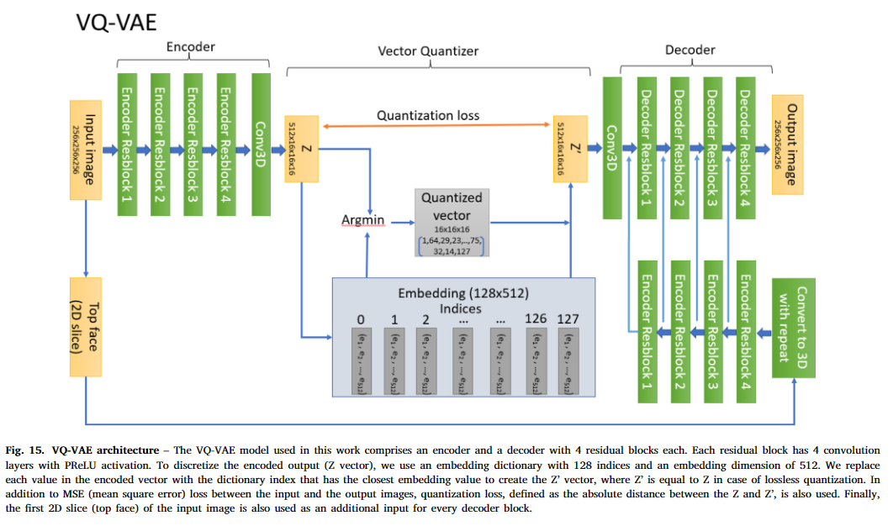

图1展示了我们从单个 2D 图像生成大规模 3D 图像的新方法。所提出的方法由 3 个主要部分组成：

1. VQ-VAE（Oord 等人，2017；Razavi 等人，2019）：VQ-VAE 是一种基于编码器-解码器的模型，它将输入图像映射到离散表示向量。在这项工作中，我们使用 VQ-VAE 使用 128 个索引的码本将输入 3D 图像压缩 163 倍。这种高压缩级别有助于从 3D 图像中提取结构信息，例如岩石图像中的孔隙分布和颗粒结构，并将其转换为信息密集的离散向量。
2. Image Transformer (Parmar et al., 2018)：Image Transformer 是一种自回归生成技术，它使用自注意力机制以易于处理的可能性对图像内容的分布进行建模。由于 Transformer 的内存消耗与输入长度呈二次方关系（Gupta 等人，2021），直接处理这些 3D 图像甚至不会覆盖单个颗粒。因此，为了最大化跟踪空间依赖性的感受野，我们在 VQ-VAE 生成的压缩矢量上训练我们的变压器。为了生成大图像，我们使用最大感受野为 16 × 16 × 10 体素的 3D 局部注意力机制，以光栅扫描顺序逐体素地查询体素。这种方法类似于 VQ-VAE-2（Razavi 等人，2019）中使用 PixelCNN 的方式，但在 3D 环境中，PixelCNN 被变压器取代。本工作中使用的变压器采用 GPT-3 架构，参见 Brown 等人。 （2020），但词汇量只有 128 个单词、16 个注意力头、16 层、总共 5000 万个可训练参数。
3. 大小不变的 GAN：我们的 GAN 架构松散地基于 StyleGan-v2（Karas 等人，2020）中提出的基于残差的架构，以便在训练时进行有效的梯度传递。在这种情况下，GAN 的使用与超分辨率模型具有类似的作用，即将纹理和高分辨率细节填充到前面步骤中生成的结构中。

### 3.1 方法说明

首先，2D 输入图像经过编码器，得到第一层量化向量（图 1 步骤 1）。然后，我们通过迭代地将第一层的量化向量传递给转换器来获得下一个数据点的似然分布，并使用顶部采样策略（= 10）对其进行采样（Fan et al., 2018）（图. 1 步骤2).使用采样策略（例如，顶部、核仁采样）对于防止级联退化至关重要，因为我们的生成目标通常明显长于模型接受视场

这个的工作流程允许 Transformer 专注于全局结构，同时 GAN 生成详细纹理（图 1 步骤 4）。该方法非常适合问题的性质，因为岩石图像的结构特征（例如颗粒堆积）严格受到岩石类型的统计和物理特性的限制。另一方面，细节特征（例如每个颗粒的表面纹理）是局部的，生成起来不太复杂，因此适合 GAN。将 Transformer 与 VQ-VAE 和 GAN 相结合的另一个动机是最大化感受野以捕获空间图像上下文。虽然 163 体素图像体积很小，但展平后其序列长度为 4096 个单词，这比大多数自然语言生成 (NLG) 模型的输入长度都要长。因此，即使只有 163 体素输入，VQ-VAE 的使用也允许转换器在图像结构方面具有相当于 2563 体素立方体的空间上下文窗口。

### 3.2尺寸不变模式

鉴于岩石图像通常不限于固定尺寸或尺寸比例（请参见表 1），因此创建独立于输入尺寸（即尺寸不变）的工作流程非常重要。完全使用卷积、池化和量化等局部操作构建模型，理论上我们可以生成任何大小的图像，只要输入图像大小可以被感受野的大小整除，例如在我们的例子中，有 643 个体素立方体。然而，使用 CNN 处理 3D 图像对内存的要求非常高，例如我们的模型需要超过 20 GB 的 GPU 内存来生成/处理 1963 体素立方体图像。由于大多数现实场景需要大于 10243 体素的图像来覆盖代表性体积，因此必须将输入图像分割成更小的补丁并单独处理每个补丁。然而，由于零填充引起的边界效应，天真地将生成的图像块放在一起形成大图像会导致每个块之间的不自然过渡，如图2（a）所示。由于零填充为 CNN 提供了许多重要的好处，例如允许 CNN 编码位置信息并保持空间大小恒定在每一层之后（Islam et al., 2021；Kayhan and van Gemert, 2020），我们不能简单地避免使用零填充来避免边界问题。处理这个问题的一种方法是使用合并策略。在图 3 中，我们说明了我们的合并策略，其中我们以与顺序卷积运算类似的方式逐块处理图像。为了生成具有平滑过渡的大图像，如图2（b）所示，我们在训练和推理中引入了基立方体的概念，图4。基立方体的大小定义为最大感受野，即我们模型的输入中产生特征的区域的大小。

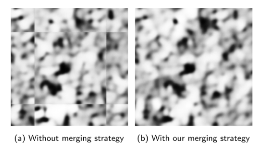

   图2 来自 VQ-VAE 输出的输出裁剪 – 我们的合并策略可以在将补丁组合成大图像时实现平滑过渡

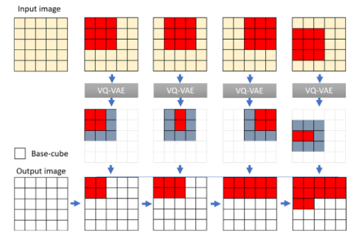

  图3 ***具有基立方体的 2D 合并策略 - 使用卷积填充可能会导致边界伪影，见图 2(a)。为了避免这个问题，我们丢弃所有与看不见的立方体接壤的立方体（丢弃的立方体以灰色显示）。这使得生成的合并图像是连续的，就像我们一次处理整个大图像而不进行分割一样***

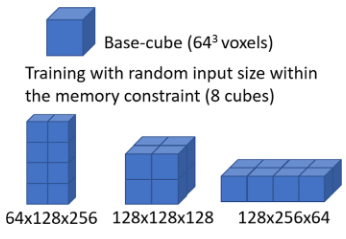

 图4  使用多个基础立方体进行训练。

### 3.3 训练数据

在这项工作中，我们使用孔隙率图像来训练和评估我们的模型。为了构建孔隙度图像，通过扫描干燥和盐水饱和状态的岩石样本来获取两幅图像。然后，将孔隙度图像构建为两个图像之间的差异，并进行衰减校正，如 Arns 等人所述。 (2003)，Golab 等人。 （2010）。我们的训练数据集包含 9 个不同类型岩石（3 个砂岩和 6 个碳酸盐岩）的不同分辨率的孔隙度图像。它们是在不同的 X 射线扫描仪中使用不同的图像重建和处理程序以避免系统问题。由于当前成像技术的分辨率限制（视场与空间分辨率），X 射线显微 CT 图像的孔隙度图像通常包含不可忽略的亚分辨率孔隙度，即这些区域中的孔隙低于图像分辨率。因此，使用孔隙率图像提供了一种客观的方法，可以将训练数据标准化在 0（孔隙）– 100（固体）之间，并保留未解析的微孔隙率 (1–99)。在处理复杂岩石（例如碳酸盐）时，微孔隙率至关重要，其中图像的很大一部分由分辨率不足的孔隙结构表示。

对于每个训练步骤，我们从较大的 3D 图像中进行随机裁剪，其尺寸变化在原始输入尺寸的 50% 到 200% 之间。然后，我们通过用于上采样的三线性插值和用于下采样的孔隙度平均来调整图像的大小。使用随机裁剪作为数据增强反映了处理岩石图像时分辨率和粒度的变化。

### 3.4 验证指标

为了验证生成图像的质量，我们将以下岩石物理和拓扑特性与真实岩石图像进行比较

• 孔隙率：是多孔材料的孔隙与总体积之间的比率，即容纳流体的能力。

• 渗透率：衡量介质的水力传导率，即在相同的驱动力下，渗透率越高意味着流体流量越大。我们通过对提取的孔隙网络模型进行流体模拟来计算渗透率使用 Ruspini 等人中描述的方法从 3D 图像中提取数据。

• 欧拉特征：是描述结构的拓扑和连通性的无量纲函数，即断开组件的数量与等效环的数量之间的关系（Vogel，2002）。我们使用 Blasquez 和 Poiraudeau (2003) 中提出的算法并考虑 26 邻域连接来计算这个数字

## 4. 结果与讨论

为了评估我们的工作流程，我们使用了 4 个具有不同属性、分辨率和图像大小的验证岩石样本，如表 1 所示。我们从每个样本的顶部 2D 切片生成了 3D 图像。生成的图像及其相应的 GT 通过以下方式可视化Paraview（Ahrens 等人，2005）并如图 1 和 2 所示。如这些图5-8。所示，我们的方法能够为每个样本使用相同的 2D 输入生成完全不同的图像，同时在视觉上保留整体结构（例如晶粒尺寸/形状、孔隙率）。在图中。在图 9 和 10 中，我们比较了生成图像和地面实况图像的孔隙率和欧拉特征。为了分析这些属性的变化，我们将图像划分为多个 2003 体素立方体，并绘制它们属性的分布。此外，我们还计算了每个子样本在所有三个方向上的渗透率，以构建孔隙度与渗透率图。这些图中的斜率和色散反映了不同类型的多孔介质（Ruspini 等人，2017、2021）。尽管渗透率对孔隙体积和形状的局部变化非常敏感，但生成的图像和真实图像对于所有不同类型的岩石产生相似的趋势。

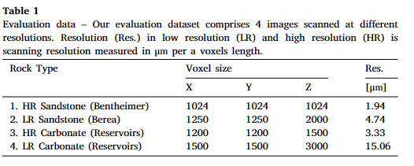

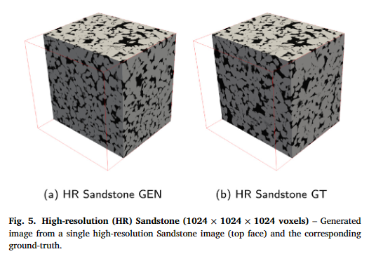

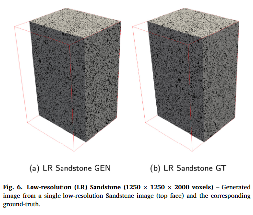

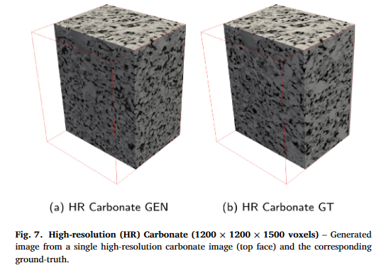

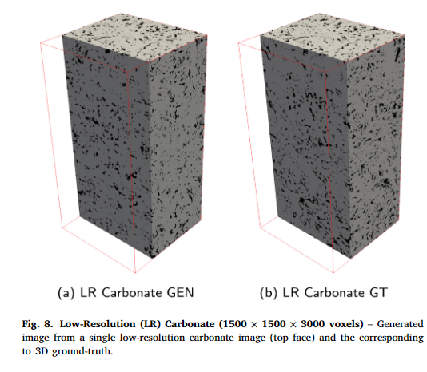

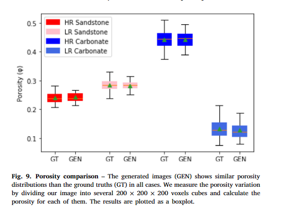

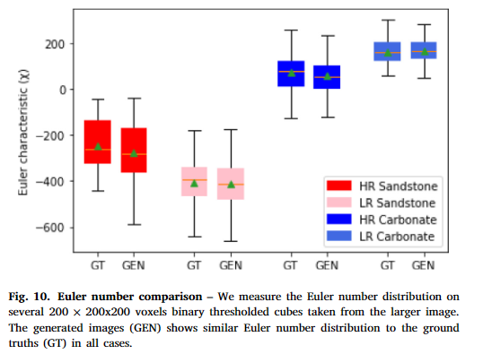

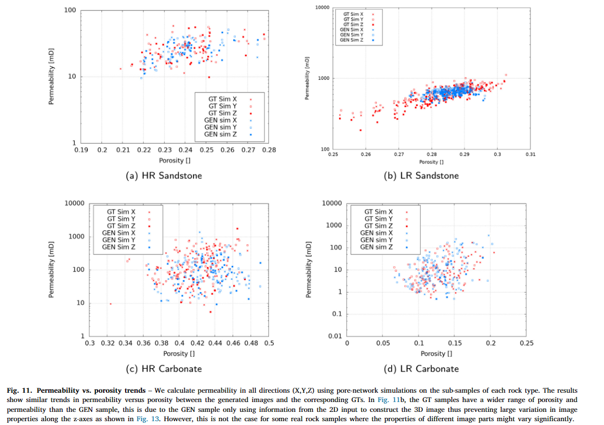

鉴于我们的生成方法基于自回归采样，每个新生成都会产生一个独特的图像。为了证明这一点，在图 12 中，我们展示了从同一输入图像生成的几种实现。这是新方法的一个重要优点，因为它允许仅使用单个二维图像来估计给定岩石类型内的属性变化。

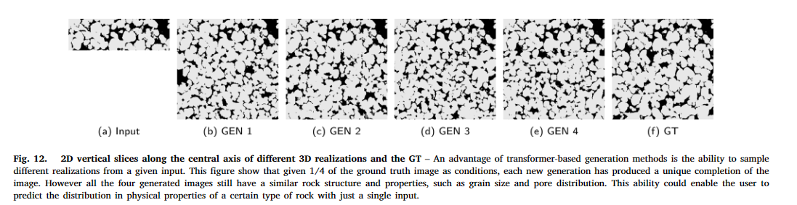

使用变压器和一般自回归模型时的一个常见问题是输出退化（Holtzman 等人，2019）。大尺寸的生成通常会产生重复或不自然的结果。为了分析退化效应，我们生成了来自 512 × 512 2D 输入的 8192 体素深度图像，如图 13 所示。然后，我们使用尺寸为 512 × 512 × 256 体素和步长为 64 体素的滚动窗口沿生成方向计算孔隙率和欧拉特征。长度。通过查看图像和属性，即使生成的图像比模型输入长度长 32 倍，也没有观察到退化迹象。

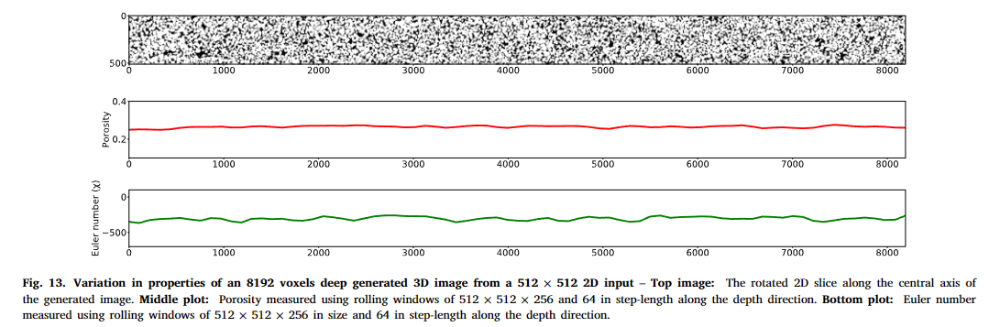

使用 VQ-VAE 作为变压器框架的主要动机之一是显着降低计算成本。在表 2 中，我们表明转换器步骤是整个工作流程中最耗时的部分。重要的是要考虑到，即使输入图像大小是 10243 体素立方体，由于编码器量化步骤，我们需要使用转换器采样的大小仅为 643 体素。我们估计，使用相同的硬件，仅使用 Transformer 生成全尺寸 10243 立方体图像大约需要 4 年时间。此外，在一代中仅使用变压器还需要更大的感受野，即更长的输入序列长度，以捕获图像上下文

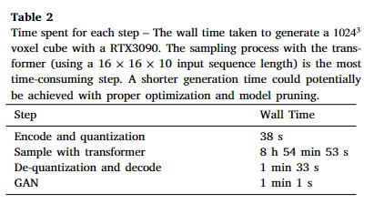

在确定模型的输入序列长度时，时间约束是一个需要考虑的重要因素，如图 14 所示。另一个限制因素是训练 Transformer 所需的内存和计算，它随序列呈二次方增长长度（Beltagy 等人，2020）。由于我们处理的是 3D 图像，因此将每个方向的输入图像大小加倍会使输入序列长度增加 8 倍，从而大大增加生成时间和内存消耗。另一方面，有在大多数情况下，较长的输入序列长度应该可以提高生成质量（Parmar et al., 2018）。因此，最佳解决方案将始终受到这些提到的因素的限制。在我们的例子中，由于 GPU（图形处理单元）的内存限制，我们选择使用 16 × 16×10 的输入长度。

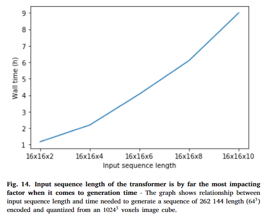

## 5.结论

在这项工作中，我们提出了一种结合 VQ-VAE、Image Transformer 和尺寸不变 GAN 的工作流程，以解决从单个 2D 岩石图像生成大型 3D 图像的问题。为了验证我们的工作流程结果，我们从 4 种不同类型的岩石中生成了几张不同分辨率的大尺寸 3D 图像。然后，我们将岩石物理和拓扑特性与真实的岩石物理和拓扑特性进行了比较真实岩石形象并发现了令人鼓舞的结果。由于采集 2D 图像比 3D 图像采集便宜得多且速度更快，因此该工作流程可能会降低岩石物理特性的成本表征对于许多行业至关重要，例如二氧化碳捕获和储存、水文学、石油和天然气

## 6.局限性

由于我们在这项工作中仅使用孔隙度图进行训练，因此我们需要添加一个额外的步骤，将其他数据类型转换为孔隙度图，以使模型正常工作。然而，在大多数情况下，这种转换可以通过图像阈值处理或现有的分割工具来完成。在处理输入图像中的噪声/伪影时，我们建议使用单独的模型进行噪声过滤作为预处理，即使可以将噪声过滤能力合并到我们的模型中。为了将噪声过滤能力纳入我们的模型中，我们需要使模型的三个部分具有抗噪声能力，因为它们都以 2D 图像作为输入。这也可能对生成模型的性能产生负面影响，因为它必须学习另一项任务。

该方法专门用于解决岩石图像的 2D 到 3D 生成问题，因此预计在该领域效果最佳。根据我们的理解，我们期望该方法能够在由某些物理或统计分布严格定义的问题（例如材料科学或生物学）上表现良好。但是，我们尚未在其他领域测试我们的方法，因为它超出了本工作的范围
