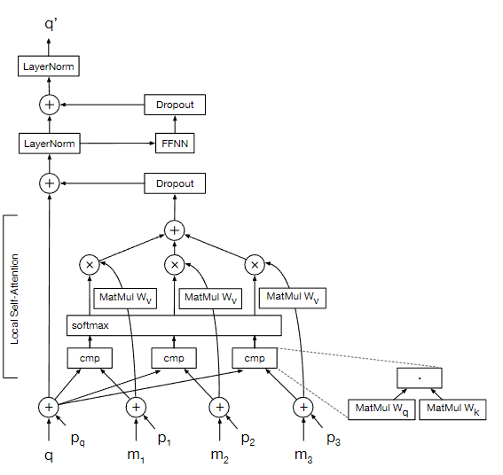

# image Transformer

2018

Computer Vision and Pattern Recognition 8.0

---

图像生成已成功地转化为自回归序列生成或转换问题。最近的工作表明，自注意力是对文本序列进行建模的有效方法。在这项工作中，我们将最近提出的基于自注意力的模型架构（Transformer）推广到具有易于处理的可能性的图像生成的序列建模公式。通过限制自注意力机制来关注局部邻域，我们显着增加了模型在实践中可以处理的图像的大小，尽管每层的感受野比典型的卷积神经网络要大得多。虽然概念上很简单，但我们的生成模型明显优于 ImageNet 上图像生成的当前技术水平，将 ImageNet 上已发表的最佳负对数似然从 3.83 提高到 3.77。我们还应用我们架构的编码器-解码器配置，展示了大放大率图像超分辨率的结果。在一项人类评估研究中，我们发现由我们的超分辨率模型生成的图像欺骗人类观察者的次数是之前技术水平的三倍

---

CelebA 超分辨率模型的三个输出，然后是条件 CIFAR-10 模型的三个图像补全，从左到右为输入、模型输出和原始图像

## 介绍

利用神经网络对自然图像分布进行建模的最新进展使他们能够生成越来越自然的图像。一些模型，例如 PixelRNN 和 PixelCNN (van den Oord et al., 2016a)，具有易于处理的可能性。除了许可直接最大化对数似然的相对简单和稳定的训练机制之外，这还使得这些模型能够直接应用于图像压缩（van den Oord & Schrauwen，2014）以及概率规划和探索（Bellemare 等人）等问题。 .，2016）。通过将图像中像素的联合分布建模为条件分布的乘积，可以使可能性变得容易处理（Larochelle & Murray，2011；Theis & Bethge，2015）。因此，将问题转化为序列建模问题，最先进的方法应用循环或卷积神经网络来预测给定所有先前生成的像素的每个下一个像素（van den Oord 等人，2016a）。训练循环神经网络来顺序预测即使是小图像的每个像素在计算上也非常具有挑战性。因此，使用卷积神经网络（例如 PixelCNN）的可并行模型最近受到了更多关注，并且在质量上已经超越了 PixelRNN（van den Oord 等人，2016b）。

与 RNN 相比，CNN 的一大缺点是其感受野通常相当有限。这可能会对它们模拟图像中常见的远程现象（例如对称性和遮挡）的能力产生不利影响，尤其是在层数较少的情况下。事实证明，扩大感受野可以显着提高质量（Salimans 等人）。然而，这样做会在数量上付出巨大的代价参数和计算性能，并且可以使训练此类模型更具挑战性。

在这项工作中，我们证明了自注意力（Cheng et al., 2016; Parikh et al., 2016; Vaswani et al., 2017）可以在几乎无限的感受野和必然的感受野之间取得更好的平衡。顺序 PixelRNN 以及可并行性更高的 PixelCNN 及其各种扩展的有限感受野。

我们采用与之前的工作类似的联合像素分布分解。然而，在最近的文本建模工作（Vaswani 等人，2017）之后，我们建议避开循环网络和卷积网络，转而使用 Image Transformer，这是一种完全基于自注意力机制的模型。我们提出的多头自注意力的特定局部受限形式可以解释为门控卷积的稀疏参数化形式。通过将感受野的大小与参数数量解耦，我们可以使用比 PixelCNN 大得多的感受野。

尽管训练的资源要求相对较低，但 Image Transformer 在对标准 ImageNet 数据集的图像进行建模方面达到了新的技术水平（通过对数似然来衡量）。我们的实验表明，增加感受野的大小在这种改进中发挥着重要作用。我们观察到有效感受野大小达到 256 像素的显着改进，而具有 5x5 滤波器的 PixelCNN（van den Oord 等人，2016b）使用了 25。

图像密度模型的许多应用都需要对各种附加信息进行调节：从增强或重建任务中的图像（例如超分辨率、修复和去噪）到从自然语言描述合成图像时的文本（Mansimov）等人，2015）。在视觉规划任务中，条件图像生成模型可以根据先前的帧和所采取的操作来预测视频的未来帧

因此，在这项工作中，我们还评估了使用图像转换器执行条件图像生成的两种不同方法。在图像类条件生成中，我们以嵌入少数图像类之一为条件。在高放大率（4x）的超分辨率中，我们以非常低分辨率的图像为条件，在编码器-解码器配置中使用图像转换器（Kalchbrenner＆Blunsom，2013）。与最近关于自回归超分辨率的研究（Dahl et al., 2017）相比，一项人类评估研究发现，我们的模型生成的图像通常看起来更加自然，令人信服。

## 背景

文献中存在多种类型的图像生成模型。这项工作受到自回归模型的强烈启发，例如完全可见的信念网络和 NADE（Bengio & Bengio，2000；Larochelle & Murray，2011），因为我们还将图像像素的联合概率分解为条件分布。继 PixelRNN（van den Oord 等人，2016a）之后，我们还将输出像素的颜色通道建模为从多项分布生成的离散值，并使用简单的 softmax 层实现。目前在 CIFAR-10 数据集上进行图像建模的最先进技术是通过 PixelCNN++ 实现的，它使用离散逻辑混合似然对输出像素分布进行建模，以整个像素而不是颜色通道为条件，并对架构进行更改（Salimans 等人） .)。这些修改很容易适用于我们的模型，我们计划在未来的工作中对其进行评估。图像生成的另一个流行研究方向是训练具有对抗性损失的模型（Goodfellow 等人，2014）。通常，在这种情况下，生成器网络的训练与鉴别器网络相反，试图确定给定的图像是真实的还是生成的。与通过基于可能性的损失训练的网络生成的通常模糊的图像相比，生成对抗网络（GAN）已被证明可以在生成和图像超分辨率任务中生成具有真实高频细节的更清晰的图像（Zhang等人） .，2016；Ledig 等人，2016）。虽然 GAN 很有前途，但它也有各种缺点。众所周知，它们是不稳定的（Radford et al., 2015），激发了大量的方法试图使它们的训练更加稳健（Metz et al., 2016; Berthelot et al., 2017）。另一个常见问题是模式崩溃，即生成的图像无法反映训练集中的多样性（Metz 等人，2016）。一个相关的问题是 GAN 不具有封闭形式的密度。这使得衡量模型捕获多样性的程度变得具有挑战性。这也使模型设计变得复杂。例如，在 GAN 中客观评估和比较不同的超参数选择通常比在具有易于处理的可能性的模型中困难得多

## 模型架构

左边是我们最好的条件生成模型的图像补全，我们对后半部分进行了采样。右侧是我们在 CIFAR-10 上训练的四倍超分辨率模型的样本。我们的图像看起来真实可信，在完成样本之间显示出良好的多样性，并观察到输出在超分辨率下为粗略输入提供了令人惊讶的细节

### 图像表示

我们将像素强度视为离散类别或序数值；此设置取决于分布（第 3.4 节）。对于类别，每个输入像素的三个颜色通道均使用特定于通道的 256 组进行编码强度值 0 − 255 的 d 维嵌入向量。对于输出强度，我们跨通道共享一组单独的 256 个 d 维嵌入。对于宽度为 w 和高度为 h 的图像，我们将宽度和通道尺寸结合起来，生成形状为 [h, w · 3, d] 的 3 维张量。

对于序数值，我们运行 1x3 窗口大小、1x3 跨步卷积来组合每个像素的 3 个通道，形成形状为 [h, w, d] 的输入表示。

对于每个像素表示，我们添加该像素坐标的 d 维编码。我们评估了两种不同的坐标编码：坐标的正弦和余弦函数，在不同维度上具有不同的频率，遵循（Vaswani 等人，2017），并学习位置嵌入。由于我们需要表示两个坐标，因此我们使用 d/2 维度来***编码行号***，使用其他 d/2 维度来编码***列和颜色通道***

### 自注意力

对于图像条件生成，就像在我们的超分辨率模型中一样，我们使用编码器-解码器架构。编码器生成源图像的上下文化、每像素通道表示。解码器自回归生成像素强度的输出图像，每个时间步每个像素一个通道。这样做时，它消耗了先前生成的像素和输入图像代表由编码器生成的状态。对于编码器和解码器，图像变换器使用自注意力和位置前馈层的堆栈，类似于（Vaswani 等人，2017）。此外，解码器使用注意力机制来消耗编码器表示。对于无条件和类条件生成，我们在仅解码器配置中使用图像转换器.

在我们描述如何将自我注意力扩展到由比句子中通常发现的更多位置组成的图像之前，我们先简要描述一下自我注意力

每个自注意力层计算每个位置的 d 维表示，即每个像素的每个通道。为了重新计算给定位置的表示，它首先将该位置的当前表示与其他位置的表示进行比较，获得其他位置的注意力分布。然后使用该分布来加权其他位置的表示对当前位置的下一个表示的贡献.

方程 1 和方程 2 概述了我们的自注意力层和全连接前馈层中的计算；图 1 对此进行了描述。 W1和W2是前馈层的参数，并且在层中的所有位置之间共享。这些完整地描述了每一层中执行的所有操作，每个位置独立，但多头注意力除外.

更详细地说，根据之前的工作，我们将像素通道或位置的当前表示称为要重新计算的查询 q。将用于计算 q 新表示的其他位置是 m1、m2、…。 。 。它们共同构成存储矩阵 M 的列。请注意，M 也可以包含 q。我们首先分别通过学习矩阵 Wq 和 Wk 线性变换 q 和 M

然后，自注意力机制将 q 与内存中每个像素的通道表示与按 1/√d 缩放的点积进行比较。我们将 softmax 函数应用于所得的兼容性分数，将获得的向量视为内存中像素通道上的注意力分布。将另一个线性变换 Wv 应用于内存 M 后，我们计算加权平均值转换后的记忆，按注意力分布加权。在不同模型的解码器中，我们适当地屏蔽比较的输出，以便模型无法处理内存中尚未生成的位置

然后，我们对得到的向量应用一个单层全连接前馈神经网络，该网络具有修正线性激活，然后是另一个线性变换。这些学习到的参数在所有位置之间共享，但层与层之间不同。如图 1 所示，我们在每次应用自注意力和位置前馈网络后执行 dropout、合并残差连接并执行层归一化（Ba 等人，2016 年；Srivastava 等人，2014 年）。整个自注意力操作可以使用高度优化的矩阵乘法代码来实现，并针对所有像素的通道并行执行。

图像transformer一层的切片，通过关注先前生成的像素 m1、m2...的内存来重新计算一个像素 q 的单个通道的表示 q'。 。 ..执行局部自注意力之后，我们应用一个两层位置前馈神经网络，对于给定层中的所有位置具有相同的参数。自注意力和前馈网络之后是 dropout，并通过后续层归一化的剩余连接绕过。位置编码 pq 、 p1 、 . 。 。仅在第一层添加。

### 局部自注意力

内存 lm 中包含的位置数量，或者 M 的列数，对自注意力机制的可扩展性有巨大影响，其时间复杂度为 O(h · w · lm · d)。

我们的超分辨率模型的编码器在 8×8 像素图像上运行，并且处理所有 192 个位置在计算上是可行的。然而，我们实验中的解码器生成具有 3072 个位置的 32 × 32 像素图像，渲染关注所有位置是不切实际的。受卷积神经网络的启发，我们通过采用局部性概念来解决这个问题，将内存矩阵 M 中的位置限制为查询位置周围的局部邻域。然而，改变每个查询位置的邻域将禁止将自注意力所需的大部分计算打包到两个矩阵乘法中——一个用于计算成对比较，另一个用于生成加权平均值。为了避免这种情况，我们将图像划分为查询块，并将每个查询块与也包含查询块的较大内存块相关联。对于给定查询块中的所有查询，模型会处理相同的内存矩阵，该矩阵由内存块中的所有位置组成。然后并行计算所有查询块的自注意力。对于所有位置，前馈网络和层归一化都是并行计算的。

在我们的实验中，我们使用两种不同的方案来选择查询块及其相关的内存块邻域，从而将联合像素分布两种不同的分解为条件分布。两者均如图 2 所示。

图 2.我们实验中使用的两种不同的条件分解，左侧和右侧分别具有 1D 和 2D 局部注意力。在这两种方法中，图像都被划分为不重叠的查询块，每个查询块与覆盖查询块像素的超集的存储块相关联。在每个自注意力层中，查询块中的每个位置都会关注内存块中的所有位置。标记为 q 的像素是最后生成的。内存中的所有像素通道和以白色显示的查询块都具有屏蔽的注意力权重，并且不会对查询块中位置的下一个表示做出贡献。虽然图中两种方案的有效感受野大小相同，但在 2D 注意力中，内存块分别在查询块旁边和上方包含更均匀平衡的像素数量

1D 局部注意力 对于 1D 局部注意力（第 3.3 节），我们首先使用光栅扫描顺序的位置编码来展平输入张量，类似于之前的工作（van den Oord 等人，2016a）。为了计算所得线性化图像的自注意力，我们将长度划分为长度为 lq 的非重叠查询块 Q，如有必要，用零填充。虽然在线性化图像中是连续的，但这些块在图像坐标空间中可以是不连续的。对于每个查询块，我们从与 Q 相同的位置构建内存块 M 以及与之前生成的像素相对应的附加 lm 位置，这可能会导致内存块重叠。

2D 局部注意力在 2D 局部注意力模型中，我们将具有位置编码的输入张量划分为原始图像空间中连续的矩形查询块。我们生成一个又一个查询块的图像，并按光栅扫描顺序对块进行排序。在每个块内，我们再次按光栅扫描顺序生成单独的位置或像素通道

如图 2 的右半部分所示，我们生成从左到右、从上到下的灰线轮廓的块。我们使用尺寸为 lq 的二维查询块，其高度和宽度指定为 lq = wq ·hq ，以及分别将查询块扩展到顶部、左侧和右侧 hm、wm 和 wm 像素的内存块

在 1D 和 2D 局部注意力中，我们屏蔽了查询和内存块中的注意力权重，从而忽略尚未生成的位置。如图 2 所示，2D 局部注意力更均匀地平衡水平和垂直条件环境。我们相信，随着图像尺寸的增大，这可能会对质量产生越来越积极的影响，因为一维局部注意力中的条件信息越来越多地由给定位置旁边的像素（而不是上面的像素）主导。

### 损失函数

我们执行最大似然，其中关于网络参数最大化 log p(x) = Σh·w·3 t=1 log p(xt | x<t)，并且网络输出自回归分布的所有参数。我们尝试了两种分布设置：每个渠道的分类分布（van den Oord 等人，2016a）和三个渠道的离散物流混合（Salimans 等人）。分类分布 (cat) 将每个强度值捕获为离散结果并跨通道进行因式分解。每个像素总共有 256·3 = 768 个参数；对于 32 × 32 图像，网络输出 786、432 维。

与分类分布不同，物流的离散混合（DMOL）捕获了两个重要的属性：像素强度的顺序性质和更简单的依赖关系-跨渠道传播（Salimans 等人）。对于每个像素，参数的数量是混合分量数量的 10 倍：10 表示一个非标准化混合概率、三个均值、三个标准差和三个捕获线性相关性的系数。对于 10 种混合，这意味着每个像素有 100 个参数；对于 32 × 32 图像，网络输出 102、400 维，减少了 7 倍，从而实现更密集的梯度和更低的内存
