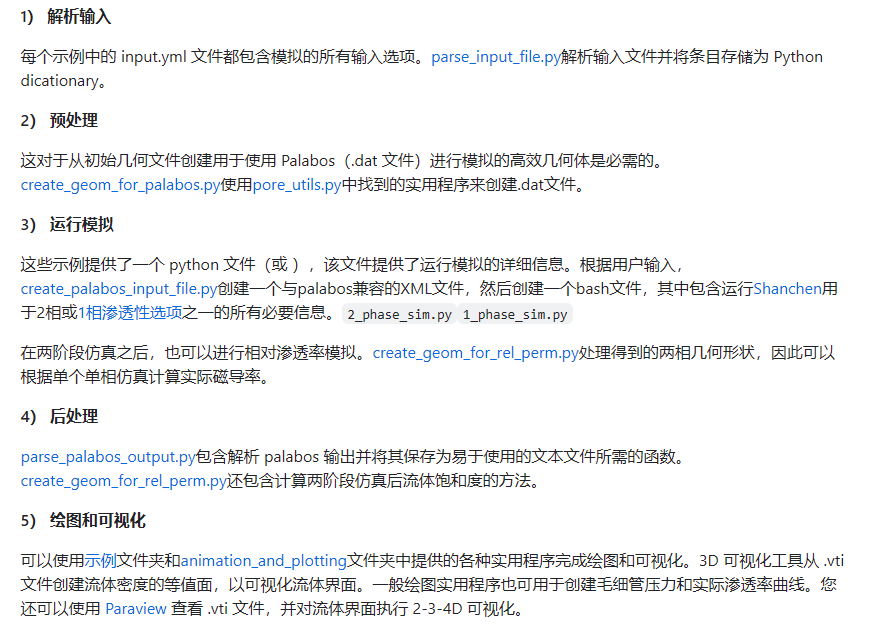

ImageJ是一款基于Java的图像处理程序，它在美国国立卫生研究院和威斯康星大学的光学和计算仪器实验室（LOCI）中开发。以下是ImageJ的一些主要功能和对应的算法：

* 显示，编辑，分析，处理，保存和打印图像：ImageJ可以处理8位色彩和灰度，16位整数，和32位浮点图像。它可以读取许多图像文件格式，包括TIFF，PNG，GIF，JPEG，BMP，DICOM，和FITS，以及原始格式。
* 图像堆栈：ImageJ支持图像堆栈，即一系列共享单一窗口的图像。

* 区域和像素值统计：ImageJ可以计算用户定义选择和强度阈值对象的区域和像素值统计。
* 距离和角度测量：ImageJ可以测量距离和角度。

* 密度直方图和线性轮廓图：ImageJ可以创建密度直方图和线性轮廓图。
* 图像处理功能：ImageJ支持标准的图像处理功能，如逻辑和算术操作，对比度操作，卷积，傅立叶分析，锐化，平滑，边缘检测，和中值滤波。

* 几何变换：ImageJ支持几何变换，如缩放，旋转，和翻转。
* 插件架构：ImageJ设计了一个开放的架构，通过Java插件和可记录的宏提供可扩展性。用户编写的插件使得解决许多图像处理和分析问题成为可能，从三维活细胞成像到放射学图像处理，从多个成像系统数据比较到自动化血液学系统。

* 图像增强：ImageJ支持平滑，锐化，边缘检测，中值滤波和阈值处理等图像增强技术。
* 颜色处理：ImageJ可以将32位色彩图像分割为RGB或HSV组件。

* 堆栈：ImageJ可以在单一窗口中显示一系列相关的图像。

[ImageJ User Guide - IJ 1.46r](https://imagej.net/ij/docs/guide/146.html) 用户指南

# MPLBM-UT：

[GitHub - je-santos/MPLBM-UT：用于在复杂几何形状（即多孔介质3D图像）中执行多相仿真（基于Shan-Chen模型）的库](https://github.com/je-santos/MPLBM-UT)

MPLBM-UT是一个用于多相和单相流体在多孔介质中的模拟的库。以下是其主要功能和实现算法：

1. **多相和单相模拟**：MPLBM-UT支持计算3D二进制图像的毛细压力曲线、相对渗透率曲线和单相渗透率。它使用Shan-Chen模型进行多相模拟，使用BGK和MRT进行单相模拟。

   [格子玻尔兹曼机(Lattice Boltzmann Method)系列5：LBM多相流实例之Shan-Chen模型_shanchen模型_阿莱夫的博客-CSDN博客](https://blog.csdn.net/weixin_43796562/article/details/104464041)

   [晶格玻尔兹曼法_百度百科 (baidu.com)](https://baike.baidu.com/item/%E6%99%B6%E6%A0%BC%E7%8E%BB%E5%B0%94%E5%85%B9%E6%9B%BC%E6%B3%95/6834129)
2. **直接流体流动模拟**：MPLBM-UT使用Palabos v2.2.1进行直接流体流动模拟。

   [首页 - 帕拉博斯 - UNIGE](https://palabos.unige.ch/)

   Palabos 库是通用计算流体动力学 （CFD） 的框架，其内核基于格玻尔兹曼 （LB） 方法。它既可用作研究工具，也可用作工程工具：其编程接口非常简单，可以相对轻松地设置流体流动仿真，或者，如果您了解格子玻尔兹曼方法，则可以使用自己的模型扩展库。Palabos 代表 Parallel Lattice Boltzmann Solver。

   库的本机编程接口以C++编写。它几乎没有外部依赖关系（只有Posix和MPI），因此非常容易在各种平台上部署。Python和Java编程语言提供了其他编程接口，这使得快速原型设计和开发CFD应用程序变得更加容易。当前不存在图形用户界面;因此，为了使应用程序运行，需要进行一定量的编程。特别是使用Python脚本接口，开发的代码可以非常非正式，并且很容易在提供的示例的帮助下生成。

   Palabos的目标受众包括具有计算流体动力学扎实背景的科学家和工程师，以及LB建模方面的一些知识。该软件根据开源 AGPLv3 许可证的条款免费提供。它分发是希望它能促进LB建模领域的研究，并帮助研究人员专注于实际的物理问题，而不是停留在繁琐的软件开发中。此外，在Palabos中实施新的LB模型提供了一种推广新模型和在研究小组之间交换信息的简单方法。
3. **预处理和后处理**：MPLBM-UT的预处理和后处理都是用Python完成的。
4. **创建高效的模拟几何体**：MPLBM-UT包含了用于创建高效模拟几何体的脚本。
5. **多种边界条件**：MPLBM-UT支持多种边界条件。
6. **广泛的后处理工具**：MPLBM-UT提供了广泛的后处理工具。
7. **灵活的模拟引擎**：MPLBM-UT的模拟引擎非常灵活，可以在个人电脑的单个核心上运行，也可以在超级计算机的数百个节点上运行。
8. **多个示例和基准模板**：MPLBM-UT提供了多个示例和基准模板，允许快速原型化不同的多孔介质问题。

   
