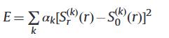
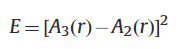
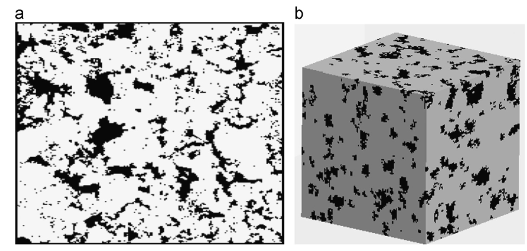
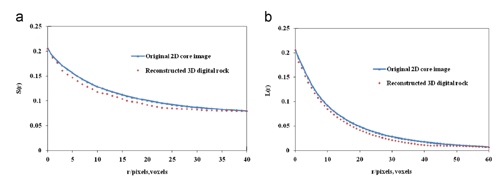
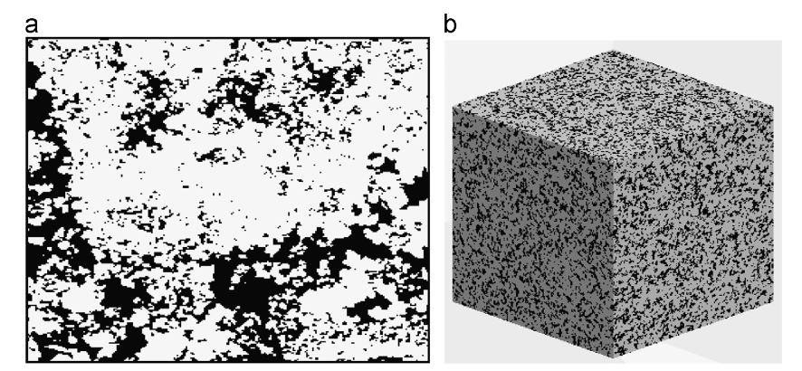
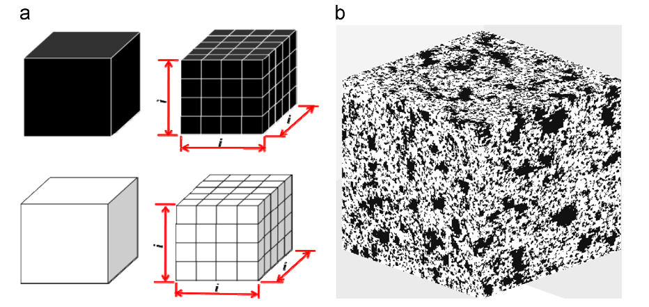
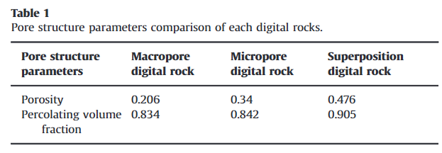
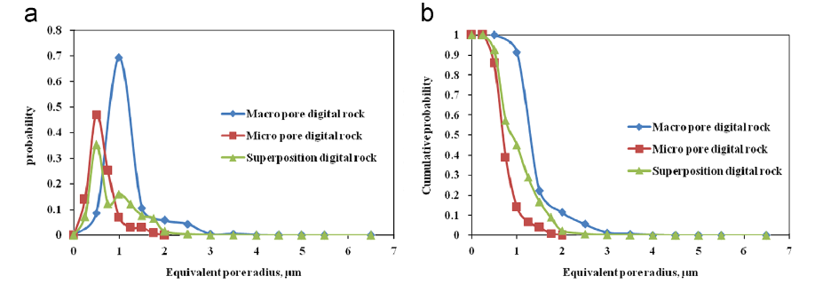
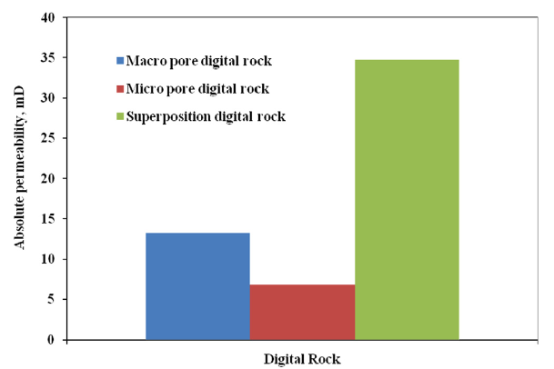

# 混合叠加法构建碳酸盐数字岩石

数据集：

代码：

主要内容：

Journal of Petroleum Science and Engineering 8.8

13年

---

碳酸盐岩储层本质上是非均质的，孔径可以有数量级的变化，不同尺度的孔隙对连通性和流动特性有很大影响。有必要描述不同尺度碳酸盐岩的微观孔隙特征及其对流动机制的影响。在本文中，使用扫描电子显微镜（SEM）收集不同分辨率的二维薄切片碳酸盐图像。较低分辨率的图像显示大孔特性，而较高分辨率的图像显示微孔特性。针对两幅不同尺度分辨率的图像，提出了一种混合叠加法，***分两步构建叠加数字岩石，第一步用模拟退火法重建大孔隙数字岩石，用马尔可夫链蒙特卡罗（MCMC）法重建微孔隙数字岩石。 ，第二步是用叠加法构造碳酸盐数字岩石。最后采用孔隙空间微观结构分析方法和格子玻尔兹曼方法对孔隙结构和流动特性进行分析。***结果表明，混合叠加方法结合了模拟退火法和马尔可夫链蒙特卡罗法的优点，能够以较少的计算时间重建具有更好形貌描述的大孔隙数字岩石和微孔隙数字岩石。碳酸盐岩叠置数字岩石具有双峰孔径分布，可以同时描述大孔和微孔特征，并且比大孔和微孔数字岩石具有更高的渗流体积分数和绝对渗透率，这表明微孔对碳酸盐岩的总连通性。该方法为研究碳酸盐岩多尺度孔隙特征和微观流动机制提供了研究平台。

---

## 一、介绍

世界上 50% 以上的碳氢化合物储量蕴藏在碳酸盐岩中。碳酸盐岩具有高度非均质性，许多岩石具有复杂的孔隙结构，且孔隙结构的长度尺度变化很大。宏观物性是微观结构的反映，因此有必要研究碳酸盐岩的微观孔隙结构和多相流机制。

目前，数字岩石已成为了解和预测多孔介质中岩石物理和多相流特性的重要平台（van Dijke 和 Piri，2007）。数字岩石的构建方法主要有物理实验和数值重建两种。同时，物理实验包括连续切片（Tomutsa等，2007）、激光扫描共焦显微镜（Fredrich等，1995）、X射线计算机显微断层扫描数值重建方法包括高斯模拟（Joshi，1974；Quiblier，1984；Adler 等，1990）、模拟退火（Hazlett，1997；Yeong 和 Torquato，1998）、基于处理的（Bryant 和 Blunt，1992；Oren）等，3D数字岩石构建后，***通常采用Lattice-Boltzmann（LB）***方法来预测流体直接计算流动特性，无需进一步简化。

尽管许多 3D 重建方法可用于砂岩，但很难为碳酸盐岩构建类似的模型。碳酸盐岩在沉积和成岩过程中，通过化学溶解、再沉淀、白云石化作用，产生了各种尺寸的孔隙，导致孔隙分布复杂。由于这些原因，很难对碳酸盐岩的孔隙尺度微观结构进行完全分类和表征，并且预测碳酸盐岩的岩石物理和多相流特性也具有挑战性。

任何碳酸盐岩都具有双峰孔径分布，这在储层形成中发挥着重要作用。近年来，许多学者对微观多尺度进行了研究碳酸盐岩的特征。 Arns（Arns 等人，2005）使用高分辨率 X 射线显微断层扫描技术对储层碳酸盐岩心塞在一定长度尺度范围内进行 3D 成像，发现岩心的表观孔隙度随着图像分辨率的增强而增加，表明存在大量碳酸盐岩亚微米孔隙率。 Knackstedt (Knackstedt et al., 2006a, 2006b, 2008) 还使用高分辨率 X 射线显微断层扫描在一定范围的长度尺度上对露头和储层碳酸盐岩岩心栓进行了成像，并显示基于图像的岩石物理性质计算与实验数据。 Biswal (Biswal et al., 2007, 2009)提出了碳酸盐岩成岩过程的随机几何模型，再现了复杂的孔隙尺度几何形状和基本的岩石物理性质。 Ghous (Ghous et al., 2008) 使用微型计算机断层扫描和聚焦离子束显微镜分别描述碳酸盐岩心样品中大孔和微孔的 3D 成像。 Al-Kharusi（Al-Kharusi 和 Blunt，2008）遵循多级工作流程从孔隙空间图像中提取网络并预测地下碳酸盐样品的多相传输特性。然而，现有的微观结构模型要么不太好，要么高度简化了碳酸盐岩的表示。

## 二、方法

这里使用二维SEM图像，因为我们无法获得具有所需分辨率的3D图像来成像碳酸盐岩的微观结构，并且将使用重建方法来获得3D数字岩石。针对两幅不同尺度分辨率的图像，提出了一种混合叠加方法，分两步构建叠加数字岩石。第一步采用模拟退火法重建3D大孔隙数字岩石，采用MCMC方法重建微孔隙数字岩石；第二步是用叠加法构造碳酸盐数字岩石。

### 1.模拟退火法

Hazlett (1997) 首先将模拟退火方法应用于构造多孔介质。它可以基于高斯滤波方法重建多种不同的随机统计函数。在重构过程中，最常用的统计函数包括孔隙率、自相关函数和线性路径函数等。对于典型的模拟退火方法，两相各向同性的重构过程多孔介质描述如下。生成由孔隙空间和骨架空间组成的 3D 多孔介质，其孔隙率与 2D 岩石图像相同。然后，能量E的计算如下：

其中E是二维图像和重建的数字岩石之间统计特性的平方差之和； Sr(k) (r) 是重建数字岩石的统计特性，S0(k) (r) 是二维图像的统计特性； k是第k个统计属性，αk是权重。如果只考虑自相关函数，则上式可简化为

其中 A3 (r) 是重建 3D 数字岩石的自相关函数，A2 (r) 是参考 2D 图像的函数。

在本文中，收集了不同分辨率的二维图像。而低分辨率二维图像是通过扫描电镜收集来描述碳酸盐岩的大孔隙特征。然后基于二维二值图像（图1a），采用模拟退火方法构建3D大孔隙数字岩石（图1b）。图2为模拟退火法大孔隙数字岩石的统计函数。从图中可以看出，当r=0时，每个函数的值为0.206，等于图像孔隙率。对于自相关函数曲线（图2a），当r大于40时曲线变得稳定，建模过程中选择前40个体素中的自相关函数作为参考函数。对于线性路径函数曲线（图2b），当r大于60时曲线变得稳定，建模过程中选择前60个体素中的线性路径函数作为参考函数。

### 2.马尔可夫链蒙特卡罗方法

MCMC方法是一种特定的蒙特卡罗方法；将马尔可夫链应用于蒙特卡罗实现动态模拟。 MCMC方法的主要思想是构造一个稳定分布的马尔可夫链p(x)。考虑从 2D 薄片图像数据导出的空间结构信息来获取所有转变概率，并且输入数据取自图像分析。这种 MCMC 重建方法及其生成的模型被称为“孔隙结构模型”或 PAM。一般来说，使用四个程序来重建 3D 数字岩心。

图1 基于模拟退火法的大孔隙数字岩石。 （a）低分辨率1.34μm/像素的二维二值图像（矩阵空间显示为白色，孔隙空间显示为黑色）和（b）重建的大孔隙数字岩石（矩阵空间显示为灰色，孔隙空间显示为黑色） ），体素大小为 100 *100 *100

从 SEM 收集高分辨率二维图像来描述碳酸盐岩中的微孔特征。基于2D二值图像（图3a），假设3D数字岩石是各向同性的，采用MCMC方法构建3D微孔数字岩石。重建的3D微数字岩石如图3b所示。

### 3.叠加法

数字岩石的数据以0和1的形式存储，0代表孔隙空间，1代表矩阵空间。基于大孔隙和微孔隙数字岩石，引入叠加法构建叠加数字岩石。这叠加过程如下：首先，将大孔隙数字岩石中的每个体素细化为 i \*i *i **个体素（图 4a），i 为大孔隙数字岩石和微孔隙数字岩石的分辨率比，本文中 i 等于 4。体素细化可以使大孔隙数字岩石和微孔隙数字岩石具有相同的物理尺寸（0.134 mm 0.134 mm 0.134 mm）和体素尺寸（400* 400* 400）。那么，两个数字岩石之间的二进制数据的叠加运算如下：0+0=0、1+0=0、0+1=0、1+1=1

图2 模拟退火法大孔隙数字岩石统计函数曲线(a)自相关函数和(b)线性路径函数

叠加过程中，大孔隙和微孔隙数字岩石的物理尺寸应保持一致。低分辨率的大孔隙数字岩石具有较小的体素尺寸，而高分辨率的微孔数字岩石具有较大的体素尺寸。由于大孔和微孔数字岩石对体素尺寸的要求，采用精度较好、计算时间较长、统计功能较多的模拟退火方法来重建大孔数字岩石，而MCMC方法则采用计算时间较少、精度较低的方法来重建大孔数字岩石。使用较少的统计函数来重建微孔数字岩石。混合叠加法可以结合模拟退火法和马尔可夫链蒙特卡罗的优点，以更少的计算时间和更高的精度构建碳酸盐数字岩石。采用混合叠加法的叠加数字岩石如图4b所示。叠加数字岩石体素尺寸为400 *400* 400，分辨率为0.335 μm

图3. MCMC法微孔数字岩石。 （a）高分辨率0.335 μm/pixel的二维二值图像（矩阵空间显示为白色，孔隙空间显示为黑色）和（b）重建的大孔隙数字岩石（矩阵空间显示为灰色，孔隙空间显示为黑色） ），体素大小为 400 400 400。

图4 碳酸盐叠合数字岩石重建。 (a) 体素细化算法和 (b) 叠加数字岩石

## 三、参数分析

### 1.孔隙结构分析

首先分析了孔隙率、渗流体积分数和孔径分布等孔隙结构参数。渗流体积分数用于描述流体渗流的孔隙空间的体积分数，可以表示整个孔隙空间的连通程度，这里的孔径分布描述了该点与其最近的矩阵点之间的距离概率

基于大孔、微孔和叠加数字岩心，可以计算出各自对应的孔隙度和渗流体积分数，比较结果见表一

图 5. 孔径分布函数。 (a) 孔径分布概率和(b) 累积孔径分布概率。

叠加数字岩石的孔隙度低于大孔和微孔数字岩石的孔隙度之和。这是由于叠加过程中孔隙空间的重叠所致。大孔隙和微孔隙数字岩石的渗流体积分数均较低，这是由于碳酸盐岩的非均质性较强。然而，叠加数字岩石的渗流体积分数比其他两种数字岩石具有更高的值，这表明微孔隙可以连接孤立的大孔隙，为叠加数字岩石的总体连通性做出了巨大贡献

根据孔径分布函数，得到孔径和累积孔径分布概率如图5所示。由图中可以看出，大孔的平均孔径为1.3 μm，主要描述了大孔的大孔特征。孔内；微孔网络平均孔径为0.54 μm，主要描述孔内微孔特征。平均孔径为1 μm的叠加数字岩石具有双峰孔径分布，可以同时捕捉数字岩石大孔和微孔的孔隙结构特征，描述碳酸盐岩孔隙内的多尺度特征

### 2.运输分析

这里采用格子玻尔兹曼方法来分析输运特性，并选择D3Q19 LBGK模型来计算绝对渗透率（Masa，2005）。而采用格子玻尔兹曼法计算各数字岩石的绝对渗透率，对比结果如图 6 所示。叠加数字岩石的绝对渗透率为 34.8 mD，高于大孔隙数字岩石的渗透率总和（13.2 mD）和微孔数字岩石（6.8 mD）。这是由于微孔隙在叠加过程中将连通性较差的大孔隙很好地连接起来，提高了总连通性，提高了绝对渗透率。

图 6 采用格子玻尔兹曼法计算数字岩石的绝对渗透率

## 四、结论

本文采用模拟退火法重建大孔隙数字岩石，采用马尔可夫链蒙特卡罗方法重建微孔数字岩石，然后采用叠加法重建碳酸盐数字岩石。通过对每种数字岩石的孔隙和输运特性进行分析，我们可以得到以下结论：（1）混合叠加方法可以结合模拟退火法和马尔可夫链蒙特卡罗方法的优点，可以用更好的形态描述和计算时间更少的微孔数字岩石； (2)叠加数字岩石具有双峰孔径分布，可以同时捕捉大孔隙和微孔隙数字岩石的孔隙结构特征，描述碳酸盐岩孔隙内的多尺度特征； (3) 虽然微孔隙由于渗透率低而在以往的研究中通常被忽视，但微孔隙的影响应该得到更多的关注，因为它们可以改善碳酸盐岩的总体连通性并对输导特性有很大的贡献
