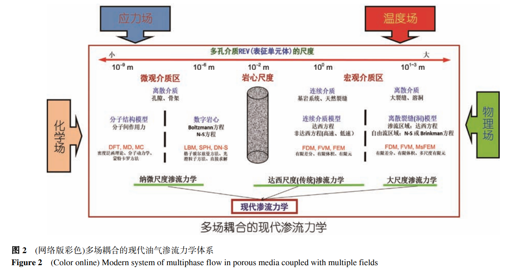

# 现代油气渗流力学体系及其发展趋势

油气渗流是油气藏开采的科学核心问题, 以连续介质假设和达西方程为基础的传统渗流力学在常规油气
资源开发中发挥了重要作用. 近年来, 非常规油气藏成为油气行业勘探开发的主要阵地, 其开发理论和技术尤其
是渗流问题也成为学术界研究的热点问题. 非常规油气藏其岩石多孔介质具有明显的多尺度特征, 尺度差异达到
6个数量级之多, 而且采用大规模的水平井分段压裂开发模式, 储层应力强烈作用. 因此, 传统的油气渗流理论已
无法准确描述非常规油气藏的流动特征. 实质上, 非常规油气资源的开发过程是一个典型的多场作用下的多流动
模式的多相流体(油气水)在多尺度多孔介质的流动过程. 为此, 本文提出了“多场作用下的多流动模式的多相流体
在多尺度多孔介质中流动动力学体系”的现代渗流力学体系的概念, 并从纳微尺度油气流动模拟、流动模拟的多尺
度升级、非常规油气藏的宏观流动模拟、大尺度缝洞碳酸盐岩油藏的流动模拟以及油气渗流物理模拟等方面系统
阐述了其研究现状及发展趋势

---

## 一、现代渗流力学体系及其特点

### 1.岩石多孔介质具有多尺度性

跨越五个尺度:
即分子(纳米)尺度、孔隙(微米)尺度、达西(毫米)尺度、岩心(厘米)尺度以及大(百米甚至千米)尺度上研究渗流问题, 在不同的多孔介质表征单元体尺度上具有不同的流动机制、控制方程、渗流模型以及流动模拟方法, 如图1所示. 不同尺度流动的关联性即尺度升级是现代油气渗流力学需要解决的重要基础问题之一.

### 2.油气渗流具有多场耦合的特征

为了高效开采, 需要对油气藏采用各种增产和  提高采收率措施. 非常规页岩/致密油气藏, 需要对  水平井进行大规模的分段压裂以形成了地下缝网,   这极大地改变了油气藏的应力场分布, 其生产过程  中的油气渗流必然受应力场的影响较大[7]  , 因此, 存  在着渗流场与应力场耦合的问题. 对于各种化学驱  油藏, 注入聚合物、表面活性剂以及碱等各类化学剂,   这些化学剂与多孔介质孔隙喉道表面及油水界面发  生系列化学反应, 这些反应对渗流场有较大的影响,   因而, 存在着渗流场与化学场耦合的问题. 对于稠油  油藏, 由于原油黏度较大, 经常采用注热(如注蒸汽  或火烧油藏等)方法提升地层温度降低原油黏度来实  施有效的开采, 热场对渗流场有较大的影响, 因而,   存在着渗流场与热场耦合的问题. 另外, 油气开采中  还实施很多的物理采油方法(如声、光、电、磁、震  动等)改善近井油藏岩石和流体的物理性质, 从而提  高油气藏的采收率, 因此, 存在渗流场与这些物理场  耦合的问题. 油气渗流力学具有多场耦合的特征, 如  图2所示为渗流场与应力场、热场、化学场以及物理  场等耦合的示意图.

### 3.多孔介质多相流的多流动模式特征

在纳微米孔隙尺度上, 流体的流动模式更加丰  富多彩, 有努森扩散、表面扩散、分子扩散、温度引  起的热扩散以及压力差作用下的黏性流等, 导致了  纳微孔隙尺度下流体的流动机制复杂.  

 在缝洞型多孔介质中, 既存在基岩孔隙和微裂  缝中的渗流又存在大裂缝和溶洞中的自由流(由N-S  方程描述), 在不同类型的孔隙介质中呈现出不同的  流动模式, 缝洞型多孔介质的流体流动是渗流与自  由流的耦合流动.

 总之, 流动模式的多样性导致了多孔介质中流  体流动的复杂性

### 4.现代油气渗流力学体系及其特征

所谓的现代油气渗流力学体系主要包括纳微尺度渗流力学、岩心尺度渗流力学、达西尺度宏观渗流力学和缝洞大尺度渗流力学, 具有多尺度、多场耦合和多流动模式的特征. 现代油气渗流力学体系实质上是一个典型的多场作用下的多尺度多孔介质中的多流动模式多相流体(油气水)的动力学体系, 其特征可用“五多”来描述, 即多孔介质、多尺度、多相流、
多模式和多场耦合.
实际上, 人们对非常规油气资源的极大关注、对开采机制的不断探索, 促进了现代油气渗流力学体系的完善和发展, 其发展趋势为: 纳微尺度流动模拟、缝洞大尺度流动模拟、流动模拟的多尺度升级和渗流与多场全耦合的大规模计算等.
本文对现代油气渗流力学体系中的部分关键内容如***纳微尺度油气流动模拟、流动模拟的多尺度升级、非常规油气藏的宏观流动模拟、大尺度缝洞碳酸盐岩油藏的流动模拟以及油气渗流物理模拟***等展开系统阐述

## 二、*纳微尺度*油气流动模拟

### 1.纳米尺度流动模拟

相对于常规尺度而言, 纳米尺度下物质的性质有很大的不同, 如边界速度滑移、温度跳跃效应、粗糙度效应、表面力效应等

#### 1.1纳米孔道内水的研究

典型的连续流可通过Navier-Stocks(N-S)方程来描述, 连续流理论中, 温度、密度和速度的变化是连续的, 可以通过时间和位置进行微分.

经典算法是否在微观条件下适用的实验

#### 1.2纳米孔道内页岩气的研究

由于连续性假设在纳微米孔道中不适用, 一般采用气体分子运动自由程与孔隙半径的比值Knudsen数判定页岩中的气体运移模式,不同Knudsen数对应气体运移机制不同.

目前普遍认为无机质孔隙如黏土孔隙具有大量吸附气是建立在固-气界面吸附理论基础上的, 对***页岩气藏不适用***

如图4所示, 同种气体分子与分子之间碰撞产生黏性流, 分子与壁面碰撞产生Knudsen扩散, 吸附在孔隙壁面的气体分子沿孔隙表面蠕动产生表面扩散.

相比于有机质对甲烷的强吸附能力, 无机质孔隙吸附能力可以忽略， 在模拟页岩气流动和气藏储量计算中一般忽略无机质孔隙中的吸附气。

### 2.微米尺度流动模拟

微米尺度流动模拟通常也叫做***孔隙级流动模拟***,一般以多孔介质的数字岩心为平台。

最早在数字岩心的基础上通过提取孔隙网络模型, 简化多孔介质的孔隙结构, 然后在孔隙网络模型上进行模拟. 后来随着计算机速度、存储容量的发展 , 利用***格子Boltzmann方法(LBM)、直接求解N-S方程等方***法可直接模拟数字岩心中的流体流动。

#### 2.1数字岩心和孔隙网络模型的构建方法

(ⅰ) ***数字岩心***构建研究进展. 

    数字岩心作为孔隙级微观渗流理论研究的基础平台, 为微观孔隙尺度上研究流体在多孔介质中的流动提供了重要的研究手段. 数字岩心的建模技术主要分为两大类:***物理实验法和数值重建法***

    ***系列切片法、聚焦离子光束法、CT扫描法、聚焦离子束扫描电子显微***镜(FIB-SEM)法可获得多孔介质高精度的二维或三维数据, 为多孔介质重构研究提供真实的基础数据

    数值重构法先用二维图像获取孔隙结构特征,再进行多孔介质的三维重构, 主要有以下几种方法：

    (1) 高斯模拟法. 高斯模拟法基于岩石薄片统计资料, 随机产生数据集(高斯场), 该高斯场由相互独立的高斯变量组成; 应用孔隙度和两点相关函数作为约束条件, 通过非线性变换将高斯场转化为数字岩心. 但是, 仅用孔隙度和两点相关函数无法充分反映孔隙空间的结构特征, 孔隙空间的连通性较差.

    (2)模拟退火法. 模拟退火法通过提取二维图像中的孔隙度和两点自相关函数等统计函数信息来重构三维孔隙图像. 赵秀才等人在此基础进行了改进, 给出了更加合理的优化步骤. 由于模拟退火法只是使用了二维图像中的低阶统计信息, 因此难以再现孔隙空间的长连通性.

    (3) 多点地质统计法. Okabe等人通过旋转二维薄片图像获得三维情况下的条件概率分布函数, 再利用多点地质统计法来重构多孔介质的孔隙结构, 由于缺少真实的三维结构特征, 这种方法重构的多孔介质不能再现真实的三维孔隙特征信息, 虽然二维薄片图像具有较高的分辨率并且较易获取, 但是它不包含孔隙的三维结构特征信息.

    (4) 过程模拟法. 过程模拟法提出了通过模拟岩石的地质成岩过程来建立数字岩心的方法, 给出了一种能更加逼真的模拟真实岩石形成过程的建模方法,过程模拟法所建立的数字岩心具有很好的孔隙连通性, 但该方法无法模拟复杂孔隙系统的成岩过程
    (5) 马尔可夫链蒙特卡罗法. Wu等人[27]将马尔可夫链蒙特卡罗(MCMC)方法应用到了三维油藏岩石的构建之中, 大大提高了计算效率, 是目前应用最多的重构方法之一.

    (6) 混合法. 针对碳酸盐岩和非常规油气藏的多尺度非均质特性, Yao等人发挥模拟退火法、多点地质统计法和马尔可夫链蒙特卡罗法各自的优点, 提出了一种叠加耦合方法, 重建了反映碳酸盐岩和页岩岩心孔隙的数字岩心(如图5所示), 取得了较好的建模效果.

(ⅱ) ***孔隙网络***模型提取研究进展. 

    三维孔隙网络模型是进行多孔介质微观多相流研究的基础, 孔隙网络模型能够再现复杂的孔隙空间, 孔隙网络模型模拟不仅可以降低实验成本, 缩短实验数据获取周期, 还可以得到实验室内难以测量的实验数据。

    建立真实拓扑孔隙网络模型的方法有: 孔***隙空间居中轴线法、最大球体法以及不同孔网模型的叠***加耦合法. 

    (1) 孔隙空间居中轴线法. 对于多孔介质,岩心孔隙空间像人体内的血管一样贯穿于岩心内部,这些孔隙空间的中心轴线即称为孔隙空间居中轴线.孔隙空间居中轴线准确保留了孔隙空间的几何连通特征, 可以表征孔隙空间的拓扑结构. 定义中轴线节点为孔隙, 中轴线上的局部最小区域为喉道, 对整个孔隙空间进行合理分割和简化, 即可建立孔隙网络模型. 孔隙空间居中轴线法可以获得多孔介质内部连通性(喉道), 但是在识别孔隙时会存在不确定性.
    (2) 最大球体法. Silin等人[30]提出了最大球体法思想,对孔隙空间任意一点, 找出其最大的内切球半径, 用局部最大的球体来表示孔隙, 连接此球体的所有较小球体表示喉道. Dong等人[31]完善了Silin和Patzek的方法, 改进了最大球体生成方法, 建立了一种树状结构, 使孔隙、喉道间的相互连通关系更加清晰. 然而,最大球体法在图像分辨率较差时会倾向于搜索大量小尺寸喉道, 同时在产生特定的水力半径时存在一定的误差.

    (3) 多尺度孔隙网络模型. 以孔隙网络模型为研究平台, Jiang等人[32]提出了一种孔隙网络模型的整合方法. 首先, 分别构建出不同尺度或者不同性质的孔隙网络模型; 然后, 为了获取孔隙网络模型的统计特征, 分析孔隙网络模型几何结构参数变量之间的相关性并通过相关强度描述变量之间的相关结构; 最后, 通过整合几何拓扑结构特征等价的孔隙网络, 得到同时描述不同孔隙类型结构特征的多尺度孔隙网络模型.

#### 2.2基于数字岩心的LBM模拟

[格子玻尔兹曼方法：基本概念 - 知乎 (zhihu.com)](https://zhuanlan.zhihu.com/p/397601406)

LBM直接利用多孔介质的孔隙结构, 不需要对孔隙结构进行简化, 可以直接进行流动模拟, 与孔隙网络模型的模拟相比, LBM能够对多孔介质内的流动进行精细刻画, 但计算量也大大增加.

    (ⅰ) LBM单相流动模拟. 1989年Succi等人首次应用LBM模拟了三维随机多孔介质内的孔隙流动; 随后一些学者[34]利用LBM模拟了二维、三维随机生成的多孔介质中的流动, 研究了不同孔隙度多孔介质的达西流动问题, 但这仅适用于常规油气藏中油气渗流的模拟, 对于页岩等致密性非常规油气藏,由于储层岩石孔隙尺寸的纳微尺度特性, 比如对于页岩气的流动, 壁面存在滑移流速, 并且有机质壁面存在吸附气, 这使得气体在页岩中的流动明显不同于常规孔隙。

    利用LBM进行微尺度气体流动模拟时需要解决两个基本问题, 一是松弛时间和努森数之间的关系,二是合理的滑移边界条件.

为研究有机质吸附对页岩气流动及生产的影响,通过引入有机质壁面与气体分子间相互作用力来模拟吸附, 并且LBM中有机质壁面的吸附参数大小由分子动力学模拟来确定[40], 研究了吸附对页岩气生产的影响, 见图6, 结果表明与游离气相比, 吸附气更难被产出, 从而导致有机质中的气体采收率相对较低。

(ⅱ) LBM多相流动模拟应用. LBM多相流模型根据描述相之间相互作用方式的角度来划分, 可以分为四大类: 颜色模型、伪势模型、自由能模型和其他模型. 颜色模型表面张力与界面的走向相关, 在重新标色过程中计算量较大. 伪势模型只有当相互作用力中的有效密度函数取指数形式时, 该模型才与热力学相关理论一致; 自由能模型当界面之间存在较大的密度梯度时, 会导致一些非物理现象

#### 2.3基于数字岩心和孔隙网络模型的N-S方程模拟方法

近年来以多孔介质图像为基础, 结合现有成熟的计算流体力学方法, 通过数值求解N-S方程进行孔隙尺度多孔介质内的单相流以及多相流模拟也在不断发展. N-S方程单相流模拟目前较为成熟, 但仍存在网格剖分困难, 计算量巨大的问题. 多相流模拟中液相界面的动态描述及界面张力计算是一个关键问题, 描述液相界面动态变化的方法主要有***动网格法和界面追踪法***两大类.

动网格法在各相区域内单 独划分网格, 相界面被表示为两套网格的边界. 随着  流体的运动, 网格需要进行调整以适应相界面的变  化, 因此这类方法的计算量较大; 

常用的界面追踪方  法有水平集方法(level set method), 流体体积法(VOF)  以及CLSVOF方法, 其中CLSVOF方法是前两种方法  的耦合方法, 有效地克服了水平集方法物理量不守  恒以及流体体积法不能准确计算相界面的法向和曲  率的缺点. 结合动态液相界面形状可以求取界面张  力, 常用的模型有连续表面力模型、连续表面应力模  型和间断表面力模型等. 

多孔介质孔隙尺度多相流  模拟中另一个关键问题是如何准确描述液相与固体  表面接触角的动态变化过程. Renardy等人[44]基于  VOF方法提出修正固体表面法向量和求解杨氏方程  两种计算接触角的方法. Huang等人[45]和Qaseminejad   Raeini[43]分别通过采用不同方式光滑固体表面法向  量对第一种方法进行了改进. 与其他流动模拟方法  相比, N-S结合非结构化网格可以模拟任意复杂形状  多孔介质内的微观流动, 但同时也存在网格剖分量  及计算代价大, 对求解器要求较高的缺陷

## 三、流动模拟的多尺度升级

### 1.多孔介质中的多尺度问题

油气藏是由复杂的多孔介质组成的, 其空间类型的多样性和多尺度性, 导致流体在不同尺度的空间上流动机制不同, 此时采用单一尺度上控制方程或流动模拟方法不能准确揭示复杂油气藏内流体流动规律. 页岩气藏和缝洞型碳酸盐岩油藏为典型的多尺度复杂油气藏, 以页岩气藏为例, 图8说明了页岩气藏的多尺度流动机制, 页岩气藏存在***五个尺度***上的储集空间: 纳米级尺度的有机质孔隙、微米级的干酪根团和非有机孔隙、介观毫米级尺度上的微裂缝和基岩孔隙系统、宏观米级尺度上的水平井和压裂缝及大规模的油气藏尺度, 气体在不同的储集空间内运移机制不同, 所采用的方法也不同: 如在纳米级有机质孔隙内, 传统的连续性假设不再成立, 达西定律和N-S方程不再适用, 需采用分子模拟揭示有机质表面的吸附解吸机制, 采用DSMC或修正的LBM来研究有机质孔隙内的气体运移; 而在微米级微观干酪根团和非有机孔隙内可采用N-S方程和LBM来研究其流动问题; 介观毫米尺度上, 需考虑天然裂缝自由流和基岩内连续流耦合的问题.

### 2.常用尺度升级方法

尺度升级的方法有多种, 目前多孔介质流动中常用的方法为***均化理论(homogenization theory)和体积平均法***(volume averaging method).

均化理论一般应用在周期性问题, 假定存在宏观和微观两个尺度, 微观尺度的方程通过双尺度渐进展开得到宏观尺度上均化的方程和参数, 该方法适用的条件是微尺度空间尺寸相对于宏观尺度必须趋于零. 

体积平均法一般采用平滑化和空间平均公式进行尺度升级, 不需要有小尺度假设, 因此不需要假定必须有两个尺度相差较大的空间, 一般在REV尺度上进行升级.（REV（表征体元）指的是采用局部容积平均方法对连续多孔介质在宏观水平上进行建立数学模型时，所选取的平均范围。）

#### 2.1均化理论

目前该理论在多孔介质传质传热问题以及流体力学等领域也得到了应用, 并被称为多尺度均匀化方法.从数学角度来看, 均匀化理论是一种极限理论, 它利用渐进展开式和周期性假设, 用常系数或变化缓慢但解逼近原始解的微分方程来代替系数变化快的原始微分方程, 目前均化理论中存在双尺度渐进展开方法等一些比较经典方法

#### 2.2体积平均法

体积平均法也是一种尺度升级方法, 与均化理论不同的是: 体积平均法不需要有两个相差较大的空间尺度, 通过在区域内选取一表征单元体, 将表征单元分为固体骨架和不同流体相(如图11所示的两相流系统, 包含固体骨架(s-phase)、润湿流体相(w-phase)和非润湿流体相(n-phase)), 通过定义的5个基本定义和定理(表相平均、体相平均、物理量的空间分解、空间平均定理及物质传输方程), 表征单元空间上对不同相进行平均, 得到宏观控制方程

## 四、非常规油气藏的宏观流动模拟

页岩/致密油气藏作为一种典型的非常规油气藏,与常规油气藏相比有截然不同的开采方式和流动机理. 储层孔隙结构复杂, 发育纳微米级孔喉和微米级裂隙系统, 孔喉直径非常小, 渗透率极低, 必须进行压裂才能进行商业化开采; 储层基岩中流体运移机制非常复杂, 常规只考虑黏性流动的达西方程无法准确描述; 同时, 储层处于复杂地应力等多物理场的共同作用中, 随着孔隙压力的下降, 岩石骨架承受的有效应力增加, 储层基岩孔隙和裂缝发生形变, 整个生产过程伴随着强烈的流固耦合现象, 导致储层的渗流能力急剧减小, 造成产能下降. 现将页岩/致密油气藏的大规模分段压裂模拟以及生产过程的数值模拟研究进展及趋势介绍如下.

### 1.页岩/致密油气藏的水力压裂裂缝扩展数值模拟

水力裂缝扩展问题需要考虑以下3个作用过程:地层岩石力学变形、裂缝内流体流动以及断裂延伸.针对岩石变形, 目前采用的模型包括: 线弹性理论、弹塑性理论和多孔弹性理论;

### 2.页岩气藏流动数值模拟

常用的页岩气流动模型主要有: 双重介质模型和离散裂缝模型. 

双重介质模型将裂缝的影响等效到整个模型中, 重点研究整体的渗流特征, 该模型的关键在于如何准确刻画基岩与微裂缝间的非稳态窜流, 常用的方法主要有解析推导和数值离散两类; 

离散裂缝模型可以准确刻画单个裂缝的导流特征, 然而由于裂缝形态的复杂性, 其网格剖分难度较大, 同时模型的计算量也较大, 难以用于模拟储层中的所有裂缝. 压裂后页岩储层中同时存在微孔隙、微裂缝和水力裂缝, 如图13所示. 单一的双重介质模型或者离散裂缝模型均不能准确有效模拟, 对此, 有学者提出一种耦合模型, 将双重介质模型与离散裂缝模型相结合: 对于小尺度的微裂缝建立双重介质模型[69],大尺裂缝建立离散裂缝模型. 这种耦合模型有效的结合了双重介质模型和离散裂缝模型各自的优点,具有较高的计算精度和计算效率.

### 3.页岩气藏流固耦合数值模拟

## 五、大尺度缝洞碳酸盐岩流动模拟

缝洞型碳酸盐岩油藏一般经历了多期构造运动、多期岩溶叠加改造、多期成藏等过程, 具有极强的非均质性和显著的多尺度特征, 主要表现在: (1) 介质的储集类型多样, 包括裂缝、溶洞和孔隙; (2) 介质的储集空间尺度变化范围大, 尤其是裂缝和溶洞的空间大小从毫米级可跨越到米级; (3) 受后期构造运动影响, 裂缝和溶蚀孔洞充填比较严重, 加剧了储层的非均质性.

### 1.离散裂缝网络模型流动模拟方法

#### 1.1渗流区域中的离散裂缝模型

#### 1.2离散裂缝模型数值模拟方法

### 2.离散缝洞网络模型流动模拟方法

#### 2.1渗流-自由流耦合流动理论

#### 2.2渗流-自由流耦合两相流数学模型

### 3.等效介质模型的流动模拟方法

#### 3.1等效连续介质模型有效性的判定

#### 3.2裂缝油藏等效渗透率计算

## 六、油气渗流的物理模拟

### 1.缝洞宏观物理模拟

#### 1.1缝洞介质油水流动机理的研究

#### 1.2缝洞单元开采机理研究

### 2.致密油气渗流物理模拟

#### 2.1孔隙度渗透率测试

#### 2.2孔隙结构表征

#### 2.3可动流体、可动油分布特征

#### 2.4单相、两相渗流规律

## 七、结论及展望
