# 基于直接模拟和机器学习技术的图像岩石物理性质评价文献综述

期刊：Abu Dhabi International Petroleum Exhibition and Conference阿布扎比国际石油展览会和会议   影响因子：

---

岩石物理性质的估计对于准确的储层预测至关重要。近年来，人们致力于训练不同的机器学习 (ML) 模型，以使用***干岩石图像***以及***单相直接模拟数据***来预测数字岩石的岩石物理特性，例如格子玻尔兹曼方法 (LBM) 和有限元法体积法（FVM）。本文的目的是对使用不同的机器学习工作流程和直接模拟方法从干岩石图像估计岩石物理特性进行全面的文献综述。该综述对文献中用于***估计孔隙度、渗透率、弯曲度和有效扩散率***的不同机器学习算法进行了详细比较。本文对文献中的各种机器学习工作流程进行了筛选，并在训练数据集、测试数据集、提取的特征、所采用的算法及其准确性方面进行了比较。还提供了最常用算法的全面描述，以更好地理解这些算法对岩石图像与其各自的岩石物理特性之间的关系进行编码的功能。

对用于从干图像估计岩石岩石物理特性的各种机器学习工作流程的回顾表明，使用从图像中提取的特征（物理信息模型）训练的模型优于直接在干图像上训练的模型。此外，某些基于树的机器学习算法（例如随机森林、梯度提升和极限梯度提升）可以产生与深度神经网络 (DNN) 和卷积神经网络 (CNN) 等深度学习算法相当的准确预测。据我们所知，这是第一个致力于探索和比较不同机器学习框架的工作，这些框架最近被用来根据图像准确有效地估计岩石物理特性。这项工作将使其他研究人员能够对该主题有更广泛的了解，并帮助开发新的机器学习工作流程或进一步修改现有的工作流程，以改善岩石特性的表征。此外，这种比较还为理解不同机器学习算法的性能和适用性提供了指导。此外，该综述有助于该领域的研究人员应对第四个工业时代——石油和天然气 4.0 中多孔介质表征的数字创新。

## 机器学习工作流程

使用直接模拟和机器学习技术从图像预测岩石物理性质的典型工作流程如图所示。

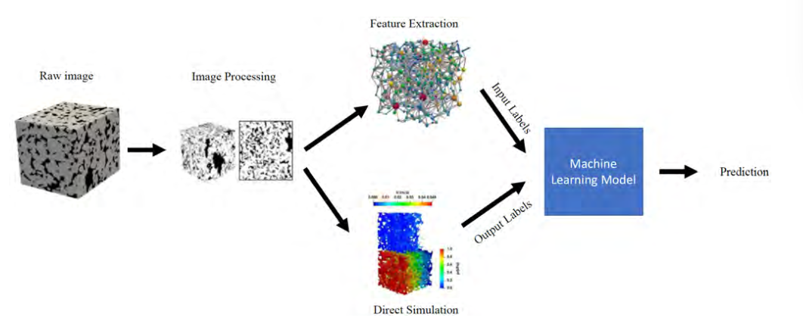

所提出的工作流程可用于预测任何岩石物理特性，包括孔隙度、渗透率、有效扩散率 (De) 以及杨氏模量和剪切模量等弹性特性。弹性特性通常使用有限元法 (FEM) 在孔隙尺度上计算。然而，机器学习在预测弹性特性方面的应用仍有待充分解决。在 ML 背景下，值得注意的是，特征提取步骤对于将从图像中提取的多孔介质的微观属性与其宏观属性相关联至关重要，从而使预测更具可解释性，并使 ML 模型更具物理信息。然而，并不是所有的研究都使用了这个特征提取步骤，而是应用了深度学习算法。深度学习算法直接处理图像来进行预测，无需任何人工干预。

## 图像采集与处理

数字图像被认为是本工作中提出的所有研究的基石。数字图像由称为像素的图像元素组成。图像的大小由像素矩阵的尺寸决定。在 3D 中，这些像素称为体素。为了通过实验获得真实的岩石图像，通常使用显微CT成像技术。微型 CT 扫描是一种使用 X 射线观察物体内部的数字成像技术。它以不同的投影角度捕获一系列称为切片的二维图像。然后，根据大量射线照片进行重建过程以获得 3D 图像。 Micro-CT 能够捕获孔隙尺度的岩心样品的异质性，包括碳酸盐的异质性。此外，微型 CT 扫描（通常分辨率为 0.5μm）比医用 CT（通常分辨率为 500μm）具有更高的分辨率。然而，很多时候这些实验图像并不广泛可用，或者获取成本高昂。为了解决这个问题，使用了各种合成数据生成技术来生成具有特定属性范围的多孔介质结构。此外，由于生成对抗网络（GAN）能够生成与实际图像高度相关的结构，因此最近已被用于生成多孔介质图像。

考虑到实验方法所需的高成本和时间，显然使用合成成像技术获得大量图像是简单的，并且在文献中被广泛采用。对实际实验数据进行的工作通过将少量大图像二次采样为大量小图像来解决这个问题。该技术涉及以一定的步长（称为跨步距离）移动所需小图像大小的预定窗口，穿过原始图像以获得小窗口，如果处理 2D 图像或 3D 图像的小立方体。要训练的图像的大小仍然是一个有争议的问题，并且在大多数研究中经常被忽视。建议窗口大小小于大图像的代表性基本体积 (REV)，以获得广泛分布且具有广泛属性的数据集，以帮助泛化 ML 模型并改进预测能力。

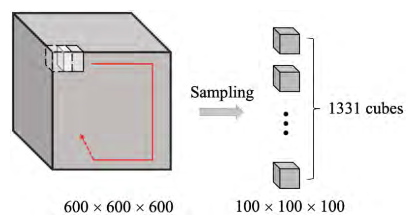

## Direct Simulation Techniques 直接模拟技术

为了获得训练机器学习模型所需的岩石物理特性数据，使用了直接模拟技术。直接模拟技术可分为两大类：基于离散粒子的模拟和基于连续体网格的模拟

### Discrete Particle-based Direct Simulation 基于离散粒子的直接模拟

格子玻尔兹曼方法（Lattice Boltzmann Method）LBM 是模拟孔隙尺度流体流动的最有效的离散粒子方法。 LBM直接模拟是一种基于元胞自动机理论的介观模型，能够计算实际复杂多孔介质中的流动，而不需要特殊的网格化。元胞自动机理论的基本概念是流体可以被认为是大量随机运动的小粒子的组合。粒子像台球一样不断碰撞和流动，从而保存动量和能量。这个过程可以通过玻尔兹曼输运方程来模拟如下

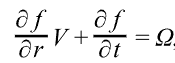

其中 f(r,v,t) 是粒子密度分布函数，v 是粒子速度，Ω 是碰撞算子。在准确性方面，LBM优于其他直接模拟方法，但计算时间和资源非常重要，必须考虑在内。

### Mesh-based Direct Simulation 基于网格的直接模拟

有限差分法 (FDM)、有限体积法 (FVM) 和有限元法 (FEM) 等基于网格的技术用于评估岩石物理特性。基于网格的方法将孔隙空间划分为几何上简单的单元或单元。对于流动特性计算，这些技术用于通过离散质量和动量守恒方程来求解多孔介质内的流体流动方程

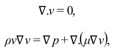

其中 v 表示速度矢量，ρ 是密度，p 是压力，μ 是粘度。求解方程后，可以利用达西定律计算渗透率。流体体积法 (VOF) 是 FVM 的扩展，可用于估计牛顿流体和非牛顿流体的多相流特性。虽然有限元法已用于模拟流动特性，并取得了不同程度的成功。基于岩石显微CT图像的弹性特性计算是FEM最成功的应用之一。该方法由胡克定律的离散线性弹性方程组成：

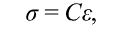

其中，σ 表示应力张量，C 表示刚度张量，ε 表示应变张量。通过在具有均匀应变的 3D 显微 CT 图像上求解方程，可以计算有效体积 (K) 和剪切模量 (G)

## Machine learning Techniques 机器学习技术

机器学习 (ML) 涉及从数据中提取信息、对其进行处理以促进任务自动化并增强人类对所检查主题的知识的算法。学习算法分为三种类型，如图所示：监督学习、无监督学习和半监督学习。此细分基于可用数据的标记程度。监督学习采用标记数据，其中问题的输入和输出是预先已知的，并且要求学习算法对它们之间的关系进行编码以帮助将来的预测。另一方面，无监督学习算法使用未标记的数据，这意味着输入数据已知但输出未知，ML 模型用于从数据中提取模式和信息。分类和回归算法是监督学习的例子，而聚类和降维算法是无监督学习的例子。同时，半监督学习处理部分标记数据（少量标记数据和大量未标记数据），包括生成对抗网络（GAN）和强化学习等算法

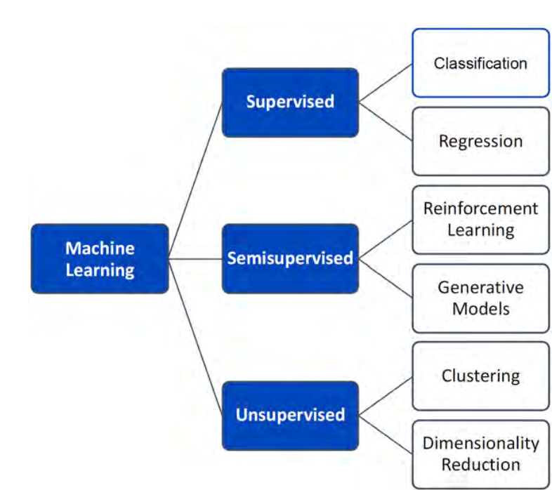

常用的回归算法包括基于树的算法和人工神经网络（ANN）。基于树的算法包括决策树及其强大的集成，例如随机森林、梯度提升和梯度 xboosting。另一方面，人工神经网络有能力对任何非线性函数进行编码和近似。 ANN 的改进是深度神经网络 (DNN) 和卷积神经网络 (CNN)。 DNN 是具有多层的神经网络，即使对于最复杂的数据也可以提供令人印象深刻的预测能力，而 CNN 是具有表示为卷积核的非线性激活函数的 DNN，使其在图像识别和分析方面具有高性能

### Regression Evaluation Metrics 回归评估指标

本节定义了用于评估 ML 模型性能的不同评估指标。如果 yi 是原始输出， 是模型的预测输出， 是原始输出均值，则评估指标可以定义为：

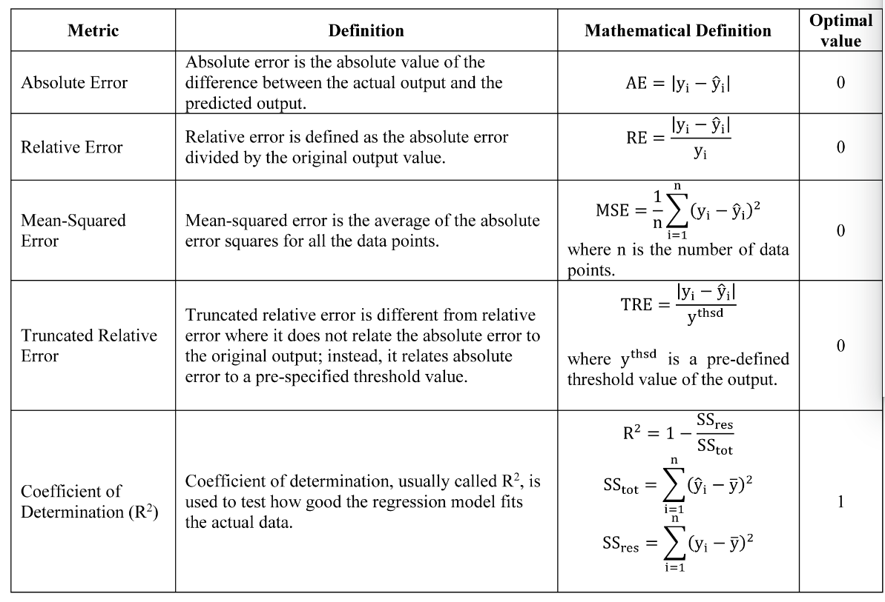

## Predicting Petrophysical Properties Using Machine Learning 使用机器学习预测岩石物理特性

使用机器学习从图像预测岩石物理特性的方法可以分为两大类。第一类是回归模型，它使用图像特征或图像本身来训练模型，以便编码它们与感兴趣的相关岩石物理特性的关系。第二类采用机器学习作为数值模拟的代理模型，机器学习模型能够预测速度场，进而可以用来恢复感兴趣的物理特性。这两个类及其子类别如图所示

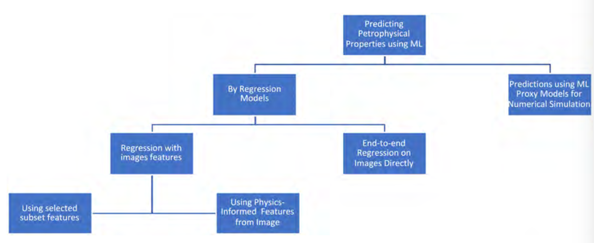

### 回归模型的预测 Predictions by Regression Models

 可以使用传统的机器学习技术建立岩石物理性质和多孔介质结构之间的关系，这需要使用传统的回归模型将多孔结构简化为可以与岩石物理性质相关的一些描述符或特征。这种技术通常在文献中得到推荐，因为它揭示了有关问题的物理知识并且计算成本较低。另一种方法涉及使用深度学习（DL）技术，该技术主要使用岩石图像作为直接输入，因此不需要首先提取图像中的特征。尽管该技术的计算成本较高并且需要优化 ANN 的许多超参数，但它不涉及任何人为干预。下面介绍了这两种技术，并对文献中的相关案例研究进行了批判性分析

#### Regression with Images Features 图像特征回归

在图像特征回归中，多孔介质使用不同的形态特征进行统计表征。这些特征可以使用孔隙网络模型从多孔介质的图像中提取。然而，所有特征不能与多孔介质的所有岩石物理性质相关。有些特征会影响渗透性；其他影响有效扩散率等等。此外，模型中包含不相关的特征会使模型更加复杂且难以解释。特征的选择可以与特定的岩石物理性质相关，通常应该参考已知的经验相关性或实验结果。本文讨论的大多数研究都采用了这种特征选择方法。另一方面，一些研究使用了特征选择算法，该算法根据特征与所研究的岩石物理性质的相关程度为特征分配分数。

##### Regression Using Selected Subset Features  使用选定的子集特征进行回归

根据图像估计渗透率是 ML 回归模型在多孔介质研究中的首批应用之一。在后一项研究中，通过选择能够准确预测渗透率的最高得分特征来表征渗透率。为了在加权孔隙网络的渗透率和平均接近中心性之间建立双对数尺度的线性相关性作为特征，使用了三种ML特征选择技术——Kendall等级相关、互信息和RReliefF。后一种技术根据最佳表征渗透性的程度对图像特征进行评分。该数据集包含使用离散元法 (DEM) 生成的 536 个球体填料，并使用孔隙网络和颗粒接触网络提取特征。此外，安田等扩展了后一项人工作，开发了一种工作流程，不仅根据特征对渗透率计算的影响对特征进行排序，而且能够选择最佳特征子集来准确描述渗透率

##### Regression Using Physics-informed Features of Images. 使用图像的物理特征进行回归

此类研究首先从图像中提取一些已知会影响所研究的岩石物理性质的特征。 Rabbani 和 Babaei（2019）通过耦合直接和间接方法估计了孔隙尺度渗透率； PNM 与 LBM 的结合可以受益于两种方法的优势。使用分水岭分割算法对 12 个 3D 多孔岩石图像进行孔隙网络提取。此外，田等人。 (2020)提出了一种混合ML方法，隐式地建立渗透率和孔隙结构参数（例如曲折度、孔隙数量和孔喉比）之间的非线性关系，以克服由于复杂的孔隙结构而导致的渗透率预测的挑战。岩石。此外，滕贝利等人。 (2020a) 提取了孔隙度、PNM 渗透率和地层因素，然后测试了各种算法以从碳酸盐岩图像中预测绝对渗透率。该研究与 CNN 和物理学信息 CNN 一起使用了随机森林、梯度增强和梯度 xboosting。此外，R̈oding 等人。 (2020)提取了其他特征，例如两点和三点相关函数、测地线曲折度、孔隙度和比表面积。作者发现，所有三个两点相关函数与测地线曲折度的组合导致了模型的最佳性能。表 2 总结了利用直接模拟数据训练的文献中图像特征的不同 ML 回归研究之间的关系，用于从岩石图像估计渗透率

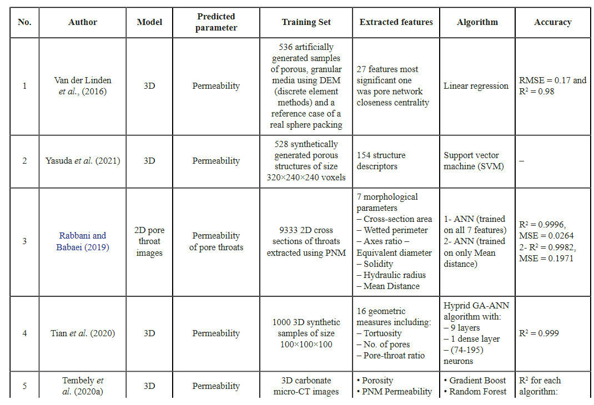

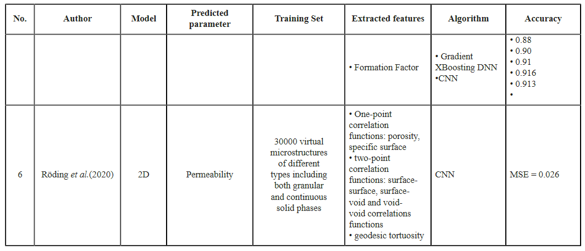

#### End-to-end Regression on Images Directly直接对图像进行端到端回归

使用 CNN 从图像中以稳健的方式直接预测渗透率是一种新颖的孔隙尺度建模方法，在 Wu 等人的研究中显示出巨大的潜力。与 LBM 模拟结果相比，大多数样品的预测渗透率误差小于 10%。然而，通过在基于物理的 CNN 中注入图像的孔隙率和特定区域，模型的准确性得到了提高。此外，在一项不同的研究中，包括 3D 砂岩图像、通过重建方法生成的数百个随机实现以及通过布尔方法生成的合成松散多孔介质，开发了 ANN 和 DL 的混合网络来预测渗透率。

吴等人，2019年进行了一项研究来预测二维多孔介质的有效扩散率 (De)。将 AlexNet 与 ResNet50 一起进行了测试。采用重建方法来生成孔隙拓扑和孔隙率变化的多孔介质，并使用 LBM 来计算通过菲克定律恢复的有效扩散率。该模型的计算成本比 LBM 模拟更稳健六个数量级。 95% 的 De 大于 0.2 的样本的截断误差小于 10%

在另一项研究中，Araya-Polo 等人。 (2020) 对尺寸为 33020 × 9434 的高分辨率图像进行二次采样并裁剪为与 GPU 内存匹配的补丁，从而生成数百个 640 × 480 图像。构建了两个神经网络，第一个神经网络由七个卷积层和两个密集层组成，而第二个神经网络具有类似 U-net的结构。该网络显示出较高的准确度，R2 为 0.9582，MSE 为 0.0108。此外，Graczyk 和 Matyka (2020) 使用类似的工作流程从合成图像中获取孔隙度、渗透率和弯曲度。该项目的数据集被认为是其他研究中使用过的最大的数据集，训练和验证中分别有 84917 个和 14986 个样本。为了让 CNN 从灰度图像中学习，就像文献中的二进制/分段图像一样，Alqahtani 等人。 (2020) 开发了一种使用 CNN 快速估计多孔介质的孔隙率、比表面积和平均孔径的工作流程。此外，Alqahtani 等人。 （2021）应用了ResNet和ResNext；两个卷积神经网络架构，用于学习 3D 多孔介质图像中孔隙空间的几何形状。这项研究是数据集图像数量最多的研究之一，涉及超过 29K 个虚拟几何形状，渗透率范围广泛，超过 3 个数量级。使用孔隙尺度有限体积求解器计算用于训练模型的图像的渗透率。然而，上述分析集中于评估样品的平均总渗透率，但大多数情况下渗透率是各向异性的，即其值根据评估方向而变化。 Hong 和 Liu (2020) 提出了一种基于 3D CNN 的方法来快速估计渗透率在各向异性岩石中。该工作流程在预测其他样品的渗透性方面表现出较高的 R2 分数以及良好的泛化能力。该方法在渗透率预测方面比 LBM 快 10,000 倍。表 3 总结了不同的 ML 回归与图像直接研究，这些回归来自受过直接模拟数据训练的文献，用于从岩石图像中估计渗透率

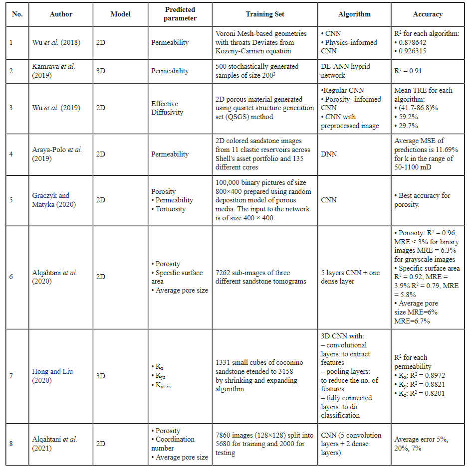

### Predictions by ML Proxy Models for Numerical Simulation. 用于数值模拟的 ML 代理模型的预测

在本节中，讨论使用机器学习作为数值模拟代理模型来预测多孔岩石岩石物理性质的另一种方法。这种方法涉及用机器学习方法取代高成本的直接模拟方法，然后使用生成的速度场来计算所需的岩石物理性质。指某东西的用途不同的研究报告了模拟中的机器学习（Wang 等人，2021）。一些研究能够以合理的精度替代模拟；然而，其他研究表明，在所获得的精度下，模拟无法被取代，但可以通过使用生成的速度场作为初始条件来改进，从而使模拟能够快速收敛。表 4 比较了用于根据使用经过训练的 ML 算法导出的速度场来预测岩石物理特性的研究，包括 Santos 等人的工作。 （2020），王等人。 （2020）和桑托斯等人。 （2021）。这三项研究开发了三种不同的神经网络架构，分别称为 PoreFlow-Net、ML-LBM 和 MS-Net

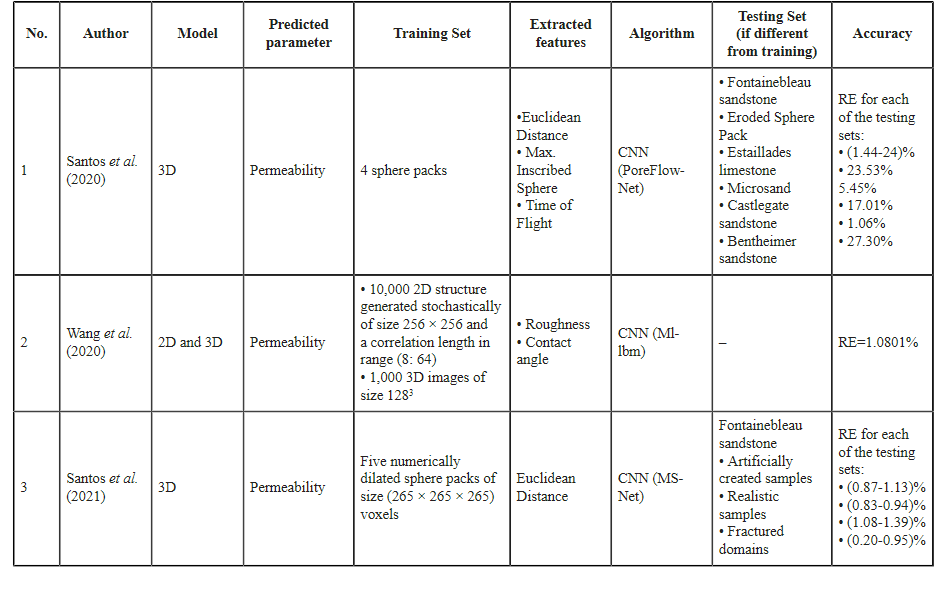

## 总结

在回顾了从多孔介质图像确定岩石物理性质的技术后，可以得出以下结论：

• 估计岩石的岩石物理性质至关重要，过去几十年来已经开发了多种方法来执行此任务，从实验方法、经验相关性到直接模拟技术。

• 这些方法中的每一种都有缺点，包括计算时间长以及预测未见过的数据集的泛化能力。因此，机器学习（ML）提供了不同的算法，可以对变量之间最复杂的非线性关系进行编码，被建议用于协助岩石物理特性估计的任务，并克服上述的成本和时间限制。方法。

• 提出了使用直接模拟技术和机器学习算法根据多孔介质图像估计岩石物理特性的工作流程。通过文献中的示例讨论了所有工作流程的共同步骤。随后，对近期研究进行了全面回顾，从数据集和模型准确性方面进行了分析和比较。总体框架提供了所有研究的总结。此外，还强调了不同研究中评估岩石物理性质的对比。

 • 一些研究使用从图像中提取的特征或图像本身与相应的感兴趣的岩石物理特性之间的直接回归。另一方面，其他研究更倾向于使用机器学习作为模拟的替代方案，其中可以训练机器学习模型来预测模拟属性场（速度和压力），从而能够计算感兴趣的岩石物理属性。

 • 尽管直接使用图像的模型是为了消除任何人为干预而开发的，但当与基于物理的功能相结合时，这些模型将得到显着改进，从而将机器学习模型转变为物理信息模型。

# 附录

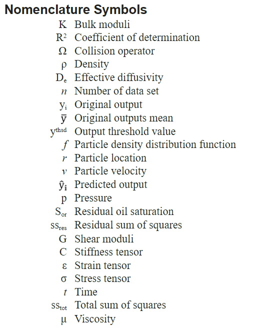

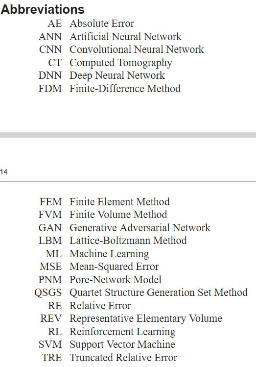
