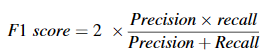

# 无监督深度学习在 二氧化碳-水-岩石系统中的图像分割和原位接触角测量中的应用

#### 接触角（英语：contact angle）是意指**在液体/气体界面接触固体表面而形成的夹角** 。 接触角是由三个不同界面相互作用的一个系统。 最常见的概念解说是，一个小液滴在一单位横向的固体表面，由杨格—拉普拉斯方程所定义的水滴的形状，接触角扮演了约束条件。 接触角测量可由接触角量角器所测得。

岩石表面润湿性是调节多孔介质中多相流的关键特性，可以使用表面接触角 (CA) 进行量化。 X 射线微计算机断层扫描 (μCT) 为表面 CA 的原位测量提供了一种有效的方法。然而，CA 测量精度很大程度上取决于 CT 图像分割的质量，即将 CT 像素聚类为不同的相位。受此启发，开发了基于深度学习 (DL) 的 CA 测量工作流程。受最近无监督学习技术巨大进步的推动，为了避免昂贵的手动数据注释，提出并实现了一种*用于 **CT 图像分割的无监督深度学习流程***，其中包括无监督模型训练和后处理。无监督模型训练由受特征相似性和空间连续性约束的新颖损失函数驱动，并通过迭代前向和后向实现；前者对卷积神经网络提取的逐像素特征向量进行聚类，而后者使用梯度下降更新参数。模型训练采用了超分割策略。实施基于凝聚层次聚类（AHC）[聚类算法 - 凝聚层次聚类 - 简书 (jianshu.com)](https://www.jianshu.com/p/4948a88dec7e)的后处理步骤，以进一步将过度分割的模型输出合并到所需的簇数，旨在提高图像分割的效率。将开发的无监督深度学习管道与其他常用的图像分割方法进行比较，在合成原始图像数据集上使用像素级和基于物理的评估指标，该数据集具有已知的基本事实。无监督深度学习管道显示出最佳性能。接下来，将分割的图像输入自动CA测量工具，并通过与手动测量的比较来验证结果。手动和自动测量的 CA 值显示出相似的分布和统计特性。由于测量数据点数量较多，自动测量显示出更广泛的范围。本研究中开发的无监督深度学习流程的主要新颖之处在于新颖的损失函数和与 AHC 后处理相关的过度分割策略。该工作流程已被证明是孔隙尺度润湿性表征的有效工具，在天然多孔介质多相流的基础研究中具有广泛的应用，这对地质碳封存、碳氢化合物能量回收和污染物在地下水传输具有重要影响。

## 介绍

表面润湿性是指在其他不混溶流体存在的情况下，流体占据固体表面的能力，它是调节微观多相流行为的关键因素，进而影响毛细管压力和毛细管压力等宏观性质。

表面润湿性通过流体-流体和固-流体界面之间的接触角（CA）来表征，可以通过岩心尺度的毛细管压力曲线推断或在使用座滴平坦的矿物表面。然而，此类传统方法未能考虑孔隙几何形状、表面粗糙度、矿物非均质性以及排水和自吸循环（即 CA 滞后）的影响，这使得测量结果不能代表孔隙尺度的表面润湿性。高分辨率三维 (3D) X 射线微计算机断层扫描 (μCT) 成像的出现提供了一种直接观察多孔介质中流体构型的非破坏性方法，从而能够在给定的压力、温度和盐度条件下进行原位 CA 测量。安德鲁等人和道尔顿等人基于原始 X 射线 μCT 图像测量了砂岩样品中超临界 CO2-水-岩石系统中的岩石表面 CA 分布；通过描绘垂直于三相接触线的平面来手动完成测量。克莱斯等人与斯坎齐亚尼等人开发了用于自动表面 CA 测量的算法和开源代码，这些算法和开源代码已应用于珠包和岩石样品中的各种多相流系统（例如 CO2-水-岩石和油-水-岩石系统）。这些自动CA测量方法是基于分割图像实现的，通过自动识别流体-流体和流体-固体界面并使用垂直于这些界面的方向向量的点积计算CA。与手动测量方法相比，自动测量方法效率高，避免了用户偏差，可以提供更具代表性的原位CA分布，因此更适合复杂的天然岩石。然而，自动CA测量的结果和质量在很大程度上取决于数字成像和后续图像处理（即多相分割），尤其是接触线周围的细节。因此，多相流系统中原始 X 射线 μCT 图像的精确分割是自动原位 CA 测量工作流程中的关键步骤。

近年来，深度学习（DL），特别是基于卷积神经网络（CNN）的监督学习方法，已广泛应用于图像分割和数字岩石物理（ DRP），如矿物分类、流体流动模拟、地球物理性质估计等。监督学习模型（例如常用的 FCN、U-Net、SegNet 等）的性能取决于训练数据集的数量和质量，训练数据集由原始图像和标记图像对组成。堆叠式 CNN 滤波器捕获从训练数据集中提取的特征，这些特征可以转移到新的领域并以高精度和高效率生成新图像（即测试数据集）的分割。然而，高质量训练数据集的获取（即逐像素语义标记或语义分割）通常既费时又费力，这极大地限制了监督学习方法的大规模应用，特别是对于无法获得海量训练数据的情况。

相反，无监督学习方法通过对逐像素特征向量进行聚类来为每个像素分配标签，这不需要分割图像作为训练数据集。无监督学习性能的关键是特征表示，而所需的表示在很大程度上依赖于图像内容和分割目标。无监督学习图像分割方法在DRP中得到了广泛的应用，例如k-means 、模糊c-means 和最大值似然期望最大化方法，将聚类应用于手工制作或低级语义特征（例如灰度值或梯度），这对于复杂目标的分割来说是不够的，因此无法满足要求自动 CA 测量的输入数据。 CNN 已被证明是一种强大的特征提取器，可以生成特定于应用程序的特征，并在各种计算机视觉应用中取得了巨大成功。在CNN出色的特征描述能力的推动下，利用CNN和不同聚类技术的无监督学习分割方法已经取得了与监督学习方法相当的性能。特别是，无监督学习方法规避了监督学习所面临的挑战，即训练数据获取过程耗时且昂贵。

为了扩展原位表面 CA 测量的可行性并提高其准确性，在这项工作中，我们提出了一种基于无监督深度学习的工作流程，其中包括图像分割管道和自动表面 CA 测量工具。具体来说，我们首先开发了一种基于无监督深度学习的图像分割流程，并将其应用于 Bentheimer 砂岩样本中 CO2-水-岩石系统的 3D X 射线 CT 图像数据集。分割流程包括基于 CNN 的无监督模型训练和后处理。无监督深度学习模型设计了循环框架和新颖的损失函数，共同优化了像素级语义标签和特征表示。我们还采用了模型训练的超细分策略。在下一步中，我们使用凝聚层次聚类（AHC）方法实施后处理步骤，将过度分割的模型输出合并到所需的聚类（即二氧化碳、水和岩石）。特别是，我们通过使用点扩散函数（PSF）和背景随机噪声模拟 X 射线 CT 扫描中的部分体积效应（PVE），合成了基准原始 CT 图像数据集；该合成的原始 CT 图像数据集具有已知的基本事实（即真实标签），因此用于模型性能评估。评估指标包括像素级和基于物理的准确性。最后一步，将分割后的图像输入自动CA测量工具，并通过与手动测量的比较来验证结果。

无监督深度学习模型在数字图像处理和分割中变得越来越流行，因为它们不需要训练数据集，这在 DRP 中是一个巨大的优势，因为获取高质量的标记图像通常既昂贵又耗时，例如复杂多相流系统的训练数据。本文是第一个探索基于 CNN 的联合学习无监督 DL 模型在数字岩石分割和 DRP 中的应用的研究。开发的自动 CA 测量工作流程可以成为 DRP 中 CA 测量的有效工具，并将在许多基础研究中得到广泛应用，其中多相流体分布和多相流动行为至关重要。

## 方法

本文的结构如图 所示，包含 CO2-水-岩石系统中的数据（即 X 射线 μCT 图像）采集、无监督深度学习图像分割、模型性能评估和自动 CA 测量的组成部分。具体而言，后续描述了本工作中使用的数据集，其中包括 Bentheimer 砂岩的 X 射线 µCT 图像和具有已知地面实况的合成原始图像数据，接着说明了无监督深度学习模型框架、损失函数定义、超参数设置和后处理。

数据采集 -> 无监督深度学习-> 图像分割模型 ->性能评估(像素级指标 ---物理指标)-> 自动接触角测量

---

### 数据集

在 Bentheimer 砂岩样品中获得了 CO2-水双流体系统的 X 射线 μCT 图像。特别是，在一轮排水-注入实验后，通过对 Bentheimer 岩心进行 X 射线 μCT 扫描，获得了 CO2 和水的孔隙尺度分布。 3D 图像是通过堆叠 500 个垂直于主流方向的二维 (2D) 横截面图像构建的。图 显示了一对原始和预处理（即裁剪和过滤）的 2D μCT 图像。 2D 预处理图像的尺寸为 1300 × 1300 像素，每像素长度的空间分辨率为 1.66 μm

第二个数据集是合成的原始图像数据集样本，它具有已知的基本事实，旨在提供基准来评估所提出的图像分割管道的性能。 X 射线 μCT 图像是真实材料配置的模糊近似。 PVE和其他非理想扫描条件导致单个像素的信号扩散到其周围的像素，使得一个像素的灰度值成为两种以上材料的灰度值的加权平均值。为了获得具有已知地面实况的原始图像数据集，从砂岩样本的分段三相（即二氧化碳、水和岩石）图像数据集开始，模拟模糊效果使用 2D PSF 和背景噪声。 PSF 量化单个像素的信号如何影响其相邻像素。分割的三相图像数据集是真实数据，而模拟的模糊图像数据集被用作合成原始图像数据集。图展示了合成原始图像的过程，使用高斯核和随机背景噪声的已知地面实况数据集，在这项工作中，使用高斯平滑内核进行 2D PSF操作：

$ PSF(X,Y) = exp [- \frac{8((X-X_0)^2+(Y-Y_0)^2)}{r_{PSF}^2}]$

其中（x0，y0）是像素位置，（x，y）是相邻像素位置，rPSF是PSF影响参数，定义为该离散高斯平滑核的四西格玛值。在这项工作中，高斯平滑核的标准差等于两个像素长度，rPSF等于八个像素长度，这意味着(x0,y0)像素内超过95%的信号被扩散在直径为八个像素长度的圆形区域中。随机背景噪声由与椒盐随机噪声（即脉冲噪声）相关的高斯随机噪声组成。椒盐随机噪声表现为稀疏出现的白色和黑色像素，这是由成像信号中的突然干扰引起的。椒盐噪声随机选择像素，并将灰度值设置为0或255，这会在黑暗区域产生亮像素，在明亮区域产生暗像素。我们引入椒盐随机噪声来说明所提出的无监督学习模型不仅分析灰度值，还分析形态特征（例如形状和连续性）

使用已知的图像生成人工原始图像的工作流程，其中涉及：a) 实际图片：分别为黑色代表二氧化碳、灰色代表水和白色代表岩石，b) 高斯核，核大小为 9 x 9 像素，* 为卷积算子，c) 随机背景噪声：均值为 0、标准差为 25 的高斯随机噪声，与占总像素 4% 的椒盐噪声相关，以及 d) 最终合成的原始噪声图像数据集

### 基于无监督深度学习的图像分割

在本研究中，开发了一种基于无监督 DL 的图像分割流程，其中包括无监督 DL 模型训练和后处理，以分割原始 X 射线 μCT 图像和像素聚类为三个组成部分（即二氧化碳、水和岩石）。然后将分段的 μCT 图像输入到自动 CA 测量应用程序中，以获得 CA 在岩石表面的完整分布。与监督学习不同，无监督深度学习模型不需要训练带有像素级语义标签的图像，这避免了昂贵的手动数据标注。相反，无监督深度学习模型将相同的标签分配给一组显示相似特征和空间连续性的像素。

下图说明了无监督深度学习模型架构. 

该架构由基于 CNN 的特征提取组件和用于聚类的映射函数组成。给定输入图像，通过最小化损失函数来联合优化逐像素语义标签和特征表示：

$ argmin L(Y, \{\theta,\omega\}|X))$

其中X表示输入图像； θ和ω分别是特征提取组件和映射函数中的可训练参数集； Y是像素级语义标签的向量，与X具有相同的维度。Y是通过将具有最大CNN输出响应的簇标签分配给每个像素而获得的，这是使用argmax函数实现的； L是损失函数。为了将联合优化付诸实践，无监督训练被分解为两个循环子过程：使用固定参数集 {θ, ω} 预测最优 Y 的前向路径和后向路径用于更新具有固定 Y 的参数集 {θ, ω}。前向和后向子过程的数学公式可以写为

X = {$X_n$ ∈ R, n = 1…N} 是具有 N 个像素的输入图像，其中灰度值已标准化为 [0, 1]。通过M个特征提取分量从X获得pM维特征图V = {vn ∈ RpM }。每个特征提取组件由 2D 卷积层、ReLU 激活函数和批量归一化函数组成。所有组件中卷积滤波器的大小为3×3，pi是第i个组件的滤波器编号（即通道数）。特征图是映射函数的输入，其中包含作为线性分类器的一维（1D）卷积层和批量归一化函数。线性分类器产生 q 维响应图 R = {rn = ωvn ∈ Rq, ω ∈ Rq×pM }，然后将其归一化为 R′ = {r′ n }。归一化使每个通道内的响应值具有零均值和单位方差，从而防止所有像素都分配有相同标签的平凡解决方案。最后根据argmax分类规则，取最大维度选择 r′ n 中的响应值作为像素的标签 cn，写为

其中$r'_{n,i}$表示第i维中第n个像素的归一化响应值。提出了一种新颖的损失函数来满足特征相似性和空间连续性的约束:

其中 μ 表示平衡这两个约束的系数。

特征相似性约束的损失函数 Lsim 是归一化响应图和作为伪目标的像素级语义标签之间的交叉熵损失。目的是使相同标签的像素的特征向量尽可能相似，不同标签的像素的特征向量尽可能不同，这样可以产生更有效的聚类特征表示

另一个损失函数 Lcon 利用水平和垂直方向上的 L1 范数距离来量化归一化响应图的差异。对空间连续性的约束假设相邻像素可能具有与局部像素相同的标签，这可以避免由于复杂和独特的特征而导致的过度分割。连续性损失函数可写为:

其中W和H分别是{r′n}的宽度和高度； r′ ψ,η 是位置 (ψ, η) 处的归一化响应值； α和β分别是水平和垂直间隔。

在这项工作中，我们设置M = 2，这表明有两个特征提取组件，其中p1 = p2 = 128。将具有128个通道的特征图输入到q = 32的映射函数中，这意味着q = 32的最大簇数无监督模型输出为 32。参数集 {θ, ω} 使用 Xavier 初始化进行初始化 (Glorot et al., 2010)。如上所述，前向路径使用固定参数集预测像素级标签，后向路径计算并反向传播损失函数，其中 μ = 2 且 α = β = 2。使用随机梯度下降更新参数方法（Ruder，2016），其中学习率为0.05，动量为0.9。这种前向-后向迭代被多次实现，以最终预测像素级语义标签，直到达到停止条件：最大迭代次数 T = 500，或最小簇数 S = 8。具体来说，而不是直接将输出簇数设置为三个（即CO2、水和岩石），我们采用过分割策略，并使用基于质心方法的AHC方法将模型输出合并到所需的簇数（即三个）（默塔等人，2012）。具有最小质心（即平均特征向量）距离的两个簇在每个步骤中被合并。后处理操作可以提高无监督图像分割的效率和鲁棒性。过度分割的进一步讨论在第 3.1 节中。模型训练是使用 PyTorch (Paszke et al., 2019) 在 NVIDIA Tesla T4 GPU 上实现的。分割结果用于自动获得表面CA测量值。算法 1 展示了无监督图像分割流程的伪代码以及自动 CA 测量工具中的主要步骤.

### 模型评估

使用具有已知基本事实的合成原始图像数据集评估无监督图像分割的性能。评估指标包括逐像素和基于物理的准确性评估。前者是基于类别的整体（即体积分数加权）F1分数，后者是精确率和召回率的调和平均值。

其中，精度是正确识别的正像素与模型预测的正像素的比率，召回率是正确识别的正像素与真正的正像素的比率。

此外，PVE是X射线CT图像分割的主要挑战，它显着影响边界和小目标分割。因此，为了评估所提出的无监督深度学习管道在解决 PVE 问题中的性能，边界缩放精度被用作像素级指标之一。根据已知的分割事实，我们首先提取宽度为三个像素长度的边界，并确定边界像素（即边界区域内的像素）的总数。然后，我们将所提出的无监督学习方法预测的标签与地面真实情况进行比较，并获得具有正确预测标签的边界像素的数量。正确预测的边界像素占总边界像素的比例定义为边界缩放精度。

基于物理的评估指标对于 DRP 研究至关重要，因为在接触线处准确分割 CO2 和水对于准确测量岩石表面的 CA 以及孔隙空间中相关的两相流非常重要。我们选择捕获在孔隙空间中的 CO2（即非润湿相）斑点的曲率分布（Driscoll 等人，2012）作为润湿性表征的基于物理的指标。曲率分布的基本事实（即频率直方图）T是在基本事实分割上测量的，而模型预测的曲率分布（即频率直方图）P是在分割结果上测量的所提出的无监督学习方法。此外，这两个曲率分布在相同范围内使用相同数量的箱进行比较，在本工作中为 50。使用卡方距离量化两个曲率分布之间的差异

## 结果

### 无监督深度学习图像分割流程

我们使用无监督深度学习模型对图 2b中所示的预处理原始图像进行分割，然后使用 凝聚层次聚类AHC 对模型输出进行后处理。无监督训练是一个完全自动的过程，其目的是最小化损失函数（即式（6）），因此模型训练中不需要人工干预。图 5 展示了无监督模型在不同时期（即迭代）预测的逐像素语义标签，并通过选择特征图的前三个主要维度来可视化在初始、中间和最终训练阶段提取的特征。在无监督深度学习模型训练开始时，特征提取组件和映射函数的参数用随机值初始化并且没有学习到所需的特征表示，导致意外的聚类结果。图 5a 在第一个 epoch 之后预测的像素级语义标签中包含 32 个簇，这是预定义的最大簇数。此外，特征表示在初始阶段是混合的，如图所示.

随着epoch数的增加，无监督DL模型训练在特征相似性和空间连续性约束的损失函数的驱动下，在前向路径中合并簇，并在后向路径中优化特征表示。特别是，模型输出的簇数在第 13 个 epoch 后减少到 20 个，在第 55 个 epoch 后减少到 10 个，分别如图 5b 和 5c 所示。相应地，中间阶段的特征表示变得更具辨别力，如图所示.

在最后阶段，模型达到停止标准，并在最终 epoch 后以 8 个聚类完成训练，这是预定义的最小聚类数。图5d表明最终模型输出接近用户期望的分割目标。此外，如图5g所示，最后阶段的特征表示分离良好，这表明循环框架预测了像素级语义标签并同时优化了特征表示.

下图展示了无监督深度学习模型训练过程中损失函数值与历元数的关系。具体来说，损失函数包括总损失、相似性损失和连续性损失。很明显，损失函数值随着纪元数的增加而单调下降，这导致簇（即标签）数减少。如图所示，当簇数达到9时，损失函数曲线逐渐平坦，使得模型越来越难以提取不同簇之间的共同特征表示并进一步合并它们。图 7 分别可视化了模型输出的每个簇以及中间结果的AHC。特别地，0、1、4、7的每个簇所占的像素分数都小于0.01，这意味着对于每个簇，其像素数与总像素数的比例小于0.01。对这些具有独特特征表示的簇中的像素进行聚类非常耗时，并且对分割精度带来的改进很少。因此，本研究采用超分割策略，并将最小簇数设置为8，以平衡训练效率和准确率。

使用AHC方法进行后处理。每个子图中的值表示单个或合并簇的像素分数。不同簇之间连接线上的数字表示AHC过程中的合并顺序；需要五个合并步骤才能将八个簇减少到最后三个簇。在这种情况下，簇 0、1、4、5、6 和 7 形成岩石相，簇 2 形成水相，簇 3 形成 CO2 相。在最终的分割结果中，岩石、水和CO2分别用白色、灰色和黑色标记。

随后，采用 AHC 方法进行后处理步骤，以进一步将模型输出合并到用户所需的三个簇，即 CO2、水和岩石。 AHC 根据不同簇的特征图质心之间的 L2 距离来合并簇，从而对同一簇中的所有像素级特征向量进行平均。图 8 展示了根据无监督模型的最终特征图计算出的 L2 距离矩阵。簇 0 和 1 之间的最小距离为 5.81，它们在第一个 AHC 步骤中合并。同样，簇 0、1、4 和 7 的距离相对较近，因此在后续步骤中合并形成岩石边界。随后，岩石边界与岩体（即簇 5 和簇 6）融合，形成整个岩石相。相反，簇 2 和 3 分别代表水相和 CO2 相，远离其他簇，因此被标记为单独的簇。最终的分割分为三个阶段（即岩石、水和二氧化碳），如图 7 所示。

不同簇的特征图质心之间的 L2 距离矩阵。数字0-7表示簇编号，而每个框中的值表示两个簇之间的L2距离。

### 模型性能评估

我们使用具有已知基本事实的合成数据来评估模型性能。表1定量比较了本工作中开发的无监督DL管道（称为“无监督DL + AHC”）与DRP中常用的图像分割方法，包括手册（Dalton等人，2020；Wang等人） ., 2022)、K-means (Chauhan et al., 2016) 和分水岭算法。本研究提出的无监督深度学习管道与其他基于 CNN 的无监督聚类方法（例如，Yang et al., 2016; Caron et al., 2018）之间的主要区别在于两个方面：以及 AHC 后处理遵循的超分割策略。特别是，将所提出的无监督深度学习管道与另一个采用 CNN 的无监督模型进行了比较简单线性迭代聚类（SLIC）的超像素（Kanezaki，2018）。图9说明了模型评估的基本事实、用于边界尺度精度计算的边界像素以及逐像素差异图，它们是分割结果与图9a所示的基本事实之间的逐像素比较。特别地，图9d-h中的黑色区域表示像素

模型预测的标签与真实情况不同（即错误的预测）。基于物理学的基本事实是图 9a 中所有 CO2 斑点的曲率分布，图 9c 显示了沿一个特定 CO2 斑点边界的曲率测量。所提出的基于无监督深度学习的图像分割流程实现了最高的像素精度，包括基于类别的分数和总体 F1 分数。特别是，DRP 分析中最重要的 CO2 相和水相的 F1 分数分别为 0.961 和 0.945，比第二好的方法的分数高出 0.021 和 0.018。图9d-9h中的差异图表明，对于所有分割方法，预测误差主要集中在边界像素上，如图9b所示，这些像素受到PVE的影响，因此难以分割。所提出的无监督深度学习管道达到了最佳边界分割性能，最高边界缩放精度为 0.711。此外，所提出的管道具有最佳的噪声容限，无需在各个分割实例中产生隔离，从而保持分割结果中不同组件的完整性。

基于物理的指标分析了沿非润湿相（即 CO2）斑点边界的曲率，对于评估多相流系统中岩石表面的润湿性至关重要。所提出的无监督深度学习管道使用直方图箱数 50 时的最小卡方距离为 0.032，这表明所提出的图像分割管道成功地恢复了非地面实况图像中表示的润湿流体边界曲率分布。使用不同的直方图 bin 编号（25 和 100）获得了类似的结果，表明结果对 bin 大小不敏感。

我们将 CO2-水-岩石系统的分割 3D 图像（包含 1300 × 1300 × 500 像素，每像素长度的空间分辨率为 1.66 μm）输入到自动 CA 测量工具中（AlRatrout 等，2017）。图 10 可视化了 CO2 和水相的 3D 分布以及三相接触线上的 CA 值。图 11 比较了自动测量和手动测量之间的原位 CA 分布。

手动测量是使用 ImageJ 中的角度工具包获得的（Dalton et al., 2018；Guo et al., 2020），花了几周的时间完成了 300 个数据点的测量。相比之下，基于无监督深度学习的自动测量在大约 3.5 小时内产生了超过 420,000 个数据点。手动和自动测量的 CA 分布均表明 Bentheimer 砂岩表面是水湿的。手动测量的 CA 值范围在 10 度到 80 度之间，平均值为 42.4 度，最常见的值为 44.8 度，标准偏差为 15.0 度。手动测量的 CA 范围狭窄是由于测量过程耗时而导致数据点数量有限。相反，基于自动、无监督 DL 的方法测量所有三相接触点，导致 CA 范围在 0 度到 180 度之间。平均偏差、最常见偏差和标准偏差值分别为 54.6 度、41.0 度和 35.9 度。特别是，10度到80度之间的CA值占据了自动测量数据中80%以上的数据点，该范围内的平均值和标准差分别为43.8度和16.4度，接近于自动测量数据的统计特性。手动测量数据。手动和自动测量结果之间的比较表明，基于无监督 DL 的 CA 测量工作流程产生了准确且具有代表性的孔隙尺度润湿性表征。

## 结论和启示

基于分段 X 射线 CT 图像的表面 CA 测量可生成可靠的孔隙尺度表面润湿性表征多孔介质，这对各种多孔介质中多相流行为的基础研究具有重要意义。自动 CA 测量过程会生成丰富的数据点并避免用户偏差，但结果在很大程度上依赖于分段图像的质量，尤其是在多相接触线周围。获得高质量的分割图像通常既耗时又昂贵，已成为自动 CA 测量大规模应用的主要限制。无监督深度学习模型的最新进展，采用 CNN 进行特定于应用的特征提取并使用不同的聚类技术，同时实现了很高的精度和效率，从而为自动 CA 测量过程中的图像分割步骤提供了新的视角。在这项工作中，我们开发了一种基于深度学习的无监督 CA 测量工作流程。拟议的流程包括无监督的深度学习模型训练和后处理。不同训练阶段的聚类和特征可视化的中间结果表明，无监督模型同时优化了像素级语义标签和特征表示。此外，基于AHC的过分割策略和后处理，将过分割模型输出进一步合并到期望的聚类数，大大提高了图像分割的效率。然后，我们将所提出的基于无监督深度学习的管道与一些基于具有已知基本事实的合成数据集的常用图像分割方法进行了比较。所提出的流程获得了最高的基于类别和总体 F1 分数。此外，边界尺度精度和差异图表明，所提出的管道对 PVE 和随机噪声具有最佳的容忍度。此外，就二氧化碳斑点曲率分布而言，所提出的管道与基于物理的地面实况具有最佳匹配。随后，将分割的图像输入到自动CA测量工具中。自动方法生成的CA分布范围为0至180度，由于自动测量的数据量较大，因此比手动测量的CA分布更宽。此外，手动和自动测量产生了相似的测量CA统计特性，这表明开发的基于DL的无监督CA测量工作流程产生了准确且具有代表性的孔隙尺度润湿性表征。

a) CO2（红色）和水（蓝色）相的 3D 高斯平滑渲染，其中空隙空间是岩石相。 b) 三相接触线上的 CA 值
