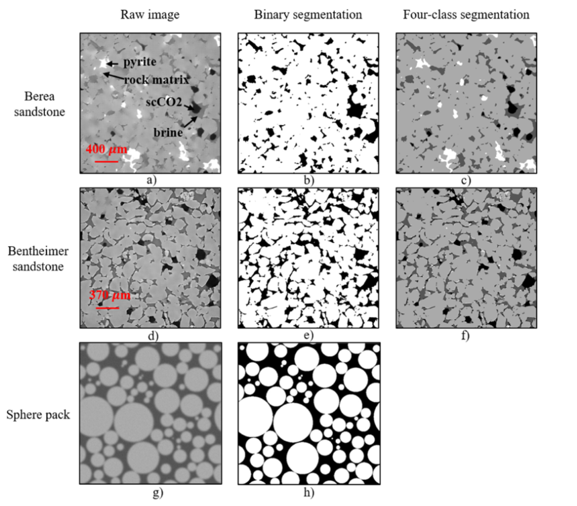
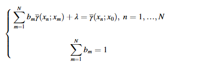

# 基于深度学习的工作流程，使用 UNet++ 和 IK-EBM 在数字岩石图像中进行边界和小目标分割

---

数据集 用算法进行了优化标注，生成了水平球数据作为调优，模型新增了跳转输入的层
玻瑞亚 本特海默数据集

---

三维（3D）X射线微计算机断层扫描（μCT）能够提供储层岩石详细的孔隙结构信息，并可将其导入到孔隙尺度数值模型中，从而在石油工程中得到广泛应用，模拟多种流体在孔隙空间中的传输和分布。部分体积模糊 (PVB) 问题是分割岩石样本原始 μCT 图像的主要挑战，它会影响边界和接近分辨率极限的小目标。我们开发了基于深度学习 (DL) 的工作流程，用于准确、快速的部分体积分割。深度学习模型的性能主要取决于训练数据质量和模型架构。本研究采用基于熵的掩蔽指示克里金法 (IK-EBM) 将 3D 伯里亚砂岩图像分割为训练数据集。 IK-EBM 与使用 3D 合成球包进行手动分割（具有已知的基本事实）的比较表明，IK-EBM 在部分体积分割方面具有更高的准确性。然后，我们训练和测试了 UNet++ 模型，这是一种最先进的监督编码器-解码器模型，用于二进制（即空和实）和四类分割。我们将 UNet++ 与常用的 U-Net 和 Wide U-Net 模型进行了比较，结果表明 UNet++ 在像素级和基于物理的评估指标方面具有最佳性能。具体来说，边界缩放精度表明，UNet++ 架构在边界附近像素和小目标（受 PVB 效应影响）的分割方面优于常规 U-Net 架构。特征图可视化表明，UNet++ 弥合了在网络不同深度提取的特征图之间的语义差距，从而实现更快的收敛和更准确的精细特征提取。开发的工作流程显着增强了部分体积分割中监督编码器-解码器模型的性能，在地下能源、水和环境系统的基础研究中具有广泛的应用。

unet[UNet 浅析-菜鸟笔记 (coonote.com)](https://www.coonote.com/note/unet.html) 

[图像分割必备知识点 | Unet详解 理论+ 代码 - 知乎 (zhihu.com)](https://zhuanlan.zhihu.com/p/313283141)

## 介绍

数字岩石物理 (DRP) 提供了一种实用且经济有效的方法，用于基于从 X 射线微计算机断层扫描获得的三维 (3D) 高分辨率数字图像来研究孔隙介质和相关流体流动（ μCT）（Andrâ等人，2013a；Saxena等人，2021；Kyle和Ketcham，2015；Verri等人，2017；Li等人，2020；Guo等人，2021）。特别是μCT图像可以提供储层岩石详细的孔隙结构信息，然后可以将其导入孔隙尺度数值模型作为流动建模的内部实体边界，以模拟多种流体（例如水和油或水和二氧化碳）的传输和分布。从 DRP 获得的孔隙几何信息和模拟流动特征对于深入了解各种能源地质储层中的单相流和多相流具有重要意义，例如提高石油采收率（Scheffer 等，2021）、地质 CO2 封存（Fan 等） al.，2019；Guo 等，2020），以及氢的地质储存。

图像分割是指将CT像素分类为孔隙空间、固体或更详细的子相，这是DRP框架中最关键的步骤，影响后续的属性分析和数值模拟（Andrâ等人，2013b；Iassonov）等人，2009；Shah 等人，2016）。 X 射线 CT 测量并可视化材料的线性衰减系数，该系数主要是材料密度的函数（Ketcham 和 Carlson，2001）。理论上，如果成分之间的密度差异很大，则 X 射线 CT 像素的分割很简单。然而，***非理想的扫描条件、重建算法和有限的 CT 分辨率可能会导致部分体积模糊 (PVB) 效应 (Ketcham et al., 2010)，这意味着单个像素包含来自两个或多个组件的信号，从而导致它的净 X 射线衰减以及灰度值是这些分量的加权平均值***（Ketcham 和 Mote，2019）。受PVB效应的影响，分量边界处的灰度值转变并不像预期的那么清晰，使得重建的CT图像模糊地近似真实的分量分布（Ketcham，2005）。 PVB 效应会对边界和小目标的 CT 图像分割的准确性产生负面影响，而这对于使用 DRP 正确恢复多孔介质的传输特性至关重要。例如，多相流模拟中的岩石表面润湿性表征需要接触点周围的高精度边界描述（Garfi等人，2020）。另一个例子是致密岩石中的裂缝系统分析（Ketcham et al., 2010），其中裂缝孔径仅等于几个像素长度，因此由于PVB效应的影响，其量化具有很大的挑战性。

近年来，监督机器学习（ML）技术，例如随机森林（Reinhardt et al., 2022）、支持向量机（Chauhan et al., 2016）和编码器-解码器模型（Garcia-Garcia et al., 2017）已广泛应用于数字岩石图像的语义分割。在这项工作中，我们重点关注使用卷积神经网络（CNN）构建的编码器-解码器模型，这是最常用的图像分割深度学习（DL）算法。编码器-解码器模型的架构可以被认为是一个编码器网络和一个解码器网络，其中编码器提取不同级别的高维特征图，解码器将编码器学习到的特征图语义投影到分割图上。编码器块由卷积层、非线性函数和用于下采样的池化算子组成。相反，解码器块由上采样运算符、后跟卷积层和非线性函数组成。 CNN 从使用卷积和池化函数提取的特征和模式中学习，而不是仅分析灰度值。监督学习模型只需要训练一次，然后就可以用于具有相似特征的新数据集（Santos et al., 2020）或作为迁移学习的起点（Shin et al., 2016），从而显着减少计算成本并避免用户偏差。这些优点提高了模型在准确性和效率方面的性能，超越了传统的图像分割方法（Krizhevsky et al., 2012）。自从基于全卷积网络（Long et al., 2015）发明 U-Net 模型（Ronneberger et al., 2015）以来，通过跳跃连接连接编码器和解码器的对称 U 形架构一直是逐像素分割和监督预训练模型的事实标准框架（Taghanaki 等人，2021）。通过在网络中替换或添加算子，人们提出了各种基于 CNN 的 U 形架构模型，例如 SegNet（Badrinarayanan 等人，2017），它使用最大池索引对特征图进行上采样。 U-Net的变体已广泛应用于多孔介质的研究，包括矿物分类(Wang et al., 2021b)、石油物性估计(Erofeev et al., 2019; Kamrava et al., 2020)、和流体流量预测。

通过编码器进行下采样是指图像分辨率粗化和提取抽象信息的过程。具体来说，编码器子中用于下采样的池化算子对特征图进行采样。通常，采用具有 2 × 2 窗口和两个像素步幅的最大池化算子，将水平和垂直方向的分辨率粗化两倍，这减少了可训练的参数数量并增加了平移不变性。另一方面，解码器中的一些对称上采样算子恢复（即增加）特征图的分辨率。然而，由于内存限制，一些信息，特别是边界细节，在下采样过程中丢失，并且无法在上采样过程中恢复（Zhou et al., 2018）。因此，深度CNN模型在部分体积分割方面的性能通常并不令人满意。之前的工作表明，这些模型在边界和小目标分割上的精度较低（Wang et al., 2021b; Karimpouli and Tahmasebi, 2019）。

此外，对高质量训练数据集的访问有限是将监督学习模型应用于部分体积分割的另一个主要挑战（Kim et al., 2020）。在各种图像分割方法中（Iassonov et al., 2009），阈值方法（Niu et al., 2020）是最常用的，因为它们简单且易于实现（Culligan et al., 2006；Jassogne et al., 2020）。 ，2007 年；施密特等人，2016 年）。然而，由于PVB引起的模糊效果随目标尺寸的变化而变化(Ketcham and Mote, 2019)，因此固定阈值导致的分割偏差，包括过度分割、分割不足，甚至小目标完全丢失，不可避免的。手动分割（Dalton et al., 2018）是另一种常用的方法。然而，手动分割模糊图像所产生的时间和人力成本很高，而且不同个体引入的分割偏差也不容忽视。因此，深度学习模型很少应用于部分体积分割，因为获取高质量训练数据集存在挑战，而高质量训练数据集严重依赖于良好分割（即良好标记）的图像。

为了解决上述挑战，我们提出了一种基于深度学习的工作流程，用于准确快速的部分体积分割，其中包括高质量训练数据生成以及深度学习模型训练和测试。具体来说，我们应用基于熵的掩蔽指示克里金法（IK-EBM）方法（Kim 等人，2016）（一种基于概率估计的技术）来生成高质量的分割图像作为训练数据集。我们使用具有已知基本事实的合成 3D 球体包评估了 IK-EBM 和其他常用分割方法（包括手动分割）的性能；使用点扩散函数 (PSF) [点扩散函数（Point Spread Function）-广州超视计生物科技有限公司 (csr-biotech.com)](https://www.csr-biotech.com/newsinfo/1057939.html)模拟球体包的模糊图像（Ketcham 等人，2010）。然后，我们开发了一个 UNet++ 模型，它是一种新颖的编码器-解码器深度学习网络（Zhou et al., 2019），用于数字岩石图像分割。 UNet++ 模型经过训练可以进行二元（即空心和实心）分割和四类（即 scCO2、盐水、岩石基质和黄铁矿）分割。然后使用逐像素和基于物理的评估指标将 UNet++ 的性能与常用的 U-Net 和宽 U-Net 模型进行比较。此外，为了评估 UNet++ 模型的泛化能力，使用训练有素的模型来分割训练数据集中未包含的另一种岩石类型的图像。本文是首次将UNet++模型应用于数字岩石图像部分体积分割的研究。该工作流程解决了高质量训练数据集访问受限带来的主要挑战，并采用了一种新颖的编码器-解码器深度学习模型，旨在改进边界和小目标分割。所开发的工作流程可以成为数字岩石图像中部分体积分割的高效和标准工具，并将广泛应用于地下能源、水和环境系统的基础研究，其中多孔介质中的流体流动和质量传递至关重要。

## 方法论概述

本研究的工作流程包括数据采集、模型训练和模型评估，如图 1 所示。描述了本工作中使用的数据集，其中包括 Berea 和 Bentheimer 砂岩样本的 μCT 图像以及模拟 PVB 效应的合成 3D 球包图像。合成球体包用于测试 IK-EBM 的性能并训练二元深度学习模型。 2.2节介绍了IK-EBM，并将其与手动分割和其他使用合成球包的分割方法进行了比较。 2.3节阐明了UNet++的模型架构及其相对于传统U-Net架构的优势。 2.4 节描述了用于比较不同深度学习模型在二元和四类分割中的性能的模型评估指标。

### 数据集

CT 扫描原始图像和手动标记图像来自美国能源部国家能源技术实验室（NETL）。岩石样品包括直径为 6.35 mm、长度为 12.70 mm 的伯里亚砂岩岩心和直径为 6.35 mm、长度为 25.40 mm 的 Bentheimer 砂岩岩心（Dalton 等，2020）。在使用 Zeiss Versa XRM-400 CT 扫描仪进行 X 射线 CT 扫描之前，Dalton 等人。 Fan等(2018)对样品进行了岩心驱实验，***包括一次CO2饱和盐水注入、一次CO2注入(即排水)、然后再一次注入CO2饱和盐水***(即渗吸)(Fan等，2018)。 ，2019）。有关岩心驱替实验和 X 射线 CT 扫描设置的更多详细信息可以在我们之前的研究中找到（Fan 等，2019；Guo 等，2020）。 3D 图像重建后，提取垂直于主流方向的二维 (2D) 横截面图像。图 2 显示了原始图像和分割的二元图像（即空洞和固体）和四类图像（即 scCO2、盐水、岩石基质和黄铁矿）图像。特别是，二值分割图像包含空白（黑色）和实心（白色）分量。空隙成分可以细分为 scCO2 和盐水成分，而固体成分可以细分为岩石基质和黄铁矿成分，从而形成四类分割图像。在四类分割中，黄铁矿、岩石基质、卤水和 scCO2 由于密度递减而分别显示为白色、浅灰色、深灰色和黑色。表 1 总结了本工作中使用的数据集。

本特海默砂岩 CT 图像扫描质量高，导致不同组件之间有足够的灰度对比度和清晰的边界特征。因此，手动或其他常用的分割方法对于组件标记非常有效。另一方面，由于X射线CT扫描质量较差，伯里亚砂岩图像中的空隙-固体边界对比度较低，导致明显的PVB效应。因此，我们采用IK-EBM方法对伯里亚砂岩CT图像中的空隙和固体成分进行分割。天然岩石图像分割的主要挑战是缺乏地面实况，这导致由于地面实况未知而难以评估特定图像分割方法的准确性。因此，我们生成了一个人工 3D 球包几何形状，其基本事实是已知的，以评估 IK-EBM 分割方法的性能和准确性。特别是，我们从真实情况开始，这是一个合成的二元 3D 球体包，包含 1000 个球体，孔隙率为 0.35，尺寸为 512 × 512 × 512 体素。图2h示出了真实情况的2D横截面，而图2g是模拟模糊图像（即，由真实情况产生的模拟原始图像）的2D横截面。特别是，图 2g 中的模糊效果是基于图 2h 中的二值图像使用 PSF 进行建模的，PSF 量化了单个像素的信号如何影响其相邻像素。

$ F = G ∗ PSF + ε$

其中F是模拟的模糊灰度值，G是真实（即地面真实）灰度值，ε是高斯背景噪声，*是卷积算子。等式表明模拟数据是真实数据与PSF和背景噪声卷积的总和。

我们跟随凯查姆等人。 (2010) 使用高斯形式的 PSF

其中 (x0, y0, z0) 是像素位置，(x, y, z) 是相邻像素位置，rPSF 是 PSF 的影响半径，它基于离散高斯平滑核（Ketcham 和 Mote， 2019）。 rPSF 的值越大，单个像素信号在其相邻像素上的影响就越大。

原始和标记（即分段）数字图像。 Berea 和 Bentheimer 原始图像来自 X 射线 CT 扫描，而球体包原始图像是使用基于已知地面实况的 PSF 生成的合成数据

### PVB问题的基于熵的掩蔽指标克里金法

IK-EBM（Kim et al., 2016）是一种基于数据与数据、数据与未知之间的空间相关性的图像分割方法。 IK-EBM 背后的想法是，空间距离较小的像素具有较高的相关性（Oh 和 Lindquist，1999）。因此，这些像素具有相同标签的可能性更高，一般特征是协方差或变差函数（分离用于量化依赖性的两个位置的距离和方向的函数。 变异函数可定义为两个位置处的两个变量之间的差值方差。 变异函数的值通常随着距离的增加而增加，并且由块金、基台和范围参数进行描述。 如果数据保持稳定，则变异函数和协方差在理论上相互关联。）.

IK-EBM方法的工作流程：a)用于边界像素提取的基于熵的掩蔽； b) 高斯混合模型拟合； c) 全局阈值处理：蓝色表示空相，红色表示固相，绿色表示未确定的像素； d) 变差函数； e) 最终二元分割：蓝色表示空相，红色表示固相。 （为了解释该图例中对颜色的引用，读者请参阅本文的网络版本。） H. Wang 等人。

上图说明了用于图像分割的 IK-EBM 方法（Kim et al., 2016）的整体工作流程，其中包括***全局阈值处理和局部插值步骤***。全局阈值处理的目的是将像素分类为实心像素、空心像素和未分配标签的未确定像素，而局部插值的目的是使用变差函数为未确定像素分配标签。特别是，在全局阈值步骤中，基于信息熵的mask用于提取边界上和边界附近的像素。然后利用高斯混合模型拟合确定两个灰度阈值；具有低于第一阈值的灰度值的像素被分类为空像素，而具有高于第二阈值的灰度值的像素被分类为实心像素。灰度值在两个阈值之间的像素被分类为未确定像素。在局部插值步骤中，使用变差函数确定未确定像素的标签，该函数将图像中任意两个像素的协方差（即相似性）描述为其分离距离的函数。特别地，未确定像素的标签是使用其周围像素的标签的线性组合来计算的，其中标签是已知的

其中G*(x0)是未定像素x0的估计标签值； G(xn)是确定的相邻像素xn的标签； bn 是 xn 的权重系数。如果估计的标签值高于0.5，则未确定的像素将被分配给固相（即标签为1）。另一方面，如果估计的标签值低于0.5，则未确定的标签将被分配给空阶段（即标签为0）。指标克里金方法用于使用以下普通克里金方程确定权重系数，该方程给出最小误差方差的最佳线性、无偏估计

其中 λ 是拉格朗日乘数； γ(xn; xm) 是两个标记像素 xn 和 xm 之间的变异函数值； γ(xn; x0) 是标记像素 xn 和未确定像素 x0 之间的变差函数值。该方程组有 N+1 个方程和 N+1 个未知变量（即 λ 和 bn，其中 n = 1, …, N），具有闭式解。使用方程（4）求解 bn 和 λ 的值后，可以使用方程确定未定像素 x0 的标签。

下图比较IK-EBM与手动分割以及其他四种常用的分割方法，分割 3D 合成球包几何形状，该几何形状具有已知的基本事实。特别地，手动分割方法基于全局阈值方法，其中在高斯混合模型拟合中找到的两个阈值之间手动选择的单个阈值用于通过ImageJ软件包来分割空心和实体成分。 （施耐德等人，2012）。图4表明，与手动分割和其他常用的图像分割方法相比，IK-EBM具有最高的分割精度，特别是在rPSF值较大的情况下。这是因为较大的rPSF值会导致显着的PVB效应；基于单一阈值的手动分割方法导致边界和小目标附近的未确定像素被错误标记。因此，IK-EBM 方法对于生成高质量的分割图像作为可靠的训练数据集至关重要，特别是当原始 CT 图像质量较差时（例如本例中的伯里亚砂岩），这通常与显着的 PVB 效应相关。

IK-EBM 与手动分割和其他常用分割方法在分割合成 3D 球包几何形状时的比较，该几何形状具有已知的基本事实

### U-NET++

这项工作中使用的监督编码器-解码器模型是 UNet++（Zhou et al., 2018, 2019），它是从常规 U-Net 的框架（Ronneberger et al., 2015）发展而来的。 U-Net 架构由一条收缩路径（即下采样或编码器）和一条扩展路径（即上采样或解码器）组成，前者会粗化图像分辨率，后者会细化图像分辨率。编码器操作从图像中捕获特征。前几个或浅层编码器捕获低级特征，例如边缘、梯度方向等。最后几个或深层编码器捕获高级特征，例如孔隙空间几何形状，可以将其视为低级特征的组合- 真实。相应地，对称解码器将最高级别的特征映射上采样回输入分辨率。由于下采样操作（即非线性激活和池化操作）是不可逆的，因此在这些过程中丢失的信息无法恢复，这表明网络越深，从输入图像中提取的抽象信息就越多，从而导致低级特征的丢失（即边界和小目标）。因此，最优的 U-Net 模型深度取决于目标复杂度（Zeiler 和 Fergus，2014；Wang 等，2020）。跳跃连接的思想，即将低层特征图直接连接到具有相同分辨率的解码器，在一定程度上缓解了边界和小目标的分割精度低的问题。然而，U-Net模型对于受到显着PVB效应影响的图像的性能并不令人满意.

下图展示了 UNet++ 的新颖架构，它是通过集成多深度 U-Net 模型并连接所有具有相同分辨率的编码器和解码器块而开发的。这项工作中使用的 UNet++ 模型由一条收缩路径、四条扩张路径和重新设计的跳跃连接组成。嵌套架构利用不同深度的常规U-Net模型，保证了复杂目标检测的准确性，并保留了最终分割中的低级特征。此外，与训练四个独立的U-Net模型相比，具有共享收缩路径的UNet++模型提高了训练效率，从而显着减少了所需的计算资源。 UNet++模型的另一个关键改进是重新设计的跳跃连接，它弥合了U-Net模型中编码器和解码器的特征图之间的语义差异。 UNet++模型中的解码器组合了从具有相同图像分辨率的先前块水平传递的特征图，以及具有不同图像分辨率的垂直传递的多尺度特征图。

   UNet++模型架构集成了四个常规U-Net模型。黑色显示的块和跳过连接用于第四个 U-Net。蓝色块和灰色跳跃连接是新颖的 UNet++ 模型提供的独特功能。 （为了解释该图例中对颜色的引用，读者可以参考本文的网络版本。）

例如，在由黑色块和跳跃连接组成的第四常规U-Net架构中，解码器块E464 512仅接收来自两个块的特征图；一个是从解码器块 E4128 256 上采样的，另一个是从编码器块 C64 512 上采样的，它们具有相同的图像分辨率（即 512 × 512 像素）。这两个特征图在 E464 512 的块处连接，由于它们在常规 U-Net 模型中的分离距离而有很大不同。相比之下，在新颖的 UNet++ 模型中，解码器块 E464 512 从具有相同图像分辨率的其他中间解码器块（即 E164 512、E264 512 和 E364 512）接收额外的输入特征图。因此，重新设计的跳跃连接结构能够在解码器处实现平滑的特征融合，集成低级、中级和高级特征，从而加速模型收敛并提高各种尺寸目标的分割精度。

收缩块和扩张块是基本层的堆叠，包括卷积层、池化层、激活函数等。图6示出了收缩块和扩张块的详细内层。每个收缩和扩展块由两个带填充的卷积层组成，后面是一个修正线性单元（ReLU）激活函数和一个旨在防止过度拟合的 dropout 函数。在收缩块中提取特征图，然后进行 2 × 2 最大池操作进行下采样（即图像分辨率粗化）。特征图在扩展块中被解码为更高分辨率，然后进行 2 × 2 转置卷积运算以进行上采样（即图像分辨率增强）。第四解码器块的最后一层 E464 512 是 1 × 1 卷积层，它将 64 个特征图映射到目标类别（即 scCO2、盐水、岩石矩阵和黄铁矿）。具体来说，图像中的每个像素在SoftMax层之后将获得四个分数，代表该像素属于四个类别的概率；像素被分类到具有最高概率得分的类别.

收缩块 C128 256 和扩展块 E2128 256 的详细架构。四个 U-Net 模型共享收缩路径，E1、E2、E3 和 E4 表示第一、第二、第三和分别是第四个 U-Net 模型。上标和下标数字分别表示块输出的通道数和图像分辨率。在每个块中，卷积层中的数字，例如128, 3 × 3 × 64，建议这一层使用128个卷积核（即滤波器），每个核的大小为3 × 3 × 64

### 模型比较和评估指标

由于模型架构的差异，UNet++ 模型比具有相同深度和图像通道的常规 U-Net 模型具有更多的可训练参数。为了进行公平的比较，我们训练并测试了一个宽U-Net模型，这是一个增强了图像通道的U-Net模型，因此总的可训练参数数量与U-Net++模型相同。我们训练了两组 DL 模型，一组用于二元分类（即分割），另一组用于四类分类（即分割）。每组包含一个 U-Net 模型、一个 Wide U-Net 模型和一个 UNet++ 模型。表 2 说明了这些深度学习模型中的图像通道数和总可训练参数数。图 4. IK-EBM 与手动分割和其他常用分割方法在分割合成 3D 球包几何形状时的比较，该几何形状具有已知的基本事实。 H.王等人。

图像数据集分为训练数据集、验证数据集和测试数据集。训练和验证数据集包括 3760 个伯里亚砂岩图像对和 2560 个合成球包图像对。测试数据集包含 380 个伯里亚砂岩图像对、512 个合成球包图像对和 500 个 Bentheimer 砂岩图像对。每个图像对包括原始图像和标记的（即分段的二值或四类）图像。 Berea 数据用于训练二元和四类深度学习模型。另一方面，合成球体包数据仅用于训练二进制深度学习模型，因为合成球体包仅具有二进制标签（即，空和实）。所有训练和测试过程均使用 Keras（Chollet 等人，2015；Abadi 等人，2016）以及 NVIDIA Tesla T4 GPU 上的 Tensorflow 后端来实现。应用提前停止机制来防止过度拟合。我们使用二元交叉熵损失函数来训练模型

其中 yn,i ∈ Y 是第 n 个像素属于 i 类的真实标签；对于二元深度学习模型，i = 0、1；对于四类深度学习模型，i = 0、1、2、3； pn,i ∈ P 是第 n 个像素属于 i 类的预测概率； N 是一批数据中的总像素数，等于 4 × 512 × 512

评估模型性能的准确性指标包含两类：逐像素评估和基于物理的评估。前者包括 F1 分数和边界精度。 F1分数是精度和召回率的调和平均值，其中精度是真阳性结果（即预测标签和实际标签均为阳性）的数量除以所有预测阳性结果的数量，召回率是真阳性结果的数量真正阳性结果的数量除以所有实际阳性结果的数量。因此，F1 分数对于评估模型在对数据分数较低的小类进行分类方面的性能非常有效。边界缩放精度是接收正确预测的边界像素数与边界像素总数的比率。因此，边界尺度精度评估了模型对边界附近像素和小目标进行分类的性能，这些像素通常会受到PVB效应的影响，因此难以分割。

基于物理的评估指标的选择是基于分割图像的应用。多孔介质中的单相流模拟是DRP的一个重要应用，它使用分段的二进制数字图像作为3D孔隙空间中流动建模的内部边界。因此，我们使用根据分割图像计算的样品孔隙度和基于分割图像的格子玻尔兹曼[格子玻尔兹曼方法：基本概念 - 知乎 (zhihu.com)](https://zhuanlan.zhihu.com/p/397601406)（LB）方法（Chen等，2008、2009、2016；McClure等，2014）模拟的绝对渗透率，作为二元深度学习模型基于物理的评估指标。另一方面，四级分割旨在研究多孔介质中的多相流特性。多相流模拟中输入的关键模型之一是岩石表面润湿性，它调节孔隙空间中非润湿流体团的曲率。因此，我们测量了被困在孔隙空间中的 scCO2 斑点的表面曲率（Driscoll 等，2012）。卡方距离（Piotr Dollar，2016）量化了深度学习模型（P）和地面实况（T）的曲率频率直方图之间的相似性，被用作四类深度学习的基于物理的评估指标楷模

## 结果

### 二元分类

我们使用训练和验证数据集中的 3760 个伯里亚砂岩和 2560 个合成球包图像对来训练和验证二进制 DL 模型。然后使用测试数据集中的 380 个伯里亚砂岩图像对来测试训练有素的模型。表 3 使用逐像素和基于物理的评估指标比较了二元分类中的 U-Net、Wide U-Net 和 UNet++ 模型。在模型测试中，二元分类中逐像素评估的基本事实是使用 IK-EBM 分割获得的带标签的二元图像数据集。基于物理的评估中的基本事实（包括孔隙度和绝对渗透率）是根据 IK-EBM 分割产生的标记二值图像进行测量和模拟的。总体 F1 分数是所有组件基于其体积分数的加权 F1 分数之和。与常规 U-Net 相比，UNet++ 将整个测试图像数据集的总体 F1 分数提高了 0.009，而对于孔隙尺度流体流动模拟最重要的空隙空间的 F1 分数提高了 0.041。

下图展示了每个 DL 模型的一个分割的 2D 图像以及差异图，这是预测分割和地面实况之间的逐像素比较。特别是，差异图中的黑色区域表示**模型预测和地面实况不同的像素**（即错误的预测），而白色区域表示模型预测和地面实况相同的像素（即，正确的预测）。图 7 显示 UNet++ 具有最佳性能，并且宽 U-Net 优于常规 U-Net 模型。比较表明，具有更多可训练参数的相同模型架构具有更好的二值分割性能，并且 UNet++ 的新颖架构进一步提高了分割精度。如图 7g-i 所示，DL 模型分割的错误主要发生在空固边界和小空隙空间上。 U-Net、wide U-Net 和 UNet++ 模型的边界尺度预测精度（即提取的边界像素的分割精度，如图 7c 所示）分别为 0.527、0.642 和 0.744 ， 分别。这表明UNet++模型显着提高了边界像素的预测精度，这些像素受到PVB效应的影响，因此难以分割。孔隙度和绝对渗透率是基于物理的关键精度指标。特别地，使用模型分割图像计算样品孔隙率；利用模型分割图像作为孔隙空间流动模拟的内部边界，通过LB方法模拟绝对渗透率。与实测真实孔隙度值 0.116 相比，U-Net、wide U-Net 和 UNet++ 模型的孔隙度预测相对误差分别为 17.2%、12.9% 和 7.8%。基于 IK-EBM 标记图像。与真实绝对渗透率 32.87 mD 进行比较，U-Net、Wide U-Net 和 UNet++ 模型的绝对渗透率相对误差分别为 25.7%、15.7% 和 6.2%。在 IK-EBM 标记图像上。很明显，UNet++ 模型实现了与真实值的最佳匹配。

### 四级分类

四类深度学习模型的训练和验证数据集包含 3760 个伯里亚砂岩图像对。测试数据集包括 380 个伯里亚砂岩图像对。表 4 说明了四类分类中的模型性能比较。像素级精度计算的基本事实是四类标记图像在伯里亚测试数据集中。与二值分割类似，UNet++模型在四类分割中实现了最高的像素级精度，主要改进在边界和小目标上。一个有趣的发现是，U-Net 在 scCO2、盐水和岩石矩阵分割方面比宽 U-Net 具有更好的性能，这表明更多的可训练参数并不一定会带来更好的性能。

在标记图像上测量的 scCO2 斑点的曲率值是基于物理的评估中的基本事实。图 8 显示了沿一个 scCO2 斑点边界测量的曲率分布，并将一张 2D 图像中所有 scCO2 斑点的曲率频率直方图与地面真实情况进行了比较。非润湿流体液滴（即 scCO2 斑点）边界的曲率分析是四类 DL 模型的关键评估指标，可以量化岩石表面的润湿性。对于 U-Net、wide U-Net 和 UNet++，DL 模型预测与真实值之间的卡方距离分别为 0.104、0.143 和 0.082。这表明UNet++模型的分割成功恢复了CO2地面实况图像中表示的边界曲率分布

### 特征可视化

我们使用 scCO2 分割来显示 U-Net 和 UNet++ 中的不同特征图。白色区域显示响应特定滤镜的像素，亮度表示响应强度。图9示出了顶部块的特征图，它们是UNet++模型中的C64 512、E164 512、E264 512、E364 512、E464 512和常规U-Net模型中的C64 512、E464 512。第一个收缩块 C64 512 的特征图包含来自 scCO2、黄铁矿和盐水像素的响应。相比之下，最后一个扩展块 E464 512 的特征图仅包含 scCO2 像素的响应

C64 512 包含两个卷积层并生成具有最小变换的特征图。广阔的街区穿过他对路径进行下采样和上采样，当网络深入时捕获具有网络学到的特定特征的目标。网络中最后一个扩展块 E464 512 的输出特征图已经经过所有五个收缩块，将特征通道增加到 1024，然后是四个扩展块，将图像分辨率恢复到 512 × 512最高层的特征在扩展路径中被解码，这意味着解码器的输出特征图仅响应目标。因此，常规 U-net 模型中的跳跃连接连接具有显着语义差异的特征图。相反，UNet++模型集成了多个特征映射和平滑的语义转换，这有助于UNet++模型更好的性能。

表明 UNet++ 在所有三个 DL 二元模型中实现了最高的总体精度，并且与常规 U-Net 模型相比，边界尺度精度大大提高了 20% 以上。此外，UNet++中的多尺度特征聚合导致损失函数的轮廓表面平滑，这使得模型训练能够更快地收敛。图 10 表明，就总体精度和边界精度而言，UNet++ 模型在二值分割中具有最快的收敛速度。在四类分割中也可以观察到类似的结果。

### 模型泛化

使用 Berea 数据集训练训练有素的二元和四类 DL 模型，然后使用 Bentheimer 砂岩数据集进行测试，以评估模型的泛化能力，该能力衡量模型在处理具有以下特征的样本时的表现：训练过程中没有看到。表 5 说明了逐像素评估指标。所有深度学习模型都取得了很高的 F1 分数，二元分割高于 0.98，四类分割高于 0.95。尽管所有这些深度学习模型都具有令人满意的泛化能力，但 UNet++ 模型仍然表现出最好的性能。特别是，与 U-Net 和 Wide U-Net 模型相比，UNet++ 模型在边界尺度精度方面的提高非常显着。这一改进至关重要，因为受 PVB 效应的影响，边界像素的分割具有挑战性

## 结论

从 DRP 技术获得的孔隙几何信息和模拟流动特征对于深入了解各种能源地质储层中的单相流和多相流具有重要意义，例如提高石油采收率、二氧化碳地质封存和氢气地质储存。图像分割是DRP框架中最关键的一步，影响后续的性能分析和数值模拟。尽管深度学习方法在图像分割中受到越来越多的关注，但由于缺乏高质量的训练数据集以及分割边界的挑战，有监督编码器-解码器模型在数字岩石图像部分体积分割中的应用受到限制。和小目标。这项工作开发了一个基于 IK-EBM 和 UNet++ 的完整工作流程，用于准确、快速地对数字岩石图像进行部分体积分割。 IK-EBM 是一种基于概率估计的技术，可生成高质量的训练数据集，为边界附近的像素和 PVB 效应显着的小目标提供可靠的标签。 UNet++ 是一种最先进的深度学习模型，它集成了编码器-解码器网络不同深度的多尺度特征，从而实现平滑的语义转换，从而更快地收敛并更准确地提取边界附近和小尺度的精细特征。目标。 IK-EBM 在部分体积分割方面的性能通过已知真实情况的 3D 合成球包图像得到了确认。接下来，我们使用 IK-EBM 对模糊的伯里亚砂岩图像进行分割作为训练数据集。然后，我们分别训练两组 DL 模型进行二分类和四分类。每组DL模型包括UNet++模型、常规U-Net模型和宽U-Net模型。 UNet++ 模型在二元分类和四类分类中实现了最高的整体和基于类的像素精度。边界尺度精度表明UNet++在边界附近的像素和受PVB效应影响的小目标的分割上有显着的改进。此外，UNet++ 在孔隙率和绝对渗透率方面与基于物理的地面实况具有最佳匹配。良好预测的曲率直方图进一步证实了UNet++模型在边界和小目标分割方面的改进。 UNet++的优越性源于其嵌套架构和重新设计的跳跃连接，这通过与U-Net的特征图比较来说明。此外，UNet++通过在未用于模型训练的Bentheimer砂岩图像上进行测试，表现出了出色的泛化能力。

本研究首次将UNet++模型应用于数字岩石图像的部分体积分割。开发的工作流程解决了高质量训练数据集访问受限所带来的主要挑战，并采用了一种新颖的编码器-解码器深度学习模型，旨在改进边界和小目标分割。该工作流程可以成为数字岩石图像中部分体积分割的高效且标准的工具，并将在地下能源、水和环境系统的基础研究中具有广泛的应用。
