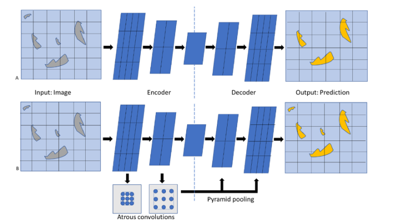
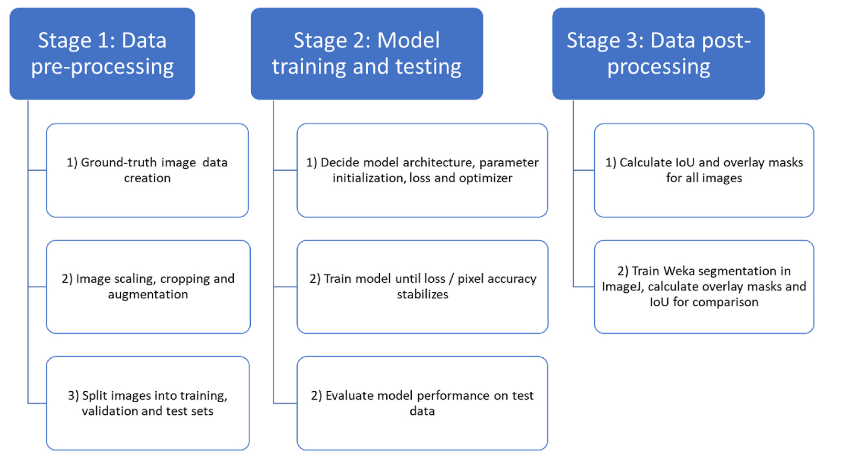
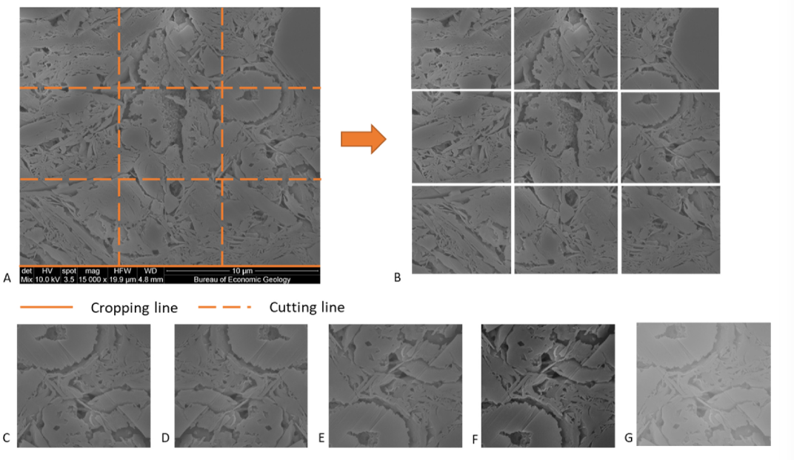
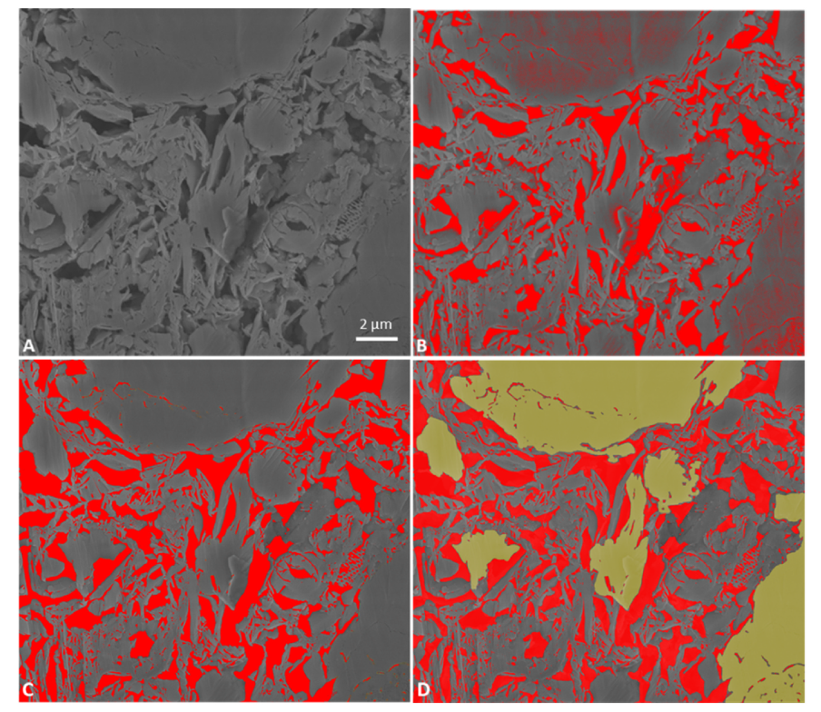
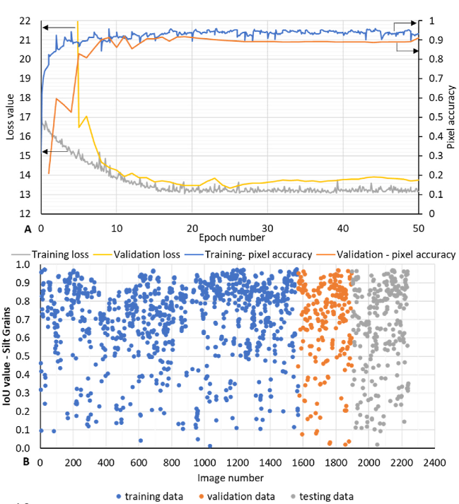
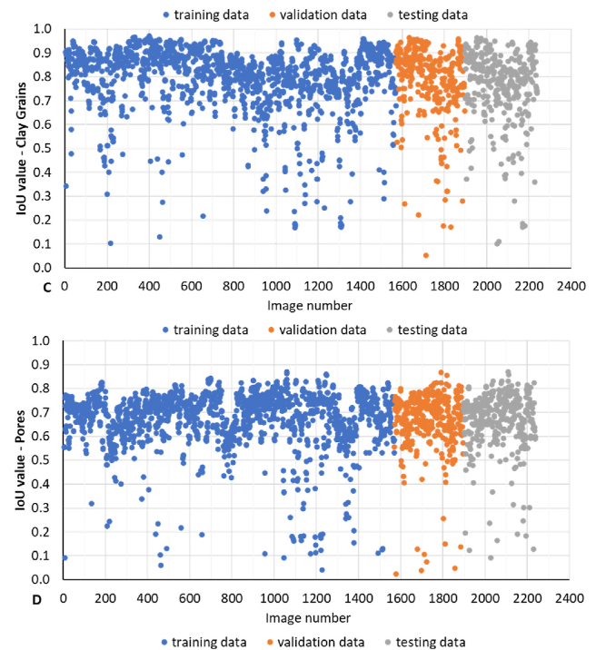
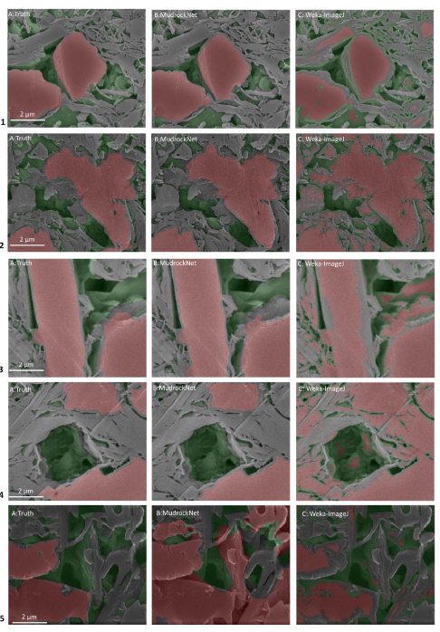

# MudrockNet：通过深度学习对泥岩 SEM 图像进行语义分割

由于成像伪影、图像之间像素灰度值的变化以及不同物理特征（例如粉砂颗粒、粘土颗粒和孔隙）之间灰度值的重叠，从扫描电子显微镜图像中对泥岩的各个孔隙和颗粒进行分割和分析并非易事。 ，这使得识别变得困难。此外，由于颗粒和孔隙通常具有重叠的灰度值，直接应用基于阈值的分割技术是不够的。计算机视觉领域的最新进展使得分割图像和识别图像中此类特征的多次出现变得更加容易和快捷，前提是用于训练算法的地面实况数据可用。在这里，我们提出了一种深度学习 SEM 图像分割模型 MudrockNet，它基于 Google DeepLab-v3+ 架构，并通过 TensorFlow 库实现。地面实况数据是通过图像处理工作流程获得的，该工作流程应用于日本近海熊野盆地深度 <1.1 公里的非胶结泥浆的扫描电子显微镜图像。经过训练的深度学习模型获得了 > 90% 的像素精度，并且对测试数据的预测获得了淤泥颗粒的平均交集 (IoU) 为 0.6663，粘土颗粒的平均交集为 0.7797，孔隙的平均交集为 0.6751。我们还将我们的模型与使用 ImageJ 中可训练的 Weka 分割的随机森林分类器进行了比较，观察发现 MudrockNet 在大多数情况下对淤泥颗粒、粘土颗粒和孔隙给出了更好的预测。淤泥和粘土颗粒的尺寸、浓度和空间排列会影响泥岩的岩石物理性质，而准确识别泥岩中不同颗粒和孔隙的自动化方法可以帮助改善石油勘探和人为废物的储层和密封特征封存。[语义分割模型之DeepLabv3+ - 知乎 (zhihu.com)](https://zhuanlan.zhihu.com/p/62261970)

---

没说模型结构，数据集是裁切处理的，对比了模型精度

---

## 介绍

泥岩是地球上主要的沉积岩，由淤泥和粘土大小的颗粒组成，通常包括小于 63 μm 的粘土矿物、石英、长石和碳酸盐（Macquaker 和 Adams，2003 年；Lazar 等人， 2015b）。这些岩性作为碳氢化合物聚集的毛细管封闭（Schowalter，1979；Schlömer 和 Kroos，1997）、碳捕获和封存的盖层（Li 等，2006）以及非常规油气藏（例如，布斯汀等人，2008）。在较高浓度下，粉砂颗粒为泥岩提供支撑框架，在较低浓度下，它们保护较大的孔隙免受压实（Oertel，1983；Yang和Aplin，2007；Desbois等，2009；Schneider等，2011； Pommer 和 Milliken，2015）。粉砂和粘土颗粒的尺寸、浓度和空间排列会影响泥岩的岩石物理性质，从而影响流体输送行为（Potter等，2005；Lazar等，2015a；Bihani和Daigle，2019）。因此，泥岩样品的扫描电子显微镜 (SEM) 图像可以作为改善储层和盖层表征的有效工具。

用于过滤和分割岩石微观结构图像的典型工作流程包括识别各个特征的步骤，每个特征都需要用户的输入，例如固定每个图像的分割阈值像素值。然而，随着机器学习的最新进展，可以减少特征检测或图像分割所需的步骤数量和用户干预程度。深度学习也被许多企业所应用研究人员分割不同类型的岩石图像以辅助岩石物理分析，包括砂岩 SEM 图像（Karimpouli 和 Tahmasebi，2019 年；Niu 等人，2020 年）、microCT 图像（Marmo 等人，2005 年；Chauhan 等人，2016 年； Varfolomeev 等人，2019；Guntoro 等人，2019；Wang 等人，2019b；Anderson 等人，2020），核心（Ivchenko 等人，2018；Baraboshkin 等人，2018；Alzubaidi 等人， 2021）或薄片图像（Izadi 等人，2017；Dong 等人，2019；de Lima 等人，2020；Tang 等人，2020）。其他研究人员（Tang 和 Spikes，2017；Andrew，2018；Tian 和 Daigle，2019；Wu 等人，2019；Knaup 等人，2019；Knaup，2020；Z. Chen 等人，2020；Misra 等人。 ，2020）已成功使用机器学习技术对页岩或泥岩的高分辨率 SEM 图像进行特征检测。

Tian 和 Daigle（2019）在高分辨率背散射电子图像和能量色散 X 射线光谱（EDX）图像上使用自动目标检测算法来表征微裂缝的位置和大小以及它们与页岩中特定矿物的优先关联。然而，目标检测算法仅适用于识别具有特定形状的特征，并且仅限于图像中仅出现的少数情况。如果该算法应用于包含数百个孔隙和颗粒的 SEM 图像，边界框无法准确捕获所有特征。 Tang 和 Spikes（2017）使用页岩样品的高分辨率 EDX 图像作为神经网络的输入来检测方解石、长石、石英、干酪根和粘土/孔隙，但无法区分粘土和孔隙。 C.李等人。 (2021) 使用 Bakken 页岩的 SEM-EDX 图像来比较浅层机器学习和深度学习 (U-Net) 模型，发现由于数据集不平衡，随机森林模型优于 U-Net 模型预测。然而，他们发现 U-Net 模型能够比其他机器学习模型更好地预测孤立的较小颗粒。克纳普等人。 （2019 年使用 U-Net 模型从 Woodford 页岩获得的 SEM 图像中分割孔隙、有机质和矿物质含量，并能够实现超过 90% 的交并 (IoU) 结果。他们的研究使用 SEM-EDX 彩色图除了用于分割的灰度 SEM 图像之外，由于此类方法利用相似大小颗粒中矿物颜色的差异进行颗粒识别，因此当只有灰度 SEM 图像可用时，它们无法应用于分割。Andrew (2018) 使用机器学习来分割灰度利用灰度强度和纹理对比的差异将页岩数据分为五类（孔隙度、有机相、石英、方解石和黄铁矿），并研究噪声对模型性能的影响。他发现机器学习优于 Otsu 和种子分水岭区域等传统技术Wu 等人 (2019) 使用特征提取，然后使用梯度增强和随机森林分类器来分割高分辨率灰度页岩 SEM 图像。他们发现随机森林分类器对于检测四种类型的特征给出了最佳结果；孔隙/裂缝、岩石基质（石英、粘土、方解石）、黄铁矿和干酪根。然而，他们没有识别不同类型的谷物。 Z.陈等人。 (2020) 使用 U-Net 模型从加拿大西部 Duvernay 页岩样品的 SEM 图像中分割大矿物（淤泥大小）颗粒、粘土骨料和有机质。他们从四个带标签的大图像块中准备了 8000 个随机图像切片，并能够在测试数据集上实现 0.917 的 IoU。

因此，虽然研究人员已经使用深度学习对页岩和泥岩的 SEM 图像进行分割，但从纹理和成熟度变化的灰度 SEM 图像中识别特定类型和尺寸的单个孔隙和颗粒仍然是一个活跃的研究领域。

## 背景

在计算机视觉领域，在图像中逐像素分配标签的任务称为语义分割（L. C. Chen 等人，2018）。语义分割需要识别图像中不规则的对象轮廓，因此比在图像中进行简单的图像级分类或基于边界框的对象检测具有更严格的精度要求（Liu et al., 2019）。我们建议使用它来检测图像中的孔隙以及特定类型的颗粒（例如淤泥），并提供来自原始图像和地面实况的足够数据用于训练。此外，虽然语义分割可以识别不同的对象类别（孔隙和淤泥颗粒），但可以将分割增强到实例级分割，这需要检测图像中颗粒和孔隙的每个实例并为它们分配唯一的标识符每个实例。这也可以在后处理步骤中完成，其中所有已检测到的不相连的颗粒和孔隙都被分配一个唯一的标识符以允许进一步分析。

卷积神经网络 (CNN) 使用小型空间滤波器，可以在整个域中重复使用，这使得它们能够有效地进行图像分割。它们具有不同类型的层，其参数可以通过数据进行训练以执行特定任务（Liu et al., 2019）。龙等人。 （2015）通过用全卷积层（层中的神经元连接到前一层的小区域）替换全连接层（层中的所有神经元连接到前一层的所有神经元），将全卷积神经网络引入图像分割。如图 1A 所示，输入图像通过编码器的多个卷积层（黑色箭头），卷积图像表示（特征图）的高度和宽度连续减小。因此，编码器通过将原始图像与较小的内核（滤波器）进行卷积，将输入数据转换为特征图，以识别图像中人类不易识别的重要特征（Goodfellow et al., 2016）。然后，第一个输出特征图用作下一个与另一个内核的卷积的输入，并且该过程继续直到到达瓶颈层（蓝色虚线），该层具有输入数据的最高压缩表示。此后，可以使用反卷积网络（解码器）通过连续层的插值对图像进行上采样，以将特征图恢复到原始图像大小（Noh et al., 2015）。

在此基础上进行修改，创建了 U-net 架构，该架构使用更少的训练图像，但改善了结果。它采用对称的编码器-解码器架构，编码器部分具有大量特征通道，这有助于保留传递到高分辨率层的信息，并且解码器层连接到相应的编码器层以提高高分辨率层的分辨率。预测图像。从那时起，语义分割领域取得了进一步的进展，其中包括 DeepLab，它是由 Google 创建并开源发布的最先进的监督分割模型（Chen 等，2014）。它首先作为 DeepLab-v1 发布（Chen et al., 2014），随后进行了多项改进； DeepLab-v2（Chen 等人，2017a）、DeepLab-v3（Chen 等人，2017b）、DeepLab-v3+（L.C. Chen 等人，2018）。

MudrockNet 基于 DeepLab-v3+，它还使用编码-解码架构，通过卷积层提取信息。然而，虽然应用编码器-解码器架构可以减少神经网络训练的计算时间并捕获尖锐的对象边界，但当训练层的分辨率小于要识别的特征时，重复下采样可能会丢失丰富的语义信息（Chen等人）等，2018）。该架构在识别多个尺度的物体时也会引起问题。例如，如果泥岩的 SEM 图像具有多种尺寸的孔隙，则使用传统编码解码架构的模型可能无法识别仅由几个像素组成的最小孔隙（图 1A）。 DeepLab-v3+架构通过结合两种技术克服了这些问题，即空洞卷积和空间金字塔池化（atrous Spatial Pyramid Pooling）（图1B）。应用并行的空洞（扩张）卷积有效地增加了视野，结合了多尺度上下文，因为空洞滤波器通过在滤波器权重之间插入空洞来防止最后几层的下采样操作（Chen 等人， 2018）。空间金字塔池使用同一图像在多个尺度上的版本，后来由 A. Bihani 等人提出。结合起来，当与空洞卷积和编码器-解码器模块一起使用时，可以为语义分割提供更好的结果，同时保留空间分辨率。因此，我们训练 MudrockNet 模型，从不同深度、不同淤泥成分获得的 SEM 图像中识别孔隙、淤泥尺寸和粘土尺寸颗粒。该模型可用于其他泥岩SEM图像的分割，并且单个孔隙和颗粒可用于进一步分析。

A) 普通编码器-解码器架构，B) 具有空洞卷积和金字塔池的 DeepLab-v3+ 架构的比较。经 Chen 等人修改。 （2018）。连续特征图之间的卷积由黑色箭头显示，网格线表示特定图像特征图中的像素数量。可以看出，Deeplab-v3+架构更擅长分割较小尺寸的特征

### 材料和方法

下图描述了使用 MudrockNet 进行语义分割的工作流程和结果比较。流程由数据预处理、模型训练与测试、数据后处理三部分组成。

该模型的 SEM 图像是从熊野盆地的未胶结泥浆样品中获得的，该盆地是日本近海南海海槽的一个大型弧前盆地（Moore 等，2013）。这些岩心样本是在综合海洋钻探计划 (IODP) 第 315 次和第 338 次探险期间在海底以下 <1.1 公里的深度 C0002 采集的（Milliken 等人，2016 年）。该研究使用了来自不同深度的 5 个岩心样本的 49 张 SEM 图像。用于孔隙成像的样品表面通过 Ar 离子截面抛光进行制备，并在 Leica EM ACE600 中涂上 6 nm 铱，以最大限度地减少表面充电效应。这些图像是使用 FEI Nova-NanoSEM 430 扫描电子显微镜通过二次电子检测产生的，通过背散射电子和二次电子检测的混合信号来减少充电效应（Nole 等人，2016）。所有图像均以 15,000 倍或 40,000 倍的机器放大倍数进行扫描，得到水平场宽度 (HFW)，即图像宽度分别为 20 μm 或 7.5 μm。

按照 Landry 等人的研究，将图像处理工作流程应用于 SEM 图像。 （2017）获取模型的地面实况数据。这是必要的，因为简单的基于阈值的分割技术如果不进行过滤，则无法正确分离颗粒和孔隙，因为它们可能具有重叠的灰度值。例如，对图 3A 中的图像应用简单分割会导致错误地将较暗的颗粒像素预测为孔隙（图 3B）。

***因此，工作流程的第一步是应用中值滤波器将图像平滑到要分割的特征的目标空间尺度，然后结合顶帽和底帽滤波器来增加局部特征对比。*** 经过平滑和对比度增强后，应用灰度阈值将图像分离为没有重叠的孔隙和颗粒（图3C）。图像分割是在不同的空间尺度上进行的，以捕获所有尺寸的孔隙，并将最终图像合并在一起，类似于金字塔池化。通过按照用户指定多次侵蚀和膨胀颗粒成分来识别淤泥尺寸颗粒（等效圆直径>2μm），并根据需要对分割图像进行审查和校正。分段的粉砂粒(以下简称粉粒)、粘土粒(以下简称粘土粒)和孔隙如图3D所示。本研究中使用的使用传统分割算法的所有原始图像和分割图像（淤泥、粘土、孔隙）的数据集均可用。

A) 原始图像（放大倍数 15,000×）、B) 剪切和裁剪后、C) 样本输入图像、D) 水平翻转图像、E) 垂直翻转图像、F) 对比度增强图像、G) 亮度增强图像

为了改进模型训练，所有图像都缩放到相同的 15,000× 放大倍数。此后，为了保持一致的图像大小并增加训练图像的总数，我们将 SEM 图像分为多个相等的部分，每个部分等于最小缩放 SEM 图像（400 × 343 像素）的高度和宽度，如示例所示图4A、B、C中的图像。对图像进行水平（图4D）和垂直（图4E）翻转以进行数据增强遵循 Tian 和 Daigle (2018) 的方法。此外，随机选择的图像进行了色彩空间变换（Shorten 和 Khoshgoftaar，2019），例如修改图像对比度（图 4F）或修改图像亮度（图 4G），因此总共产生了 2239 张图像。然后将图像（原始图像和相应的真实数据）分为训练数据集（~70%）、验证数据集（~15%）和测试数据集（~15%）

SEM 图像：A) 原图； B) 不进行过滤的分割； C) 过滤后的分割（预测孔隙以红色显示），D) 粉土颗粒（黄色）、粘土颗粒（灰色）和孔隙（红色）分离的分割。 （为了解释该图例中对颜色的引用，读者可以参考本文的网络版本。）

MudrockNet 模型使用具有 8 GB 内存的 NVIDIA GeForce GTX 1070 GPU 针对三个类别进行训练：淤泥、孔隙和粘土。从预训练的 ResNet-101 模型（在 ImageNet 上）进行迁移学习，并持续训练 50 个 epoch，直到损失变得恒定。我们使用了稀疏 softmax 交叉熵损失、权重衰减和动量优化器。特定的损失函数适用于多个类别的互斥分类（Wang et al., 2019a），并且包含权重衰减正则化有助于通过惩罚大的权重更新来防止过度拟合（Schmidhuber, 2015）。向优化器添加动量有助于训练期间的随机梯度下降导航，方法是添加前面步骤中的一小部分方向，从而减少不相关的振荡（Sutskever 等人，2013）。训练通过两个指标进行评估：像素精度和孔隙、淤泥和粘土颗粒的 IoU。 IoU 或 Jaccard 指数（图 5）被定义为预测与真实值之间的交叉面积（公共像素）除以它们并集的面积（两幅图像中都存在的像素）（Tian 和 Daigle，2018）。像素精度定义为正确标记的像素数（真阳性 + 真阴性）除以图像中像素总数（真阳性 + 真阴性 + 假阳性 + 假阴性）。这IoU 优于像素精度，因为它不受类不平衡的影响（例如，在图 3D 中，粘土颗粒像素 > 孔隙像素 > 淤泥颗粒像素），同时仍然提供每个类的度量（Rahman 和 Wang，2016）。此后，训练后的 MudrockNet 在保留的测试数据集上进行了测试，以对其预测不同情况下特征的能力进行公正的评估。我们发现，与仅在我们的数据中从头开始训练的模型的结果（淤泥颗粒：0.6663，粘土颗粒：0.7797，孔隙：0.6751）相比，使用迁移学习在测试数据上给出了更好的平均 IoU 结果（淤泥颗粒：0.6663，粘土颗粒：0.7797，孔隙：0.6751）。 0.4671，粘土颗粒：0.7136，孔隙：0.6592）。通过计算每幅图像的淤泥、粘土和孔隙的平均 IoU，将预测的分割与地面实况数据进行比较，通常使用低阈值，IoU 值 > 0.5 可以被认为是真阳性（Y. Li 等人，2017） ）。还计算原始图像上 MudrockNet 预测和地面实况（传统分割算法）预测的重叠掩模以进行视觉检查。

ImageJ 中带有随机森林分类器的可训练 Weka 分割（Arganda-Carreras 等人，2017）也用于执行图像分割，以将训练模型的性能与其他机器学习方法进行比较。随机森林是一种基于集成树的学习算法，它对随机选择的训练数据子集中的多个决策树进行平均，以构建类别预测（Liaw 和 Wiener，2002）。选择该算法是因为它已成功应用于岩石 SEM 图像问题（Maitre 等，2019；Wu 等，2019），并且作为一种集成方法有助于提高精度，同时控制过拟合。 Weka 模型在训练集中的 50 张图像上进行训练，每个类别（淤泥、粘土、孔隙）有多个样本。训练使用边缘检测滤波器（如 Sobel 和 Hessian 滤波器）以及快速随机森林分类器，这是随机森林分类器的多线程版本，每个节点使用 200 棵树和 2 个随机特征。然后将经过训练的 Weka 分类器应用于测试数据，以使用覆盖掩模和 IoU 值来比较预测。

## 结果

显示 MudrockNet 模型的训练和测试指标。一旦训练和验证损失达到稳定状态（值分别为 13.16 和 13.74），并且训练和验证像素精度达到稳定状态（值分别为 0.9317 和 0.9107），网络训练就会在 50 个 epoch 后停止。训练、验证和测试数据集的各个类别（淤泥、粘土和孔隙）的平均 IoU 值如表 1 所示，这三个类别的 IoU 频率分布如图 6B、C、D 所示

在表 1 中，由于类别不平衡，预测的像素精度值可能高于 IoU 值，因此 IoU 值优先作为像素精度的度量来进行进一步分析。从对比可以看出，测试和验证的IoU值和都是低于训练集（低方差），因此该模型能够推广泥浆分割问题。这表明该模型可以正确识别泥岩 SEM 图像集中的粉砂颗粒、粘土颗粒和孔隙，这些图像的质量和尺寸与此处使用的图像相似。虽然图 6B、C 和 D 中的大多数颗粒和孔隙 IoU 值都大于 0.5（真阳性的低阈值），但粉砂和粘土颗粒 IoU（图 6B 和 C）的分散量比孔 IoU（图 6D），特别是在验证和测试数据中。这可能意味着 MudrockNet 比新 SEM 图像中的颗粒更适合预测孔隙，这可能是由于各种因素造成的，例如淤泥颗粒尺寸的变化、数据中孔隙数量多于淤泥颗粒以及由于重叠淤泥颗粒和粘土颗粒的像素值，这可能会导致错误，特别是对于较小的淤泥颗粒。虽然改变图像对比度或亮度等数据增强技术已被用来改进对亮度过低或过高的 SEM 图像的预测，但数据集中此类图像数量较少也可能是 IoU 值降低的原因。图 7 显示了测试集中五个选定的 SEM 图像上的真实情况（传统分割算法数据）（A）、MudrockNet 模型预测（B）和可训练的 Weka 模型预测（C）的叠加掩模。淤泥颗粒为红色，孔隙为绿色，粘土为灰色，真实图像显示比例尺以供参考。其他的比较可以在网上找到。

显示了两种方法（MudrockNet 和 Weka 模型）对图 7 所示图像的粉粒和孔隙 IoU 值的比较。在图 7-1 中，我们可以看到 MudrockNet 模型对两种方法的预测（1B）正如 IoU 值所证实的那样，淤泥大小的颗粒（红色）和不同大小的孔隙（绿色）与传统分割（1A）的地面实况图像非常匹配。虽然 Weka 模型 (1C) 也能够检测淤泥颗粒，但它无法充分区分淤泥和粘土颗粒，如粘土中较小的红色斑块所示。在图 7-2 中，MudrockNet (2A) 能够预测与地面真实图像 (2B) 相当的整个淤泥颗粒（中心为红色）。 Weka 模型 (2C) 能够检测较大的结构，但高估了淤泥颗粒和孔隙。类似的行为如图 7-3 所示，其中 MudrockNet (3A) 的预测与地面实况 (3B) 非常相似，具有高 IoU 值，而 Weka 模型 (3C) 的淤泥预测低于预测实际的淤泥颗粒像素并给出误报。在图 7-4 中，MudrockNet (4B) 预测地面实况图像 (4A) 中的淤泥颗粒和孔隙，而 Weka 模型 (4C) 倾向于预测粘土颗粒和粘土颗粒中的淤泥像素（红色）。中心孔大。图 7-5 显示，与地面实况 (5A) 相比，MudrockNet 模型 (5B) 给出了较低的 IoU 值，对粉砂颗粒的预测过高，而对孔隙的预测过低。这可能是由于图像亮度低以及颗粒和孔隙之间的对比度低等因素综合造成的，这可能导致神经网络将粘土颗粒和周围的孔隙预测为淤泥颗粒。虽然 Weka 模型 (5C) 预测的 IoU 高于 MudrockNet，但它也会高估孔隙并低估粉砂颗粒，这可能是由于特定图像的低亮度和对比度所致。图 8 显示了 2048 × 1767 像素的大型测试 SEM 图像（放大倍数 15,000 倍）的真实情况 (A) 和 MudrockNet 模型预测 (B) 的比较。可以看出，尽管图像比用于训练的图像大，但 MudrockNet 可以识别孔隙（绿色）、淤泥颗粒（红色）和粘土颗粒（灰色），IoU 分别为 0.7819（淤泥）、0.8365（粘土）和0.6636（孔隙）。虽然存在一些差异，因为由于图像尺寸较大，MudrockNet 可能会将一些较小的颗粒识别为淤泥尺寸，但图 8 显示了该模型分割比训练时更大的 SEM 图像的能力。此外，传统分割算法（使用默认值）的预测时间需要 7.767 s，而 MudrockNet 模型的预测只需要 0.218 s，快了一个数量级。因此，从图 1 和 2 中的示例图像中观察到的总体趋势来看，从图 7 和图 8 以及表 2 中对应的 IoU 值可以看出，传统的滤波和

MudrockNet 模型的训练和验证指标：A) 训练指标（黑色箭头指向相应的轴），B) 单张图像的淤泥颗粒 IoU 值，C) 单张图像的粘土颗粒 IoU 值，D) 单张图像的孔隙 IoU 值

淤泥颗粒（红色）、孔隙（绿色）、粘土（灰色）的 SEM 图像示例 - A）地面实况（传统分割算法）数据，B）MudrockNet 模型预测，C）可训练的 Weka 模型预测。 （为了解释该图例中对颜色的引用，读者可以参阅本文的网络版本。） A. Bihani 等人。
