# 使用超体素过分割对岩石 X 射线图像进行分割

国际石油技术会议  工程技术大类1区

---

数字岩心分析因其对我们对***多孔介质流动***的理解的影响而引起了许多科学界的兴趣。数字岩心分析的典型工作流程包括***扫描、重建、去噪、分割和建模***。图像分析和建模很大程度上取决于分割步骤的质量。在这方面，传统的图像分割方法通常需要用户输入/干扰。这会导致用户偏见，并可能产生一系列可能的细分结果。为了解决这个问题，我们提出了一种***无监督机器学习框架***，该框架提供多种功能，包括改进的***矿物和微孔隙度识别***。超像素 (2D) 和 (3D) 的工作原理是使用一系列过分割算法对灰度图像进行过分割。简单线性迭代聚类 (SLIC) 是此类算法之一，因其速度和内存效率而受到认可。所提出的框架利用 ***SLIC 和无监督聚类方法***来分割灰度图像。 SLIC 将 2D 和 3D 图像划分为具有相似特征（即强度范围）的像素（或体素）的片段。计算每个片段的统计特征，并用于通过无监督聚类技术识别片段标签。无监督投票聚类通过多种聚类算法（包括层次聚类和 k 均值聚类）实现多数投票策略。使用北海砂岩二维 X 射线图像及其 SEM 图像来验证该框架。使用不同的指标来测量 SEM 分割的 X 射线分割的准确性。我们的结果显示平均 Jaccard 指数（称为Jaccard相似性指数或Jaccard指数，是**数据科学和机器学习中用于衡量两个集合之间相似性的统计量**）为 70%，平均 Dice 指数（是一种集合相似度度量函数，通常用于计算两个样本的相似度）为 81%。在高分辨率 3D 印第安纳石灰岩图像上使用超级体素应用相同的工作流程，结果显示与分水岭分割相比具有相似的精度。与其他分割方法相比，Jaccard 平均得分为 74%，Dice 指数平均得分为 83%。据我们所知，这是超像素过分割算法在多孔介质 X 射线微 CT 图像语义分割中的首次应用。这项研究的结果强调了这些算法在检测灰度图像中的亚分辨率孔隙度区域和获得准确的多标签分割方面的优势

---

数据集：

[Digital Rock Segmentation for Petrophysical Analysis With Reduced User Bias Using Convolutional Neural Networks - Niu - 2020 - Water Resources Research - Wiley Online Library](https://agupubs.onlinelibrary.wiley.com/doi/10.1029/2019WR026597)

1. 北海砂岩SEM:[Plug 44 SEM - Origin Data - North Sea Sandstone SEM Images - Project - Digital Rocks (digitalrocksportal.org)](https://www.digitalrocksportal.org/projects/256/origin_data/1028/)
2. 北海砂岩X-ray：[Digital rock segmentation from micro-CT/SEM data by using convolutional neural network - Project - Digital Rocks (digitalrocksportal.org)](https://www.digitalrocksportal.org/projects/251)
3. 印第安纳石灰岩3D：

[超像素/体素分割算法简介 - 知乎 (zhihu.com)](https://zhuanlan.zhihu.com/p/608383917)

[超体素分割（过分割）详细过程_种花家的德棍的博客-CSDN博客](https://blog.csdn.net/qq_41918369/article/details/114436941)

---

## 1.介绍

近年来，数字岩心分析扩展了我们对多孔介质流动相关许多主题的了解。它在石油和天然气工业中的应用非常重要，因为它有利于岩心样品的石油物理表征研究。它可用于分析岩心样品的结构、成分、颗粒形状、孔隙网络和非均质性。岩石图像的可靠定性和定量分析可用于从孔隙到岩心尺度的岩石特性的互相关。数字岩心分析的典型工作流程如下。***首先，使用微型 CT 扫描仪扫描岩心，然后重建采集的 X 射线投影以创建 3D 体积图像。通过去除成像伪影（例如死像素、环形伪影或光束硬化）来处理图像。处理后的图像是灰度图像，必须对其进行分割，以便为每个体素分配一个相位并识别孔隙空间。 3D图像分割后，将用于孔隙内流动的数值模拟，以预测岩心样品的有效特性。***

PS：去除成像伪影的方法有很多，具体取决于伪影的类型和原因。例如，**去除高光伪影**可以使用一个多任务网络，基于一个新的镜面高光图像形成模型，用于联合高光检测和去除；**去除环形伪影**可以使用一种基于投影正弦图的新型校正方法 或者一种基于图像重建后处理的CT环形伪影去除改进方法

传统的图像分割技术（例如阈值处理或基于区域的方法）存在用户偏差。这些结果的差异强烈影响所有后续的岩石物理分析。分割的常见方法是二值化，其中识别两个相以区分孔隙空间和固体基质（矿物质）。然而，除了选择阈值之外，文献中没有具体的框架或方法来识别***微孔***区域，即低于图像分辨率的孔隙。本文将通过提供无监督机器学习框架来***分割和表征异质样品中的微孔隙来解决这些问题。***

许多研究人员评估了孔隙尺度图像的不同分割方法。主要的分割方法之一是***全局阈值方法***。在全局阈值方法中，定义灰度值以根据图像的灰度值直方图将图像分成两个感兴趣区域。作为全局阈值方法的扩展，Oh开发了一种基于***指标克里金法***的分割方法，将空间信息纳入分割过程。然而，基于克里金法的分割方法仍然取决于用户对阈值的选择，并且需要对某些图像进行先验部分识别。后来，谢泼德等人提出了一种各向异性扩散滤波器来平滑图像，然后使用非锐化掩模来增强图像的边缘，然后结合分水岭变换和使用活动轮廓的改进的基于区域的分割方法。此类方法在过滤过程和参数调整中仍然需要一定程度的用户干扰，从而使该过程容易受到用户偏差的影响。 ***Otsu***提出了一种常见的自动阈值方法，自动从不同类别中选择一个阈值或一组阈值。然而，Otsu 的方法没有考虑局部空间信息。作为 Otsu 方法的增强，Hapca 等人提出了在阈值处理之前对***固相执行预分类步骤***，以考虑固相的异质性。然而，这个预分类步骤的计算要求很高，特别是对于较大的图像（> 10003 体素）。为了测试上述分割方法，Wang 等人生成了八个二维二值土壤图像，用作地面实况。然后，他们测试了多种分割算法的性能，并将结果与地面实况二值图像进行了比较。***指示克里格分割优于所有其他分割方法***。研究结果表明阈值的选择如何取决于用户的选择，这可能导致孔和固体标记的错误分类。最近，机器学习算法已应用于数字岩石物理学。这些算法可用于特征提取、图像处理和分割。在机器学习方法的应用中，Cortina-Januchs 等人使用图像处理、数据聚类和 ANN 算法，采用了一种新颖的方法来检测土壤显微 CT 图像中的孔隙空间。他们使用人工神经网络（ANN）作为分类器来检测毛孔图像中的空间和结果与聚类分割算法的结果相匹配。后来，Chauhan 等人测试了七种机器学习算法，即* **k 均值、模糊 c 均值、自组织映射、前馈人工神经网络、最小二乘支持向量机、bragging和boosting***来分割和计算安山岩的孔隙度岩石样本。与实验数据相比，所有这些算法在孔隙率计算中都显示出合理的准确性。

PS：

* [ **k均值聚类** （K-means）：硬聚类算法，隶属度取0或1，类内误差平方和最小化。](https://zhuanlan.zhihu.com/p/123196195)[^1^](https://zhuanlan.zhihu.com/p/123196195)[^2^](https://blog.csdn.net/qq_44397802/article/details/112180931)
* [ **模糊的c均值聚类** （FCM）：模糊聚类算法，隶属度取[0,1]，类内加权误差平方和最小化。](https://zhuanlan.zhihu.com/p/123196195)[^1^](https://zhuanlan.zhihu.com/p/123196195)[^2^](https://blog.csdn.net/qq_44397802/article/details/112180931)
* [ **自组织映射神经网络** （SOM）：一种无监督学习的神经网络，将高维数据映射到低维空间，形成拓扑保持的特征图。](https://zhuanlan.zhihu.com/p/110972781)[^3^](https://zhuanlan.zhihu.com/p/110972781)
* [ **前馈人工神经网络** （FNN）：一种人工神经网络，参数从输入层向输出层单向传播，不构成有向环。](https://zh.wikipedia.org/wiki/%E5%89%8D%E9%A6%88%E7%A5%9E%E7%BB%8F%E7%BD%91%E7%BB%9C)[^4^](https://zh.wikipedia.org/wiki/%E5%89%8D%E9%A6%88%E7%A5%9E%E7%BB%8F%E7%BD%91%E7%BB%9C)[^5^](https://zhuanlan.zhihu.com/p/369278313)
* [ **最小二乘支持向量机** （LS-SVM）：一种支持向量机的变体，将原始的凸二次规划问题转化为线性方程组求解。](https://zhuanlan.zhihu.com/p/141804619)[^6^](https://zhuanlan.zhihu.com/p/141804619)
* **bragging** ：一种集成学习的方法，通过自助采样生成多个训练集，并用每个训练集训练一个基分类器，然后对基分类器的结果进行投票或平均。
* **boosting** ：一种集成学习的方法，通过迭代地训练一系列的基分类器，并根据每个基分类器的表现调整样本权重或分类器权重，最后将基分类器组合成一个强分类器。

亚分辨率孔隙度，有时称为***微孔隙度***，是数字岩石物理学的挑战之一。该术语是指*低于成像体素尺寸的孔隙空间，无法使用显微 CT 解析*。微孔区域识别对于孔隙空间中流动行为和传输现象的描述性分析很有用。微孔隙的识别通常需要将显微 ***CT 成像与扫描电子显微镜 (SEM)** *成像相结合。为了在无需采集 SEM 图像的情况下检测微孔隙率，Lin 等人提出了一种差分成像技术，涉及用高盐度盐水淹没岩心。该技术提供具有更高对比度的图像，有助于识别固相中的低密度矿物，以避免错误分类。然而，这种方法需要耗时的步骤（即淹没核心、多次扫描和处理）。

此外，还使用*过分割*或超像素方法将一个对象的区域划分为大量片段。这些碎片是根据它们内部的相似性或它们在其他区域边界上的不连续性而生成的。相似性和不连续性是根据不同的参数（例如灰度强度、纹理分析、空间信息和颜色）进行评估的。一般来说，***过分割方法可以分为基于图的方法、基于能量的方法和基于聚类的方法***。它们的主要应用是物体检测和空间统计识别。基于超像素的对象识别算法的一些示例是选择性搜索或多尺度组合分组。此外，超像素方法还可用于语义分割目的或从单个视图进行 3D 重建。经过多年对超像素算法的研究，已经开发了许多方法，首先是 Shi & Malik (2000) 开发的第一个超像素算法 Normalized Cuts (NC)。他们提出了一种基于图的解决方案来解决图像图上的特征值问题，寻求片段之间的总相异性和每个片段内的相似性的优化。他们的第一个代码能够生成几个大的段。后来，他们利用算法作为预处理步骤来合并较小的相似像素段。之后，Comaniciu & Meer (2002) 提出了一种基于均值平移分割和边缘检测技术的边缘增强均值平移 (EAMS) 算法。

PS：过分割方法[最全综述 | 图像分割算法 - 知乎 (zhihu.com)](https://zhuanlan.zhihu.com/p/70758906)

* **基于图的方法** ：将图像看作一个加权无向图，每个像素对应一个节点，每条边对应两个相邻像素之间的相似度。基于图的方法通过切割图的边来形成不相交的子图，每个子图代表一个区域。常用的基于图的方法有最小生成树算法、最小割算法等。
* **基于能量的方法** ：将图像分割看作是一个能量最小化的问题，定义一个能量函数来衡量分割结果的质量，然后通过优化算法来寻找能量函数的最小值。常用的基于能量的方法有马尔可夫随机场模型、水平集方法等。[综述：基于能量的模型 - 知乎 (zhihu.com)](https://zhuanlan.zhihu.com/p/343529491)
* **基于聚类的方法** ：将图像看作是一个高维特征空间中的数据点集合，通过聚类算法将数据点划分为不同的簇，每个簇代表一个区域。常用的基于聚类的方法有K-均值算法、模糊C-均值算法、最大期望算法等。[基于聚类的图像分割算法 - 知乎 (zhihu.com)](https://zhuanlan.zhihu.com/p/444719502)

在本文中，通过提供一个机器学习框架来解决上述用户偏向的分割问题，该框架最大限度地减少分割过程中的人为干扰，并利用空间和统计信息来聚类和分割 2D 图像或 3D 体积。所提出的框架针对 2D 应用中 SEM 图像的地面实况分割和 3D 应用中的高分辨率体积进行了测试。结果证明了机器学习方法在全自动数字岩石分析中的潜力。

---

## 2.数据和方法

### 2.1数据

本研究考虑了两组图像。首先，北海砂岩的 2D X 射线图像及其配准的 SEM 图像。其次，使用印第安纳石灰石的 3D 体积来评估 3D 应用程序中提出的框架。所有图像的详细信息描述于下表：

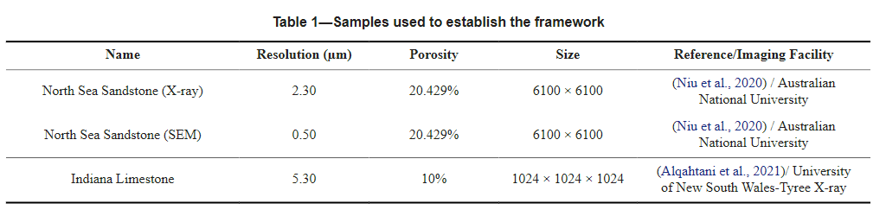

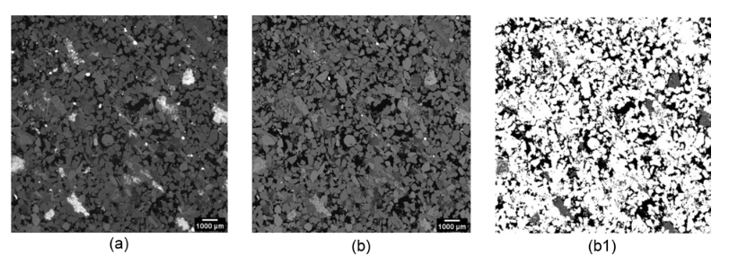

    使用的材料：(a) 北海砂岩的 X 射线图像； (b) 北海砂岩的SEM图像； (b1) SEM 图像的 WS 分割（Ground Truth）

对于 2D 应用，原始北海砂岩的 X 射线和 SEM 图像（Niu 等人，2020；Scott，2020）被分为三个阶段：***孔隙、低密度矿物和高密度矿物***。使用两种方法对 X 射线图像进行分割：***（1）使用 ImageJ 软件进行 Otsu 分割阈值处理；（2）使用 Avizo 软件进行基于分水岭的方法***。使用 Avizo 软件，使用基于分水岭的方法对 SEM 图像进行分割。为了我们的分析和比较，*SEM 分割将用作地面实况分割，而 X 射线分割将仅用于比较*。对于 3D 应用，印第安纳石灰岩的原始 X 射线图像使用 Avizo 软件通过分水岭方法进行分割，并辅以***汞注入毛细管压力 (MICP) 分析来确定宏观- 和微孔***。该分割将用作地面实况分割。

PS:[Mercury Injection Capillary Pressure (MICP)是一种常用的测量岩石孔隙度、孔喉尺寸分布和注入压力与汞饱和度关系的技术。后两者可以用来估计岩石的渗透率](https://www.searchanddiscovery.com/documents/2018/42311peng/ndx_peng.pdf)[。MICP的原理是将汞注入一个抽真空、清洁和提取的岩心样品中，逐步增加汞注入压力，并记录不同压力下的岩心孔隙体积和汞饱和度。根据油水界面张力和油水接触角，可以将汞注入压力转换为毛细管压力，从而得到岩石的毛细管压力曲线](https://wiki.aapg.org/Capillary_pressure)[。MICP可以有效地评估页岩等低渗透率岩石的大孔结构，但需要注意数据的正确解释](https://www.researchgate.net/publication/322640993_Mercury_Injection_Capillary_Pressure_MICP)。

### 2.2方法

分段工作流程。构建此工作流程的两个主要考虑因素是图像***分辨率对图像分割的影响***以及如何从***一组像素/体素的空间信息中受益，而不是将每个像素/体素强度值作为图像分割中的独立值***。所提出的框架分四个步骤完成，如图所示。简而言之，**第一步是初始图像处理。第二步启动超像素/超体素的生成。第三步涉及超像素/超体素特征提取。第四步应用三种不同的无监督聚类技术对所有生成的超像素/超体素进行聚类，然后建立多数投票聚类策略来为每个超像素/超体素分配最终标签。**

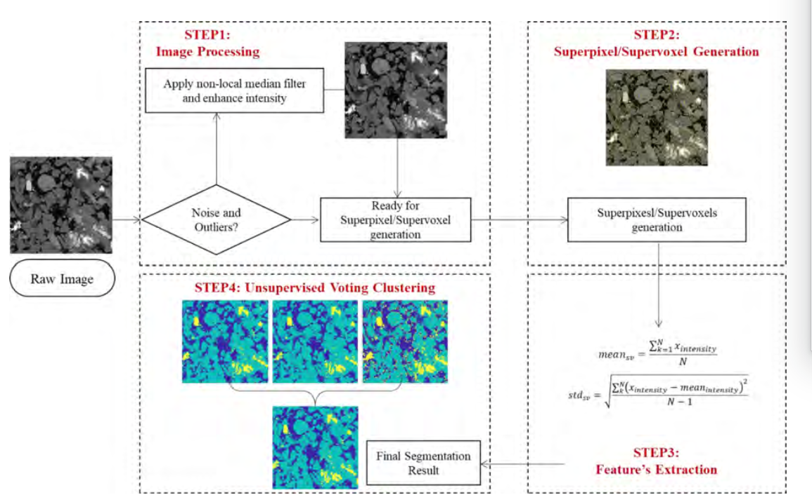

工作流程的说明； STEP1：图像处理； STEP2：利用SLIC算法生成超像素/超体素； STEP3：从每个超像素/超体素中提取统计特征； STEP4：利用三种无监督聚类技术并取每种分类的模式

PS：

**LIC算法**是一种基于K-means聚类的超像素分割算法，它可以快速地生成紧凑、均匀、边界敏感的超像素。要使用这种算法生成超像素，可以按照以下流程：

* 将图像分割成S×S个格子，每个格子中心生成一个 **聚类中心** ，并将其移动到格子中心的八邻域像素中梯度最低的像素位置。
* 在每个聚类中心周围的2S×2S的窗口内，计算每个像素与聚类中心的距离，包括颜色和空间距离，并将每个像素分配给最近的聚类中心。
* 更新每个聚类中心为其所属像素的平均颜色和位置，并重复上一步直到收敛。
* 对分割结果进行后处理，消除小区域和连接断开的区域。

**第 1 步**：图像处理。扫描伪影可能会影响或模糊图像中的某些特征，或改变图像不同部分中某些材料的 CT 值（。因此，图像处理是对数字岩心图像进行任何定性或定量分析之前必须完成的第一步。开发此工作流程时遇到的最常见的伪影是***图像暗度和图像噪声***。有时，显微 CT 图像在采集后可能会***变暗***。在这种情况下，灰度直方图偏向强度值的低频谱。因此，必须***重新映射强度值***在整个范围内。这会产生更亮的图像，同时保留图像的所有物理信息。另一个伪影是图像噪声。图像噪声是由光子统计计数错误引起的，导致某些像素/体素中存在的高强度元素出现，而低强度元素消失。为了解决这个问题，在图像上应用了***中值滤波器***。中值滤波器的计算方法是在噪声图像上滑动 M × M 像素的窗口，并将该窗口的中心像素值替换为该窗口中存在的所有像素的中值。本文发现中值滤波器的应用有助于生成更准确的超像素边界。

**第 2 步**：超级像素/超级体素生成。虽然生成超像素的方法有很多种，本文选择使用更简单的线性迭代聚类 (SLIC)。它已被证明在内存效率、边界遵守、速度和分割算法应用方面优于其他超像素/超体素算法。* **SLIC 通过基于图像平面中的相似性和邻近性对像素或体素进行聚类来生成超像素/超体素***。算法中的主要用户输入是所需的段数 k。然后，算法通过初始化步骤开始聚类，其中算法沿着 CIELAB 颜色空间 $C_k$ = $[I_k, a_k, b_k, x_k, y_k]^T$ 选择超像素中心，其中 k = [1, k] 并开始定期采样网格间隔 S 像素。为了产生大致相同尺寸的超像素，间距应该是: S=N/K   。值得注意的是，该算法在 3×3 邻域中以最低梯度下降选择每个超像素的中心，以避免将超像素集中在图像的边缘或噪声部分。下一步是分配，图像中的每个像素 i 与最近的聚类中心相关联，其中像素 I 的搜索区域与像素 i 重叠。在这一步中，SLIC 非常优化，因为与整个图像的标准 k 均值搜索相比，搜索区域为 2S×2S。一旦图像中的所有像素都与其最近的簇相关联，就会进行新的中心计算，以平均属于该簇的所有像素的所有 [labxy] 向量。 SLIC算法的总结:

1. 通过在规则网格步长 S 采样像素，来初始化聚类中心 $C_k$ = $[I_k, a_k, b_k, x_k, y_k]^T$
2. 扰动 n × n 邻域中的聚类中心，达到最低梯度位置
3. 对于每一个聚类中心$ C_k $:

   1. 根据距离测度中心，从簇中心周围的 2S × 2S 正方形邻域中分配最佳匹配像素
   2. 计算新的聚类中心和残差E {L1 先前中心和重新计算中心之间的距离}
   3. 直到 E ≤ 阈值
4. 加强连接

**步骤3-1**：特征提取。为了实现最佳分类和标记，从每个超像素/超体素中提取统计特征。这些功能将允许量化每个超像素/超体素的特定判别信息，这将简化工作流程下一步中的分类过程。每个超像素/超体素用于提取其相应强度值的平均值和标准差:

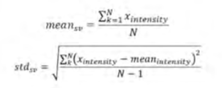

强度 - 平均强度

其中 公式(1) 和 公式 (2) 中的 N 是每个超像素/超体素中的像素/体素数.

**步骤3-2**：无监督投票聚类。聚类可以定义为***基于不相似性的定义度量***或***基于数据中识别的模式结构***将一组数据划分为不同数量的标记组。一般来说，聚类算法可以分为两大类：非参数聚类和参数聚类方法。本文提出的框架中，对生成的超像素/超体素进行聚类；基于他们提取的特征；利用两种非参数聚类算法，即***k 均值聚类和层次聚类的凝聚*****方法**，以及***概率参数聚类方法，即高斯混合模型 (GMM)***。：

    1. k-均值聚类。在 k 均值算法中，数据集被分为 k 个簇，分为两个顺序步骤。第一步是计算测试数据中的 k 个质心。第二步是将每个数据点分配到其最近的特定质心。到最近质心的最常见距离度量是欧几里德距离。每个簇由其质心及其组成数据点定义。一旦定义了簇，该算法就会在迭代过程中重新计算簇的质心，以最小化每个簇与其组成数据点之间的欧几里得距离，直到平方根误差函数最小。

    2. 凝聚聚类。层次聚类算法通过将整个数据集视为最高层次的聚类，同时将每个数据点本身视为最低层次的聚类，在聚类之间构建层次结构。凝聚聚类是一种从每个数据点/簇开始，以自下而上的方法将相似的数据点合并到新定义的簇中的方法。在提出的框架中，使用 Ward 的最小方差方法作为相似性度量或聚类之间的联系。 Ward 的方法最大限度地减少了每个定义的簇中数据点之间的方差。在高维结构数据（例如图像）中，凝聚聚类本身可能不是一种有效的聚类算法，因为它寻找要合并的聚类之间的相似性度量，并且不考虑数据集中的全局相似性。

    3.高斯混合模型聚类。高斯混合模型 (GMM) 是一种统计混合模型，表示总体总体中的子总体的概率模型。一般来说，混合模型有两组参数：混合比例和与每个成分分布相关的参数。在 GMM 中，将单个概率密度函数拟合到数据，以用与混合物中高斯数量相似的维度向量表示每个样本。 GMM 的主要缺点是它们只有在数据分布已知或可以估计时才能提供良好的结果。

    4.投票聚类。前面提到的每种聚类技术都容易出现错误和错误分类。为了最大化每种聚类技术的收益并最小化错误，本文实现了一种投票策略，该策略从上述算法中对每个生成的超像素/超体素进行分类，并为其分配分类模式。结果显示应用该技术后有所改善。

---

## 3.验证

**分割准确性指标**。为了评估框架，使用了两个分割指标：交并集（IoU）指标（也称为杰卡德指数）和骰子系数指标（DCM）。当两个样本相同时，这两个度量都给出最大值 1，当两个样本完全不同时给出最小值 0。考虑两个样本 A 和 B，杰卡德指数是通过获得 A 和 B 之间的交集面积与 A 和 B 的并集面积之比来计算的： IOU = （A∩B）/（A∪B）

骰子系数度量是通过获得 A 和 B 之间相交面积的两倍与两个面积总和的比率来计算的 ：DCM=2×(A∩B)/（A+B）

两个指标呈正相关。然而，由于交集和并集区域之间的负相关性，IoU 度量通常会产生较低的相似度分数，而 DCM 显示平均性能。

物理特性的测量。分割准确性指标本身可能会在评估过程中产生误导。因此，获得了一些物理参数来评估所提出框架的准确性：***体积分数、孔径分布和 3D 应用的渗透率***。通过将相的像素/体素的数量与像素/体素的总数进行计数来计算体积分数。本文中的孔隙率是指已分解孔隙的分数。使用 Gostick 等人计算孔径分布。使用印第安纳石灰岩样品沿 X、Y 和 Z 方向计算的渗透率。

[Journal of Open Source Software: PoreSpy: A Python Toolkit for Quantitative Analysis of Porous Media Images (theoj.org)](https://joss.theoj.org/papers/10.21105/joss.01296)

[Approximating Permeability of Microcomputed-Tomography Images Using Elliptic Flow Equations | SPE Journal | OnePetro](https://onepetro.org/SJ/article-abstract/24/03/1154/206953/Approximating-Permeability-of-Microcomputed?redirectedFrom=fulltext)

## 4.结果

### 4.1 2D 应用

我们将该框架应用于大小为 2000×2000 像素的图像的一部分。选择图像的一部分而不是整个图像的原因是地面实况图像（SEM 图像）缺少一些颗粒，如图 所示。这可能是由于获得平坦样本的抛光过程所致用于 SEM 成像。此外，我们想选择图像中所有三相共存的部分。图 4 显示了图像的所选部分及其超像素分割和地面实况分割。为了生成超像素分割，我们将图像分为 40,000 个片段，相当于图像大小（以体素为单位）的 1%。每个片段都用于从其强度值的平均值和标准差中提取其统计特征。

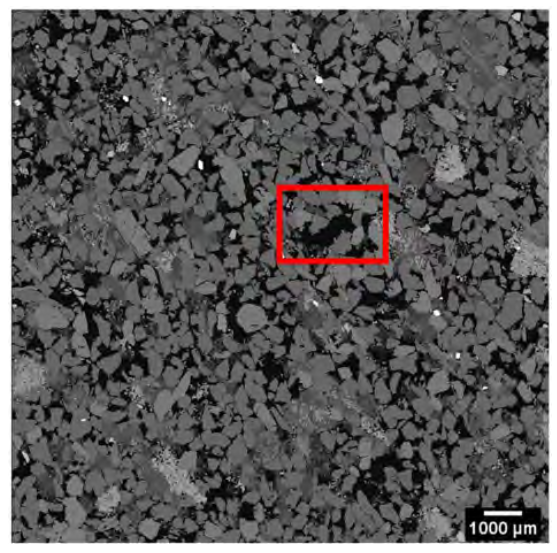

    SEM 图像中缺失晶粒的展示

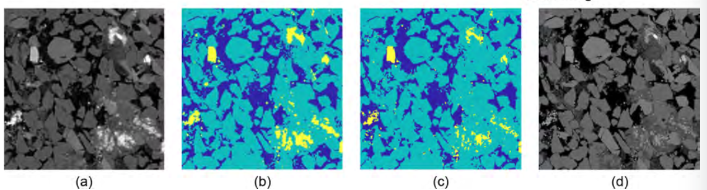

图 4—(a) X 射线图像的选定部分； (b) 超像素分割； (c) SEM 地面实况分割； (d) SEM 图像的选择部分

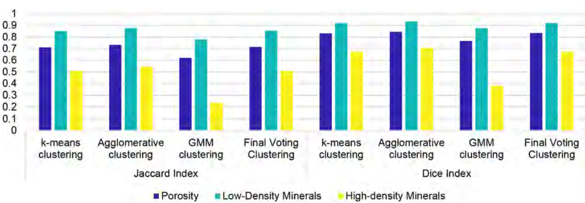

    图5 2D框架相似指数结果总结

**细分指标准确度结果。**超像素分割的 Jaccard 平均得分为 70%，Dice 指数平均得分为 80%。有趣的是，值得注意的是，这两个指标都导致***高密度矿物相得分较低***。如此低分背后的原因可能是超像素边界的不一致，因为我们使用图像总像素数的 1% 来分割图像。此外，高密度矿物区域中每个超像素的成分具有更高的平均值和更高的标准偏差值，这迫使分类算法为该超像素分配高密度标签。此外，与 SEM 图像 (0.5 µm) 相比，X 射线灰度图像的分辨率 (2.3 µm) 较低。因此，这样的误差幅度是合理的。

另一方面，比较分类算法，我们发现凝聚聚类优于所有其他分类算法，而高斯混合模型聚类导致所有指标得分最低。如前所述，GMM 模型需要先验了解数据的分布。在我们的例子中，一旦生成了超像素，数据的分布就取决于生成的超像素的数量。图 5 总结了相似性指数的结果。

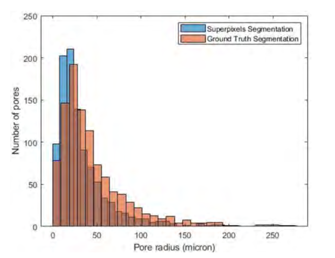

图 6 — 超像素分割图像和地面真实分割 SEM 图像的孔径分布

**物理特性结果的测量**：物理特性是典型 microCT 工作流程的最终产品。它们是评估任何细分过程的非常好的衡量标准。表3显示了孔隙相、低密度相和高密度相的体积分数的计算。

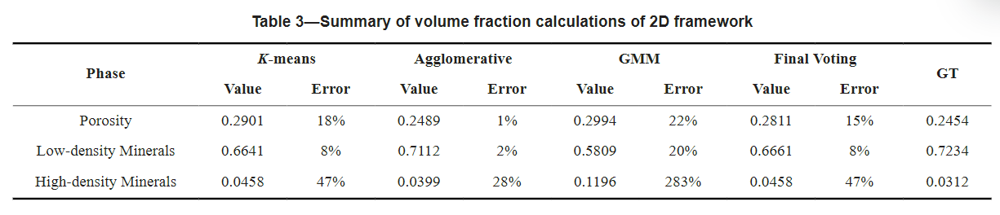

我们可以观察到，与其他聚类技术相比，团聚聚类可产生最准确的孔隙度估计，而 GMM 在量化高密度矿物相时产生最高的误差。一般来说，最终的投票聚类产生了可接受的孔隙率估计。图 6 显示了超像素分段 X 射线图像与地面真实分段 SEM 图像相比的孔径分布。两个直方图的趋势显示出高度相似性，交集为 84.3%，尽管我们看到小半径孔隙的计数存在差异，因为超像素算法识别出更多数量的小孔隙半径的孔隙空间。

### 4.2 3D 应用

为了测试我们提出的工作流程在 3D 图像上的适用性，我们将工作流程应用于印第安纳石灰石样本的 512^3 图像，并根据使用 Avizo 软件获得的 MICP 辅助的分水岭分割测试结果。为了生成超级体素分割，我们将超级体素大小设置为 50 个体素，这导致创建 54,610 个片段，相当于图像大小的 0.04%。每个片段都用于从其强度值中提取统计特征。图 7 显示了原始图像及其分割图像的 3D 表示和切片视图。

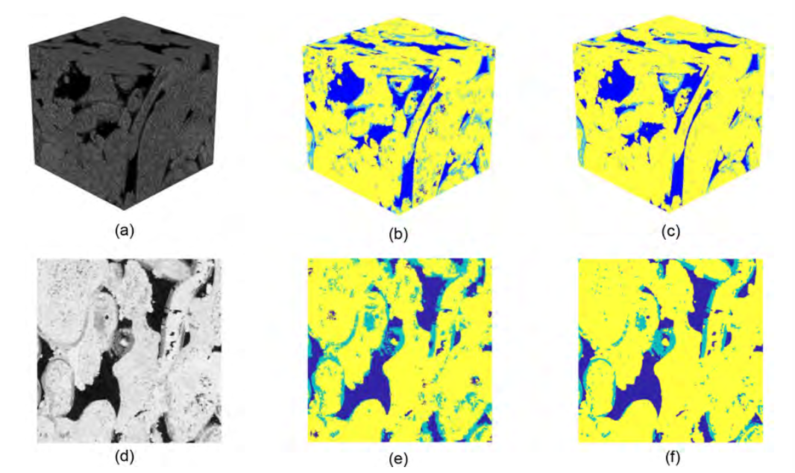

图7 (a) 512^3 体素显微 CT 印第安纳石灰岩图像； (b) 512^3 体素超体素分割图像； (c) 512^3 体素分水岭分割图像； (d) 印第安纳石灰岩图像的 2D 切片； (e) 超体素分割图像的 2D 切片； (f) 分水岭分割图像的 2D 切片

细分指标准确度结果。相似性指数得分相对高于 2D 应用结果，因为在这里我们将我们的框架与使用相同成像技术和相同分辨率 (5.3 µm) 的分水岭分割进行比较。然而，这是在仅利用图像大小的 0.04% 来生成分割图像的情况下实现的。 Supervoxel 分割的 Jaccard 平均得分为 74%；平均 Dice 指数得分为 83%。在所有分段相中，微孔识别的误差是最高的。这可能是因为超体素边界与分水岭分割中识别的微孔隙区域不相符。此外，微孔隙通常作为比超体素尺寸小得多的离散区域存在，因此增加了误差。解决这个问题的一个可能的解决方案是以捕获具有不同特征的区域的方式细化具有高强度变化的超体素。

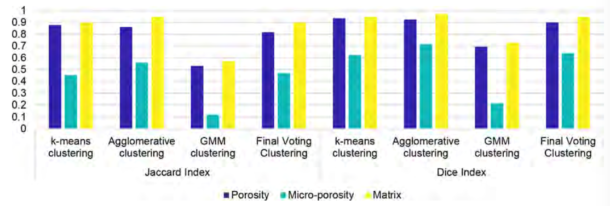

图8 3D框架相似度指数结果总结

此外，与 2D 情况类似，凝聚聚类产生了高相似性指数分数和准确的分割，这表明它在捕获空间信息方面具有强大的能力，而不是 GMM 模型，而 GMM 模型可能需要更多数据来提高整体性能。图 8 显示了相似性指数结果的摘要.

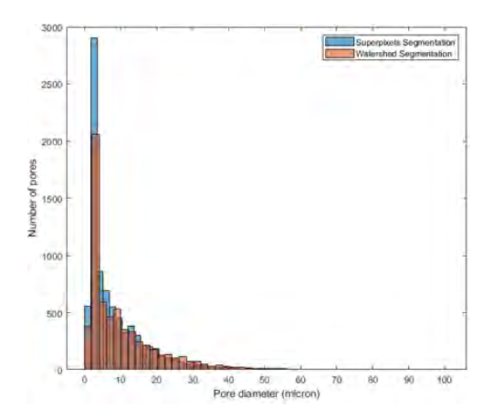

图9 超体素分割图像和分水岭分割图像的孔径分布

图9显示了超体素分割3D图像和分水岭分割3D图像中孔隙率和微孔隙率的孔径分布。分布具有相同的总体趋势，并且表现出良好的一致性，交集为 80.6%。然而，超体素分割显示出更多的孔隙率和微孔隙率

物理性质结果的测量。计算了三个物理属性来评估分割精度：(1) 体积分数，(2) 孔径分布，以及 (3) 绝对渗透率。表 4 显示了体积分数计算，其中发现 k 均值聚类产生最准确的孔隙率估计，而 GMM 聚类产生最不准确的结果。

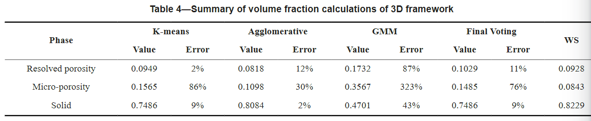对于绝对渗透率计算，包括解析孔隙度和微孔隙度，同时将 1.25×10^(−13) m^2 的电导率分配给微孔隙度相。绝对渗透率计算如表 5 所示。沿 Z 方向（即垂直方向）的结果偏差约 15%，同时使用所提供的所有聚类技术保持相同水平的精度。一般来说，超体素分割导致较低的绝对渗透率，这与具有小孔隙半径的较多孔隙的计算结果一致，如图 9 所示

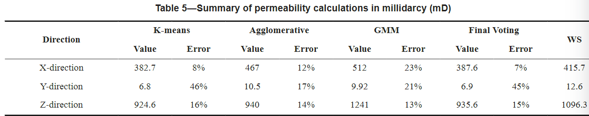

所有结果都显示了SLIC算法在过分割过程中的优势，并突出了其识别孔隙尺度图像中不同特征的能力。然而，工作流程的一些限制可以进一步改进，例如片段数量的选择。段的数量选择易于由用户输入。该框架的进一步开发可以受益于根据图像分辨率、图像尺寸和最小识别孔隙半径自动选择分段数量。这项研究的另一个发现是凝聚聚类算法在分类中的优势，因为它能够在 2D 和 3D 应用中产生最佳结果。然而，利用凝聚聚类是与生成的片段数量的准确性之间的权衡。凝聚聚类算法具有 GPU 限制，只能处理有限数量的生成的超像素/超体素。因此，结果仅限于超像素/超体素的最大数量。为了利用少量的片段，同时保留图像中最精细的细节，Ji 等人。 （2014）建议生成超像素，然后对超过每个超像素中成分方差的特定阈值的像素进行过度分割。然而，用户对方差阈值的选择仍然是该策略的一个缺点

## 5.结论

本文提出了一种应用超像素/超体素过分割方法来分割岩石的显微 CT 灰度图像。提出了一种分割工作流程，以展示 SLIC 超像素/超体素算法从原始图像获取统计特征的能力，这些统计特征可用于生成准确的分割结果。一般来说，该框架降低了计算成本分割与直接对图像应用聚类技术相比。所提出的工作流程针对从北海砂岩 SEM 图像获得的分割进行了测试，并与 512^3 个印第安纳石灰岩样本的分水岭分割体积进行了定量比较。表 6 中的比较:

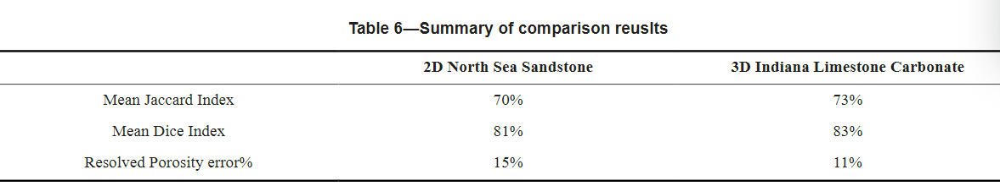

未来的工作和工作流程的改进将侧重于自动选择超像素/超体素的数量，利用其他统计特征，例如局部二进制模式描述符或小波统计应用程序，利用更多无监督聚类技术，例如亲和传播或基于密度的空间带有噪声的应用程序聚类（DBSCAN），通过选择相似系数最高的聚类技术而不是统计模式进行分类来改进投票策略
