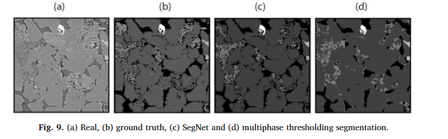

# 使用深度卷积自动编码器网络分割数字岩石图像

Computers and Geosciences   5.168  SCI Q1区

数据：[GitHub - fkrzikalla/drp-benchmarks: Supplements to &#34;Digital Rock Physics Benchmarks&#34;](https://github.com/fkrzikalla/drp-benchmarks)

[Segmentation of digital rock images using deep convolutional autoencoder networks - ScienceDirect](https://www.sciencedirect.com/science/article/pii/S0098300418303911?via%3Dihub)

---

分割是数字岩石物理 (DRP) 中的关键步骤，因为原始图像以灰度格式提供。传统方法通常使用阈值来描绘不同的阶段，因此使用分水岭算法来识别现有阶段。此类方法基于颜色对比度，这使得很难自动区分具有相似颜色和强度的相。最近，深度学习和机器学习算法提出了几种处理图像的算法，包括卷积神经网络（CNN）。其中，当各种图像可用于训练时，卷积自动编码器网络在不同的应用中都产生了准确的结果。因此，***本文采用卷积自动编码器算法来增强数字岩石图像的分割***。然而，在 DRP 中应用 CNN 算法的瓶颈是可用的岩石图像有限。作为一种有效的数据增强方法，本研究使用***基于互相关的模拟***来增加必要的数据集。因此，使用最初可用的数据集，即来自伯里亚砂岩的 20 个图像，使用由手动和半手动分割图像组成的训练种子。然后，将数据集分为训练组、验证组和测试组，比例分别为 80%、10% 和 10%。接下来，将生成的数据集提供给我们的随机图像生成器算法，并同时生成 20000 个实现及其分段图像。所实现的 CNN 算法针对基本架构和扩展架构的两个版本进行了测试。结果表明，扩展网络使用测试组中的指定图像产生的结果具有 96% 的分类准确度。最后，与传统的多相分割（多阈值）的定性比较表明，即使可用的岩石图像很少，我们的结果也更加准确和可靠。

---

通过 HYPPS 算法作为一种有效的增强方法来解决 DRP 中数据有限的问题。然后，使用SegNet来克服传统数字岩石图像分割方法的困难和缺点。

---

## 介绍

岩石物理学提供了岩石多孔结构的物理特性与遥感地球物理测量之间的关系。最近，岩石样本高分辨率微计算机断层扫描（μCT）图像的出现导致了数字岩石物理学（DRP）的显着发展。在 DRP 的标准工作流程中，将孔隙和矿物分割为不同的相是至关重要的一步。为 DRP 开发的分割方法在之前的出版物中进行了广泛的回顾（Iassonov 等人，2009 年；Sezgin，2004 年）。其中，视觉科学组（VSG）、斯坦福大学（SU）和Kongju（KJ）分段引入的程序是最有效的可用框架（Andrä等人，2013）。这些方法概括为以下步骤：***1. 使用图像的梯度大小进行边界检测并排除它们，2. 将提醒像素阈值作为孔隙和矿物相，以及 3. 通过基于标记的分水岭将所有相扩展到边界像素算法***（Beucher 和 Meyer，1992）。具有复杂图案的矿物中的标记物检测并不简单，并且可能没有通用的方法来实现这一点（Beucher 和 Meyer，1992）。尽管大多数分割方法都是基于自动框架中的图像处理算法，但每个步骤中的手动控制都是必不可少的。例如，当两个单独的相之间没有观察到颜色对比时，阈值处理可能会失败。换句话说，岩石图像中可能存在两种颜色相似的不同矿物。发生此问题的原因要么是它们的密度接近，要么是成像仪器的检测能力有限。为了简单起见，***研究人员通常将岩石图像视为两相（孔隙和矿物）样品***。然而，这种简化并不适用于一般情况，并且强烈影响岩石物理参数的后续计算，特别是 Pe 和 S 波速度。

人工神经网络（ANN）是一类受人脑启发的机器学习算法。如果人工神经网络经过一些例子的训练，它们就能学会执行分类或预测等任务。人工神经网络（特别是深度学习）的最新发展为解决图像分析中非常复杂的问题提供了新的可能性。其中一种算法是卷积神经网络 (CNN)（Krizhevsky 等人，2012 年；Lecun 等人，1998 年），它使用卷积和池化函数来提取用于分析视觉图像的新特征。这些网络被认为是深度学习的衍生品之一，与传统网络相比，在准确性和有效性方面表现出显着差异（Garcia-Garcia et al., 2017）。 CNN 已用于许多应用，包括人脸检测（Li et al., 2015）、语义分割（Garcia-Garcia et al., 2017）、自动驾驶中的视频分析（Badrinarayanan et al., 2015）、语音识别（Y.Zhang 等，2017b）和医学图像分析和应用（Havaei 等，2017；Litjens 等，2017；Wallach 等，2015）。在地球科学中，特别是在岩石物理学中，深度学习方法和 CNN 被用于不同的应用，例如：使用钻孔成像进行岩性检测（P.Y.Zhang 等，2017a）、岩石类型分类（Cheng 和Guo，2017；Ferreira）和 Giraldi，2017）、渗透率预测（Srisutthiyakorn，2016）和岩石多孔介质重建（Laloy 等，2017；Mosser 等，2017）。在这项工作中，我们的目标是使用这种强大的方法进行岩石图像分割。因此，首先简要回顾一下深度学习分割方法。

如前所述，CNN 能够用于像素标记问题或分割。 CNN 超越传统方法的最显着优势是能够从模式、特征和纹理中学习，而不仅仅是依赖颜色变化。根据 Garcia-Garcia 等人最近进行的一项研究。 (2017)，最成功的基于深度学习的分割方法是全卷积网络 (Shelhamer et al., 2017)。在全卷积网络中，一组连接层被卷积层取代，卷积层产生空间图而不是分类分数。事实上，此类图在上采样过程中进行反卷积以获得每像素标记图像（即分割图像）。 SegNet (Badrinarayanan et al., 2015) 是一种编码器-解码器卷积网络，是目前最好的此类网络之一，已在不同的应用中使用，并展示了有希望的结果 (Garcia-Garcia et al., 2017；Kendall 等人，2015；Nanfack 等人，2017

使用深度学习方法进行 DRP 的主要问题之一是可用于训练步骤的数据集有限。获取 μCT 图像既昂贵又耗时。此外，由于样品制备过程较长或岩心样品有限，在地下应用中制备数百（或数千）抛光薄片样品用于显微镜成像可能不太合理。因此，应该应用数据增强方法来增加现有的数据集。使用这样的大数据将导致更有效的训练，从而通过快速收敛或更好的正则化来避免过度拟合。数据增强的常见方法是可用***的图像变换算子，例如旋转、平移、缩放、裁剪等。***例如，Mosser 等人。 (2017) 从大图像中裁剪出几张小尺寸图像，并在小图像之间使用 12-64% 的重叠来增加数据集。然而，***在本文中，采用了一种更有效的重建方法，即 Tahmasebi (2017) 引入的混合模式和基于像素的模拟（HYPPS），用于数据增强***。 HYPPS 使用输入图像并生成任意数量的具有不同结构和任意大小但具有相似统计数据的实现。 HYPPS 是一个强大的工具，已在多个应用程序中用于重建新的非均质介质场景，如砂岩和碳酸盐样品、煤样品、小规模多孔介质建模（和非常规介质。

在本文中，首先，我们通过 HYPPS 算法作为一种有效的增强方法来解决 DRP 中数据有限的问题。然后，使用SegNet来克服传统数字岩石图像分割方法的困难和缺点。

---

## 基础介绍

本文使用的两种主要算法是用于基于图像的分割的 SegNet 和用于模拟和数据增强的 HYPPS 方法。本部分简要介绍了这些算法以及作为基于图像的神经网络的核心的 CNN

### * 卷积网络

卷积神经网络是一大群深度学习方法的一部分。它们因其强大的图像分类/识别能力而受到关注（He et al., 2015）。 CNN 通过其卷积层进行训练，以识别输入图像中的各种模式。小尺寸内核是卷积层的支柱。事实上，它们有效地提取了输入图像的高级特征。卷积层后面是一个完全连接的神经网络，用于将从前一层获得的特征转换为给定的输出阶段。常见的CNN的基本层如下：

1.输入层：图像被视为输入数据，在该层被引入CNN。

2. 卷积层：在这一层中，最后一层的输入图像或特征图与一些小尺寸滤波器（或内核）进行卷积，以生成新的特征图。这些卷积是通过移动“n”个像素来执行的，这称为步幅（Krizhevsky et al., 2012）。事实上，步长控制滤波器如何围绕输入图像进行卷积。
3. ReLU（修正线性单元）层：该层的目的是向基本上刚刚在卷积层期间通过线性运算（乘法和求和）进行计算的系统引入非线性。 ReLU 层将函数 flf x x( ) max(0, ) 应用于输入体积中的所有值。 ReLU 背后的逻辑是该层将所有负值更改为零。

4.最大池层：该层通常称为下采样，用于通过在以相同长度的步幅跨特征图移动的滑动窗口中选择局部最大值来汇总数据。

5.全连接层：它类似于传统的多层感知器（MLP）神经网络（Haykin，1999），用于将先前层中获得的特征图或模式转换为已知的分类。 6. Soft-max 层：soft-max 或归一化指数函数是另一个激活函数，它产生一个分类输出总和等于 1 的概率分布。该层位于最后一层。

    图 最大池索引用于对 SegNet 中的低分辨率地图进行上采样

### * SegNet架构

SegNet 被认为是一个完全卷积的编码器-解码器网络（Badrinarayanan 等人，2015）。对于编码器部分，它使用 CNN 的通用架构并删除全连接层以生成输入图像的低分辨率特征图。相反，在解码器部分，使用类似的架构来再现高分辨率特征图。该图被馈送到多相软最大层，以将其分类为像素级多相分段输出；

每个编码器由负责生成特征图的各种卷积层组成。为了引入非线性，使用 ReLU 层作为有效的激活函数。然后，具有不重叠步长的最大池化窗口会生成子采样特征图。使用几个卷积层步骤后，获得了低分辨率特征图，并在解码器部分进行上采样。问题在于解码器学习对低分辨率地图进行反卷积或解码。因此，编码器特征图的边界信息在子采样之前被存储并在解码器步骤中使用。巴德里纳拉亚南等人表明仅存储最大池索引就足够了。由于最大特征值存在于每个编码器特征图中。这些记忆的最大池索引在解码器部分中用于上采样和生成密集特征图。

SegNet 架构类似于 DeconvNet (Noh et al., 2015) 和 U-Net (Ronneberger et al., 2015)，但也存在一些差异。与 DeconvNet 相比，它使用全连接层，因此它的参数非常大，导致计算成本更高，训练难度更大。另一方面，U-net 将整个编码器特征图传输到解码器，这需要大量内存。

在本文中，我们使用两个版本的 SegNet 网络：1. 基本 SegNet 和 2. 扩展 SegNet。在基本的SegNet中，使用了四个编码器和四个解码器。在每个编码器或解码器中，应用了具有 2 × 2 最大池化/反池化窗口和步长 2 的 7 × 7 × 64 卷积/反卷积层。这意味着每个内部步骤的 64 通道特征图都会被下采样或上采样两倍。 ReLU激活函数仅在解码器部分使用。扩展的 SegNet 与基本的 SegNet 类似，但具有更庞大的架构。在本研究中，使用了五个编码器和五个解码器，而四个端编码器和解码器中应用了两个卷积/反卷积层。此外，**三个卷积/反卷积层应用于六个中心部分（**类似于图1）。因此，每个基本 SegNet 和扩展 SegNet 分别包含 18 层和 38 层。

### * 数据增强

如前所述，对人工智能技术进行成功的训练需要大量数据（Zhao，2017）。当输入数据很复杂时，这种要求变得更加重要，在本研究中，输入数据包括一组岩石样本的灰度图像。此外，根据问题的复杂程度，用于训练的输入数据的数量差异很大，因此提供如此大的数据需要大量的成本和时间。然而，在本研究中，提供了必要的数据，其中随机算法使用输入图像并且可以产生具有不同结构的图像。因此，我们首先描述所实现的随机算法，然后讨论与在训练中施加可变性以确保使用综合数据集相关的其他问题。

图3 （a）在扫描电子显微镜（SEM）中检测到的伯里亚砂岩的不同矿物和（b）伯里亚砂岩的 3D μCT 图像，尺寸为 1024 × 1024 × 1024 体素和分辨率为0.74微米。

本研究采用***互相关模拟算法，属于HYPPS技术中更具包容性的方法***。使用该算法而不是原始 HYPPS 方法的原因将在后面讨论。所实现的方法适用于一个/（一组）图像并产生各种等概率的实现。在本研究中，我们使用与输入图像相同的尺寸。然而，输入和输出图像之间没有关系，并且它们可以是任何大小。

* 这种方法首先使用一个 **像素技术** ，例如 **CCSIM算法** ，来生成一个初始的模拟结果。这个过程是通过在TI中寻找与目标位置相似的邻域，并从中随机抽取一个值来填充目标位置，从而保证了局部的数据一致性。**基于互相关的仿真算法** ，它通过计算目标位置与TI中每个位置的互相关系数，来找到与目标位置最相似的邻域，并从中随机抽取一个值来填充目标位置。这种方法计算效率较高，但可能会导致模式的重复或失真。
* 然后，这种方法使用一个 **模式技术** ，例如 **SNESIM算法** ，来对初始的模拟结果进行优化。这个过程是通过在TI中寻找与目标位置相似的模式，并从中随机抽取一个值来替换目标位置，从而提高了全局的模式再现性**基于模式树的仿真算法** ，它通过构建一个模式树来存储TI中所有可能的模式，并根据目标位置的已知信息，在模式树中搜索与目标位置最相似的模式，并从中随机抽取一个值来替换目标位置。这种方法可以保证模式的再现性，但计算效率较低。
* 

* 从 **训练图像（TI）**中提取出一些**模式（patterns）** ，它们是一些具有特定形状和大小的像素组合，可以反映出空间数据的特征和规律。
* 将这些**模式（patterns）**存储在一个**模式库（pattern library）**中，它是一个包含了所有可能的模式及其出现频率的数据库，可以用来指导模拟过程。
* 在模拟过程中，根据已经生成的像素和**训练图像（TI）**中的数据一致性，从**模式库（pattern library）**中选择一个合适的模式，并将其复制到模拟结果中，直到填满整个图片。

首先，为输出图像生成一个空的模拟网格。然后，从模拟网格的一角开始，从输入图像中选择具有特定尺寸的图案并将其粘贴到模拟网格上。请注意，第一个模式被插入到空的模拟网格上，并且以完全随机的方式选择。所选图案的大小取决于输入图像的异质性。如果输入图像表示非常复杂的图案，则可以使用更大的模板尺寸。类似地，当输入图像均匀时可以选择较小的图案尺寸。然而，应该记住，较大的模板通常会减少生成的实现之间的可变性，同时生成高质量的图像。另一方面，较小的模板大小会增加可变性，而最终实现可能与输入图像不太相似。因此，在定义适当的尺寸后，选择先前插入的图案OL ($OL_x * OL_y )$之间的小重叠，并使用以下公式计算所选区域与输入图像的互相关性：

其中 DI 是输入 2D 图像，DT 是点 (x,y) 处的访问数据事件，T 表示其大小（即模板大小）。使用生成的相似度图，根据模式的相似度对模式进行排序，并选择一定数量的最相似的模式。最后，选择其中一种模式并将其插入访问点。这个过程一直持续到模拟网格被填满为止。使用输入砂岩图像生成的一些实现如图所示

HYPPS 算法最初是为了处理复杂的二次连续数据和点数据而开发的。因此，使用单一模式策略来再现调节数据可能很困难。因此，HYPPS 方法提供了一些灵活性，例如通过基于像素的方法模拟点数据。然而，在本研究中，由于没有此类数据可用，因此 HYPPS 方法以其基于模式的模式使用。

人工智能和基于物理的建模之间的主要区别之一是必要的可变性的量。换句话说，当输入数据显示出较大的标准差时，深度学习方法可以代表其最佳结果，从而可以从丰富的数据库中构建新模型。为了利用输入图像之间的空间关系并制作新图案，对 HYPPS 方法进行了修改。因此，使用输入集合生成新的实现/图像。换句话说，在模式选择阶段搜索所有可用图像。这样做将导致更多的可变性，并且还会产生新的过渡模式，而这些过渡模式可能无法在每个输入图像中单独使用。

## 基准数据

安德拉等人 介绍了几种标准数字岩石样本，例如伯里亚 (Berea) 和枫丹白露 (Fontainebleau) 砂岩以及 Grosmont 碳酸盐岩 。这些基准样本经常用于 DRP 研究。其中，我们使用伯里亚砂岩来评估我们的分割结果。该样品主要由石英和粘土、钾长石、铁白云石、锆石等少量矿物组成；见图3(a)。获取的图像由1024×1024×1024个体素组成，分辨率为0.74μm（图3（b））。安德拉等人实施了三种分割方法，即VSG、SU和KJ，以获得单一矿物样本。结果表明，孔隙率范围为18.4%~20.9%。这主要是因为即使使用双峰图像直方图（即孔隙度和矿物的两种不同模式），选择阈值也会强烈影响估计的孔隙度.

## 结果

### 半自动分割

图代表本研究中使用的原始灰度图像的示例。原始图像尺寸为1024×1024像素，但为了避免中心Z轴周围，特别是图像边界存在的条纹伪影，从原始图像的中心选择了512×512像素的图像。然后，我们对图像进行了 0.5 倍的重新采样，生成了 256 × 256 像素、分辨率为 1.48 μm 的图像，主要是为了减少计算时间。

要使用多个阈值获得多矿物分割图像需要解决两个关键问题。如图 4(b) 所示： 1. 晶界比晶粒表面更亮，因此会被错误分类；2. 不同矿物因其接近的色值或强度而被类似地分类。尽管这些矿物具有不同的纹理，但上述分割对这些特征不敏感。基于多次试验，分水岭算法增强了分割过程。然而，该算法也无法区分复杂的结构。因此，我们决定手动将每个错误分类的像素标记为专家监督员。图4（c）显示了我们半手动分割的结果。尽管该样品中存在许多具有相似颜色的次要矿物，但我们决定将它们全部归类为一相。因此，分为五个阶段区分为孔隙空间（Phi）、石英（Qtz）、钾长石（K-Fld）、锆石（Zrc）和其他矿物（即主要是粘土）。尽管半手动分割是一种有效的方法，但它需要很长时间并且在实践中可能非常有限。因此，本研究中仅分割了 20 张图像。

尽管没有直接的指令来定义训练数据的数量，但为了分类目的正确训练 CNN 需要每类几千张图像（Ciresan 等人，2012）。因此，基于数据增强方法的HYPPS算法被用来训练SegNet网络。这将在下面详细讨论。

### 数据增强

如前所述，使用 CNN 处理数字岩石图像的主要障碍是可用于训练的数据有限。虽然图像变换被用作数据增强方法（Garcia-Garcia et al., 2017），但我们在 2.3 节中提出的方法是一种更有效的方法。因此，本研究采用HYPPS方法来丰富数据集。事实证明，该算法可以被视为一种有效的增强方法，可以生成深度学习研究中所需的尽可能多的图像。

为了避免二次分割，我们对源代码进行了更改以同时生成分割图像。这意味着不需要额外的一轮分割，并且当产生新的实现时，分割的图像会立即生成。输入图像大小为 256 × 256 像素，用于重建的最佳模板和重叠大小分别为 90 × 90 和 10 × 10。根据该样本的异质性，考虑了五幅图像。这种同时重建的一个例子如图5所示。在这个例子中，我们使用图4(a)中所示的灰度图像及其图4(c)中相应的分割图像作为输入，并且三个生成了实现及其分段图像。这些结果证明了本研究如何高效且准确地生成图像

为了避免过度拟合，原始 20 张图像被分为训练组、验证组和测试组，比例分别为 80%、10% 和 10%。然后，使用训练组中的图像生成 16000 个随机图像。以类似的方式，为验证和测试阶段生成了 4000 个其他图像，每个图像有 2000 个图像。下一步，训练组中生成的图像用于训练 SegNet，并使用评估数据集中的现有图像调整网络。最后，使用测试子集中未见过的图像来测试设计的网络。

### 使用 SegNet 进行分割

基本和扩展SegNet用于数字岩石图像分割。根据图 6，扩展后的 SegNet 更快地达到了所需的精度。可以看出，它需要大约 100 个 epoch 的训练，而基本的 SegNet 需要 500 个 epoch（即五倍长）来正则化卷积系数并达到适当的精度（我们这里指的是超过 90%）。两者的分类准确率每个训练、验证和测试阶段的两个网络的损失值代表了稳定的收敛。此外，扩展SegNet中的验证和测试结果更加准确，这表明该网络可以为新的和未见过的图像产生更有效的分割结果。使用每个阶段的分类精度收敛，可以更好地揭示扩展 SegNet 的强度。图 7 显示了两个网络在历元中每个阶段的分类准确度值。表 1 还总结了最终epoch的结果

图 7 和表 1 中显示的分类精度曲线和值表明，在所有情况下，两个第一阶段（Phi 和 Qtz）都可以非常快地达到合理的精度。请注意，这些阶段构成了所用图像的大部分（图 4），其分类准确度值极大地影响了整体性能（图 6）。换句话说，即使其他阶段没有正确确定，总体分类准确率仍然可以达到90%以上（表1）。这强调，我们不能仅仅依靠总体分类准确性或损失值，因为它主要由大多数主导矿物控制。图 7(a) 显示基本 SegNet 中其他阶段（OM、K-Fld 和 Zrc）的分类准确率从未达到超过 90%，尽管最终训练步骤的总体值为 96%。纪元（表 1）。此外，使用验证和测试数据对这些阶段进行分类的准确性表明，基本的 SegNet 几乎无法检测到矿物质。例如，锆石相与其他现有矿物没有区别。对于 Phi、Qtz、OM、K-Fld 和 Zrc，测试数据中标记未见过图像的网络性能分别为 87、97、60、22 和 0%，总体分类准确率为 92%。可以看出，扩展 SegNet 的结果更有希望。这可以通过验证10000个epoch后所有阶段的分类准确率值均超过90%（图7（b）和表1）。尽管上一个 epoch 训练步骤的总体分类准确度为 99%，但网络在验证和测试图像方面表现不佳。然而，扩展的 SegNet 对测试数据集的 Phi、Qtz、OM、K-Fld 和 Zrc 的分类准确度分别为 95%、98%、64%、73% 和 88%，总体分类准确度为 96%

根据这些结果，扩展的 SegNet 被认为是一个更可靠的网络。图 8 展示了四张未见过的图像的灰度图像、地面实况以及基本和扩展的 SegNet 结果。很明显，扩展的SegNet在训练和图像分割方面取得了成功。而基本的SegNet算法在分割图像中引入了大量噪声。

与传统方法相比，抑制基于 CNN 的分割的一个关键点是，这些方法基于深度架构中组合的小卷积核，这使得它们能够同时考虑颜色和纹理。为了证明这种能力，我们对使用传统方法和 CNN 方法的多分割图像的结果进行了比较。多阈值方法通过以下步骤完成： 1.由于与图像采集和重建相关的伪影，使用大小为两个像素的中值滤波器对图像进行平滑。 2. 计算梯度图像以识别矿物之间的边界。不同相之间的过渡区域是具有高梯度幅度的区域。然后将这些区域掩盖为过渡区域。 3. 除了遮蔽的过渡区域外，通过手动选择四个阈值来实现多相分割，以根据矿物的颜色对比度实现五种不同的相。 4. 最后，使用分水岭算法将每个阶段扩展到过渡区域。

上图显示多相分割的结果。 SegNet 和传统方法之间的视觉比较表明，SegNet 分割更成功，特别是在识别 OM 相（粘土和其他矿物）方面。该相位的颜色与Qtz相位非常相似，这使得仅使用颜色很难准确地检测它们。然而，SegNet 已经表现出了出色的性能。 CNN 中实现的内核提取岩石图像不同部分的必要纹理和边界。换句话说，CNN 方法不仅对颜色波动敏感，而且成功地区分具有各种纹理的组件。

根据这项研究的结果，基于 CNN 的自动分割可产生具有更高分类准确性的可靠输出。这项研究表明，如果使用有效的数据增强方法，即使图像数量非常少，也可以训练 CNN。通过快速生成大量图像（例如此处约 28,000 个），所实施的重建方法在本研究中表现出成功的性能。值得注意的是，使用 Core-i7 CPU 和 8 GB RAM 时，生成每个实现的 CPU 时间少于 15 毫秒。这种类型的增强对于 CNN 在其他领域的常见应用来说似乎是不必要的，但在 DRP 以及其他地球科学相关应用中却是不可避免的。这主要是由于 DRP 和地下问题等工程过程中对大型图像数据集的访问受到限制。

## 结论

在本研究中，我们旨在使用 CNN 改进数字岩石图像的分割过程。尽管 CNN 已应用于语义分割、自动驾驶和医学图像处理等多个领域，但由于可用数据有限，其在 DRP 中的应用尚未得到广泛研究。大多数卷积网络需要大量图像（大约 104 张）。

我们通过使用随机重建方法来解决这个问题，通过该方法，即使只有少量图像，也可以生成大型数据集。手动分割是小型数据集分割的最佳方法之一，但需要太多时间。然而，由于使用的图像数量较少，我们更喜欢手动执行分割。下一步，利用随机方法生成的每个实现的分割图像可以在模拟过程中同时生成，其精度与专家准备的精度相似。我们的结果表明，具有更深架构的 SegNet 可以通过大型数据集更有效地进行训练，并产生更可靠的结果。关键是网络的整体分类准确性（或损失）不能用于验证网络在多相分割应用中的性能。尽管如此，应该考虑逐阶段的分类准确性，以准确评估网络的性能。尽管我们研究中的基本 SegNet 和扩展 SegNet 的整体准确率彼此接近，但分阶段研究表明扩展 SegNet 的训练更有效（分类准确度为 99%）。该网络还为未见过的图像生成了有效结果，分类准确度约为 96%。与多相阈值产生的结果的比较还表明，当我们的重建方法与扩展的 SegNet 一起使用时，取得了实质性的改进。

这项研究的结果并不限于砂岩样本，但所提出的框架可以适用于任何样本。我们预计其他相关领域也存在类似的障碍，即有限数量的观察或输入图像可以从本文的发现中受益
