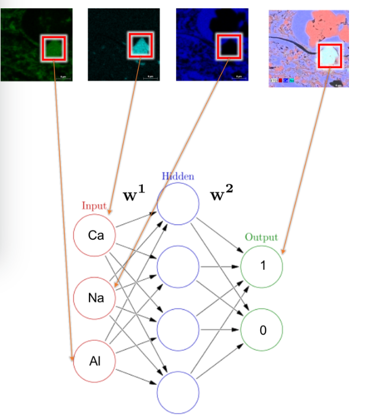
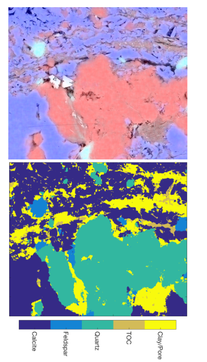

# 使用机器学习分割页岩 SEM 图像

2017年**SEG国际会议**

**SEG Technical Program**是**Society of Exploration Geophysicists (SEG)**的一个会议项目，它涵盖了地球物理学、岩土工程和工程地质等领域的技术和研究。每年，SEG都会举办一次国际会议，展示最新的地球物理技术和成果，并出版会议论文集。

---

数字岩石物理工作流程中的分割过程通常非常具有挑战性且耗时。在这里，我们提出了一种利用机器学习快速分割数字岩石物理图像的替代方法。岩芯样品的元素 SEM 图像作为神经网络的输入。然后网络输出像素属于某个类别的概率。分割是通过选择概率最高的类来实现的。该过程可以量化矿物相识别中的不确定性。训练算法后，可以快速分割图像的其余部分和后续图像。我们演示了具有六个不同相的页岩样本的分割过程

---

## 介绍

岩石的微观结构控制着其物理特性（Arns 等，2002）。岩心的实验室测量通常是这种微观结构信息的来源。然而，准确地进行这些测量可能很困难（Dvorkin 等，2008）。这些测量至关重要，因为它们用于校准岩石物理模型。该问题的一种解决方案是使用数字岩石物理（DRP）。 DRP 过程需要对岩心样本进行成像，然后对数字化岩石进行数值模拟。这些非破坏性实验可以深入了解孔隙尺度特征如何影响宏观特性（Andrä 等，2013）。各种研究证明了 DRP 对各种岩石特性的可行性，包括弹性（Andrä 等人，2013 年和 Makarynska 等人，2008 年）、渗透性（Dvorkin 等人，2011 年）和电导率（Sun 等人，2013 年） ）。

识别图像中的矿物相或分割的过程通常是数字岩石物理学中最困难但也是最重要的步骤。错误识别阶段可能会导致错误的结果。最广泛使用的分割过程使用***阈值方法、统计方法、区域生长和轮廓进化方法***（Fredrich et al., 2014）或上述方法的某种组合。目前，使用 DRP 的研究已在砂岩等相数相对较少的岩石上进行（例如，Madonna 等，2012）。在页岩等更复杂的岩石中，许多相（例如长石和石英）在视觉上看起来彼此相似，因此很难区分不同的矿物。在这种情况下阈值化会很困难，因为幅度直方图将包含不同相位之间的显着重叠。区域生长方法要求用户手动选择和识别要生长的种子区域。此外，传统的分割方法无法提供易于量化的不确定性度量

相反，我们建议，如果在成像过程中收集 SEM 元素图像，那么这些图像可以作为分割图像的机器学习算法的输入。机器学习方法的实施速度相对较快。一旦训练完成，同一样本中的其他图像就可以自动分割。机器学习方法还提供属于某一类别的矿物的概率，从而可以估计不确定性。我们在页岩样品上演示了这个过程

## 理论与方法

DRP 的第一步是获取样本的高分辨率图像。可以使用许多不同的成像技术，包括计算机断层扫描 (CT) 和扫描电子显微镜 (SEM)。对于页岩样品，需要更高的 SEM 分辨率来捕获纳米级特征，例如孔隙和有机物质（Rodriguez 等，2014）。 SEM 图像是通过将高能电子束聚焦在样品中的每个点上而得到的。电子束和样品表面之间的相互作用产生二次和背散射电子，用于对样品结构进行成像。这些相互作用还会产生 X 射线，当与能量色散 X 射线光谱 (EDS) 传感器配合使用时，可用于确定样品中存在的元素。元素组成可用于识别样品中存在的矿物质。

图 1a-1g 显示了为页岩样品收集的元素 SEM 图像的示例。我们对这些图像应用***双边滤波器以对图像进行去噪***，同时保留边缘（Tomasi 和 Manduchi，1998）。图 1h 显示了通过将***硅、钙和钠的元素图像相加而创建的 RGB 合成图像***。以前（即在灰度 CT 图像中）难以区分和分割的矿物质现在可以很好地分离出来。这些图像用于识别六种不同的矿物相（方解石、长石、石英、总有机物含量、粘土和孔隙空间）。例如，碳元素图像中存在大量碳，表明矿物分类应为有机含量。同样，铝、钠和硅的存在有助于区分长石和石英。显然，如RGB合成表明，各种元素和矿物类型（即化学式）之间存在某种关系。然而，不同元素图像之间的像素幅度之间的确切关系尚不清楚。幸运的是，监督机器学习是确定这种关系的一种非常合适的方法，使我们能够分割图像。

图 1：(a-g) 钠、硅、铝、硫、钾、碳和钙的元素 SEM 图像。 (h) 通过对元素图像进行求和而创建的 RGB 合成图像。从该图像中识别出六种不同的矿物相，包括：方解石（紫色）、长石（浅蓝色）、石英（粉色）、总有机物含量（黑色）和孔隙空间（黑色）

在监督学习中，目标是学习一个模型，该模型根据输入特征（例如，各种元素图像振幅）预测输出（例如，矿物相）。第一步是在输出标签已知的数据集上训练算法。在这项研究中，我们测试了神经网络在分割过程中的有效性。神经网络通过构建互连神经元网络来模仿大脑（图 2）。神经网络的第一层构成输入层，将训练特征输入其中。然后，我们添加隐藏层以形成输入层和输出层之间的关系。在隐藏层中，节点 z j 的值是从前一层连接到该节点的节点的输出 y i 的加权线性总和（公式 1）。然后将非线性激活函数（例如双曲正切，ReLU）应用于 z j（方程 2），从而允许神经网络捕获非线性关系（Schmidhuber，2015）。这些输出 y j 作为下一层的输入。在最后一层，softmax函数用于输出输入属于每个类别的概率。然后，我们将神经网络的输出与已知答案进行比较，并使用反向传播算法相应地调整权重。

其中： z j 是节点 j 的总输入 ，y i 是连接到节点 j 的单元 i 的输出 ，w ij 是权重项 y j 是从节点 j 到下一层的输出， f 是非线性激活函数。

为了创建训练数据集，我们手动选择了可以轻松识别矿物相的像素。神经网络的每个输入节点对应于每个图像中相同像素位置的元素图像强度（图 2）。对于正确的矿物相，输出层值为“1”，对于所有其他相，输出层值为“0”。随机选择部分训练数据 (15%) 被留作测试集。每个图像还被归一化为均值 0 和标准差 1。这避免了任何一个特征支配其他特征。训练后，将学习到的权重应用于测试集，以评估所选参数的性能（例如，每层中的节点数、隐藏层数、正则化参数）。使用一系列参数的网格搜索来决定最终模型。 F1 评分指标（公式 3）用于比较各种模型。 F1 分数是精确率和召回率之间的加权平均值。精确率定义为真阳性数与总阳性数（真和假）的比值，而召回率定义为检测概率（真阳性与假阳性和假阴性）。为了完美的召回率和精确率，F1 分数为等于 1。训练过程和模型选择的实现使用了一个名为 scikit-learn 的开源 Python 包。

由输入层、隐藏层和输出层组成的神经网络的示例架构。输入层由给定位置处的基本图像像素强度值组成，输出层包含给定分类的概率。 w 1 和w 2 表示通过优化过程从训练数据集中学习的权重。在此示例中，在输入层的所有元素图像中选择相同的像素。输出层应在节点中为方解石预测“1”，为所有其他矿物预测“0”

## 结果

很难区分孔隙空间和粘土，因此为了训练图像，将它们分为一个类别。图 3 显示了最佳参数选择的混淆矩阵。混淆矩阵将神经网络的预测与手动选取的真实标签进行比较。矩阵对角线上的值代表真阳性。非对角线值表示误报和漏报。总体而言，神经网络在方解石、长石、石英和总有机物含量 (TOC) 方面表现良好。当真实标签是方解石（混淆矩阵中的第一行）时，神经网络每次都正确预测方解石。当真正的标签是粘土/孔隙时，神经网络错误地将 78 个像素中的 10 个标记为石英。

图 3：混淆矩阵。 Y 轴是像素的真实矿物相，而 X 轴是神经网络预测的相。沿矩阵对角线的数字表示正确预测的像素数，而非对角线的数字表示假阳性和假阴性。如果第一行的第二列中有一个值，则表明方解石的像素被错误地预测为长石。如果第一列的最后一行中有一个值，则表明粘土/孔隙像素被错误标记为方解石。

图 4：给定像素位置处每个类别的概率。红色值表示属于某个类别的概率较高，而蓝色区域表示属于某个类别的概率较低。大多数矿物相在预测时的概率大于 90%，粘土/孔隙类除外

神经网络的输出层包含像素属于某个类别的概率（图 4）。这提供了分类过程中不确定性的度量。红色表示属于某个类别的概率较高，而蓝色表示属于某个类别的概率较低。沿着晶界可以看到“过渡区”，其中从一种相到另一种相的概率下降得非常快。这可能是由于在成像过程中完全解析颗粒与颗粒接触的限制。我们通过选择概率最高的类别来分割图像

图 5：使用神经网络对 SEM 图像进行分割的结果。图像中的颜色对应于各种矿物类型。图像的主要特征已被正确捕获，包括嵌入石英内的长石晶体以及有机材料的条纹

图 5 显示了分割过程的总体结果。总体而言，神经网络相当好地捕获了图像的主要特征。例如，右上角的大石英颗粒已被正确识别。此外，分割过程还捕获了有机物和大长石颗粒的条纹。图 6 显示了从训练过程中学到的权重应用于同一样本的不同图像。

图 6：（上）来自同一岩心样品内不同 SEM 图像的 RGB 合成图。 （下）应用从图 5 中学到的权重后的分割结果

图 6 的结果表明，从图 5 中的训练数据中学习到的权重可以应用于同一样本中其他位置的图像。

## 结论

机器学习是一种利用 EDS 元素图像分割 SEM 图像的有前途的方法。我们可以使用一些手动标记的示例来训练神经网络算法。一旦初始训练过程完成，自动分割图像的其余部分就会相对较快。我们还可以应用学习到的权重来分割同一样本中的其他图像。这允许在更多图像上运行 DRP 数值模拟，从而为样本的物理特性提供更具代表性的解决方案。其他图像的概率图可以表明存在尚未识别的其他矿物

然而，这个过程仍然受到图像分辨率以及图像本身质量（例如，条纹或其他成像伪影的存在）的限制。与其他分割方法一样，如果存在此类特征，则必须使用图像处理技术。我们遇到的主要挑战是正确识别训练算法时使用的矿物质。未来，还需进一步努力，正确区分粘土和孔隙之间。未来的工作还将测试其他机器学习算法和其他图像处理技术的有效性。
