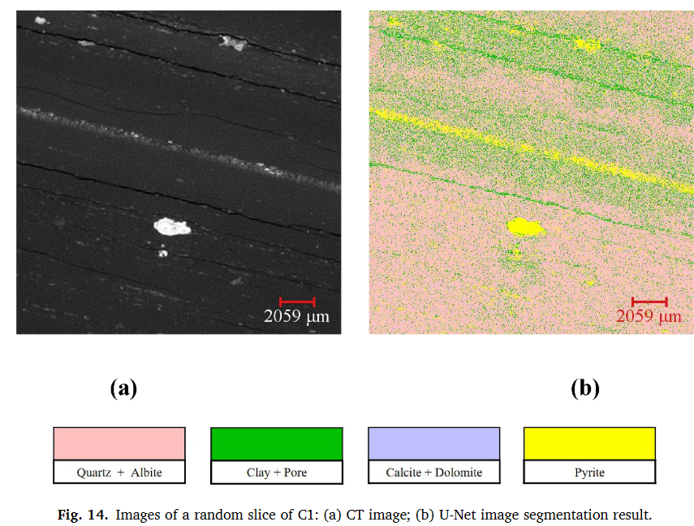

# 基于 CT 和 QEMSCAN 图像的页岩多成分数字岩石建模 U-Net 模型

多矿物成分岩心数字图像的建立是分析页岩矿物空间分布、对其物性进行数值模拟的前提。然而，利用现有技术手段直接获取3D多矿物成分数字岩心图像是一个挑战。对灰度岩心图像进行图像多阈值分割是获取多分量岩心图像的常用方法，但需要手动调整阈值，耗时且可能产生较大误差。本文为了准确、快速地建立多矿物成分的页岩数字岩心图像，以页岩CT图像为原始图像，相应的QEMSCAN图像为标签图像，训练U-Net模型并使用U-Net模型进行自动CT 图像分割，将灰度图像转换为多矿物成分图像。然后，添加手动分割的微孔和裂缝以形成最终模型。对构建的U-Net模型的图像分割效果进行了分析，在矿物含量、形态特征、空间结构等方面均取得了满意的结果。与传统方法相比，该方法避免了重复的人工调整，充分利用了CT图像和QEMSCAN图像中的信息，实现了快速自动分割，为多矿物成分岩心图像的建立提供了一种可行的途径。

---

本文unet 直接跑的模型

---

## 介绍

为了满足油气供应需求，页岩油气藏的勘探开发不断受到关注(Ma等，2021；Sun等，2021；Martyushev等，2022)。页岩主要由粘土级颗粒组成，矿物成分多样，孔隙结构复杂，渗透率低，易破裂（聂等，2016b）。页岩复杂的孔隙结构和矿物成分给其勘探开发带来了巨大的挑战(Zhu et al., 2022)。因此，需要一种精细的方法来表征页岩储层的结构和物性。常见的做法是对钻探取心获得的岩石样品进行不同的物理实验，以获得岩石的孔隙结构和弹性、电导率、渗流特征（Misbahuddin，2020）。对于页岩来说，其脆性给井下岩心钻探和实验所需柱塞的制备带来了一定的困难（朱等，2020）。另外，页岩孔隙度低、孔径小的特点使得物理实验耗时长；测量页岩电导率时也很难满足不同含水饱和度等实验条件。

随着计算机和各种扫描成像仪器的发展，利用数字图像反映岩心内部结构的数字岩石技术得到迅速发展，在石油勘探开发中发挥着日益突出的作用（Blunt等， 2013；杨等人，2019）。 3D数字岩心可以准确地描述研究岩石内部的孔隙结构，数字岩心图像为电性、弹性和渗流特性的数值模拟提供了基础（Ramstad等，2012；Nie等，2012）。 ，2019；Andhumoudine 等，2021；Tan 等，2021；Yang 等，2021；Liu 等，2022a）。目前，X射线计算机断层扫描（CT）是常用的3D数字岩心建模方法。其中，一组X射线当 X 射线穿过旋转的核心样本时，可以获得衰减图像。不同的材料导致X射线的衰减不同。基于具有衰减信息的图像重建3D岩心图像。然而，获得的图像是灰度的，可以在包括分割在内的后续处理后用于模拟（Arif et al., 2021）。图像分割就是根据图片中的颜色、形状等特征将图像划分为不同的区域，实现像素级分类（Garcia-Garcia et al., 2018）。通常将灰度图像分割成仅包含孔隙和骨架的二值图像（Andrâ等人，2013；Zhao等人，2020a）。然而，对于页岩等矿物成分复杂的岩石，不同矿物对渗流特征、岩石电导率和力学性能的影响至关重要(聂等，2016a；刘等，2018；朱等，2018；Nie等，2016a)。 ，2019）。因此，实际研究迫切需要包含多成分的岩心图像。目前，获取含有多种矿物成分的岩石二维标签图像的定量矿物成分分析技术（QEMSCAN）被广泛用于矿物分析（Pirrie等，2004；Liu等，2018）。* **QEMSCAN方法使用高能电子束扫描样品表面以获得背散射电子图像和每个像素的X射线强度，并将其与背散射图像的灰度和强度相结合通过X射线，可以得到不同元素的含量。通过将元素结果与矿物数据库进行比较，最终获得呈现矿物分布的二维图像。***

然而，直接获得包含各种矿物成分的3D岩心图像是一个挑战。存在不同的间接方法来构建 3D 多组件数字核心模型。例如，利用QEMSCAN图像中的2D矿物分布信息，可以利用随机方法生成3D多矿物数字岩心图像，其缺点是随机性强，并且可能不准确地表示样岩的内部结构（Nie等人，2016b)。另一种方法是通过应用多阈值分割将灰度数字岩心图像转换为包含不同矿物成分的标签图像。岩心的QEMSCAN图像可以作为同一岩心CT图像灰度的参考，以确定不同矿物的灰度值范围，并可以通过多阈值构建3D多矿物成分岩心分割（Liu et al., 2018；Li et al., 2019；Cui et al., 2020）。但该方法需要人为确定灰度值范围，耗时且需要一定的经验。之前的研究还强调了不同矿物的灰度值范围之间存在一定的重叠(Cui et al., 2020)，这可能会导致建模结果出现较大误差(Liu et al., 2022b)

机器学习技术已广泛应用于图像处理领域，例如图像分类、目标检测和人脸识别（Maier et al., 2019）。研究人员将BP神经网络、随机森林方法和支持向量机等多种机器学习方法引入扫描电子显微镜图像（SEM）和CT图像的分割中，结果显示了其快速性和准确性（Tang和Spikes，2017；Wu等人，2019；赵等人，2020b；李等人，2021）。然而，这些机器学习方法需要手动分析和提取图像特征。模型训练时使用的是像素级灰度值，操作复杂，而且结果也是逐像素的分类时未考虑相邻区域信息。

深度学习算法在图像分割方面的研究取得了重大突破（Asgari Taghanaki et al., 2021）。结果发现，对于复杂部件的图像分割，深度学习方法优于机器学习方法。此外，深度学习方法通常使用原始图像作为训练数据进行端到端训练，不需要复杂的特征提取（Li et al., 2021）。全卷积网络（FCN）可以在像素级别对任意尺寸的输入图像进行分类，对图像分割的研究起到了推动作用（Long et al., 2015）。其他网络如 SegNet (Badrinarayanan et al., 2017; Karimpouli and Tahmasebi, 2019)、U-Net (Ronneberger et al., 2015) 或 Deeplab (Chen et al., 2018) 在图像分割领域。比哈尼等人。 (2022)将DeepLab-v3+网络应用于泥页岩SEM图像分割，准确识别不同尺寸的孔隙和骨架

基于U-Net的图像分割方法在裂缝自动识别(Liu et al., 2021)、地震剖面跟踪(Xi et al., 2021)、矿屑图像分割(Liu et al., 2020)等方面具有优异的性能）。将深度学习算法应用于数字核心图像分割时面临的困难之一是可以获得的训练样本数量有限。 U-Net 在少量训练样本和复杂图像内容的医学图像分割中取得了惊人的性能（Ronneberger et al., 2015），并且缓解了训练数据较少的问题。在数字岩心领域，U-Net网络已被用于实现页岩SEM图像的自动分割（Chen等，2020）。王等人。 Wang等，2021，利用U-Net实现砂岩CT图像的自动图像分割，以灰度手动分割的3D CT图像作为标签集。李等人。 (2021)利用U-Net模型准确识别页岩SEM图像中的各种矿物

尽管人们对图像进行了大量的研究利用深度学习方法对岩心进行分割，研究对象多为矿物形态清晰、图像分辨率高、样本量小的二维图像。岩石物理实验总是基于英寸级岩心塞。然而，目前缺乏利用深度学习方法对3D英寸级页岩塞样本进行分割的研究。前期研究已经展示了U-Net网络在矿物识别领域的优势。因此，本文采用页岩CT图像作为训练图像，指定QEMSCAN图像作为相应的标签图像，并采用U-Net来训练岩心CT图像的自动分割。模型训练完成后，利用U-Net自动分割页岩CT图像，建立英寸级多矿物成分数字岩心模型

## 方法论和数据

### UNet

U-Net采用U形对称结构，这是一种经典的解码-编码结构，可以实现逐像素图像分割（Long等，2015）。 U-Net使用卷积层而不是全连接层，允许网络输入没有固定大小的训练图像。网络的输入是待分割的原始图像，输出是图像分割后包含像素类别信息的标签图像。网络左侧由卷积层和最大池化层组成编码器，对输入图像进行下采样以获得图像中的高维信息。网络右侧是由反卷积层和卷积层组成的解码器，通过上采样操作恢复图像中的信息。解码器和编码器通过多次跳跃连接操作来连接，以融合图像中的深层信息和浅层信息并充分利用这些信息。这不仅保证了图像分割的准确性，而且使解码器能够生成高质量的图像。本文使用的U-Net结构如图1所示，不同颜色的箭头代表卷积、最大池化、反卷积、跳过连接等操作。

### 工作流程

从图像数据采集到模型训练的相关工作流程如图2所示。

1. 获取页岩 CT 图像和 QEMSCAN 图像
2. 配准CT图像和QEMSCAN图像，并选择训练图像；
3. 确定划分的矿物类型，生成样本数据，划分为训练集和验证集；
4. 构建网络模型，并将训练集输入网络开始模型训练；
5. 每隔10个epoch，比较模型在训练集和验证集上的损失函数，并设置断点来检查模型的图像分割效果；
6. 当模型在训练集和验证集上的损失函数小于设定阈值时，训练完成，并保存网络模型和相关参数

### 数据采集

训练数据构成了中国西南四川盆地页岩气藏的数字岩心图像。岩心C1物理参数为：总有机碳含量（TOC）为5.02%，孔隙度为8.15%。矿物主要有石英、伊利石、方解石、白云石、黄铁矿等。首先，钻出直径为1英寸的塞子样品。为了保证生成的CT图像的质量，插头的两端被切平。采用Phoenix公司生产的V|Tome|X S型CT仪器对页岩样品进行扫描成像，获得分辨率为17.273 μm的CT图像。图3显示了所获得的岩心CT图像的二维和正交截面。

获得样品 C1 的 CT 图像后，从塞子上切下厚度约 5 mm 的芯部进行 QEMSCAN 成像，然后对塞子的一端进行机械加工。经过研磨、氩离子精抛光、喷碳处理，使其表面平整、导电。然后，获得横截面的QEMSCAN图像。图4为QEMSCAN的矿物分布图及各种矿物的体积分数，图像分辨率为25 μm。从图4中可以看出，黄铁矿明显以斑块和带状形式存在。图中颜色鲜艳的条带对应于密度较高的矿物。结合 QEMSCAN 图像，CT 图像中亮黄色的成分是黄铁矿。由图3可知，该样品矿物分布具有明显的层状特征，石英、黄铁矿、伊利石带明显。矿物分布高度非均质性，给页岩图像分割带来很大困难。

### 数据生成

一旦获得CT图像和QEMSCAN图像，首先要完成图像配准，即通过一系列的空间变换操作，使两幅图像的对应点在空间上一致。具体操作流程如下：

(1)选择3D CT图像中QEMSCAN图像对应的切片； 

(2)由于CT图像和QEMSCAN图像的分辨率不一致，采用Lanczos算法(Kumar et al., 2013)对CT图像进行重采样，使其分辨率与QEMSCAN图像一致；

(3)旋转CT图像和QEMSCAN图像，确保它们具有相同的角度

(4)利用互相关函数实现两幅图像的准确配准。黄铁矿在 CT 和 QEMSCAN 图像中都很突出且清晰。因此，选取其作为特征矿物，实现两幅图像的配准。互相关函数C用下图表示

其中 X 表示 M×N 矩阵； H 表示 P×Q 矩阵； C 表示 M + P-1 × N + Q-1 矩阵； k和l分别是矩阵的行和列； C(k,l)的值可以反映两幅图像X和H之间的相关性。当C(k,l)取最大值时，这意味着两幅图像中的特征点完全对应。此时，可以根据C(k，l)的索引值适当移动图像，完成精确匹配。图像配准结果如图所示

为了降低模型的复杂度，主要矿物根据 QEMSCAN 图像中有关物理性质的矿物信息进行合并。由于该分辨率下的CT和QEMSCAN图像中页岩孔隙不易识别，综合考虑页岩孔隙发育特征和粘土的电导率，将孔隙和粘土矿物结合起来。组合类别为石英+钠长石、方解石+白云石、粘土矿物+孔隙、黄铁矿。当使用 QEMSCAN 图像作为标记图像进行训练时，代表不同矿物的像素需要重新标记。矿物合并结果和相应的标签值如表1所示。完成图像配准工作后，从CT图像和分组的QEMSCAN标签图像中选择含有矿物分布特征的区域作为训练图像。本文使用的训练图像和测试图像如图6所示。在CT和标签图像中，红框内的部分用于训练，红框外的部分可用作测试设置验证分割效果。蓝色框中的区域是分析部分的测试样本。

为了获得足够的训练数据并保证训练数据包含矿物的分布特征，将用于网络训练的CT图像和QEMSCAN图像裁剪成128×128的尺寸，样本之间有重叠。最终获得1240个训练样本。在网络训练步骤中，训练图像按照8:1的比例分为训练集和验证集。图7显示了一些CT和QEMSCAN训练样本（QEMSCAN图像和CT图像都是8位灰度图像。为了显示效果，QEMSCAN图像以彩色显示）。使用的CT图像是0-255范围内的灰度图像，QENSCAN图像是t中的标签图像

### 网络结构与训练

本文的网络模型是在Pytorch 1.9环境下构建的。该计算机配置为 Windows 10 64 位系统，具有 64 GB 内存和 Intel(R) Core (TM) i5-10500 CPU @ 3.10 GHz。在网络训练步骤中，使用Rmsprop优化器来优化网络参数，并使用交叉熵函数作为损失函数。网络训练中的学习率设置为0.001。每次总共放入32个样本到网络中，训练次数设置为350次。图8展示了训练过程中训练集和验证集上损失函数随历元的变化

## 结果与分析

### u-net 分割结果

训练完成后，将二维CT图像切片输入到网络模型中，自动分割后得到标记图像。由于在训练数据匹配过程中对 CT 图像进行了重采样，因此在输入模型之前对输入的 CT 图像进行重新拍摄，以确保它们具有与训练图像相同的分辨率

从用于训练的C1的CT图像切片中截取S1样本，用于分析模型的图像分割效果，样本大小为400×400。S1样本使用U-Net和灰度作为标准多分割阈值分割方法。将自动图像分割和多阈值分割得到的结果与S1样品的QEMSCAN图像在矿物含量、分布特征、变异函数和自相关函数等方面进行比较

U-Net分割结果、多阈值分割结果以及QEMSCAN图像中矿物质含量如表2所示。S1样本的CT图像、U-Net分割结果、多阈值分割结果以及QEMSCAN图像为显示在

### 训练数据集结果

分割结果和多阈值分割结果都非常接近QEMSCAN。这说明，就矿物质含量而言，U-Net和多阈值分割都可以取得不错的效果。

  S1样本的CT图像、U-Net分割结果、多阈值分割结果和QEMSCAN图像的比较：（a）CT图像； (b) U-Net图像分割结果； (c) 多阈值分割结果； (d) QEMSCAN 图像

从图 9 可以看出，CT 图像中裂隙和黄铁矿特征明显，与其他矿物没有明显区别。 U-Net 和多阈值分割在黄铁矿和裂缝的识别上都能取得较好的效果。至于其他三组矿物，由于其复杂的接触关系和分布特征，多阈值分割的结果与QEMSCAN图像的结果存在较大差异。在灰度值差异不显着的区域中，U-Net 分割结果与 QEMSCAN 图像非常吻合。从而能够准确地描述矿物成分的分布及其之间的联系关系

U-Net分割结果、QEMSCAN图像和S1的多阈值分割结果中各分量的垂直变异函数和自相关函数：(a) Quartz； (b) 粘土矿物+孔隙； (c)方解石+白云石； (d) 黄铁矿

变异函数和自相关函数可以直观地显示核心空间结构在一定方向上的变化特征(Zhang et al., 2021)。函数曲线的形状反映了连续性。一般来说，对于总含量相同的组分，函数曲线的形状越平缓，组分的连续性越好。图10显示了上述两幅图像分割结果和QEMSCAN图像中各矿物组的垂直变异函数和自相关函数。图9中不同成分在水平方向上表现出良好的连续性，因此主要在垂直方向上分析各矿物的变差函数和自相关函数。 U-Net分割的各种矿物的变差函数和自相关函数与QEMSCAN图像吻合，而多阈值分割的结果与其有较大差异。这说明 U-Net 分割后各种矿物的分布特征与页岩中各种矿物的分布特征是一致的

### 测试数据集结果

经过训练集的对比，分析U-Net对测试样本的分割效果。图11展示了模型在测试集中T1和T2两个区域上的分割结果。

T3的矿物质成分含量与训练集有较大差异。因此，从矿物形态、含量、变异函数和自相关等方面分析了T3的分割效果。因此，表 3 显示了 T3 的 4 个矿物组的含量。此外，图13显示了T3的变异函数和自相关比较。从图13和表3可以看出，U-Net分割的矿物成分含量和分布都比多阈值方法更接近QEMSCAN

T1和T2图像对比：(a)T1的CT图像； (b) T1的U-Net图像分割结果； (c) T1 的 QEMSCAN 图像； (d) T2的CT图像； (e) T2的U-Net图像分割结果； (f) T2 的 QEMSCAN 图像

T3图像对比：（a）CT图像； (b) U-Net图像分割结果； (c) 多阈值分割结果； (d) QEMSCAN 图像

### 随机切片结果分析

为了查看U-Net自动分割对该岩心其他切片的效果，从C1岩心的CT图像中随机选择一个800×800大小的切片并输入到网络模型中。模型分割结果如图 14所示。图中，CT图像中的亮黄色斑点和亮带与分割图像中黄铁矿的分布一致。模型训练时将孔隙和粘土矿物合并，将CT图像中的裂缝划分为粘土矿物，结果正确。在同一核心上未经训练的CT灰度图像上也能取得满意的图像分割结果，证明了该方法在整个3D核心上的可靠性

### 3D 多矿物成分核心建模

为了构建3D数字岩心模型，将3D数字岩心保存为沿特定方向的一系列2D切片图像，随后使用U-Net模型对2D图像集进行图像分割。分割后，可以获得一系列 2D 标签图像并重新加载以重建 3D 多矿物成分岩心图像。在模型训练过程之前，将孔隙和粘土矿物结合起来。因此，为了保留岩心塞中的裂缝，需要将裂缝手动分割并添加到多矿物成分模式中。含裂缝C1最终3D多矿物成分数字岩心模型的部分结果如图15所示。图中黑色部分代表微孔和裂缝。在矿物形态和空间连续性方面，CT图像与多矿物成分图像吻合良好。

C1部分3D图像：（a）3D CT图像； (b) CT正交断面图像； (c) 3D 多矿物成分岩心图像； (d) 多矿物成分岩心正交截面图像

为了测试所提出的方法对不同岩心的适用性，收集了来自不同地层的新页岩岩心 C2。获取其CT和QEMSCAN图像，并通过U-Net模型过程与C1相同。 C2矿物以石英+钠长石、伊利石、方解石+白云石为主，含少量黄铁矿。 C2部分3D建模结果如图16所示，表明该U-Net分割方法适用于CT和QEMSCAN图像的岩心

### 讨论该模型对其他核的适用性

上面已经证明了训练好的U-Net模型对训练核心的适用性。为了测试它是否适用于不同的核心，将使用 C1 数据训练的 U-Net 模型应用于 C2。使用训练好的U-Net模型对这个样本进行分割的结果，由于岩心 CT 图像之间的灰度差异和巨大的矿物含量差异，明亮部分被确定为黄铁矿，而不是实际的矿物石英。也就是说，如果将训练好的 U-Net 模型应用到与训练核心有很大不同的另一个核心上，则不会取得良好的结果。因此，有必要使用新核心的 QEMSCAN 图像来训练新模型。这也表明，在获取不同层理非均质性较强的岩石的QEMSCAN图像时，最好选择垂直于层理面的表面，而不是平行于层理面的表面；当表面垂直于层理面时，可以很好地覆盖岩心不同层理中的矿物成分分布。另一方面，如果与层理平面平行，则 QEMSCAN 图像只能反映一个层理的成分属性

## 结论

多矿物成分数字岩心模型的获得对于数字岩心技术范围内页岩的应用具有重要意义。本文采用 U-Net 模型实现了将页岩 CT 图像准确、快速地转换为含有多种矿物成分的岩心图像的目标，得到以下结论：

（1）通过将页岩 CT 图像与相应的QEMS-CAN图像并训练U-Net模型，可以实现CT图像的自动分割。 

（2）与多阈值分割结果对比表明，使用U-Net模型不仅在矿物含量方面取得了满意的结果，而且保留了实际页岩岩心矿物的分布和空间结构。此外，还可以添加手动分段的微孔和裂缝以形成最终的多组分岩心塞模型。

 (3) 如果训练后的模型与训练核心有很大不同，则无法很好地服务于其他核心。 CT 图像的矿物含量和灰度值差异较大是造成这种限制的主要原因。

 (4) CT和QEMSCAN成像是权衡过程。由于成像样本尺寸较大，图像的分辨率较低，低于该分辨率的信息无法在图像中反映出来。本研究中CT和QEMSCAN图像分辨率较低，无法反映毛孔情况。然而，它可能是多尺度建模过程中可以与核心实验进行比较的核心尺度模型。不同矿物中的纳米孔可以通过提供更高分辨率的成像技术来获取。下一步，我们的目标是考虑将CT图像和其他具有更高分辨率和更精细的QEMSCAN图像的图像相结合，以实现多尺度、多分量的数字岩心建模
