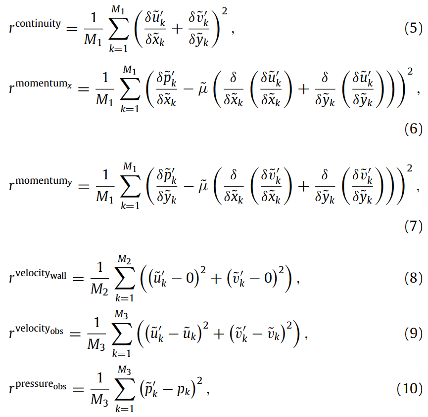

# 通过稀疏观测和基于物理的 PointNet 预测多孔介质中的流体流动

数据集：https://github.com/Ali-Stanford/PhysicsInformedPointNetPorousMedia

代码：https://github.com/Ali-Stanford/PhysicsInformedPointNetPorousMedia

主要内容：

Neural Networks *9.6*

23年

---

我们使用稀疏点观测和一类新型物理信息神经网络（称为“物理信息点网physics-informed PointNet”（PIPN））来预测孔隙尺度下多孔介质内流体的稳态斯托克斯流。考虑到 PIPN 的优势，与用于多孔介质应用的物理信息卷积神经网络相比，PIPN 具有三个新功能。首先，PIPN 的输入完全是多孔介质的孔隙空间（而不是孔隙和颗粒空间）。此功能减少了所需的计算机内存。其次，PIPN 平滑且真实地表示孔隙空间的边界（而不是逐像素表示）。第三，空间分辨率可以在物理域上变化（而不是等距分辨率）。此功能使用户能够以最小的计算成本达到最佳分辨率。我们的框架的性能是通过研究噪声传感器数据、压力观测和空间相关长度的影响来评估的

---

## 1.介绍和动机

自 2018 年代末以来，深度学习方案在多孔介质各个方面的研究中变得流行。例如岩石图像分割（Da Wang, Shabaninejad, Armstrong, & Mostaghimi, 2020; Karimpouli & Tahmasebi, 2019b; Niu, Mostaghimi, Shabaninejad, Swietojanski, & Armstrong, 2020; Phan, Ruspini, & Lindseth, 2021）；岩石图像分辨率的重建和增强(Da Wang, Armstrong, & Mostaghimi, 2019; Liu & Mukerji, 2022; Niu et al., 2021; Wang, Armstrong, & Mostaghimi, 2020);孔隙率等几何特征的预测（Alqahtani、Alzubaidi、Armstrong、Swietojanski 和 Mostaghimi，2020；Bordignon、Figueiredo、Exterkoetter、Rodrigues 和 Correia，2019；Graczyk 和 Matyka，2020）；物理性质的预测，例如渗透率（Al-Zubaidi et al., 2023；Graczyk & Matyka, 2020；Hong & Liu, 2020；Kashefi & Mukerji, 2021；Wu, Yin, & Xiao, 2018）、有效扩散率（Wu et al., 2023；Graczyk & Matyka, 2020； al.，2018），波传播速度（Karimpouli 和 Tahmasebi，2019a）；孔隙空间内流体速度和压力场的预测（Alhubail, He, AlSinan, Kwak, & Hoteit, 2022; Kamrava, Sahimi, & Tahmasebi, 2021; Lu et al., 2022; Santos et al., 2020; Tartakovsky ，Marrero、Perdikaris、Tartakovsky 和 Barajas-Solano，2018；Wang、Chen、Mehana、Lubbers、Bennett 和 Kang）我们当前研究的重点是最后一个——流体速度和压力的预测。根据文献，迄今为止，使用可用的深度学习算法预测多孔介质孔隙空间中的流体流场已采用三种主要方法。

第一种方法属于监督学习类别，其中使用的深度学习框架没有有关描述多孔介质内流体流场的物理信息（Santos 等人，2020；Wang，Chung 等人，2021）。在这种方法中，使用数值求解器（例如，格子玻尔兹曼、有限元、有限体积和快速傅立叶变换方法）生成大量标记数据，或者从实验室实验收集大量标记数据，用于训练深度学习框架以学习端到端的方法。 -***从多孔介质的几何形状到其速度或压力场的最终映射。***这种方法通常使用卷积神经网络（CNN）。这些深度学习框架的损失函数是基于神经网络预测值与训练标记数据（即地面实况）之间的不匹配而设计的，并以 L2 范数或其他范数进行数学量化

第二种方法也属于监督学习的范畴；然而，所采用的深度学习框架是由问题物理学“引导”的（Kamrava et al., 2021；Wang, Chen, et al., 2021）。更准确地说，这种方法中的损失函数与第一种方法中指定的损失函数类似，不同之处在于它是***通过表示偏微分方程残差的 L2 范数（或其他范数）的额外项进行正则化的（ PDE***），控制着流体流动的物理现象多孔介质。从技术上讲，感兴趣的偏微分方程通过有限差分方案离散化，然后将相应的模板强制执行到 CNN 最后一层的不可训练滤波器中。与第一种方法相比，第二种方法收敛速度更快，更通用，并且最后需要“相对”更小的标记训练数据。可以参考 Kamrava 等人。 (2021) 以及王、陈等人。 （2021）对此比较的详细讨论。

然而，尽管这两种方法取得了成功，但它们也存在一些缺点。首先，两者都需要大量的训练数据。这是因为生成和收集标记数据在计算和实验上都是昂贵的。其次，这两种方法中使用的 CNN 都将颗粒和孔隙空间作为网络输入和输出，而我们只在流体存在的多孔介质的孔隙空间中寻求网络预测。将固体颗粒空间集成到 CNN 中需要额外的内存（即 RAM）。第三，由于这两种方法都采用 CNN，因此用于训练的标记数据必须采用具有均匀间距的笛卡尔网格格式。这种格式可能会导致孔隙空间几何形状的不切实际的表示，特别是在孔隙-颗粒边界附近。此外，如果在非结构化网格上使用有限元/体积方法生成标记数据，则必须在均匀笛卡尔网格上对生成的数据进行插值。这种插值会给训练数据带来误差，从而给网络预测带来误差。此外，即使在训练 CNN 之前，执行插值也需要额外的努力。第四，CNN 在技术上是为统一分辨率而设计的。因此，为了提高孔隙空间中感兴趣区域的分辨率，这两种方法的用户除了提高域中各处的笛卡尔网格分辨率外别无选择。这种不灵活性给这两种方法的机器学习系统带来了高昂的计算成本。接下来我们讨论解决和改进上述局限性的第三种方法

第三种方法属于弱监督学习的范畴，主要基于物理信息神经网络（PINN）的思想构建。 PINN 最初由 Raissi、Perdikaris 和 Karniadakis (2019) 提出，用于解决正向和逆向问题，其后来的版本具有各种增强和扩展功能，例如 fPINN (Pang, Lu, & Karniadakis, 2019)、 nPINN（Pang、D'Elia、Parks 和 Karniadakis，2020）、B-PINN（Yang、Meng 和 Karniadakis，2021）、hp-VPINN（Kharazmi、Zhang 和 Karniadakis，2021）、PPINN（Meng、Li、张，＆Karniadakis，2020），PIPN（Kashefi＆Mukerji，2022）等。在基于PINN的方法中，损失函数主要是多孔流体流场控制方程残差的L2范数（或其他范数）媒体，由神经网络预测和稀疏分散标记数据之间不匹配的 L2 范数调节。通过多孔介质的透镜，PINN 已被使用，但仅用于预测现场尺度的达西流（Alhubail 等人，2022 年；Tartakovsky 等人，2018 年）。在当前的研究中，我们首次使用***物理信息神经网络的概念来预测多孔介质中孔隙尺度的斯托克斯流。***具体来说，我们使用 PIPN (Kashefi & Mukerji, 2022) 作为 PINN 的高级版本。 Kashefi 和 Mukerji (2022) 详细阐述了 PIPN 的显着优势。使用PIPN技术，消除了前两种方法的所有上述缺点。基于 PIPN 的基础数学，只需要稀疏分散的标记数据。我们专门用一组分散的点云对孔隙空间进行离散化，其中点分布的空间密度可以在空间上自由变化。这种自由度允许用户平滑、真实地表示孔隙空间及其边界的几何形状。此外，PIPN（Kashefi & Mukerji，2022）框架可以方便地与非结构化网格，不需要数据插值。在本文的其余部分中，我们将实际说明这些功能。此外，我们探讨了应用 PIPN 时的一些实际问题，例如（i）稀疏传感器上可用数据类型的影响（有或没有压力数据）； (ii) 噪声传感器数据的影响； (iii) 传感器位置稀疏性的影响

## 2.用于多孔介质中斯托克斯流的物理信息 PointNet (PIPN)

### 2.1方程和数学定义

我们首先描述控制孔隙尺度多孔介质中流体流场物理的偏微分方程。牛顿流体不可压缩稳定蠕动（斯托克斯）流的质量守恒和动量守恒分别写为：

其中u和p分别表示动粘度为μ的流体的速度矢量和压力。多孔介质的孔隙空间用 V 表示。我们进一步分别用 u 和 v 表示速度矢量的 x 和 y 分量。请注意，人们也可以考虑完整的纳维-斯托克斯方程（参见 Hassanizadeh & Gray，1987）。多孔介质在 x 方向的渗透率 (K) 按 Berg (2014)、Darcy (1856) 和 Eshghinejadfard、Daróczy、Janiga 和 Thévenin (2016) 计算

其中 U 是多孔介质整个空间的平均 x 速度。 Δp/L 项表示在多孔介质 x 方向的长度 L 上施加的恒定压力梯度。

从数学上讲，我们的目标是使用 PIPN 解决斯托克斯流的逆问题。它可以描述如下：***给定壁边界上没有滑移边界条件以及传感器位置处的速度场和压力场的一组稀疏标记数据，******找到查询点处的完整速度场和压力场***。此外，我们使用预测的速度场计算多孔介质的渗透率

### 2.2物理信息点网 (PIPN)

图 1. 多孔介质中斯托克斯流的物理信息点网 (PIPN) 示意图。损失函数的完整描述如方程式所示。 (5)–(11)

从历史上看，Kashefi、Rempe 和 Guibas（2021）首次使用点网（Qi、Su、Mo 和 Guibas，2017）对不规则几何形状上的不可压缩流进行监督深度学习。将 PointNet（Qi 等人，2017）应用到计算力学领域的成功促使 Kashefi 和 Mukerji（2022）提出了基于物理的 PointNet（PIPN），这是一种用于不可压缩流的弱监督深度学习框架。 Kashefi 和 Mukerji (2022) 详细阐述了 PIPN 方法。在这里，我们从一般角度说明 PIPN 框架，并解释如何将其专门用于多孔介质应用。图1描绘了PIPN的总体流程图。因此，多孔介质的空间 (V ) 由 N 个点表示，每个点都有空间 x 和 y 坐标。在下一阶段，我们将构建的点云输入 PointNet (Qi et al., 2017)，而 PointNet (Qi et al., 2017) 的输出是速度 (u, v) 和压力 (p) 值相应的输入点。然后，我们使用自动微分计算输出 (u, v, p) 相对于相应输入 (x, y) 的空间导数TensorFlow 技术（Abadi 等人，2016）。最后，我们将 PIPN 的损失函数构建为控制方程（方程（1）-（2））残差的总和以及预测输出和稀疏标记数据之间的不匹配，所有这些都以 L2 范数进行量化。与 Kashefi 和 Mukerji (2022) 提出的 PIPN 原始版本类似，我们使用双曲正切激活函数，定义为

在 PIPN 的所有层中。请注意，由于方程中速度场的二阶导数的存在。 (2)，选择具有明确二阶导数的激活函数至关重要。双曲正切激活函数满足此标准。

质量守恒的残差（r连续性），x方向动量守恒（r momentum x）和y方向（r momentum y），速度的无滑移边界条件（r velocity wall），稀疏观测速度场 (r velocity obs ) 和压力场 (r Pressure obs ) 分别写为

其中 δ 代表 TensorFlow 软件中的自动微分算子（Abadi 等人，2016）。内部点、位于墙壁边界上的点以及测量速度和压力值的虚拟传感器的数量分别由M1、M2和M3表示。请注意，M1 + M2 = N

我们对速度场和压力场的输出进行归一化，因为双曲激活函数的输出（参见方程（4））仅覆盖[−1, 1]的范围。缩放后的地面真实速度和压力值由 (~u, ~v, ~p) 显示，而 PIPN 预测的速度和压力场由 (~u′v′，~p′）。此外，x 和 y（作为 PIPN 输入）的空间坐标在 [−1, 1] 范围内缩放，并分别由 ~x 和 ~y 表示。此外，~μ 是标度粘度。从这个意义上讲，损失函数（J）的最终形式确定为

其中 λi (1 ≤ i ≤ 6) 是损失函数每个分量对应的权重，而它们将相关残差的单位的倒数作为自己的单位。这样，损失函数（J）是无单位的。这些权重 (λi; 1 ≤ i ≤ 6) 实际上是需要调整的超参数，以达到 PIPN 的最高性能。在本研究中，λi 在训练过程中保持恒定；然而，我们可以在网络训练时使用自适应技术在线调整 λi

### 2.3计算设置

对于下面的数值示例，设置了动粘度 µ = 0.001 Pa·s，在 L = 0.0064 m 长度上的压差 Δp = 0.1 Pa。我们使用截断高斯算法生成二维合成二元（孔粒）介质，两个维度的长度（L）均为 0.0064 m，三个不同的空间相关长度（lc）分别为 0.0005 m、0.0009 m 和 0.0017 m模拟（Lantuéjoul，2001；Xu & Journel，1993）。实际上，我们首先从正态分布中生成一个二维随机数数组（64 x 64），平均参数为 0.0，标准差为 1.0。接下来，我们使用标准差为 2.0 的二维高斯平滑内核对数组进行滤波，滤波器大小等于所需的空间相关长度（例如 5、9 或 17）。最后，我们使用阈值将生成的数组二进制化，以使孔隙率落在 [0.25, 0.40] 的范围内。为此，我们使用 MATLAB 软件。然后，我们将生成的图像（即二维数组）转换为标准曲面细分语言 (STL) 格式，以便 COMSOL 软件可以读取它。通过减小空间相关长度，多孔介质的几何形状变得更加复杂，并且点云中表示相应多孔介质空间的点的数量同样增加，这给PIPN系统带来了更高的计算成本。从这个意义上说，PIPN 功能已针对各种复杂程度进行了验证

表一提供传感器点占点云点总数的比例（M3/N）以及传感器彼此之间的平均空间距离（ds）。请注意，传感器位置（见图 2）比 PIPN 的点云（见图 3）输入稀疏。此外，点云（见图3）具有空间变化的点密度，边界处的点较密集，孔喉较窄

一般来说，由于壁上的流动以零速度移动（即无滑移条件），因此速度壁必须具有较小的权重与其他残差相比；否则，PIPN 在所有域处都收敛于零的表面解。从这个意义上说，对于本研究中研究的多孔介质，我们设置λ1 = 100 s，λ2 = 100 m3/N，λ3 = 100 m3/N，λ5 = 100 s/m，λ6 = 100 m2/N，并且λ4 = 1 秒/米

我们使用 Adam 优化器（Kingma & Ba，2014）来训练 PIPN 配置，并将其相关的超参数设置如下：β1 = 0.9、β2 = 0.999 和 ϵ = 10−6。关于这些超参数的定义可以参考 Kingma 和 Ba (2014)。此外，对于本研究信中考虑的所有多孔介质，选择恒定学习率 α = 0.0003。执行PIPN的训练直到满足J≤0.0025的条件。机器学习计算在内存时钟频率为 1.38 GHz 的 TESLA V100 显卡上执行。为了验证 PIPN 的预测并在虚拟传感器位置生成稀疏标记数据，我们使用 COMSOL 软件（参见 Azad, Li, Verba, Ideker, & Isgor, 2016；Jafari, Vahab, Broumand, & Khalili, 2023；Pirnia, Duhaime、Ethier 和 Dubé，2019；Shi、Rui、Xu、Wang 和 Wang，2022）来解决方程 1。 (1)–(2) 使用有限元方法（参见 Kashefi，2020；Kashefi & Staples，2018）。或者，稀疏观测实际上可以通过实验室实验技术获得（Bultreys et al., 2022; Karlsons et al., 2022; Sabbagh, Kazemi, Soltani, & Nobes, 2020）。此外，生成的有限元网格的网格顶点被用来构建点云作为PIPN的输入

最后，我们谈两点。首先，PIPN 主要是为了同时预测多组不规则几何上所需偏微分方程的解而设计的。在这项研究中然而，我们使用 PIPN 来预测单个几何结构上的多孔介质流动。从概念上讲，人们甚至可以使用常规 PINN 来实现此目的。尽管如此，Kashefi 和 Mukerji (2022) 表明，与常规 PINN 相比，PIPN 更稳定，即使在单个几何体上进行训练也需要更少的查询点 (N)。这两个功能默认会降低计算成本。人们可以参考 Kashefi 和 Mukerji (2022) 的第 4.1.6 节来对 PIPN 和常规 PINN 进行全面比较。其次，PIPN的大小是可扩展的，可以根据查询点（N）的大小方便地进行调整。例如，在本研究中，我们对空间相关长度较小的多孔介质使用相对较大的 PIPN。

## 3.结果与讨论

### 3.1一般分析

对于空间相关长度 (lc ) 分别为 1.7 mm、0.9 mm 和 0.5 mm 的多孔介质，对速度场和压力场的地面实况与 PIPN 预测进行了视觉比较。 4-6。总而言之，在点云位置处观察到预测与地面实况之间具有良好的一致性。在所有三种情况下，速度场的最大局部误差发生在最窄的瓶颈处，即流动加速的地方。这一观察结果凸显了在这些位置使用足够数量的传感器进行精确测量的重要性。技术上；然而，只有当最窄通道中的空间尚未达到时，这才是可能的。足够大。据推测，如果特定情况并非如此，我们会建议一种潜在的技术来应对这一挑战，如下所示。获得 PIPN 预测的速度场后，可以使用该预测解作为数值经典求解器（例如 COMSOL）的初始猜测并执行求解器。请注意，由于 PIPN 的预测误差水平较低（如图 4-6 所示），因此求解器可能只需要几次迭代即可收敛，并提高最窄瓶颈中速度场的准确性

由于强制 PIPN 满足相同的标准（即 J ≤ 0.0025），所有三种多孔介质的速度场精度阶数大致相同。然而，具有较短空间相关长度（lc）的多孔介质由于具有更多的查询数量和更复杂的几何形状而需要更多的迭代次数，如表2所示。请注意，每个历元消耗的墙时间为a - 对于所研究的所有三种多孔介质几乎相等。这是因为 TensorFlow (Abadi et al., 2016) 软件在训练开始时仅构建一次计算图，并在其余训练中使用它进行计算。事实上，虽然通过减少空间相关长度，计算图变得更加复杂，但每次迭代（即每个时期）的计算量仅略有（几秒）增强，因为 TensorFlow（Abadi 等人，2016）只是更新了中的数字之前构建的图来计算损失值

为了更精确地验证 PIPN 性能，我们在表 2 中列出了 PIPN 预测的相对逐点误差（L2 范数）。因此，速度场的相对误差为大约在15%到19%之间。在所有情况下，与压力场相比，预测的速度场会出现更高水平的误差，因为压力在 x 方向上简单地线性减小，而速度模式则更为复杂。此外，速度矢量涉及质量平衡和动量平衡，而压力仅在动量方程（式（2））中起作用。根据表2，三种情况下，由预测速度场得出的多孔介质渗透率（见式（3））的相对误差均小于5%。请注意，传感器彼此之间的平均空间距离 (ds) 表示我们观察到的每种多孔介质的信息水平。对于lc = 1.7 mm和lc = 0.9 mm的多孔介质，ds = 0.237 mm，而对于lc = 0.5 mm的多孔介质，ds = 0.16 mm。因此，与其他两种介质相比，我们观察到 lc = 0.5 mm 介质的更多信息。如前所述，这些报告的 ds 是满足 PIPN 收敛标准的最大可能距离（即 J ≤ 0.0025）

### 3.2稀疏压力观测的影响

接下来，我们研究压力观测对 PIPN 预测精度的影响。这项研究非常重要且关键，因为由于技术困难或昂贵的实验室实验等各种原因，可能无法获得对压力场的稀疏观测。为此，我们通过删除压力观测残差 rPressureobs 来修改损失函数，在损失函数中产生

与上一小节类似，我们设置 λ1 = 100 s，λ2 = 100 m3/N，λ3 = 100 m3/N，λ5 = 100 s/m，λ4 = 1 s/m。我们针对空间相关长度为 lc = 1.7 mm、lc = 0.9 mm、lc = 0.5 mm 的多孔介质进行了机器学习实验；结果列于表三

例如，让我们讨论空间相关长度 lc = 1.7 mm 的多孔介质获得的结果。经过此修改，x 和 y 方向上预测速度场和预测压力场的相对误差分别变为 1.43444E−1、1.71549E−1 和 1.25499。我们观察到，虽然预测压力场的相对误差极大地增加（667.024%），但预测速度场的精度基本保持不变。 Kashefi 和 Mukerji (2022) 对自然对流问题也进行了类似的观察。 Kashefi 和 Mukerji (2022) 的第 4.2.1 节从应用数学和机器学习的角度详细阐述了这一证据的原因。但简而言之，可以解释如下。 PIPN 能够保持数据的准确性斯托克斯方程（方程（1）-（2））中没有压力观测值时的压力梯度。 PIPN 的这一特征依赖于这样一个事实：压力是稳定 Stokes 方程中的隐式变量（Timmermans、Minev 和 Van De Vosse，1996）。对于空间相关长度 lc = 0.9 mm 和 lc = 0.5 mm 的多孔介质，可以观察到并实现类似的信息，如下所示

通过比较表 2 和表 3 中提供的信息，当前测试用例的收敛满足所需的迭代（即历元）数量有所减少。这是因为通过从损失函数中删除压力观测残差 (rPressureobs )，PIPN 损失函数的限制变得更小。此外，由于 PIPN 损失函数中省略了压力项，因此与损失函数相关的计算图变得稍微不那么复杂，因此，每次迭代（即历元）花费的墙时间略有减少。

总而言之，本小节中讨论的输出表明，即使在没有稀疏压力数据的情况下，PIPN 方法也能成功可靠地预测多孔介质的速度场

### 3.3噪声数据的影响

传感器测量通常受到噪声污染。例如，为了模拟这种情况，我们将 5% 随机高斯噪声添加到多孔介质所有传感器位置的速度和压力观测值中，空间相关长度为 lc =1.7 毫米，lc = 0.9 毫米，lc = 0.5 毫米。结果及误差分析见表4

从表4的信息可以看出，由于稀疏数据中添加了噪声，预测的速度和压力场的误差增大。例如，考虑空间相关长度 lc = 1.7 mm 的多孔介质，预测的速度 u 分量、速度 v 分量和压力场的相对点误差（L2 范数）分别变为 2.04158E−1 、2.16941E−1和2.58180E−2，表明与无噪声数据获得的结果相比增加了16.278%、6.983%和25.110%（见表2和表4）

由于噪声的存在，PIPN损失函数无法满足收敛准则（即J≤0.0025），这就是为什么与无噪声的深度学习实验相比，PIPN预测具有更高水平的误差数据（见表2和表4）。在实践中，我们继续训练过程，直到损失值达到稳定水平。表 4 列出了每种多孔介质相应的迭代次数。通过比较表 2 和表 4，可以发现，达到平稳状态（在有噪声数据的情况下）的迭代次数要大于满足收敛标准（在干净数据的情况下）所需的迭代次数，表明噪声数据需要 PIPN 深度学习求解器更多的计算成本。话虽如此，表 4 中提到的所有多孔介质的速度和压力变量的相对逐点误差（L2 范数）小于大约 22%。总的来说，得出的结论是，即使在在多孔介质中观察到存在噪声传感器数据

### 3.4传感器平均空间距离的影响

在本节中，研究了传感器的平均空间距离 (ds) 对 PIPN 预测精度的影响。为此，我们在图 7 中绘制了空间相关长度 lc = 17 mm、lc = 9 mm 和 lc = 5 mm 的多孔介质的相对点误差（L2 范数）作为 ds 的函数。从图 7 中可以看出，通过增加 ds（即减少传感器数量），相对逐点误差（L2 范数）会增加。例如，在空间相关长度 (lc ) 为 17 mm 的多孔介质中，通过将 ds 从 0.237 mm 增加到 0.534 mm，x 方向速度的相对点误差（L2 范数）、y 方向速度，压力场大约增加了270%、212%和132%。事实上，图 7 中绘制的结果反映了稀疏观测值对 PIPN 输出准确性的重要性。

现在的问题是，通过增加 ds ，多孔介质域中的预测误差如何在空间上增长？为了回答这个问题，我们展示了 PIPN 方法在不同 ds 值下预测的速度场和压力场的绝对逐点误差，例如，对于空间相关长度 (lc ) 为 17 mm 和 9 的多孔介质毫米，分别在图1和2中。此外，与每个ds相关的传感器位置如图8和图9所示。 8 和 9。在所有情况下，最大局部误差发生在流体流动的区域，特别是在加速度较高的情况下。通过增加 ds（即减少传感器数量），点误差的绝对值以及多孔介质中被显着误差污染的空间区域都会增加。进行了这个机器学习实验后，乍一看，似乎应该在流体流动和加速的区域设置更多的传感器。然而，该策略的问题在于，在执行 PIPN 求解器之前，我们不知道这些特定区域。因此，在感兴趣的多孔介质的整个空间中以彼此相等的距离分布传感器是合理的

## 4.结论和未来方向

在这篇研究信中，我们应用 PIPN（Kashefi & Mukerji，2022）作为一种创新的物理信息深度学习策略，用于预测多孔介质中二维稳定不可压缩流的速度和压力场，而只有稀疏分散集观察到标记数据。使用PIPN，首先，我们通过不将多孔介质的颗粒空间纳入机器学习框架来减少所需的计算内存。其次，点云使我们能够更真实地表示多孔介质孔隙空间的几何形状。第三，我们可以自由地改变孔隙空间的空间分辨率以优化计算成本。具体来说，通过视觉结果和定量误差分析研究了噪声传感器数据、压力观测和空间相关长度的影响

我们的展望项目之一是将 PIPN 扩展到多孔介质中的三维多相流。更具体地说，目前三维建模面临着严峻的挑战（例如，参见 Saxena 等人，2017）。通过切换到三维空间，多孔介质点云中的点数量（N）显着增加，导致 PIPN 中的计算图更加复杂和更长，需要更大的 GPU 内存和更长的挂钟时间来运行 PIPN平台。此外，对于三维空间的逆问题，推测PIPN的预测精度可能对传感器的数量和传感器的空间分布更敏感。克服这些障碍的一种方法是通过并行计算和域分解技术来降低相关的计算成本
