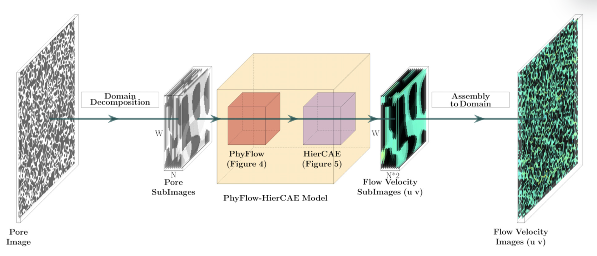
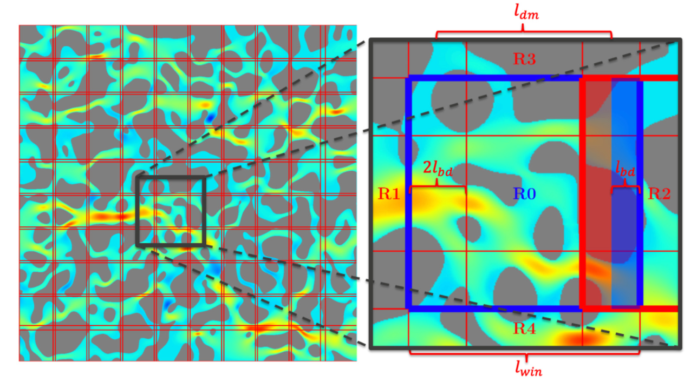
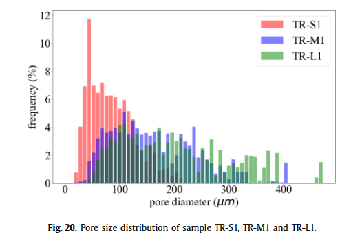

# 一种基于物理的分层正则化数据驱动模型，用于预测多孔介质中的流体流动

数据集：

代码：

主要内容：滑窗切片，对切片后的数据做固定卷积操作适应对应物理公式后encoder decoder出xy方向物理信息

Journal of Computational Physics 4.1

21年

---

本文提出了一种新的深度学习数据驱动模型，用于预测岩石中结构相关的***孔隙流体速度场***。该模型***基于卷积自动编码器 (CAE) 人工神经网络***，能够从通过孔隙结构的流体流动直接数值模拟生成的图像数据中进行学习，例如通过格子玻尔兹曼或分子动力学方法。与之前基于 CAE 的数据驱动方法相比，该模型的主要***新颖之处包括三个部分***。第一种方法是将多孔介质的全域分解为子区域或“子域”，以减小 CAE 的整体尺寸，并行批处理子域，并启用CAE 学习孔隙流体速度的局部和可推广的非线性映射。第二个包括在 CAE 之前将不可压缩***纳维-斯托克斯和连续性方程***的有限差分解嵌入到卷积层中，以便为** *CAE 提供流体动力学物理 (PhyFlow) 知识***。第三个主要新颖之处是，CAE 的训练通过分层损失函数进行正则化，该函数鼓励学习流体流动模式（类似于主成分分析中的排序模式），从最重要到最不重要进行排名。这被证明可以提高学习的稳定性、减少过度拟合并提高 CAE 神经网络层 (HierCAE) 的可解释性。综合性的新数据驱动模型（我们称之为 PhyFlow-HierCAE 模型）与传统 CAE 模型相比，表现出更高的流场预测准确性和通用性，这归因于***嵌入的物理知识和分层正则化***，并实现了顺序作为直接数值模拟的替代，计算时间的数量级加速。提供了对看不见的孔隙结构进行训练和前向预测的示例，并针对来自格子玻尔兹曼和孔隙流体流动的分子动力学模拟的数据进行了评估。该模型被证明是一个快速而准确的模拟器（或“替代品”），用于基于相对较小的直接数值模拟数据集的学习来预测看不见的孔隙结构的有效渗透率

---

## 1.介绍

由于最近技术进步（例如水力压裂、滑溜水和水平钻井）对天然气发电的需求增加，过去十年页岩地层的天然气产量显着增加（Hughes [25] ，Gandossi 和 Von Estorff [19]）。开发碳氢化合物开采、CO 2 封存、地下水和污染物管理等工程作业中的地下流预测建模能力是确保能源弹性和减轻环境影响的重要组成部分（Wheeler 和 Peszy ´nska [74]， Viswanathan 等人 [71]，Bear 和 Cheng [6]）。人们已经提出了各种分析模型来预**测简单孔隙几何形状中的流体流动，但它们不适合描述真实的孔隙，其中孔隙的拓扑结构和孔隙表面粗糙度起着重要作用**（Valkó等人[69]，McGlade等人） al. [40]、Mehana 和 Callard [41]）。直接数值模拟（DNS）（也称为“中尺度”或“全场”模拟）可以直接解析孔隙空间（微观结构），从而提供依赖于孔隙结构的流动预测（Ovaysi 和 Piri [51] ]，Mostaghimi 等人[47]）。各种数值方法已被应用于求解孔隙尺度流场，包括但不限于格子玻尔兹曼方法（LBM）（Chen和Doolen [13]，Liu等人[35]，Zhao等人[75] ])、计算流体动力学 (CFD)（Russell 和 Wheeler [58]、Raeini 等人[54]）和分子动力学 (MD)（Bitsanis 等人[10]、Bhadauria 和 Aluru [8]、Morciano 等人等[44]）。对于某些应用程序，一种 DNS 方法可能优于另一种方法。例如，LBM 是最流行的孔隙尺度 DNS 方法之一，尽管在实验下模拟整个岩心的计算成本仍然非常高，但由于其并行性和复杂几何中有效的防滑边界处理，LBM 是最流行的孔隙尺度 DNS 方法之一。条件（Chen 等人[15]）。当孔径极小时，LBM 方法可能会导致多孔流动预测不准确，因为纳米限制效应被忽略（Lubbers 等人[37]）。分子动力学 (MD) 模拟已被证明能够准确描述纳米约束效应（Collell 等人 [17]、Liu 等人 [34]、Obliger 等人 [49]），尽管需要大量额外的计算费用可能使其对于大于几百纳米的域来说不切实际。

在过去的几十年中，数据驱动（参见 Brunton 和 Kutz [11]），特别是深度学习方法（LeCun 等人[33]）已经产生了出色且有前途的代理模型，可以捕获各种物理现象固体和流体力学（Kirchdoerfer 和 Ortiz [28]、Lusch 等人[38]、Morton 等人[45]、Raissi 等人[55]、Teichert 等人[65]、Lubbers 等人[ 37]、Sanchez-Gonzalez 等人[59]、Wessels 等人[73]）。这些方法的优点是提供的预测计算时间比传统的介观数值模拟器快几个数量级。最近，文献中出现了应用于多孔介质的数据驱动和深度学习模型的各种实现，例如通过训练深度神经网络来增强页岩样本的图像分辨率（Kamrava 等人[27]），生成类似于 3D X 射线域的二元几何结构（Mosser 等人[46]），使用混合机器学习和 DNS 方法预测孔隙结构渗透率（van der Linden 等人[70]、Rabbani 和 Babaei [53]、Tian等人[68]），***并使用卷积神经网络（CNN）对多孔介质中纳维-斯托克斯方程的解进行建模（Santos 等人[60]）***。然而，涉及 CNN 的深度学习模型的一个主要缺点是它们可能涉及数百万个参数来描述仅受少数偏微分方程（或一些经验物理定律）控制的物理现象[12,48 ]。这通常会导致严重的过度拟合问题，即深度学习模型可以很好地拟合训练数据，但对测试数据的推断却很差[66,31]。缓解此问题的一种方法是将 CNN 和 CAE 模型拟合到尽可能多的不同应用场景。然而，这种补救措施在许多情况下并不可行，因为（1）孔隙结构本质上是高度复杂的（在孔隙形状、尺寸、连通性、弯曲度等方面）和（2）计算费用，例如，对于 MD 模拟的情况，都阻碍了开发这种固有的大型数据集。在此，我们采用一种方法（并展示了其优势）来合并流体流动的控制偏微分方程，并分层约束 CAE 参数的学习，以克服深度学习代理模型的这些局限性。通过这种方式，我们的框架被证明能够对有限数量的数据进行训练，并能够很好地推广到看不见的（新的）孔隙结构。

本文提出了一种构***建和训练基于物理的 CAE 替代模型 (PhysFlow-HierCAE) 的新方法，用于快速准确地预测孔隙流体速度场和宏观有效渗透率***。第 2 节概述了 (1) 适用于 CAE 的域分解，(2) 在 CAE 中嵌入已知的流体守恒定律，以及 (3) 分层正则化 CAE 训练的主要新颖性，并在第 3、4 和 5 节中详细介绍。适用于 PhysFlow-HierCAE 模型的训练、验证和测试算法在第 6 节中进行了总结。我们通过使用各种固体材料模拟各种孔隙度下的孔隙流体流动预测的示例，证明了该模型在孔隙结构和数据源方面的通用性。晶粒（和孔径）尺寸，由 LBM（第 7.1 节）和 MD 模拟（第 7.2 节）确定。仅从少量的训练孔隙结构中学习，该模型被证实在准确性和通用性方面比传统的 CAE 模型有显着的提高，并且与孔隙流的 DNS 相比在计算速度方面有显着的提高。示例仅限于二维孔隙结构（和二维流动），这简化了模型的表示；然而，这里提出的基本想法预计也适用于 3D 图像的卷积层，这是我们正在进行的工作的一部分。

## 2.模型架构概述

数据驱动模型被用作快速准确的模拟器来学习和取代 DNS 来预测流体流速场（图 1）。孔隙结构图像是高保真 DNS 模拟（LBM、CFD、MD 等）的输入，该模拟解决了与孔隙结构和压力/速度边界条件相对应的速度场和整体（有效）流动特性。流速图像构成了模型学习的“地面实况”数据。将数据（图像）和预测流（图像）进行比较以计算损失函数（或“目标函数”），通常是均方误差（MSE）。损失值用于通过机器学习的反向传播算法来训练模型参数。在训练过程中，模型预测与图像数据之间的差异逐渐减小。经过模型的训练和验证后，它就可以用作模拟器来快速预测看不见的孔隙结构上的流体流动场，从而绕过执行进一步 DNS 的计算成本。

图 1. PhyFlow-HierCAE 模型学习和模拟直接数值模拟 (DNS) 预测多孔介质流体流动的工作流程。虚线表示仅用于培训目的。

模拟器 PhyFlow-HierCAE 在给定的***压力/速度边界条件下预***测给定的孔隙结构图像***的速度场（和有效渗透率）***，并且原则上基于传统的 CAE [例如，32,24] 和 U-Nets [例如，57]，广泛应用于图像分类和分割任务。该模型是通用的，适用于任何一般的二维孔隙结构，并且还可以从不同类型的孔隙流 DNS 中学习。它对于解决纳米多孔流动特别有用，因为可以减少对 MD 的依赖来捕获依赖于孔隙结构的纳米限制效应，这在第 7.2 节中显示了 MD 仿真器的结果。为了提高前向预测精度，同时从减少的训练数据中学习，我们在传统 CAE 架构中引入了以下关键创新。

首先，我们介绍 PhyFlow-HierCAE 的域分解（第 3 节），模型不是从全尺寸的孔隙结构图像（每个维度通常包含超过 1000 个像素）进行学习，而是 ***仅采用小窗口（*** 小于每个维度 100 个像素）从完整图像中细分并提取（图 2）。这种较小的输入图像尺寸极大地减少了卷积层的数量以及 CAE 中将输入图像压缩为几个潜在变量然后将其解码为全场输出图像所需的可训练参数的数量。我们示例中的 LBM 和 MD 流数据模型只需要很少的存储空间（大约 4 MB）。从小子域中学习还使模型能够灵活地预测整个巨大的孔隙结构域，因为该模型只需要扫描整个域的局部孔隙结构来预测局部流场，然后收集和预测局部流场。将它们组装在一起。以这种方式限制模型的“视野”还有一个额外的好处，即迫使模型学习局部区域的整体流体流动行为，而不是过度拟合整个孔隙结构中的流场（Mnih 等人[42]，Ba 等人[4]）

图 2. PhyFlow-HierCAE 模型的输入/输出图像和组件。 W 是子图像（窗口）的大小。 N是对原始全域图像进行分解得到的子图像的数量。 N*2 是 u 和 v 图像堆栈的总深度（对于 2D 孔隙结构，u 和 v 分别是 X 和 Y 方向上的速度分量）。

其次，我们介绍基于物理的 CAE（第 4 节）。***脱离全域背景的子域中的孔隙结构不能唯一地确定流场。这是因为子域内的流动不仅取决于局部孔隙结构，还取决于子域周围邻域的流场，即子域的边界条件，它受到由周围的流场和孔隙连通性决定***。为了克服这个问题，我们附加了一个额外的***不可训练的卷积层***块，其中包含空间导数（Long 等人[36]、Mohan 等人[43]）和有限差分更新的数学表达式（Harlow 和 Amsden [22]） ]，Silin 和 Patzek [63]），在 CAE 的上游嵌入了不可压缩的纳维-斯托克斯动量方程和连续性方程。这为后续的 CAE 提供了理想流体的稳态流动物理（缩写为 PhyFlow，图 4）。额外的物理信息使 CAE 能够学习***从子域孔隙空间到全域（代表性）流场的映***射，例如通过实验测量或高保真 DNS 给出的映射。

第三，我们介绍了分层正则化方法（第 5 节）。由于现实世界中涉及的高维度和高度复杂的控制机制，用于图像识别的传统 CAE 中编码器和解码器的训练通常通过 L1 范数、L2 范数、批量归一化等弱正则化图片。另一方面，在计算流体力学的背景下，通常试图描述流体流动现象，即使是高度非线性的，只有少数主要的控制机制（Cengel [12]，Munson 等人[48]） ）。我们提出了一种新颖的过程，涉及类似于[61]中提出的分层损失函数，但用于限制编码器和解码器神经网络不同深度的卷积（Conv）和反卷积（ConvT）层以学习流模式（模式）从最重要到最不重要排序（缩写为 HierCAE，图 5）。该方法在 CAE 的背景下以紧凑且集成的方式实现了深度网络的“贪婪”逐层训练（Bengio 等人[7]），而不需要单独的预训练阶段。随后第 7 节显示，该 HierCAE 模型能够学习可解释的流动模式，并避免由于过度拟合而产生虚假棋盘伪影（Odena 等人[50]）。

## 3.域分解

在此处考虑的整个孔隙域（> 1000 像素）上训练和测试模型是不可行的，因为 CAE 中需要大量 CNN 层和模型参数来将完整图像压缩为小尺寸的潜在变量，然后从中重建流场图像。因此，有必要将域分解为更小的子域。域分解将整个域划***分为几个子域，在这些子域上同时求解偏微分方程 (PDE)，***即纳维-斯托克斯方程和不可压缩流体动力学的连续性方程。每个子域的边界与其相邻子域重叠，并且解在重叠区域之间传输以在每个子域上强制执行边界条件。迭代解决方案和通信，直到在全域上实现流动方程的全局平衡。通过将各个最终解组装到全域上的适当位置来恢复整个域的解。子域的所有图像都被视为 PhyFlow-HierCAE 模型的一批输入图像。这些过程在 TensorFlow（Abadi 等人 [1]）中实现为通过卷积层和张量值的收集/分散的操作。这种处理的优点是可以直接使用 TensorFlow 中提供的 GPU 加速甚至 TPU（张量处理单元）加速，而不需要对之间的消息传递接口（MPI）进行额外的编程处理器（Simon [64]，Walker [72]）。利用CNN的分布式训练技术，它可以在台式电脑或个人笔记本电脑的单个GPU上进行训练，也可以在高性能计算资源上工作。

图 3 孔隙流体流场全域图像的分解。左：全域，右：放大 R0 子域周围的子域簇（或邻域）。图像大小为 1200 × 1200 像素。为了清楚起见，窗口大小 l win = 128 像素，边界大小 l bd = 4 像素。内部域大小 l dm = 120 像素。总共 100 个子域用红色窗口标记。右侧给出了子域（R0，用蓝色勾勒出的轮廓）的更接近和放大的视图，周围有相邻窗口（R1、R2、R3、R4，用红色勾勒出的轮廓）和大小为 2l bd 的重叠边界区域（用于交叉） - 邻居之间的沟通。例如，将R2的蓝色区域中的解传输到R0的蓝色区域作为R0的边界条件（BC），同时将R0的红色区域中的解传输到R2的红色区域作为R2的边界条件（BC）。 （对于图中颜色的解释，读者可以参考本文的网络版本。）

域分解过程使用相同大小的窗口来覆盖全局域。在 2D 中，选择大小（边长）l win 且边界宽度为 l bd 的方形窗口，因此窗口的内域大小为 l dm = l win − 2l bd （图 3）。通过从左边界到右边界、从上边界到下边界跨过窗口来划分原始全域孔隙图像。步幅大小与内部域大小 l dm 相同。这是因为相邻窗口以 2l bd 的域宽度相互重叠，以确保子域相邻边界上流场解的交叉通信（图 3）。当窗口超过原始图像的右限或下限时，窗口将被重新定位以与图像限制一致，因此用于局部解通信的重叠边界区域也被重新定位。然后在这些小的局部孔隙结构窗口上训练 PhyFlow-HierCAE 模型，然后可以通过“并行”批处理对局部流场进行预测。图3显示了二维代表性孔隙结构的子域分解和子域簇（邻域）放大的示例。 l win （例如，64, 128, 256，...）和 l bd （例如，1, 2, 3，...）都是用户定义的超参数。通过对 LBM 流量数据的参数研究，我们发现 l win 和 l bd 对 CAE 模型的预测精度没有显着影响，尽管随着 l bd 的增加观察到精度略有提高的趋势，而随着 l win 的增加，观察到略有下降。对于第 7 节中介绍的 LBM 和 MD 示例，我们选择 l win = 64 像素和 l bd = 2 像素，从而产生 400 个子域分解大小为 1200 × 1200 像素的全域图像。

## 4.嵌入式物理：卷积层中的流方程

嵌入流动方程的目的是向下游 HierCAE 网***络提供理想化的孔隙流场，而不是简单地断开的局部孔隙结构图像***。理想化流场是通过求解多孔介质中理想化压力驱动流动的边值问题 (BVP) 获得的，其中偏微分方程形式的守恒定律由纳维-斯托克斯动量方程和不可压缩介质的连续性方程组成流体：

其中 v 是速度，p 是压力，ρ 是密度，ν 是运动粘度。因此 ∇ v 是速度梯度，∇·v 是速度散度，∇2 v = ∇·∇ v 是速度拉普拉斯算子。

连续性方程 ∇·v = 0 提供了运动学约束，要求压力场不断演化，以便膨胀率 ∇·v 到处消失。在构造保证运动学约束的压力场后，连续性方程变成泊松方程（Harlow 和 Amsden [22]）。对于笛卡尔坐标系中二维流动的情况，上面的结果得出速度分量 u、v 的两个方程和压力 p 的一个方程：

在深度学习中，CNN 用于学习空间特征，其中（对称或非对称）内核 f 作为整个感兴趣域的卷积运算。不可训练的 CNN 滤波器层可用于计算驻留在离散解网格上的域上的导数，使用有限差分法 (FDM) 连续导数的中心差离散数值逼近 [36,43 ，56]。在这些先前的模型中采用了该技术来学习偏微分方程的微分算子或强制 CAE 预测的约束。或者，在这种方法中，它用于迭代更新已知流体偏微分方程的理想化解。这样的 CNN 层包含五个 3 × 3 滤波器 f1 、 f2 、 f3 、 f4 、 f5 定义为：

其中 $\phi$ 是形状为 [X 中的大小、Y 中的大小、通道深度] 的任意图像，h 是由一个像素表示的长度，符号 ◦ 表示将核 f1 - f5 跨过图像 phi 的卷积算子。卷积运算符包括在图像上滑动权重（内核）的小矩阵，执行逐元素乘法，然后将结果求和为单个输出像素

虽然我们正在求解稳态流，但偏微分方程的 FDM 解是通过伪时间参数化的，并且物理参数 ρ 和 ν 不限于实值，而是相当人为的数值参数，以及空间分辨率 h和时间增量t，以保证迭代更新的收敛性。使用显式时间步进方案，迭代 n + 1 处的解同时更新为

滤波器 f1 - f5 以 1 的步长对 u^n 、 v^n 、 p^n 图像进行操作，并将原始图像尺寸减小 2 个像素 (l win − 2)。下标(i, j)表示大小为l win − 2的内部图像。下标(i + 1, j), (i − 1, j), (i, j + 1), (i, j − 1) ）分别表示内部图像 (i, j) 向 +X、-X、+Y、-Y 方向的 1 像素偏移。在每个 +X、-X、+Y、-Y 方向应用 1 个像素的对称填充（通过处理边界处的值）以恢复原始大小 l win 。使用雅可比迭代法更新压力解。添加项 1 t ( f1 ◦ u n + f2 ◦ v n) 是为了稳定压力解 (Tezduyar [67])。我们选择一组稳定的层流参数为 h = 1.0、ν = 1.0、t = 0.01 和 ρ = 1.0，以确保流速和压力的 FDM 解的收敛性。我们强调，参数不需要（也不会）对应于真实的流动属性。选择这种简化的 FDM 更新是为了加快计算速度，同时保持足够的解决方案精度，以便为随后连接的 HierCAE 提供在全域中一致的初步理想化流模式。可以实施更精确的 FDM 方案，例如 MAC [23]、分数阶方法 [16] 和 SMAC [2]，以及对孔隙-流体/固体界面的严格处理，例如 [62]，但对于这项工作中的 PhyFlow-HierCAE 模型。

该批子图像的边界条件（BC）由三种基本类型组成。第一类 BC 由压力驱动流全域的全局边界条件组成。考虑边界为 ∂B = ∂Ble f t ∪ ∂Bright ∪ ∂Btop ∪ ∂Bbottom 的域 B。全局域的 BC 为：在 ∂Ble f t 处，p = 1.0，v = 0.0，∂u ∂ X = 0；在 ∂Bright 处，p = 0.0，v = 0.0，∂u ∂ X = 0.0；在 ∂Btop ∪ ∂Bbottom 处，u = 0.0，v = 0.0。狄利克雷BC可以直接规定在子图像的相应边界上。通过对称填充来自 PhyFlow CNN 层的缩小尺寸图像的输出，可以简单地应用同质 Neumann BC。第二种类型的 BC 强制子域之间边界处重叠区域的一致性，如第 3 节中所述。第三种类型的 BC 很简单，即固相不流动，即 u = 0 和 v = 0在代表固相的像素处。为了使用 TensorFlow 机器学习包 [1] 实现，我们存储掩码以在张量中的实体像素上应用全局 BC 和零流，并将相应的 BC 值存储在另一个张量中；对于边界通信，我们存储收集索引列表以从 PhyFlow 层检索解值，然后存储散射索引列表以将值广播到相关边界像素

这种在 HierCAE 网络前面嵌入 Navier-Stokes 和连续性方程的层架构如图 4 所示。理想化流解域 (u, v, p) 的子图像通过“Deriv”迭代更新“CNN”层（等式（3））、“PhyFlow Update”层（等式（4））、聚集和分散算子的通信层，以及覆盖指定 BC 值解的边界条件层。然后将 u 和 v 理想化流图像用作下游 HierCAE 的输入，以从 DNS 重建真实流图像。包含理想化流场的迭代有限差分解的算法如算法 1 和 2 所示。我们强调流场的 FDM 解不需要是实际流场的解，而只需要初始化在满足纳维-斯托克斯方程和边界条件的意义上，用物理上允许的（或“理想化的”）流场（或“通知”）下游 CAE。

## 5.分层正则化和卷积自动编码器 (HierCAE) 网络

图 4. 在 PhyFlow-HierCAE 模型中嵌入流体流动物理的上游架构。

本节描述 CAE 神经网络学习 PhyFlow（第 4 节）给出的输入流场解图像和 DNS 给出的输出流场图像之间的映射。 CAE 架构的固有瓶颈性质需要学习输入流分布的压缩潜变量表示（[20]）。潜在变量集的大小通常是用户定义的超参数。该映射表示为编码器函数 enc : X → Z，其中 X 是输入图像的空间，Z 是潜在变量的空间。同时，从潜变量到全域输出流图像的重建由解码器函数 dec : Z −→ ˆX 表示，其中 ˆX 是 DNS 流图像的空间。

图 5. PhyFlow-HierCAE 模型中 HierCAE 的网络架构。 W 是子图像的大小（例如 64），C 是通道/滤波器的数量（例如 16），L 是瓶颈中潜在变量的数量（例如 64）。 4x4Conv 是内核大小为 4、步幅大小为 2 的卷积层，而 4x4convT 是相反的反卷积层。 4x4Conv 和 4x4convT 层通过 L2（惩罚乘数 = 5E-4）和 Batch Normalization 进行正则化。虚线仅在分层正则化训练时激活，如式（1）所示。 (8)（例如图6和图11）或Conv-ConvT层对的解释（例如图17和图18）

模型中采用的 HierCAE 的网络架构如图 5 所示。模型中的超参数，如内核大小、通道宽度、步幅大小等，是根据经验选择的。这里的重点是流动物理的嵌入以及 CAE Conv 和 ConvT 层的分层正则化，根据经验选择的超参数在整个工作中都是固定的，即没有超参数调整来最大化模型（尽管这可以在未来的工作中完成）。我们强调这里描述的方法与其他方法相比的一个显着区别是，该模型中的 CAE 不是学习用于将理想化流场映射到自身的恒等映射，而是学习到 DNS 流场的非线性映射。因此，输入图像由编码器的连续 4x4Conv 层非线性变换为潜在变量的瓶颈。然后，这些变量通过连续的 4x4ConvT 层进行解卷积，以重建 DNS 流图像。在训练阶段，Conv-ConvT 层对之间的快捷路径被激活，这与所谓的 U-net [57] 的精神类似。与 U-net 技术的区别在于，路径将输出从 Conv 层复制到 ConvT 层而不是连接，并且路径被顺序激活并逐一丢弃以计算分层损失（定义如下式（8）） ）随着 CAE 深度的增加。 CAE通过L2和Batch Normalization技术进行正则化，L2惩罚乘数设置为5e-4

为了进一步规范 CAE 网络以捕获 DNS 给出的最重要的多孔流机制，我们限制 Conv 和 ConT 层中的学习变量按重要性降序排列。这种思想与广泛用于物理问题的主成分分析（PCA）数据驱动技术一致，因此也被称为非线性PCA[61]或类PCA自动编码器方法[30]。事实上，自动编码器可以被视为 PCA 的推广，其中潜变量的映射通常是非线性的，并且当仅使用一层神经元和线性激活函数时，自动编码器可以简化为标准 PCA [cf. 11]。 PCA方法本身被广泛用于降维和重建任务。它们的优点是提取的基（特征函数）是正交的且可解释的（但仅限于潜在变量之间的线性关系）。本工作中开发的类似非线性 PCA 的方法描述如下。

假设输出 DNS 流图像被组织在矩阵 Y ∈ R m×n 中，每个窗口（大小 m）中具有平坦流场图像的列（大小 n）。 Y 的条目通过平均值和标准差进行归一化。奇异值分解 (SVD) 找到空间模式 G 和 H，使得

其中 G 和 H 是正交矩阵（G T G = G G T = I 、 H T H = H H T = I ），G 包含左奇异向量（众数）作为列，H 包含右奇异向量作为列，σ 是 m × n 对角矩阵对于实数、非负对角线元素（奇异值），σl∈[1,min(m,n)]，使得 σ1 ≥ σ2 ≥ σ3 ≥ ... ≥ 0。显着性水平，即百分比从排名第一的奇异值和相应模式恢复的完整图像信息的数量，可以通过将 σl 的累积和除以 σl 的总和来计算。通过选择与用户定义的显着性水平 sl 列表相对应的前 p 个模式，可以获得一系列逐渐重建的输出图像，例如 sl = [50%, 75%, 90%, 95%, 100%, 100% ] 对于图 5 中的 CAE 架构。输出图像近似为

其中 p 表示前 p 个奇异值，左右奇异向量在 sl 中达到第 j 个显着性（图像重建）级别。由于 ˆY j m×n 是按列组织扁平流图像的矩阵，因此通过将 ˆY j m×n 的第 i 列重塑为 [l win , l win, 2] 的大小来获得第 i 个新构造的输出图像数据 ˆX j i 。 （二维）。尽管自动编码器可以灵活地学习复杂的压缩和重建映射，但 enc 和 dec 通常缺乏任何层次约束并且对训练数据过度拟合。 Conv-ConvT 对通常不会按照 SVD 给出的模式按重要性递减顺序排序。 CAE 的标准重建误差为

其中 X i 是第 i 个输入图像，^X i 是第 i 个输出图像数据，M 是数据图像的数量。

为了对 CAE Conv-ConvT 对施加有序显着性（如传统 PCA 或 SVD），本文的重构误差以分层方式设计（类似于 [61] 中引入的损失，用于对自动排序中的潜在变量进行排序） -编码器学习恒等映射），

其中 j enc 和 j dec 是仅使用前 j 个 Conv-ConvT 层对的编码器和解码器函数。在输出流图像从输出图像向后计数之前，第 j 个 Conv 层与第 j 个 ConvT 层配对。它们可以通过快捷连接直接配对，因为它们的尺寸相同。例如，第一对都有图像大小 W/2 和 C 通道数，第二对都有图像大小 W/4 和 C 通道数，依此类推，如图 5 所示。因此 j enc 包括所有输入图像之后的前 j 个 Conv 层，j dec 包括紧邻输出图像之前的所有前 j 个 ConvT 层。 X j i 是第 i 个 SVD 重建图像数据，其在 sl 中达到第 j 个显着性级别，从等式中的 Y j m×n 获得。 （6）。 k 是 Conv-ConvT 层对的总数。该技术在 CAE 中用于规范理想化流场与 DNS 给出的真实流场之间的非线性映射的学习。然后可以使用 CAE 以及 k Conv-ConvT 层对的整个架构来预测输出图像：

## 6.模型训练、验证、测试算法

PhyFlow-HierCAE 模型涉及对从较大（全域）图像分解的一批相互关联的输入图像进行训练。理想化的流图像需要经过不可训练的层并迭代更新。 CAE中的Conv-ConvT层对需要以分层方式进行训练。除了 CNN 模型的传统训练之外，对传统 CAE 架构的所有这些修改还需要修改的训练和验证算法。算法 1 中介绍了这项工作中开发的新颖训练程序。开发的测试程序（算法 2）具有类似的 uvp 图像迭代更新，但没有训练/验证数据的分割、反向传播和图像重建通过顺序添加更多 Conv-ConvT 层对。对于第 7 节中的所有数值模拟，算法 1 中的迭代次数 numT rainEpoch 和算法 2 中的 numIter 均为 2E4。我们注意到，可以在下游 CAE 训练之前预先计算 PhyFlow 迭代更新，以减少 CAE训练时间;然而，我们选择在每个训练时期计算它们。我们选择这样做的原因是求解有限差分核的计算成本比 CAE 的计算成本低得多。此外，与 DNS 生成训练数据的成本相比，它是微不足道的。将 PhyFlow 迭代更新与 CAE 训练集成的另一个可能的优点是，在 PhyFlow 图像逐渐收敛到稳态解的意义上引入了噪声。事实证明，引入这样的噪声可以训练 CAE 更能抵抗噪声，从而提高稳定性，即对扰动（例如看不见的孔隙结构）更具弹性

算法 1 PhyFlow-HierCAE 模型的训练和验证。

 1：使用域分解从原始全域孔隙结构图像中获取子域（第 3 节）。

2：获取全局边界条件的掩模和值张量，局部边界通信的聚集索引列表和分散索引列表（第4节）。

3：初始化模型中的 PhyFlow 层（第 4 节）、编码器和解码器。图4

4：使用方程式（3）在 PhyFlow 中分配 CNN 差分算子内核。

 5：初始化理想化流动方程(2)的解 uvp训练和uvp有效。

 6: for i in [0,..., numT rainEpoch] do

7: 使用等式 1 更新 PhyFlow 的理想化流解 uvp 训练和 uvp 有效值。 （4）。

 8：使用 uv train 的平均值和标准差对 uv train 和 uv valid 进行归一化。

 9：将理想化的流速图像编码为潜在变量列表 {z j } = Encoder(uv train )。

10：将潜在变量列表解码为重建流速图像列表 {uv j reconstr } = Decoder({z j })，越来越多地使用更多的 Conv-ConvT 层对，如第 5 节所示。

11：计算分层重建误差使用方程式训练数据。 （8）。

12：计算带有附加 L2 正则化损失的训练损失 Losstrain。

13：计算模型参数梯度 ∇θ Losstrain 。

 14：使用优化器更新模型参数 θ 以最小化 Losstrain 。

15：将理想化的流速图像编码为潜在变量 z = Encoder(uv valid )。

16：将 z 解码为流速图像 uv reconstr = Decoder(z)，其中 uv reconstr 是根据所有 Conv-ConvT 对重建的。

17：计算验证数据上的有效损失（等于重建误差）。

 18：如果Loss valid是训练过程中遇到的最小值，则保存Encoder和Decoder的权重。

19：退出

## 7.结果

我们测试了 PhyFlow-HierCAE 模型在学习和预测二维多孔结构中的流体流速场方面的有效性、准确性和通用性，该模型受到从左边界到右边界的恒定压力梯度的影响。模型的性能通过两种类型的 DNS 给出的数据集进行评估：LBM 和 MD。 LBM 和 MD DNS 都使用周期性 BC 和恒定外力（对应于恒定压力梯度）来驱动流体流动。附录A2中提供了 LBM DNS 的模拟设置和边界条件的更多详细信息MD DNS 的相关信息在附录 A.3 中提供。该模型可以快速预测速度场、平均速度，从而预测看不见的孔隙结构的有效渗透率，从而取代计算成本高昂的 DNS。该模型被证明能够灵活地成功学习 LBM（无约束效应的孔隙尺度流动）和 MD（具有约束效应的纳米级孔隙中的流动）给出的不同流体流动行为。该模型的性能与没有分层潜在变量的 PhyFlow-CAE 模型和标准 CAE 模型进行了比较，以突出本工作中引入的关键成分的优势。

图 6. LBM 数据集上流模型训练阶段的 MSE 损失。训练反向传播损失是指分层损失（方程（8））加上L2损失。这些模型使用一个 NVIDIA Tesla P100-PCIE-16GB GPU 进行训练

### 7.1LBM流数据的模型训练和测试

该数据集由来自 19 种不同孔隙结构的 LBM 模拟的 2D 流体速度图像组成，这些孔隙结构在尺寸、形状、孔隙连通性和总体孔隙率方面彼此不同。孔隙结构分为三类孔隙尺寸：小（S）、中（M）和大（L）。孔隙结构还具有三种有效孔隙率：大约40%、45%、50%。数据集分为三部分：6个训练数据DNS（TR-S1，TR-S2，TR-M1，TR-M2，TR-L1，TR-L2），6个验证数据DNS（VL-S1，VL-S2） 、VL-M1、VL-M2、VL-L1、VL-L2）和7个测试数据DNS（TE-S1、TE-M1、TE-M2、TE-M3、TE-L1、TE-L2、TE- L3）。在训练阶段，训练数据提供目标速度场来计算反向传播的均方误差目标函数。在反向传播的每个时期之后，模型对验证数据进行预测，并计算均方误差损失，以估计未见孔隙结构的模型精度。验证数据不参与神经网络参数的训练，但用作选择最终训练参数的标准，以防止对训练数据的过度拟合。所有模拟器都使用相同数量的 epoch 进行训练，然后接受与最低验证损失相对应的参数作为模型的最终训练参数。模型训练完成后，用于预测测试数据的流速，以测试其对看不见的孔隙结构的普遍性。请注意，反向传播的训练损失中不使用验证数据和测试数据，而在根据最低验证损失最终确定其神经网络参数之前，模拟器对测试数据完全不知情。

所提出的 PhyFlow-HierCAE 模型在训练阶段的训练和验证损失的演变如图 6 所示。该训练与具有相同编码器-解码器 CNN 层架构（但没有分层正则化）的 PhyFlow-CAE 模型进行了比较）。它还与传统的 CAE 模型和 Hier-CAE 模型进行了比较，这些模型具有与 PhyFlow-HierCAE 模型相同的编码器-解码器架构（但没有嵌入的斯托克斯流和连续性方程）。损失曲线显示 PhyFlow-HierCAE 模型的二维多孔流图像的训练和验证准确性显着提高。传统的 CAE 模型可以拟合训练数据，但不能很好地推广到看不见的验证孔隙结构。如果没有 HierCAE，训练就会表现出很强的不稳定性——甚至表现出跳跃到很大的损失值。 PhyFlow-CAE 模型还能够显着降低验证损失，但振荡更多。潜在变量的分层正则化提高了训练的稳定性以捕获非线性映射

表 1 提供了四种模型在所有孔隙结构上的性能的定量比较。主要感兴趣的量是流动方向 k e f f（这些示例中的 X 方向）上的有效（放大）渗透率，定义为作为平均速度与压力梯度的比率。还比较流速场的均方根误差 (RMSE)（定义为 √ 1 N Σ(v 预测 i, j − vdata i, j )2 ，其中 N 是速度分量的总数），以评估解决孔隙尺度速度场的预测准确性。有效渗透率的相对误差定义为 rel k = |k Predict e f f − k data e f f |/|k data e f f |，RMSE 的相对误差定义为 rel R M S E = R M S E/ √ 1 N Σ(vdata i, j )2 ，表中列出了四个模型中的每一个。这些相对误差的统计数据如图 7 所示。从表和图中可以清楚地看出，单独使用 PhyFlow 会导致非常大的相对误差，CAE 模型也是如此。这些结果表明，PhyFlow 和 CAE 模型单独都无法学习和预测流速——只有将它们结合起来才能做出准确的流场预测。通过添加 PhyFlow 和 HierCAE成分，渗透率预测误差的平均值从 45.7% 显着降低到 1.3%。添加 PhyFlow 可以将 RMSE 的平均预测误差从 94.7% 降低到 19.3%，并且添加 HierCAE 进一步将 rel R M S E 降低到 15.7%，显着的是仅使用 6 个训练图像来对抗 13 个未见过的图像 - 证明了 PhyFlow-HierCAE 模型的成功：用于替代 LBM 模拟的模拟器。作为显示完整流场速度预测的示例，我们给出了训练数据 TR-S1、验证数据的全场速度图像的 X 和 Y 分量（即，分别是方程（2）中的 u 和 v）图1和2中的VL-M1和测试数据TE-L1。 8、图。分别为 9 和 10。单独的 CAE 并不能预测有意义的流速。 PhyFlow-HierCAE 和 PhyFlow-CAE 都成功地产生了与 LBM 数据相似的流场，而 PhyFlow-HierCAE 在定量上是最准确的。

图 7. LBM 数据上的相对误差 rel k 和 rel R M S E 统计（表 1），显示 PhyFlow-HierCAE 模型相对于非正则化 PhyFlow-CAE 模型和传统 CAE 模型在流体流量预测方面的改进。还提供仅来自 PhyFlow 模型（没有下游 CAE）的预测误差。

图 8. LBM 速度训练数据的预测

图 9. LBM 速度验证数据的预测

图 10. LBM 速度测试数据的预测

### 7.2MD流量数据的模型训练和测试

通过分子动力学 (MD) 模拟的多孔介质中流体的二维速度数据，对相同的数据驱动流动模型进行训练、测试和比较。目的是评估模型与其他 DNS 方法一起使用的通用性，特别是评估当与不专门强制执行理想化连续流方程（斯托克斯和连续性）的 DNS 方法一起使用时，理想化连续流方程（Stokes 和连续性）的使用效果如何（LBM但 MD 没有）。训练和测试中相对误差 rel k 和 rel R M S E 的较高值是可以预期的，我们将其归因于一般意义上增加的 MD 物理复杂性，例如，纳米级中甲烷气体分子和固体孔壁分子之间的相互作用。限制和MD的“噪音”，正如随后讨论的那样（另见附录A.3中的讨论）。使用相同的训练、验证和测试孔隙结构集来评估模型的预测能力。图 11 显示了训练阶段 PhyFlow-HierCAE 模型的训练和验证损失的演变。再次将训练与具有相同编码器-解码器 CNN 层架构的 CAE、HierCAE 和 PhyFlow-CAE 模型进行比较。损失曲线表明，PhyFlow-HierCAE 和 PhyFlow-CAE 模型都可以拟合训练图像模式，并将学习到的模式推广到看不见的验证孔隙结构上，而传统 CAE 则不能。对潜在变量的分层正则化进一步有助于提高捕获非线性映射的训练稳定性。传统的CAE模型无法降低训练过程中的验证损失，泛化性较差

图 11. MD 数据集上流模型训练阶段的 MSE 损失。训练反向传播损失是指分层损失（方程（8））加上L2损失。这些模型使用一个 NVIDIA Tesla P100-PCIE-16GB GPU 进行训练

图 12. MD 数据上的相对误差 rel k 和 rel R M S E 的统计（表 2）显示 PhyFlow-HierCAE 模型相对于非正则化 PhyFlow-CAE 模型和传统 CAE 模型在流体流量预测方面的改进。还提供仅来自 PhyFlow 模型（没有下游 CAE）的预测误差

图 13. MD 速度训练数据的预测

图 14. MD 速度验证数据的预测

四种模型对所有孔隙结构的 rel k 和 rel R M S E 的定量比较如表 2 所示。四种模型的相对误差统计如图 12 所示。表和图显示了添加PhyFlow和HierCAE成分的优点在于，它可以将rel k上的平均预测误差从大约83.8%降低到大约10%。 rel R M S E 的平均预测误差也从 CAE 中的约 100% 减少到约 50%在 PhyFlow-CAE 和 PhyFlow-HierCAE 中。尽管与 LBM 仿真器相比，预期误差的改善要小得多，但我们注意到它仍然比传统 CAE 有了显着改善，大约提高了 50%。例如，rel k 的最差相对误差为 28.3%，rel R M S E 的最差相对误差为 97.4%；然而，传统 CAE 的表现明显较差，rel k 的最大误差为 310%，rel RMS E 的最大误差为 166%。我们随后指出了表中不明显的分层正则化的进一步优势

作为显示完整流场预测的示例，我们在图 2 和 3 中展示了训练数据 TR-S2、验证数据 VL-M2 和测试数据 TE-L2 的 X 和 Y 分量全场速度图像。 13、图。分别为14和15。在MD数据的学习中，非正则化PhyFlow-CAE和正则化PhyFlow-HierCAE在对未见过的测试孔隙结构生成准确预测方面仍然存在困难（但不如传统CAE那么困难），特别是对于小孔隙结构。颗粒（小孔隙通道）和低孔隙率。我们假设，这可能是由于当孔道宽度较小时，相对于孔体积的孔表面积量变大，流体和固体壁分子之间存在显着的纳米限制效应。另一个原因可能是 PhyFlow 组件仅生成不可压缩粘性流体流场作为 CAE 的输入特征以映射到 MD 流数据（这不会强制执行连续介质意义上的不可压缩流）。预测困难也可能与 MD 模拟本身的数据有关，MD 模拟很难实现稳态流动，如附录 A.3 所示和讨论。尽管我们并不清楚如何调整 PhyFlow 组件以更好地执行 MD 物理（这是我们正在进行的研究的一部分），但我们强调，本方法比传统 CAE 提供了显着改进。这两种模型，即 PhyFlow-CAE 和 PhyFlow-HierCAE，都可以从训练数据中捕获纳米孔中的流体流动模式

为了可视化将分层正则化添加到 CAE 模型训练中的优势，我们展示了使用孔隙结构、目标 LBM 和 MD 流速数据进行域分解的子域结果示例（X-方向）如图 16 所示。图 17 和图 18 显示，对于 LBM 和 MD 数据，重建的传统 CAE 的速度场在 CAE 的编码器-解码器结构中使用逐渐更多的卷积-反卷积对。仅使用第一个 Conv-ConvT 对的重建表示为“模式 1”，使用前两对的重建表示为“模式 1-2”，依此类推。该图表明，传统 CAE 中随着卷积-反卷积层数（模型复杂性）的增加而学习的模式没有意义。第一种模式捕获严重的棋盘图案，这是反卷积层中的常见问题[50]。随着编码器和解码器深度的增加，以下模式（模式 1-2 到模式 1-5）也显示出不相关的杂散流模式到真实的MD流量数据。完整的传统 CAE 模型（模式 1-6）突然适合 MD 数据，这表明最深的卷积-反卷积对在学习流动模式中发挥着最重要的作用。 PhyFlow-CAE 模型虽然具有与正则化 PhyFlow-HierCAE 模型相似的预测性能，但也存在以无组织且不可解释的方式学习流模式的相同问题。值得注意的是，当 CAE 的训练按层次进行规范化时，所有模式都显示出有意义的流程模式。人类可以直接解释随着 PhyFlow-HierCAE 中编码器-解码器深度的增加而捕获的所有模式 1 到模式 1-6 流行为。相比之下，没有分层正则化的其他模型（CAE 和 PhyFLow-CAE）的分离模式是人类无法解释的。正如示例所示，PhyFLow-HierCAE 的第一个显着模式捕获了孔隙通道内的基本平均流动模式。随后的模式逐渐重建孔隙通道不同区域的高浓度流速。这些在 CAE 编码器-解码器对中逐步捕获的流动模式可以清楚地解释，并隐式地捕获每种模式中嵌入的流体流动物理现象。相对误差图 |upredict − udata|/|udata|图 19 表明，非正则化 CAE 和 PhyFlow-CAE 模型在使用小于 6 个累积模式学习局部流场时都表现出非常高的误差：以这种方式重建的流模式仅使用所有 6 个模式才准确。当在 PhyFlow-HierCAE 中对训练进行分层正则化时，相对误差往往会使用逐渐更多的模式单调下降。这具有进一步的优点，即允许根据所需的模型复杂程度来选择 PhyFLow-HierCAE 模型中的模式数量（例如，权衡计算时间费用）。

## 8.结论

提出了一种基于物理的分层正则化数据驱动模型 PhyFlow-HierCAE，用于预测通过孔隙的流体流动，该模型由三个主要新颖成分组成：1）使用域分解来一致地描述大域计算高效的方法，2）将流体物理方程嵌入到用于描述几何形状的特征中，3）对 CAE 模型中的 Conv-ConvT CNN 层进行正则化，以便学习从最重要到最不重要的流型特征。该模型已被证明可以处理从全域孔隙结构分解而来的一批输入子域，以便在所需的计算资源较少并能够分析整体较大孔隙结构的情况下，在最终的 CAE 架构中提供显着的优势。通过经典纳维-斯托克斯动量和连续性方程的解来预测复杂孔隙结构中的全场有效流体流动（包括纳米多孔流动）。理想化流动解和真实流速曲线之间的非线性映射的学习通过 CAE 人工神经网络中的分层损失函数进行正则化网络。分层正则化已被证明可以进一步提高测试数据的准确性，并消除训练和验证迭代中损失性能的波动。提供了与传统 CAE 模型相比的模型性能示例，用于模拟多孔流动的 LBM 和 MD 预测（表 3 中总结）。

与传统 CAE 相比，PhyFlow-HierCAE 模型需要更少的数据进行训练，同时对未见过的测试数据进行预测的准确性更高。与标准 CAE（大约 100 MB）相比，所需的存储空间（大约 4 MB）非常少，并且训练时间不到一小时，而我们的预测可以在单个 GPU 上在 1 分钟内做出。与此处考虑的 MD 模拟需要在 3200 个 CPU 上执行长达 16 个小时的 DNS 模拟相比，这意味着所需的计算资源显着减少，这表明 PhyFlow-HierCAE 模型是一个轻量级、快速、可靠且灵活的预测仿真器孔隙结构相关的流动行为。

LBM 仿真器比传统 CAE 具有显着优势，在流场预测渗透率和 RMSE 的预期相对误差方面大约提高了一个数量级。它的训练成本相当，平均约为前向预测成本的 1/15。对于 MD 模拟，该模型的性能不如 LBM，但仍然比传统 CAE 提供了显着改进。 MD模拟器的训练时间是生成训练数据成本的1/16，并且前向预测可以比模拟便宜得多，低了近3个数量级。此外，分层正则化被证明可以提供从可归因于分层的 MD 数据中学习物理意义和人类可解释的流动模式的优势。

CAE 正则化。我们假设模拟 MD（与 LBM 相比）相对困难是因为纳米限制区域中固液分子相互作用的额外复杂性（这是我们正在进行的研究的一部分，需要改进），以及用于预测通过最小孔隙的流量的 MD 结果的固有噪声。改进该模型的训练和预测的未来工作可能涉及引入主动学习技术，以找到最少量的适当训练数据，从而产生最普遍准确的流体流动模拟器。此外，物理学的思想为 CAE 提供了经典偏微分方程边值问题的理想解，可以扩展到其他应用，例如固体力学或耦合固液相互作用问题。目前，我们正在努力将此处提出的模型扩展到 3D 孔隙网络中的 3D 流动，并调整物理约束以包括可能更适合 MD 的约束。此外，这里提出的 CAE 训练的分层正则化可能会导致在开发其他物理现象的可解释机器学习模型方面取得进一步进展。
