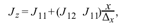

# 使用 3D CT 扫描图像数据进行电、扩散和水力弯曲各向异性量化

数据集：伯里亚砂岩

代码：

主要内容：分割后计算 电力弯曲度、扩散、水力弯曲度

SPE年度技术会议暨展览会 SPE Annual Technical Conference and Exhibition

21年

---

沉积物的沉积机制和沉积后过程通常会导致岩石结构的空间变化和非均质性，从而影响岩石物理、电学和机械性质的方向依赖性。上述性质的方向依赖性的量化对于正确表征含烃储层至关重要。各向异性量化可以通过使用多尺度图像数据对多孔介质中的流体流动、气体扩散和电流传导等物理现象进行数值模拟来完成。通常，这些模拟的结果是传输特性（例如渗透性）。然而，也可以量化用作模拟域的介质的弯曲度，这是岩石微观结构的基本描述。本文的目标是 (a) 通过***模拟电势分布、扩散和扩散***，使用多尺度图像数据（即全岩心 CT 扫描和微 CT 扫描图像堆栈）量化多孔介质的弯曲各向异性。流体流动，以及 (b) 比较电、扩散和液压弯曲度。首先，我们对图像（即 CT 扫描图像）进行预处理，以去除非岩石材料的视觉元素（例如岩心桶）。然后，我们进行图像分析以识别原始图像中的不同阶段。然后，我们继续进行电势分布的数值模拟。仿真结果用作流线算法和随后的方向相关电气弯曲度估计的输入。接下来，我们使用随***机游走算法对扩散***进行数值模拟。每个步行者在每个笛卡尔方向上走过的距离用于计算方向相关的扩散弯曲度。最后，我们进行流体流动模拟以获得速度分布并计算与方向相关的水力弯曲度。模拟是在分段全岩心 CT 扫描图像堆栈的最连续相和微 CT 扫描图像堆栈的分段孔隙空间中进行的。最后，利用每种技术获得的方向相关的弯曲度值来评估所评估样本的各向异性.

我们在双能全核心 CT 扫描图像和较小尺寸的微 CT 扫描图像上测试了引入的工作流程。全岩心 CT 扫描图像是从主要由针状岩组成的硅质碎屑深度层段获得的。我们从伯里亚砂岩和奥斯汀白垩地层获得的显微 CT 扫描图像。我们观察到所使用的两种类型的图像数据在方向相关的电、扩散和水力弯曲度的估计中存在数值差异。最高数值当比较电和液压弯曲度与扩散弯曲度时观察到差异。观察到的差异在各向异性样品中尤其显着。记录的比较为弯曲度估计技术的选择过程提供了有用的见解。在所提出的工作流程中使用岩心尺度图像数据提供了弯曲度和弯曲度各向异性的半连续估计，这在使用孔隙尺度图像时通常无法实现。此外，全岩心 CT 扫描图像数据中的弯曲度和弯曲度各向异性估计的半连续性质为选择岩心塞取芯位置提供了极好的工具。

---

## 一、介绍

沉积物的沉积机制和沉积后过程影响岩石成分的空间分布和沉积岩的孔隙结构，从而影响岩石的岩石物理和力学性质。此外，岩石成分和孔隙结构的空间分布影响各种岩石性质的方向依赖性。准确估计沉积岩的方向相关特性对于储层地质建模和后续储层模拟以及完井决策至关重要。各向异性通常通过测量不同方向上的所需属性并计算不同方向之间测量的属性的比率来量化。最常见的例子之一是渗透率各向异性，通常通过测量相对于层理平面水平和垂直定向的相邻岩心塞的水平和垂直渗透率来估计。类似地，通过测量至少水平和垂直定向的岩心塞中的应力、变形、压缩波和剪切波速度来量化机械特性的各向异性

X射线微计算机断层扫描（micro-CT）和扫描电子显微镜（SEM）等现代成像技术已被用来捕获沉积岩的孔隙网络，解析微米/纳米尺度的结构（Rassenfoss 2011）。该技术的出现允许在孔隙尺度域模拟多孔介质中的不同物理现象（孔隙尺度建模）。孔隙尺度建模已用于模拟多孔介质中的流体流动，以估计渗透率和渗透率各向异性（Al Mansoori 等人，2014 年；Sun 等人，2014 年）。类似地，可以模拟其他传输特性，例如导电和气体扩散。除了估计传输特性之外，这些模拟还可以用于估计用作模拟域的多孔介质的弯曲度（Fu et al. 2021）。沉积岩数字孔隙网络中的模拟已被广泛用于估计输运特性和岩石各向异性。然而，X射线计算机断层扫描（CT-scanning）图像所获取的图像并不一定能揭示岩石的孔隙结构，但它们可以揭示矿物岩石成分的空间分布。开启了在岩心尺度域估计岩石各向异性的可能性

***曲折度是多孔介质的特征参数，它解释了多孔介质内部路径的曲折性和复杂性***。此外，它通常出现在估计输运特性的公式中（Clennell 1997；Ghanbarian 等人 2013；Fu 等人 2021），例如用于估计渗透率的 Carman-Kozeny 方程（Kozeny 1927；Carman 1937）。根据应用的不同，估计的弯曲度可以是电、扩散、热或液压过程方面的。然而，通过不同的物理过程计算出的弯曲度通常是不同的（Clennell 1997）。此外，不同的弯曲度值在文献中可以互换使用（Ghanbarian 等人，2013 年），这可能会导致混乱。例如，Chen 和 Heidari（2015）开发了一个工作流程来量化岩石成分的方向连通性及其对富含有机物泥岩电阻率的影响。该工作流程包括方向弯曲度的计算，该计算采用模拟扩散物理现象的随机游走算法（Nakashima 和 Kamiya 2007）进行计算。由于记录工作的目的是量化连接的影响（包括方向弯曲度），因此在计算中使用电气弯曲度将与电传导的物理现象。因此，量化通过模拟各种物理现象计算出的弯曲度值的差异非常重要。

在本文中，我们记录了全岩心 CT 扫描和微 CT 扫描图像堆栈中弯曲度各向异性估计的工作流程，并比较了通过模拟多孔介质中的电势分布、扩散和流体流动获得的弯曲度估计值。首先，我们对全岩心 CT 扫描图像堆栈进行预处理，以消除原始图像切片中不需要的非岩心材料部分。然后，我们采***用监督学习算法对全核心 CT 扫描图像堆栈的视觉可识别阶段进行分割***。所使用的显微 CT 扫描图像已经被分割和预处理。随后，我们***对电势分布、扩散和流体流动进行了模拟，以获得所有三个笛卡尔方向上的电、扩散和水力弯曲度***。对全岩心 CT 扫描（在最连续相）和微 CT 扫描（在孔隙空间中）图像堆栈进行了模拟

## 二、方法

我们引入了一种工作流程，通过使用全岩心 CT 扫描图像和微 CT 扫描图像的分段图像堆栈对水力、扩散和电传输过程进行数值模拟，来估计方向相关的弯曲度和各向异性评估。图 1 说明了建议的工作流程

所提出的工作流程包括对全岩心 CT 扫描图像堆栈的视觉可识别阶段进行预处理和图像分割，对分段全岩心 CT 扫描和显微扫描中的***电位分布、扩散和流体流动进行数值模***拟。 CT 扫描图像堆栈，以及通过物理过程的数值模拟来估计方向相关的弯曲度。***通过弯曲度估计进行岩石各向异性计算***，并比较通过模拟上述物理现象获得的弯曲度估计值。这项工作中没有进行微 CT 扫描图像的预处理和分割，因为分割的图像堆栈是可用的。

### 2.1全核 CT 扫描图像堆栈的预处理

所采用的全岩心 CT 扫描图像堆栈的采集通常是通过取芯过程中使用的岩心筒中包含的岩心材料（例如砂岩）来完成的。因此，原始图像堆栈包含与核心材料不对应的视觉元素。非芯材料视觉元素的示例是取芯过程中使用的芯筒和在取芯过程中用于稳定芯材料的石膏。图 2a 显示了原始图像切片的示例，显示了芯材、芯筒和石膏。删除非核心材料视觉元素对于执行建议工作流程的后续步骤是必要的。岩心筒显示为围绕岩心材料的圆环。石膏表现为岩心筒和岩心材料之间的光亮材料。为了去除非核心材料视觉元素，我们首先采用边缘检测技术（Canny 1986）来识别每个全核心 CT 扫描图像切片的边缘。然后，我们使用检测到的边缘作为参数曲线检测技术的输入，即霍夫变换（Hough 1962）。霍夫变换的输出是最适合检测到的边缘的曲线参数。在本例中，我们的目标是确定芯材形成的周长。我们通过将潜在圆周半径限制为检索到的核心尺寸（即 4 英寸外径）来压缩搜索空间。一旦我们获得了最佳拟合周长，我们就用特征值替换检测到的周长之外的所有像素的值，并且不用于进一步分析。图 2 显示了从原始全岩心 CT 扫描图像堆栈中去除非岩心材料元素的工作流程的所有步骤。最后，为了在笛卡尔坐标系中进行模拟，我们从上一步获得的圆柱体上切下一个直角棱柱。我们在每个全核心 CT 扫描切片的圆周内安装了最大可能的正方形（图 2c 中的红线）

### 2.2全核心 CT 扫描图像堆栈的分割

在全岩心 CT 扫描图像堆栈的情况下，数值模拟是在最连续的阶段进行的；而在微 CT 扫描图像堆栈的情况下，数值模拟是在孔隙空间中进行的。为此，我们使用了可在图像分析软件 ImageJ-Fiji (Schindelin et al. 2002) 中访问的 WEKA 3D 可训练分割插件 (Arganda-Carreras et al. 2017)。 WEKA 3D 中使用的分割方案依赖于基于图像的特征提取和监督学习算法。首先，我们手动选择代表多个全核 CT 中每个视觉可识别相的图像区域扫描图像切片。选定的区域是 WEKA 3D 算法的输入，该算法计算每个选定区域的均值和方差，并使用这些估计值来训练随机森林算法 (Ho 1995)。最后，我们使用经过训练的算法来分割完整图像堆栈（直角棱镜）。图 3 展示了为视觉可识别阶段和分割图像切片选择的感兴趣区域的示例。***红色、绿色和黄色相代表岩石成分，密度从红色到绿色到黄色逐渐增加***

### 2.3弯曲度估计

我们使用分段全岩心 CT 扫描和微 CT 扫描图像堆栈作为模拟多孔介质中的电势分布、扩散和流体流动的域。如前所述，模拟是在全岩心 CT 扫描图像堆栈的最连续固相和微 CT 扫描图像堆栈的孔隙空间中进行的。在全岩心 CT 扫描图像堆栈的情况下，我们假设在电导率模拟的情况下最连续的相是导电的。在流体流动和扩散模拟的情况下，同一相被视为可用于流体流动和扩散的空间。在以下各节中，我们将解释用于进行上述每一项模拟的方法

#### 2.3.1 电气迂曲度

为了计算电弯曲度，我们首先估计分段样本的电势分布。然后，我们使用***流线算法***估计了施加电势差后的电流密度和每个电荷所覆盖的距离。最后，我们使用计算出的长度来估计电弯曲度

我们通过求解定义为的电荷稳态连续性方程来估计分段全核心 CT 扫描和微 CT 扫描图像堆栈中的电势分布

其中 σ 是电导率，E 是电势，J 是电流密度。首先，我们使用笛卡尔框架离散化模拟域。之后，我们利用透射率方法（Garcia 和 Heidari 2018）通过计算 x 方向上定义的半电池透射率来求解方程 ：

其中 Δx、Δy 和 Δz 是每个笛卡尔方向上网格单元的尺寸。我们以类似的方式计算了 y 和 z 方向的电传输率。进行模拟每个笛卡尔方向，我们在垂直于感兴趣方向的两个面上应用恒定电势差的边界条件，并且在立方域的其余面中没有电势差。该问题简化为代数线性问题，我们采用双共轭梯度技术解决了它

求解出每个笛卡尔方向的电势分布后，我们估计电流密度为

其中 σ 是可用于电流流动的相的电导率，E 是每个笛卡尔方向上的电势分布。然后，我们采用电流密度作为流线追踪算法的输入。 Pollock (1988) 的出版物中描述了我们采用的算法。该算法是为追踪地下水流建模中的颗粒而开发的。该方法利用速度分布，使用半解析方程来跟踪单个粒子的路径。然而，在本文中，我们使用 Garcia 和 Heidari (2018) 建议的电流密度而不是粒子速度。电流密度与 x 方向的漂移速度相关：

我们计算了每个笛卡尔方向的漂移速度。然后，我们使用计算出的漂移速度来估计电荷在每个笛卡尔方向上从网格单元的一端移动到另一端所需的假设时间。然后，使用估计的最短时间来确定电荷离开电池的方向。对域中的每个粒子重复计算。结果是一组流线，描述了每个电荷从立方域的最高电势面移动到最低电势面时的路径。最后，我们通过计算电扭曲度

式中，Ls,i为每个粒子在第i方向上的流线长度，ns为流线总数，L为样本在第i方向上的长度，也就是粒子在第i方向上的流线长度。施加电势差

#### 2.3.1 扩散曲折度

为了计算扩散弯曲度，我们采用***随机游走算法模拟气体扩散过***程。为此，我们采用了 Pytrax（Tranter 等人，2019），这是一个现成的开源 Python 库。使用 Pytrax 库进行弯曲度估计所需的***输入是模拟域***，用于识别可用于扩散的空间和不可能扩散的空间、步行者的数量以及模拟的时间步数。 Pytrax 库中使用随机游走算法的目的是模拟布朗运动，可以与扩散流进行比较。然后，弯曲度计算为自由空间中的扩散率与受限模拟域中的扩散率的比率。简单行走的均方位移 (MSD) 和每个方向上的相等运动概率由高斯分布定义。然后，步行者在时间 t 的位置 x 的概率可以通过以下公式计算

其中 D 是扩散系数。 N 维均方位移定义为

因此，MSD 是每个方向上位移贡献的总和。然后，N 轴平方位移 (ASD) 计算如下：

最后，每个笛卡尔方向 i 的弯曲度通过以下公式计算

Pytrax库中算法代码的假设包括：（a）步行者不会进入固相（不可能扩散的空间），（b）步行者仅在正交方向上移动（即不允许对角线位移） ), (c) 到达固相的步行者不会继续移动，而是会弹回到原来的位置，(d) 当步行者到达模拟域的边界时，它不会被包含，而是在镜像中继续移动模拟域的副本，以防止高估弯曲度值，并且 (e) 绘制轴向平方位移随时间变化的曲线，并拟合回归线并强制截距为零，然后求斜率倒数的平方根回归线的方向曲折度

#### 2.3.1 水力曲折度

为了估计水力迂曲度，我们使用开源格子玻尔兹曼法 (LBM) 求解器 Palabos (Palabos 2021) 模拟了多孔介质中的流体流动过程。所需的输入包括一堆二维 (2D) 图像，这些图像定义了流体流动可用的空间、岩石矩阵、与流体接触的岩石矩阵边界、所有笛卡尔方向上样本的尺寸以及所应用的沿所需方向的压降（以晶格单位表示）

Palabos 的目标是求解玻尔兹曼输运方程，定义为

其中 f 是分布函数，是 r（位置）、v（速度）和 t（时间）的函数，Ω 是碰撞算子。在我们的模拟中，我们使用了 Bhatnagar-Gross-Krook (BGK) 碰撞算子，定义为

其中 τt 是弛豫时间，feq 是通过以下方式计算的麦克斯韦-玻尔兹曼分布

其中 ρ、u 和 T 是流体的密度、速度和温度，k 是玻尔兹曼常数，m 是分子的质量，Dm 是分子移动的空间维度。在我们的模拟中，我们使用D3Q19晶格。流体流动模拟的输出包括模拟域中的速度分布，可用于估计介质的渗透率。然而，我们对介质的渗透性不感兴趣，而是对方向相关的弯曲度感兴趣。为此，我们计算了 Matkya 和 Koza (2012) 定义的方向相关弯曲度：

其中 u(r) 是速度大小，ui(r) 是第 i 个方向（即 x、y 和 z）的速度，n 是笛卡尔模拟域中的单元总数，i -方向对应于施加压降的方向。

## 三、结果

### 3.1全核 CT 扫描图像堆栈

我们在覆盖约两米的硅质碎屑深度区间的两个双能 CT 扫描图像堆栈上估计了方向相关的电、扩散和水力弯曲度。图 4 显示了包含两米全岩心 CT 扫描图像堆栈的深度区间的初始地层评估。评估深度区间的孔隙度范围为14.2%至26.4%，渗透率范围为3.55 md至268 md。蓝色阴影框表示所采用的全核心 CT 扫描图像堆栈的位置。所选深度区间的主要岩性包括针状岩，这是一种由海绵二氧化硅针状体组成的生物沉积岩。所采用的全核心 CT 扫描图像堆栈的分辨率在 x 和 y 方向上为 0.234 毫米/像素，在 z 方向上为 0.5 毫米/像素。然而，我们重新调整了 x 和 y 方向上图像堆栈的分辨率，以匹配 z 方向上的分辨率，从而保持模拟域的均匀离散化。图 5 显示了全核心 CT 扫描图像堆栈的三维 (3D) 渲染

样品号 1 (5a) 和样品号 2 (5b) 的原始尺寸分别为 512×512×1778 和 512×512×2025（分别为 x、y 和 z 方向）体素。重新缩放后样本的最终尺寸对于样本1号和样本2来说分别是126×126×1778和126×126×2025体素。为了进行方法部分中描述的模拟，我们将样本划分为 126×126×126 体素的立方子样本，分别为样本 1 和样本 2 产生 14 和 16 个子样本

### 3.2分割结果

对于全核心 CT 扫描图像堆栈，我们将样本分为四个视觉可识别的阶段。我们主要根据灰度差异来识别每个阶段。正如所解释的在方法部分，我们选择代表每个阶段的区域进行基于图像的特征提取和随机森林算法的训练。我们为每个样本单独训练算法，然后使用训练后的算法对整个堆栈进行分段。图 6 显示了 1 号样品中子样品 12 的分段相。我们将最连续的相标记为 A 相。这是我们在全岩心 CT 扫描图像堆栈中进行数值模拟的相。尽管 A 相具有明显的连续性，但其余相（即 B、C 和 D）的分布在分段相的空间分布上表现出不均匀性，这可能导致岩石的各向异性。我们在 1 号样品和 2 号样品中观察到多个子样品的分段相分布不均匀

### 3.3弯曲度各向异性估计

我们对方法部分中记录的所有物理现象进行了数值模拟。为此，我们将分段的全核心 CT 扫描图像堆栈划分为立方子样本，并将它们用作模拟域。我们在最连续的相 A 相中进行了所有模拟。在最连续的相中进行了数值模拟以量化其空间分布。在电势分布建模的情况下，我们在所需的笛卡尔方向上在立方域的相对面上建立了 100 伏的电势差。在随机游走模拟中，我们使用了 10000 个游走者和 1e7 个时间步长。我们使用 1e7 个时间步长来保证步行者移动穿过整个样本，这是通过运行随机步行模拟来增加时间步数直到获得的弯曲度值收敛到恒定值来检查的。最后，在流体流动模拟中，我们在所需笛卡尔方向上的立方域相对面的晶格中建立了 5e-5 压降。选择所采用的压力值以确保模拟中的层流状态。我们对 1 号样品和 2 号样品的所有子样品的所有模拟使用相同的模拟参数

图7显示 1 号样本中所有子样本在所有三个笛卡尔方向上的弯曲度估计。在电势分布的情况下，显示的值对应于在所有生成的流线上计算的平均电弯曲度。在其他两种情况下，直接从模拟结果中获得扩散和水力弯曲度的单个值。此外，还显示未包裹的 CT 扫描图像和板状全岩芯的照片。黑色虚线编号 1 表示各向同性区间，其中在所有三个笛卡尔方向上为 A 相计算的弯曲度显示所有模拟物理现象的相似值。另一方面，黑色虚线编号 4 显示了一个各向异性区间，对于所有模拟的物理现象，在 z 方向上为 A 相计算的弯曲度与 x 和 y 方向上的弯曲度值都不同。蓝色虚线 2 和 3 表示 A 相在 z 方向上不连续的区间。因此，预计在此区间内不会计算弯曲度值，因为模拟现象不会发生穿过样本（即，从立方域的一个面到另一面）。在电弯曲和扩散弯曲的情况下，我们获得了上述预期行为。然而，在扩散曲折的情况下，我们获得了一个数值。然而，轴向位移与时间步长的直线拟合会导致确定系数为负，这表明计算的弯曲度值无效。在水力曲折的情况下，我们也得到了一个数值。这是弯曲度计算方式的结果。水力弯曲度、流体流动模拟仍然提供速度分布阵列（具有可忽略的值），并且由于弯曲度是使用公式 12 计算的，因此它仍然提供数值结果。图 7 的轨道 4 显示了从 CT 扫描图像的图像特征获得的基于图像的岩石类别以及聚类验证索引的使用（Gonzalez 等人，2020）。获得的岩石类别与 z 方向上估计的弯曲度值的变化有一定程度的一致性。然而，我们并不期望看到完美的相关性，因为基于图像的特征仅捕获由 2D CT 扫描图像表示的平面中岩石成分的空间分布

图8显示了 2 号样品中所有子样品在所有三个笛卡尔方向上的弯曲度估计值，以及展开的 CT 扫描图像和板状全岩心的照片。通过引入的模拟技术获得的弯曲度值显示了除取回岩心的前 10-15 厘米之外的整体各向同性深度区间。与 1 号样品相比，对板状全岩心照片和展开的 CT 扫描图像的视觉分析显示，构成岩石的矿物成分的分布在视觉上更加均匀。应该注意的是，没有计算出岩石的弯曲度值。由于 A 阶段的连续性严重丧失，该层段的下部部分发生了变化。图 8 中的轨迹 4 显示了评估层段基于图像的岩石类别。在这种情况下，我们没有观察到良好的一致性曲折度估计值和岩石类别之间的关系。这种不一致的原因可以解释为，用于基于图像的岩石分类的基于图像的特征不一定捕获岩石成分的空间分布的方向性质。然而，应该指出的是，曲折度估计和基于图像的特征的集成可能会改善估计的岩石类别

电、扩散和水力弯曲度的半连续估计在两个示例（图 7 和图 8）中显示出类似的趋势，捕获了评估深度间隔的垂直变化。然而，观察到估计弯曲度的数值存在可测量的差异，特别是在 1 号样品的结果中。无花果。图9a和9b显示了弯曲度估计之间的平均差异。计算为弯曲度值中各个深度的差异，并在整个深度间隔内取平均值。在 1 号样品和 2 号样品中，在 z 方向上的电弯曲度值和扩散弯曲度值之间观察到最大差异，差异分别高达 0.51 和 0.03 个单位。对于 1 号样品和 2 号样品，在电弯曲度和水力弯曲度之间观察到最小差异，在 y 方向上差异为 0.030 个弯曲度单位，在电弯曲度和扩散弯曲度之间在 y 方向上差异最小为 0.007 个弯曲度单位。所有进行的模拟中两个样本的最大差异都在 z 方向上观察到，这可能与 z 方向上岩石成分空间分布的不均匀性增加有关，而这与沉积物的沉积机制有关

### 3.4显微 CT 扫描图像堆栈

我们对两张 3D 显微 CT 扫描图像上的电势分布、扩散和流体流动进行了数值模拟。所采用的样品属于具有不同孔隙结构的两个地层。第一个图像堆栈是从伯里亚砂岩样本中获取的（Dong 2007；Chi 和 Heidari 2016），其空间分辨率为 5.345 μm/像素，孔隙率为 19.65%，体素为 400×400×400。第二张图像属于 Austin Chalk 样本（Prodanovic et al. 2015；Chi and Heidari 2016），其空间分辨率为 0.7 μm/像素，孔隙率为 29.56%，体素为 600×600×600。在 Austin Chalk 样本的数值模拟中，我们使用了 400×400×400 体素子样本。图 10 显示了分段微 CT 扫描图像堆栈的 3D 渲染

### 3.5 弯曲度各向异性估计

我们对两个样品在所有三个笛卡尔方向上的电势分布、扩散和流体流动进行了模拟。在分段孔隙空间中进行模拟。在电势分布模拟的情况下，我们假设 100% 水饱和度，并在感兴趣的笛卡尔方向上的立方域相对面上使用 100 伏电势差。在随机游走模拟（扩散）的情况下，我们使用了 1000 个游走者和 1e7 时间步长。最后，在流体流动模拟的情况下，我们进行了单相流体流动模拟，在感兴趣的方向上立方域的相对面的压降为 5e-5 压力晶格单位

图11显示通过电势分布、扩散和流体流动的数值模拟获得的两个样本在每个笛卡尔方向上的弯曲度值。伯里亚砂岩分段显微 CT 扫描图像（图 11a）获得的弯曲度值显示了各向同性样本，在所有三个笛卡尔方向上显示了电、扩散、水力弯曲度的相似弯曲度值。电、扩散和水力弯曲度的比较显示出与全岩心 CT 扫描图像堆栈 1 号样品的结果观察到的类似行为。水力和电弯曲度显示相似的值，而扩散弯曲度显示比水力和电弯曲度更高的值。在伯里亚砂岩样品中观察到的水力弯曲度和扩散弯曲度之间的最高差异在 x 方向弯曲度上为 0.62 个单位。另一方面，伯里亚砂岩样品中观察到的电弯曲度和扩散弯曲度之间的最高差异在 z 方向为 0.76 个单位

在 Austin Chalk 样本的情况下，获得的弯曲度值（图 11b）显示了一个各向异性样本，对于所有三种类型的计算弯曲度值（电、扩散和液压），所有三个笛卡尔方向的弯曲度值都有可测量的差异。 ）。电气和液压弯曲度在 x 方向上显示相似的值，而在 y 和 z 方向上观察到 0.22 和 0.47 单位的差异。然而，当比较扩散与电力和液压弯曲度时，观察到最大的差异。在 Austin Chalk 样品中观察到的水力弯曲度和扩散弯曲度之间的最高差异在 x 方向为 1.21 个单位。另一方面，在 Austin Chalk 样本中观察到的电弯曲度和扩散弯曲度之间的最高差异在 z 方向为 1.66 个单位。

## 四、结论

我们估计了全岩心 CT 扫描和微 CT 扫描图像堆栈中的电、扩散和水力弯曲度。我们采用方向相关的弯曲度估计来评估所评估样本的各向异性。在全岩心 CT 扫描图像堆栈的情况下，所提出的方法依赖于原始图像切片中至少存在两个可区分的相（矿物成分）。这个条件是必要的，因为所提出的工作流程的目标是量化不同岩石成分的空间分布

方向相关的弯曲度估计与在板状全岩心照片和全岩心 CT 扫描图像堆栈中观察到的岩石成分的空间分布密切相关。此外，在全岩心 CT 扫描图像堆栈的情况下，电势分布、扩散和流体流动模拟的弯曲度结果显示出类似的垂直变化。然而，在电力、液压和扩散弯曲度估计之间观察到可测量的数值差异。当将电气和液压弯曲度值与 1 号样品中的扩散弯曲度进行比较时，观察到最高的平均差异，z 方向的平均差异为 0.50 和 0.51 弯曲度单位，分别。对于 1 号样品，在所有笛卡尔方向上，电气和液压弯曲度之间的差异都很小。之前的出版物（Clennell 1997；Ghanbarian 等人 2013）报道称，扩散弯曲度和电弯曲度应具有相似的值，而水力弯曲度的比较应显示不同的值，这与我们在 1 号样品中的发现相矛盾。观察到的差异可能是弯曲度值定义方式的结果。例如，在 Fu 等人的工作中。 (2021)，电弯曲度以两种不同的方式定义，这可能提供不相等的弯曲度值。此外，预计电、扩散和液压弯曲度之间存在差异，因为扩散和电弯曲度由拉普拉斯方程描述，而液压弯曲度遵循纳维-斯托克斯方程（Fu et al. 2021）

在孔隙尺度分析中，通过所有记录的模拟估计的弯曲度值反映了两个样本岩石结构的复杂性。就伯里亚砂岩而言，在所有三个笛卡尔方向上计算的电、扩散和水力弯曲度表明样本是各向同性的。另一方面，Austin Chalk 在每个笛卡尔方向上计算的电、扩散和水力弯曲值表明样本是各向异性的。最后，在比较电、扩散和液压弯曲度时，我们观察到与全核心 CT 扫描图像堆栈中 1 号样品的情况类似的差异。然而，在孔隙尺度分析的情况下，数值差异的值大约高一个数量级。显微 CT 扫描图像获得的弯曲度值通常高于全岩心 CT 扫描图像获得的弯曲度值。这一观察结果是由于与全岩心 CT 扫描图像中最连续固相的空间分布相比，微 CT 扫描图像中孔隙空间的空间分布相对较高的复杂性的结果

此外，我们没有观察到基于图像的岩石类别（基于 2D 图像分析）与 3D CT 扫描图像的弯曲度估计之间存在一致的一对一相关性。对于 1 号样品，检测到的岩石类别与 z 方向计算的弯曲度值的垂直变化具有合理的相关性。另一方面，2 号样品中检测到的岩石类别与弯曲度值没有很好的相关性。由于用于基于图像的岩石分类的基于图像的特征是在 2D 图像上提取的，因此不会出现强相关性，无法考虑岩石成分的三维空间分布。然而，基于图像的特征和弯曲度估计的集成可能会导致岩石类别反映岩石成分的 2D 和 3D 空间分布

