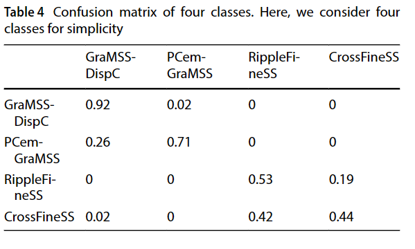

# 使用卷积神经网络对全岩心 CT 扫描进行岩性分类

数据集：

代码：

主要内容：CNN分类，发现会分错，用了层次聚类把分错的合并

[SN Applied Sciences](https://link.springer.com/journal/42452) 2.6

21年

---

X 射线计算机断层扫描 (CT) 图像作为整个岩心的数字表示，可以提供有关从井中提取的岩心的成分和内部结构的宝贵信息。将毫米级岩心 CT 数据纳入岩性分类工作流程可以产生高分辨率岩性描述。在这项研究中，我们使用 2D 岩心 CT 扫描图像切片来训练卷积神经网络 (CNN)，其目的是自动预测挪威大陆架上一口井的岩性。在训练之前对图像进行预处理，即自动标记不需要的伪影并从进一步分析中删除。训练数据包括通过手动岩心描述获得的专家推导的岩相类。经过训练的分类器用于预测分类器看不到的一组测试图像上的岩相。预测结果表明，不同类别的预测具有较高的召回率（高达 92%）。然而，存在与灰度值和传输属性的相似性相关的错误分类率。为了对获得的结果进行后处理，我们通过临时分析识别并合并了类似的岩相类别，***考虑了预测混淆矩阵的混淆程度，并借助孔隙度-渗透率交会图关系***。基于此分析，岩相类被合并为四个岩石类。另一个针对所得岩石类别进行训练的 CNN 分类器概括性良好，与手动岩心描述相比，在检测薄层和地床边界时具有更高的像素精度。因此，分类器为现有的岩石类型描述提供了附加和补充信息

## 1.介绍

岩相分类是表征储层和更好地了解其沉积环境的重要一步。为了预测储层饱和度并进行后续有效的储层建模，正确评估岩性特性（例如粒度、颗粒形状、分选和胶结作用）至关重要。这些岩性特性影响储层岩石的岩石物理和运移特性（例如孔隙度和渗透率）

用于岩性分类的传统测井解释通常会忽略测井分辨率以下的非均质性。目前，从井筒中提取的整个岩心是由地质学家和/或岩石物理学家团队通过直接目视检查来描述的。然而，这个过程非常耗时，并且最终的相分类可能会受到主观解释的影响

整个核心数据的提取目前需要大量的资本投资。因此，快速、自动化的岩心分类和相关的岩心分析被视为提高投资回报和增强整体决策流程的关键技术。

X 射线计算机断层扫描 (CT) 成像被视为以亚毫米分辨率检查整个岩心的最有效的无损方法之一，所得到的岩心数字图像有助于实现岩心分类过程的自动化。 CT 图像确实可以纳入分类工作流程中，以实现快速岩性分类 [10]。全岩心 CT 扫描在协助地质学家研究提取的岩心方面有着悠久的历史 [39]。更准确地说，2D 和 3D 全岩心 CT 扫描可提供有关储层岩石的纹理、成分和内部结构的高分辨率（亚毫米）信息。此外，整个岩心 CT 图像可以在相分析过程的早期阶段进行：当岩心仍在铝桶中时，可以在挤压之前使用这些数据

从技术角度来看，CT 图像中的每个体素都由一个灰度值表示，该灰度值表示一定程度的 X 射线衰减。该灰度值以及由此产生的衰减是基础材料的密度和有效原子序数的函数[36]。自第一代CT扫描仪以来，扫描技术经历了广泛的改进，目前的CT图像可以预测整个岩心化学成分和密度的2D和3D分布[19]。这些信息以及整个岩心扫描均以数字方式存储有助于对岩心内部结构进行实验室分析，用于岩石表征和塞钻位置评估。 CT 扫描和重建算法的最新改进，加上计算能力和图像分析的发展，为从整个岩心中提取更多信息开辟了新的可能性，从而提高了其在操作环境中的价值并促进了岩心分类过程的自动化

监督和无监督机器学习算法的应用在包括石油工业在内的许多学科中都有重要用途。最近，勘探和生产公司对大数据分析和自动化解决方案产生了广泛的兴趣，以减少运营效率低下的情况，从而减慢决策过程并造成相关收入损失

机器学习算法，特别是人工神经网络和支持向量机，已成功应用于多项研究中，以对岩相进行分类并使用测井或岩心塞测量来估计岩石物理性质

在基于图像的岩性分类方面，一些出版物利用深度学习方法根据光学岩心照片、钻孔图像测井、薄片和显微断层扫描图像对岩性进行分类。德利马等人。 [12, 13]采用深度学习和迁移学习技术对碳酸盐岩岩心图像进行分类。在另一份出版物 De Lima 等人中。 [14]探索利用深度卷积网络加速基于岩石薄片的微相分类。瓦伦丁等人。 [50]介绍了一种基于超声和微电阻率钻孔图像以及深度残差卷积网络的自动岩相识别方法。巴拉博什金等人。 [6]比较了几种著名的神经网络架构（AlexNet、VGG、GoogLeNet、ResNet）的性能，以根据光学岩心图像对岩石类型进行分类。此外，Anjos 等人还利用了深度学习技术。 [4]根据显微断层图像识别碳酸盐岩的岩性模式

在上述大多数出版物中，测井数据或岩心分析数据已被用作模型学习阶段的输入。然而，最近的趋势是将这两种信息集成在一起，可能还包括多尺度图像。更具体地说，Al-Obaidi 等人。 [3] 结合从图像测井中提取的岩石结构特性以及基于测井的岩石物理和成分估计，使用基于 k 均值的聚类方法执行自动岩石分类。

虽然人工智能已广泛应用于基于测井和岩心分析数据的相分类和岩石物理性质估计，但也有一些利用 CT 图像进行相分类和流动性质估计的方法。这些方法通过提取各种特征来利用 CT 图像的信息内容以进行聚类和分类。霍尔等人。 [19]预处理整个核心CT图像，从处理的图像中提取统计特征，并训练随机森林分类器来识别生物扰动的核心区间。 Odi 和 Nguyen [36] 利用从双能 CT 扫描中提取的密度、孔隙度和光电效应等物理特征，进行有监督和无监督的地质相分类。此外，模型经过训练可以学习 CT 提取的物理特征与现有用户定义的地质相描述之间的关系

冈萨雷斯等人。 [17]考虑了自动岩石分类的工作流程，该工作流程结合了传统测井记录、全岩心 CT 图像、光学岩心照片和常规岩心分析（RCA）数据。在此工作流程中，首先从整个岩心 CT 图像和岩心照片中提取与岩石结构相关的特征，然后通过聚类算法用于确定岩石类别。最初，作者假设了几个岩石类别，然后通过迭代增加类别数量并将基于渗透率的成本函数最小化到某个阈值以下来优化这个数字。获得的岩石类别最终用于训练人工神经网络以根据测井数据预测类别。申等人[10]采用支持向量机（SVM）利用从二维横截面全岩心 CT 图像中提取的一阶统计量和灰度共生矩阵（GLCM）特征来自动分类岩相。作者使用 SVM 模型来学习提取的特征与专家得出的手动核心描述之间的关系。

在所提到的出版物中，相分类是使用各种统计和纹理特征形式的CT图像的信息内容来执行的。然而，CT 图像并不直接用作基于机器学习的分类的输入

在本研究中，我们提出了一种***自动岩相分类的工作流程***，该工作流程使用整个岩心 CT 图像切片作为输入来训练 CNN 模型。在所提出的方法中，消除了手动特征提取的需要，因为网络在一组 CT 图像上进行训练时可以学习相关特征。获得的结果表明，经过训练的分类器能够以令人满意的精度区分某些岩相类别。然而，具有相似纹理和灰度值的岩相类别是混乱的。在我们的工作流程中，从以下位置获取的信息预测结果用于根据输运特性的相似性来评估错误分类的岩相类别。此外，作为分类后处理步骤，进行层次聚类分析，使用预测混淆矩阵自动对相似的岩相类别进行聚类，然后使用这些结果以及孔隙度-渗透率关系将 20 个岩相类别分为 4 个岩石类

## 2.方法

简而言之，我们提出了一种使用整个核心 CT 图像和 CNN 的自动岩相分类工作流程，如图 1 所示。整个方法从 2D DICOM（医学数字成像和通信）图像的预处理开始。然后根据用户定义的地质岩心描述将岩相标签分配给处理后的图像。岩相简单地指的是可通过其纹理、粒度和沉积环境来区分的岩性细分。标记的图像被进一步增强并用作训练 CNN 分类器的输入。然后在一组未见过的图像上验证经过训练的分类器以预测岩相类别。然后，将被认为足够相似的岩相类别组合成岩石类别（即将相似的岩相类别组合形成一个岩石类别）；在此步骤中，从传输特性（孔隙度和渗透率）的评估以及学习算法产生的混淆矩阵中的混淆程度开始计算相似性指数。此外，分类器相对于级别的数量；换句话说，分类器是用较少数量的岩石类别进行训练的。最后，采用粗化分类器来预测一组未见过的图像上的岩石类别。

图1 岩相分类建议工作流程

在下面的小节中，将详细解释 CNN 算法及其一般架构，然后介绍本研究中采用的图像预处理和图像增强过程

### 2.1卷积神经网络

卷积神经网络（CNN）在许多科学和行业中都有重要的应用。事实证明，它们在图像识别、语音识别和分类领域特别有效。一般来说，神经网络从人脑中汲取灵感。如前所述，此类算法直接从输入训练数据中学习相关特征，因此不需要主题专家手动提取特征。大多数现代 CNN 架构由交替的卷积层和池化层组成，后面是全连接层。卷积层和池化层处理特征提取，而全连接层将这些提取的特征映射到最终输出。对于 CNN 的广泛讨论，我们建议感兴趣的读者参考[53]。在卷积层中，执行卷积运算，即将一组可优化的卷积核叠加在由二维像素阵列表示的图像的每个位置上。将核的元素与输入图像中的感受野进行逐元素相乘，将乘积结果求和并存储在输出特征图中的相应位置。一旦计算并存储了该特定位置的卷积运算，内核就会水平或垂直移动一个称为步幅的偏移量。重复此过程，直到覆盖整个图像并且完全填充生成的特征图。卷积层是局部连接的，而在经典神经网络中，每个神经元都完全连接到其他层中的神经元。为了引入非线性，卷积运算的输出通过激活函数。最常见的激活函数是修正线性单元（ReLU）；使用这个特定函数的优点是它可以在训练过程中快速有效地收敛。卷积层的特征图输出记录了输入图像中现有特征的确切位置。因此，输入图像中的微小空间变化将产生不同的特征图。为了解决这个问题，在将非线性激活函数（例如ReLU）应用于卷积运算的特征图输出后添加池化层。选择将池化操作应用于每个单独的特征图。两种常见的池化函数是平均池化和最大池化。添加池化层的优点是池化特征图对于输入图像中的局部平移和空间变化（例如边缘、角度、特征位置等）保持不变[24]。然后，从最终池化层得出的下采样特征图输出被展平为一维值数组，该数组连接到一个或多个全连接层（称为密集层）。这里，输入节点通过可学习的权重连接到输出节点[53]。提取的特征最终通过全连接层映射到网络的最终输出。通过在每个全连接层后面添加激活函数（例如ReLU），也可以在全连接层中引入非线性。请注意，应用于最终全连接层的激活函数通常与其他层不同，并且根据任务类型（即分类和回归）进行选择。多类分类的常见激活函数是所谓的“softmax”函数，它返回预测类别的概率分布，即将最后一层的输出转换为预测输出类别概率

### 2.2有关可用数据类型的信息

所提供的 CT 扫描数据由每个岩心层段的各个横截面图像切片组成。因此，每个核心的图像切片数量不同，因为取决于核心本身的长度和相应的垂直图像分辨率（即，每米核心拍摄多少图像）。例如，如果垂直图像分辨率为 0.4 毫米，单个岩芯长度为 1 米，则该 1 米岩芯间隔会产生超过 2000 个独立图像文件。在我们的数据集中，图像切片以 16 位无符号 DICOM 格式存储，这是一种为医学图像开发的标准格式 [34]。然后使用 ImageJ 软件将各个核心的 DICOM 图像堆叠在一起并存储为 3D 原始图像

### 2.3 图像预处理 

为了准备图像作为 CNN 训练过程的输入，我们需要丢弃不需要的非核心区域。来自某些区域的图像可能会对分类结果产生负面影响，因为它们包含与我们想要的实际现象无关的信息

我们采取的第一步是通过将 3D 原始图像切片裁剪为大小为 256 × 256 像素的矩形裁剪来消除边框效果。图 2 显示了裁剪前后示例图像的比较。裁剪后，通过观察所有矩形裁剪的 3D 直方图选择的全局最小和最大强度值被分配给整个矩形裁剪的图像。考虑核心区间。此外，强度调整后的图像以 8 位格式（即 0-255 灰度）进行编码，并存储以供进一步分析

另一种预处理操作包括删除与岩心恢复不良、诱发裂缝或冲塞相关的丢失数据的图像。请注意，缺少核心间隔的图像切片显示出较低的灰度衰减值

我们还注意到，图像数据集包含许多其他与岩心管接头、钻井泥浆侵入以及黄铁矿和菱铁矿等高密度矿物胶结相关的不需要的人工痕迹（示例如图 3b 和 c 所示）。 ）。此外，这些区域需要从训练集中排除

为了标记并删除上述伪影，我们对原始数据实施了专用的类型相关算法。更准确地说，为了消除缺失的间隔，我们使用覆盖像素总数 40% 的中心正方形来计算图像中心的平均衰减 c。如果计算出的平均衰减小于预定义的截止值 C m ，则图像将被标记并删除：

其中 f m 是缺失间隔的标志。如果 f m 等于 1，则图像将被删除。具有高密度材料的间隔看起来非常明亮，具有相对较高的灰度级衰减读数。为了识别这些间隔，计算整个 2D 图像的平均衰减，如果平均值大于预定义的截止值 Ch ，则将图像标记为要删除：

在有岩心筒耦合的区间，图像中间的衰减值低于图像边缘的衰减值（即边缘较亮，如图 3c所示）。为了检测岩心筒耦合的间隔，需要计算 2D 图像中心和边缘的平均衰减差。如上所述，使用中心正方形考虑像素总数的 40% 来计算中心平均衰减 c。为了表示边缘平均衰减 e，考虑沿边缘的像素总数的外部 5%。如果中心平均衰减与边缘平均衰减之差衰减大于预定义的截止值 C b ，图像间隔被标记并删除

其中 f b 是核心筒耦合标志。如果 f b 等于 1，则删除图像。请注意，上述阈值是使用数据集中观察到的最小、平均和最大强度值的全局分布计算的。

最后，为了减少与 CNN 训练相关的计算时间，剩余的 2D CT 图像被粗化四倍（即最终图像大小为 64 × 64 像素）。此外，在用作 CNN 训练的输入之前，图像会被重新缩放，即所有像素值除以 255

### 2.4 图像增强

一般来说，深度神经网络需要大量的训练数据才能获得良好的性能。图像增强是一种通过对原始图像进行不同类型的修改（例如随机旋转、移位、剪切和翻转）来提高网络性能的策略。在训练阶段应用图像增强，以便模型可以从更多图像中学习例子。在我们的框架中，我们特别考虑了原始图像的旋转和水平翻转。因此，我们使用 Keras API [11] 在 Python 中实现了“ImageDataGenerator”类，这是一种可用于动态图像增强目的的公开代码。 “ImageDataGenerator”类在用户定义的角度范围内随机旋转图像。因此，在方形图像的情况下，对于某些特定的旋转角度，像素很可能会脱离图像帧，从而使图像的某些区域没有像素。有许多插值技术（例如最近邻）可用于这些区域，但它可以修改关键特征，从而导致不同的特征对训练产生反作用。为了避免这个问题，图像在 Keras 外部旋转，而在训练 CNN 分类器期间使用“ImageDataGenerator”类动态在 Keras 中应用水平翻转。图像旋转了 90°、180° 和 270°。旋转和水平翻转图像的示例如图 4和5。

测井数据和岩心 CT 图像的二维横截面显示了所研究井的 142 米。测井轨迹从左到右：轨迹 1：地层，轨迹 2：卡尺 (CALI) 和伽马射线 (GR)，轨迹 3：密度 (DEN) 和中子 (NEU)，轨迹 4：深电阻率 (RDEP)，第 5 道：光电因子 (PEF)，第 6 道：压缩波慢度 (AC) 和横波慢度 (ACS)，第 7 道：全岩心 CT 扫描的 2D 横截面

## 3.数据集

### 3.1全核心CT扫描图像

本研究使用挪威大陆架一口井的整个岩心横截面图像切片。这研究井钻穿了 4 个主要地层，如图 5 中的 Fm.1、Fm.2、Fm.3 和 Fm.4 所示：地层 1 由极细粒的泥质砂岩和胶结砂岩组成，地层 2 由连续的泥岩层和地层 2 组成。细粒砂岩，地层 3 由富含颗粒的中粒砂岩和针状岩（由海绵二氧化硅针状体组成的生物岩）组成，地层 4 由富含泥和方解石的泥灰岩组成。正如《小节》中提到的。 2.3 中，图像以 16 位无符号 DICOM 切片形式提供，垂直分辨率约为 0.45 毫米。各个 DICOM 图像被堆叠并存储为 3D 原始图像，然后切割成矩形作物。此外，在以 8 位格式编码之前，为所有图像分配了全局最小和最大强度值。如上所述，删除了具有不需要的伪影的图像，并将剩余图像粗化了四倍以减少计算时间。

### 3.2所采用的岩心描述中的岩相

我们利用从地质学家手动进行的基于岩心的岩性描述中获得的信息作为创建训练岩相类的基础事实。然后训练 CNN 分类器来学习卷积过程提取的图像特征与相应岩相类别之间的关系。为了为了完整起见，我们报告我们的数据集提供了通过上述手动岩心描述导出的 20 个岩相类（缩写类和简短描述见表 1）。最丰富的三种岩相是泥岩（海相和陆相）、分散胶结的富颗粒中粒砂岩和不同结构/纹层（波纹、交层和块状）的细粒砂岩；这些与其他稀疏岩相互层

## 4.训练阶段

在本节中，将详细解释训练阶段。本节从用于分离训练和测试样本的策略开始，然后是训练步骤和超参数优化过程

### 4.1训练数据集与测试数据集的划分

标准数据分析范式是在一组被视为基本事实的数据上训练机器学习模型，然后在另一组未见过的实例上评估其统计性能，再次在手动标记过程中被视为正确标记。考虑到数据集中图像的统计分布，我们评估了合适的训练集与测试集分割比率是训练为 80%，测试为 20%。为了保持连续的间隔并同时平衡每组内岩相的频率，手动选择训练集和测试集。不随机选择训练集和测试集的原因是图像变化缓慢，因此随机选择会在两组中给出相似的数据点。大约 20% 的训练集被用作验证集，用于评估训练期间模型的性能（参见第 4.2.3 节）。为了完整起见，图6给出了所得训练集和测试集中不同岩相类别的分布，从中我们可以看到两个集合中相似的类别分布。

图6 训练集（蓝色）和测试集（红色）不同岩相类别的分布

### 4.2CNN训练过程细节

CNN 训练是一个过程，通过该过程，可以调整卷积层中的内核权重、全连接层中的权重及其相关偏差，从而使预测标签与给定标签之间的差异（即，真实情况）被最小化。训练通常是通过使用梯度下降优化算法和损失函数在整个网络中进行前向和反向传播过程来执行的。损失函数计算通过前向传播计算的输出预测与实际标签之间的差异。网络使用损失函数评估性能。交叉熵通常用作多类分类任务的损失函数，而均方误差通常用于连续值的预测，即回归分析[53]。在当前的研究中，我们正在处理多类分类任务。因此，我们使用交叉熵来确定 CNN 模型的损失函数，如下所示：

其中yi和yi分别是第i个样本的真实标签和预测标签，p是概率，而N是训练样本总数

如上所述，可学习参数使用梯度下降优化算法迭代更新，旨在最小化交叉熵损失。基本上，首先计算损失函数对于每个可学习参数的偏导数；一旦计算出整个损失函数梯度，可学习参数将使用以下方法更新：

其中w指的是每个可学习的参数，w+是更新值，代表学习率，L是损失函数。学习率是一个重要的超参数，它决定了可学习参数（例如权重）在梯度方向上移动的速度。请注意，在训练期间找到最佳学习率对于神经网络至关重要，因为使用太高的学习率时训练过程可能不会收敛， 在这种情况下，事实上，优化器超出了最小值并落在参数空间的一个区域中，导致更糟糕的损失值）。为了避免这个问题，通常采用各种类型的优化器，以便使用一组不同的梯度下降策略来搜索最佳权重和内核参数，然后在其中选择最好的一个。不同类型的下降方法的例子有随机、批量和小批量梯度下降。这些方法在用于计算实际标签和预测标签之间的误差的样本数量方面有所不同。在我们的研究中，我们评估了 RMSProp [20] 和 Adam [29] 优化器优化权重的性能。获得的结果表明 Adam 优于 RMSProp。因此，我们最终使用 Adam 优化器结合小批量梯度下降法来优化权重。请注意，这是深度学习中最常见的梯度下降变体；为了给出一些直觉，小批量梯度下降将训练数据分成小批量，并在更新可学习参数之前计算每批的误差。在我们的研究中，最终的最佳方法是考虑 32 个图像的批量大小和 70 个时期的 CNN 分类器训练过程（其中时期是所有训练样本至少向网络呈现一次的时期） 

一般来说，机器学习算法中存在两种类型的参数。正如章节中提到的卷积层中的内核权重、全连接层中的权重以及它们相关的偏差都是可学习的，因此可以在训练过程中进行优化。第二类参数，称为超参数，决定最小化成本函数的结构，需要由用户设置。这些超参数包括学习率、卷积层数量、卷积层中的核数量以及全连接层中的神经元数量。很容易认识到机器学习模型的性能高度依赖于参数和超参数的正确选择。调整超参数的过程称为超参数调整。

如前所述，此处提出的 CNN 分类器是使用 Tensorflow 后端在 Keras 中开发的。在我们的例子中，我们使用 Keras 调谐器库 [30,37,40] 解决超参数调整问题。该库能够定义一个搜索空间，其中包括所考虑的超参数和一个合适的调谐器，该调谐器将自动解决该调谐过程。更准确地说，调整器的任务是评估为超调整而明确设置的模型（即超模型）中一定数量的超参数组合。本研究中考虑的超参数如表 2 所示。Keras 有四个可用的调谐器，包括随机搜索、Hyperband、贝叶斯优化和 Sklearn。有关这些方法之间差异的更多信息，我们引导感兴趣的读者参考[7,23,32,47]。在本研究中，我们利用 Hyperband 算法 [32]，这是一种相对较新的迭代算法调整方法。基本上，这种方法背后的策略是使用自适应资源分配和提前停止规则来尝试大量随机配置，以快速收敛到高性能模型。更具体地说，随机配置在每个配置中运行特定数量的时期（即一个或两个），然后基于先前的结果对表现最好的模型配置进行更长的运行训练。最后，该算法返回训练到指定最大时期数的最佳配置。通过该超参数选择过程获得的优化分类器架构如图 7 所示，并在下一节中详细描述。

所提出的 CNN 分类器架构如图 7 所示。其输入和输出层由 2D 图像切片和从可用岩心描述导出的岩相类组成。该分类器采用四个不同的卷积层，分别表示为“Conv1”、“Conv2”、“Conv3”和“Conv4”，分别为 240、48、48 和 240分别是卷积核。请注意，这里我们使用的内核大小为 5 × 5；这个特定的维度确实是超参数调整过程中的最佳结果，并且已在我们所有的卷积层中使用。为了保留原始图像大小，我们还在每个卷积层中应用了零填充技术；即，我们在图像边缘周围添加了一层值为零的像素。在我们的方案中，每一层中的卷积运算都使用步长 1 执行，所得的特征图通过 ReLU 激活函数来引入非线性。在我们的上下文中，步幅基本上是当内核在整个输入图像中移动时的像素移位数。应用ReLU函数后，特征图被发送到后续的池化层，在池化层中使用池化窗口大小为2×2、步长为1的最大池化层进行下采样。最后一个卷积层的池化特征图为展平为一维向量，该向量连接到全连接层中的输出层。所提出的网络包含一个具有 256 个神经元的隐藏层。如前所述，隐藏层神经元的数量是一个超参数，在超参数调优过程中进行了优化。 ReLU 函数也应用于隐藏层，然后是 dropout 层。 Dropout 是一种正则化技术，在训练过程中丢弃随机选择的神经元（即，将它们与其传入和传出连接一起暂时从网络中删除）。在反向传播阶段不使用丢失的神经元 [21, 48]。在所提出的网络中应用了 0.2 的丢弃率，这意味着隐藏层中五分之一的神经元将在每次更新迭代中被随机忽略。如表 2 中所述，dropout 率是一个超参数，与其他参数一样，在超参数调整阶段进行优化。这种正则化方案旨在防止过度拟合，并且可以解释为优化整体估计量的偏差-方差权衡的尝试。有关正则化统计解释的更多详细信息，请参阅[44]。深度学习中另一种常见的正则化技术是批量标准化。在批量归一化中，卷积层的输出在用于下一个层之前先进行归一化。众所周知，该技术还具有正则化效果，并且根据经验，通常可以加速网络训练，并使其对初始化点不那么敏感[26]。然而，我们注意到，这在一般设置中并不能得到保证——事实上，在当前的研究中，在不使用批量归一化的情况下获得了更准确的结果。图7中的最后一层是输出层，有20个节点对应20个岩相标签。所提出的架构提供了 1'628'612 个可训练参数

如前所述，20% 的训练图像被用作验证集。交叉熵损失和准确率被视为训练指标，用于评估 CNN 分类器在训练过程中的性能。图 8 显示了训练过程中准确率和交叉熵如何随时间变化。从图中可以看出，分类准确度随着训练集和验证集中历元数的增加而增加。然而，交叉熵损失随着时期数的增加而减少。训练指标在 70 个 epoch 左右开始收敛

## 5结果

在一组未见过的图像上使用经过训练的分类器获得的岩相分类结果将在以下部分中介绍和讨论

### 5.1岩相预测

为了评估经过训练的 CNN 分类器对未见过的数据的性能，该模型用于预测井的另一部分（之前称为测试集）的岩相。为了保持一致性，测试图像在实际分类之前经过相同的图像预处理和重新缩放过程。表 3 和图 9 总结了通过对岩心描述（分类基础事实）和 CNN 预测对岩相类别进行交叉分类计算出的相应预测精度指标和混淆矩阵。这里，精度定义为真实岩相类别的总和。正例除以测试集中的样本总数（即正确分类的概率）。精度被量化为测试集中所有岩相类别的真阳性总和除以真阳性和假阳性总和。换句话说，精度表示在给定分类结果的情况下，预测岩相类别的概率。

这里说了***会把相似孔隙度渗透的岩石分到同一类中***，具体看论文

## 6.分类后处理

在上一节中，我们提到***混淆矩阵可以提供有关不同岩相类别之间的相似性和关系***的宝贵信息，然后我们表明，***混淆的岩相类别表现出相似的孔隙度-渗透率趋势。***事实上，在图 11 中，我们看到错误分类的岩相根据孔隙度和渗透率关系分为四个不同的岩石类别。这引导我们考虑是否可以根据岩相类别的数量来粗化岩相分类任务。为此，受 Godbole [16] 的启发，我们使用从混淆矩阵获取的信息，根据不同岩相类别的混淆程度生成岩相层次结构

### 6.1 自动生成岩相层次

层次聚类是聚类分析中的一种方法，旨在基于预定义的相似性度量构建聚类层次结构。一般来说，在进行层次聚类分析时考虑两种方法，即凝聚聚类和分裂聚类[27]。凝聚聚类，也称为“自下而上”方法，从单簇中的每个元素开始，并且连续合并成对的簇，直到满足特定的停止标准。分裂者也称为“自上而下”方法，从单个集群中的所有元素开始；然后通过在层次结构中向下移动来递归地执行分裂。在层次聚类中，相似的簇使用相似性度量连续分组，该相似性度量通常是在特征空间上定义的距离度量[27]。最常见的相似性度量是欧几里德距离、马哈拉诺比斯距离和库尔贝克-莱布勒距离度量。有不同的方法来测量簇之间的距离；其中，单链接[46]、完全链接[28]和最小方差（Ward）[51]方法是最流行的方法。更具体地说，单链接（或最近邻）聚类方法从两个聚类中查找具有最小距离的元素对。换句话说，这种方法基本上递归地考虑两个簇中最接近的元素对来测量距离。相反，在完全链接方法中，两个簇之间的距离计算为两个簇中最远元素之间的距离。在这两种情况下，具有最小距离测量的簇被合并以形成更大的簇。单链接算法实现起来很简单，但众所周知，它会受到链接效应[35]的影响，从而产生拉长的簇和长链。相比之下，完整的链接算法强制直径和球形簇保持一致。 Ward 聚类方法是目标函数方法的一个特例，它寻找元素的聚合偏差。事实上，该方法假装合并两个簇，然后估计所得簇的质心，并计算所有元素与新质心的偏差平方和。然后，该算法选择簇内方差最小的合并或与新质心偏差最小的合并。层次聚类的输出以树状图形式呈现，表示元素的嵌套聚类及其相似性级别

在本研究中，我们使用分类器的***经验混淆矩阵***作为层次聚类各种岩相之间距离的定量测量。这对应于使用欧几里得距离作为混淆空间中岩相类向量之间的类间相似性度量。更准确地说，在我们的工作中，***欧几里德距离是通过对两个类向量的坐标值的绝对差求和来计算的。为***了举例说明该过程，请考虑表 4 中的混淆矩阵，为简单起见，我们仅显示与四个类别相关的结果。每个类由混淆空间中的向量表示，即GraMSSDispC = {0.92, 0.02, 0, 0} 表示 GraMSSDispC岩相类。然后通过对类对的坐标值的绝对差求和来计算上述欧几里德距离。通过这种方式，可以计算上三角相似度矩阵，如表 5 所示。这尤其清楚地表明 RippleFineSS 和 CrossFineSS 类是本文考虑的类集中最相似的类。用于举例说明该过程的子混淆矩阵

然后在原始完整混淆矩阵中执行和观察上例中的计算和考虑；然后将所得的相似度矩阵用作分层凝聚聚类步骤的输入

由该聚类步骤产生的树状图如图 14 所示，并显示了将相似岩相类别聚类在一起的总体结果。值得一提的是，不同的聚类方法会产生不同的树状图结构。在这项工作中，我们首先使用上述所有三种方法（即单链接、完全链接和 Ward 方法）执行层次凝聚聚类；然后我们观察到，在这些方法中，Ward 方法返回的聚类结构在保持岩相具有相似的传输方面是最一致的。

我们还注意到，树状图中的垂直轴用作显示岩相类别相似性的参考距离。这意味着该图不仅显示了类别的不同程度，还显示了岩相聚类发生的顺序。我们注意到，获得的树状图清楚地反映了混淆空间中岩相类别的语义相似性。事实上，例如，该图显示泥岩和块状超细粒绿砂岩 (MassVeryFineSS) 类被分组在任何其他岩相类之前；这与以下事实相符：从岩性角度来看，这些相是我们所考虑的类别中最相似的相。第二个最相似的岩相类别是波纹交错层理（RippleFineSS）和交错层理细粒砂岩（CrossFineSS）。正如应该的那样，它们在获得的树状图中形成层次结构中的第二个簇。相反，第三组是通过将泥质细粒砂岩和胶结良好的砂岩与箭石化石融合而形成的。然后，这个新形成的簇与相似距离更高级别的第一个簇合并。此外，泥质细粒砂岩（ArgFineSS）类簇生有针状砂岩。这些岩相类别在混淆空间中彼此显示出高度的混淆，如图 1 所证实。

当我们向上探索树状图时，聚集在一起的岩相类别的相似性会降低。我们确实可以注意到，层次聚类源于岩相类别的相似性混淆空间主要导致具有相似粒度、结构和传输特性的岩相分组。然而，作为一个例子，我们注意到，胶结良好的中粒砂岩（WCemMSS）类首先与胶结不良的富含颗粒砂岩类（PCemGraMSS）合并，并且在稍高的水平上，它们与颗粒类合并。富含分散胶结物的砂岩 (GraMSSDispC)。回想一下，之前表明，富含颗粒的岩相岩心测量分布在渗透率值范围从 30 mD 到 50 Darcy 的高区域（即图 11 中的绿色椭球体），其中大多数样品的孔隙度和渗透率值分别高于 0.20 和 1 达西。另一方面，胶结良好的砂岩样品（WCemMSS）的特征是孔隙度和渗透率值分别小于 0.10 和 5 mD。因此，合并这些具有完全不同的传输属性的类似乎并不合理。

### 6.2 使用 Coarsened CNN 分类器进行岩相预测

正如上一小节所提到的，当前的岩相分类任务可以通过合并类似的错误分类岩相类别来粗化类别数量。更具体地说，根据孔隙度-渗透率关系和层次聚类结果，我们建议将岩相类别分为四个岩石类别，如表 6 所示。

按照这种分类，可以修改从手动核心描述导出的真实标签，以反映上面的 4 个超类，而不是原来的 20 个超类。这意味着我们可以使用这组新标签重新训练上面提出的原始 CNN 分类器，并执行新一轮的测试。生成的混淆矩阵如图 15 所示，从中我们可以看到分类器能够预测具有高召回值的岩石类别 1、2 和 4。

然而，岩石类别 3 的预测仍然具有相对较低的召回率 (0.65)，并且它大多与岩石类别混淆1 和 4。为了检查原因，请考虑相应的岩石类别，如图 16 所示。该图显示粗化分类器概括性良好，并且可以高精度预测各个岩石类别。该分类器甚至在检测薄层和地床边界方面表现出更高的像素精度，以至于能够检测到手动岩心描述未选取的薄层。作为示例，在图16中，2D CT图像横截面显示了图16A中绿色矩形标记的部分中灰度值的明显变化。在这里，我们看到多孔性和渗透性更强的层（以较暗的灰度值为特征）下面是由红色矩形标记的更紧密的层。与上面和下面的层相比，致密层的特点是灰度值更亮，但在手动岩心描述过程中并未选择这一点。同时，该层被CNN分类器准确地检测到。对此进行更多调查层段揭示致密层实际上是包裹在块状细粒砂岩岩相中的大方解石结核（见图17）。该方解石结核被归类为 1 类岩石，其中包含具有大量方解石胶结物的岩相类别，很可能是由于相似的灰度值

## 7.结论

本研究研究了 CNN 基于 2D 全岩心 CT 图像切片的岩性分类能力，并对其性能进行了详细表征。 CNN 分类器经过训练，可以学习与源自手动岩心描述的 20 种不同岩相类别相关的特征。然后使用经过训练的分类器来预测未见过的测试集图像上的岩相。初步结果表明，经过训练的分类器表现出与岩相相关的性能，并且在不同程度上对具有相似粒度、灰度值和传输特性的特定岩相类别进行了错误分类。然后将获得的预测混淆矩阵用作了解 CNN 分类器的性能限制并使用自动分层聚类方法将相似岩相组合到岩石类别中的有价值的工具。将 CNN 分类器应用于这些聚类类别表明，新方法可以很好地概括并预测具有高召回值的岩石类别。此外，与专家得出的核心描述相比，它在检测薄层时表现出更高的像素精度，从而提供比手动标记过程中提取的信息更高分辨率的信息。所提出的分类器是基于岩相类分布不平衡的单井数据进行训练的。这可能会导致比例较低的类的预测性能较低。为这些类别添加更多训练图像（最好是具有类似岩性的其他井）可能会对分类器的性能产生积极影响。正如预期的那样，与手动岩心描述、交换和倾斜岩相相关的不确定性也会影响训练过程和训练分类器的泛化能力。值得一提的是，网络架构可能会影响结果，但预计不会改变本研究的结论。为了进行比较，对 VGG16 架构 [45] 进行了测试，其性能与建议的架构进行了比较。然而，CNN架构的这种变化对获得的结果影响很小
