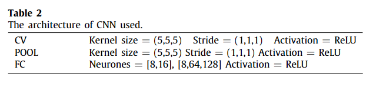

# 利用机器和深度学习通过 X 射线微计算机断层扫描估算复杂碳酸盐岩的渗透率

数据集：

代码：

主要内容：通过孔隙网络模型（pnm）机器学习 (ML) 预测的复杂碳酸盐渗透率

Energy Reports 5

21年

---

准确估计渗透率对于油气藏开发和管理至关重要，因为它控制着生产率。在评估了从孔隙网络建模 (PNM) 到格子玻尔兹曼方法 (LBM) 等数值技术后，开发了一种基于人工智能的工作流程，用于通过 X 射线微计算快速准确地估计复杂碳酸盐岩石的渗透率。断层扫描（显微 CT）图像。在使用图像处理和 PNM 进行特征工程之后，我们使用浅层和深度学习算法在数千张分段 3D 微 CT 图像上训练和测试工作流程以评估渗透性。实施和测试了多种监督学习算法，包括线性回归、支持向量回归、改进的梯度提升和卷积神经网络。此外，我们还探索了一种混合物理驱动的神经网络，该网络同时考虑了 X 射线显微 CT 图像和岩石物理特性。最后，我们发现通过机器学习 (ML) 预测的复杂碳酸盐渗透率与计算量更大的基于体素的直接模拟的预测非常一致。此外，与 LBM 相比，这里开发的 ML 模型将计算时间大幅减少了大约三个数量级。本文强调了特征工程在通过机器和深度学习预测岩石物理特性方面发挥的关键作用。所提出的框架集成了多种学习算法、岩石成像和建模，有可能快速准确地估计岩石物理特性，以帮助油藏模拟和表征

---

## 一、介绍

[PNM孔隙网络模型介绍-2021-10-29 22:44:18_哔哩哔哩_bilibili](https://www.bilibili.com/video/BV1Xu411d7Qq/?vd_source=6f8e70b7069d78f1150a7748b3d70a2f)

预测常规岩心和特殊岩心分析的性质对于准确描述油藏至关重要，这对提高采收率（EOR）策略、完井设计和油藏管理有直接影响。石油和天然气行业节奏快且拥有大量数据，使其成为数据驱动方法的主要候选者。岩石物理性质的有效估计对于储层表征和生产至关重要（Davarpanah 等，2018；Hu 等，2020）。由于观测和测量尺度上都存在固有的非均质性，碳酸盐岩储层的表征仍然非常困难（Andrä等，2013）。渗透率代表孔隙空间微观结构的特征和岩石传输流体的能力，是多孔介质表征最重要的属性之一。在石油和天然气行业，了解渗透率对于实现所需的商业石油和天然气生产率至关重要由于渗透率不存在普遍关系，因此需要有效的工具来估计渗透率，并且是正在进行的研究的主题。

达西尺度储层岩石物理性质受孔隙尺度流动性质控制，数值模拟是从孔隙尺度升级到达西尺度的唯一实用方法。然而，孔隙尺度成像和建模的缺点之一是进行精确模拟所需的计算能力。孔隙尺度的岩石物理性质（例如流动和弹性性质）的数值计算可以分为两类：（i）***孔隙网络建模***（Dong 和 Blunt，2009）和（ii）***直接建模***，其中包括有限差分法(Mostaghimi et al., 2013; Blunt et al., 2013)、有限元法(Andrä et al., 2013; Sun et al., 2020)、有限体积法(Guibert et al., 2015) ；Tembely 等，2017）、平滑粒子流体动力学方法（Pereira 等，2011）和格子玻尔兹曼方法（LBM）（Blunt 等，2013）。由于其简单性，***孔隙网络建模（PNM）比更密集的直接模拟更适合预测岩石物理性质***。然而，PNM 方法基于简化几何形状的孔隙空间，没有提供可靠的估计。为了克服 PNM 固有的局限性，开发了机器和深度学习算法来实现快速有效的渗透率计算。所提出的工作流程可以扩展到基于 3D 图像的其他岩石物理特性的计算，***例如弹性和多相流特性***的估计。

机器学习（ML）具有规范化、泛化和分析复杂交互的潜力，近年来在人工智能（AI）领域重新引起了人们的兴趣（Serre，2019）。它已被应用于解决许多学术研究和工业挑战，包括流体动力学（Brunton 等人，2020）、石油工程（Kohli 和 Arora，2014；Alkinani 等人，2019）和医疗诊断（Yala）等人，2019；Chilamkurthy 等人，2018）。然而，石油和天然气行业中的大多数人工智能应用都集中在岩石定型和分类（Mandal 和 Rezaee，2019）、测井特性估计以及最近的井位和钻井优化（Pollock）等人，2018；Nwachukwu 等人，2018）。致力于根据 3D 微 CT 扫描估算岩石物理特性的研究非常少。尽管深度神经网络在复杂问题中提供了极大改进的预测能力，但很少有人致力于将其应用到数字岩石物理（DRP）中，以估计并可能加速岩石物理特性的计算。最近，苏达科夫等人。 (2019) 尝试使用机器学习 (ML) 来估计渗透率；然而，该模型依赖于不太可靠且通常不准确的 PNM 模拟作为 ML 模型的输出（或目标）。此外，没有考虑岩石物理特征工程的分析和融入。最后，在吴等人中。 (2018)，机器学习用于基于简单的二维合成图像来预测渗透率，该图像与实际的储层岩石不对应。同样，在 Araya-Polo 等人中。 (2020) 使用来自 11 个碎屑岩储层的二维薄片图像，利用卷积神经网络 (CNN) 来估计渗透率。同样，值得一提的是 Wang 等人最近的工作。 (2020) 使用 CNN 来估计基于通过随机重建方法再现的多孔介质的扩散率。 Miao 等人开发了一种使用 ML 的有趣方法。 （2017）根据许多孔隙形状或几何参数准确估计水力导度。他们的机器学习模型在二维碳酸盐和砂岩图像上进行了训练和测试。估计的水力传导度约为 90%，误差范围为 20%。尽管如此，3D 几何形状的渗透性评估仍有待解决。然而，与目前专注于简化孔隙空间的方法相比，依赖于实际岩石孔隙空间的工作流程有望改善渗透率预测。 Rabbani 和 Babaei (2019) 结合 LBM 研究了孔隙网络几何形状。由于其精度，LBM被用来计算孔喉网络的渗透率，这比PNM采用的经典哈根-泊肃叶方程更准确。通过采用基于图像的特征结合 ML 来评估 LBM 喉道渗透率，可以最大限度地降低总体计算成本。为了降低LBM计算成本，Alpak等人开发了一种基于相场形式主义的图形处理单元加速LBM。 (2019) 模拟 X 射线显微断层扫描图像的两相流。该模型能够捕捉包括折断、海恩斯跳跃和毛细管去饱和等现象。

尽管 PNM 在孔隙尺度建模中得到广泛应用，但该方法在根据 3D 微 CT 图像预测岩石物理特性方面表现出某些固有的局限性。 ***PNM 的缺点之一是该模型依赖于简化的孔隙空间来描述流过（或多或少复杂）多孔介质的流体。*** 为了弥补这些缺点，对于直接求解孔隙几何形状中的流动控制方程而无需任何简化至关重要。然而，由于LBM的计算成本较高（Alpak等，2019；Rabbani和Babaei，2019），解释所有相关的物理过程和孔隙空间的微观结构具有挑战性（Xie等， 2016）。应当指出的是，目前估计孔隙尺度渗透率的技术可分为直接法和间接法。 LBM 被认为是一种直接方法，其中直接在分段图像上进行模拟，对应于孔隙空间，没有与网格划分相关的不确定性，而 PNM 使用简化的几何结构，限制了其预测能力和准确性

由于直接模拟的计算成本较高，在大多数孔隙尺度建模中，渗透率是使用 PNM 计算的，并被认为是样品或显微 CT 图像的实际渗透率。然而，正如我们在本文中所证明的，更准确的基于体素的 LBM 方法和 PNM 得出的渗透率之间存在显着差异。这种差异在当前复杂碳酸盐岩的情况下更为明显，这与我们之前致力于简单砂岩的工作不同（Tembely 等人，2020）。在这种情况下，机器和深度学习可能是有效估计图像渗透性的一个有吸引力的替代方案

在本文中，我们利用中东复杂***碳酸盐岩的 X 射线显微 CT 图像***来评估用于在孔隙尺度建模背景下计算渗透率的三种数值技术的比较分析。***通过使用最大球算法，首先根据二值 3D 图像创建孔隙网络，然后将简化的孔隙空间用作 PNM 模拟的输入，以计算样品的地层电阻率因子和渗透率***。此外，考虑到相同的分割（或二值）图像，会生成更复杂的孔隙几何形状并划分网格，以便执***行渗透率的有限体积法*（**FVM）计算。最后，***使用基于 LBM 的体素方法直接从分割的 3D 图像计算渗透率***。总体而言，模拟的高计算成本与孔隙空间微观结构的复杂性密切相关，而其准确性则取决于孔隙空间的简化程度，PNM 就是这种情况。最后，开发了利用数千张 X 射线微 CT 图像的机器和深度学习工作流程，用于有效计算渗透率。最终目标是提供有***效的数据驱动（机器和深度学习）和基于物理（FVM、PNM、LBM）的模型***，能够快速准确地估计复杂碳酸盐岩的渗透率。

## 二、流体流动特性的计算

为了估计流动特性，我们结合了***机器学习和数值模拟***，对通过 X 射线显微断层扫描获得的 3D 数字多孔岩石内的流体流动行为进行建模（图 1）。然而，为了避免与分割技术相关的偏差，分割图像被用作 LBM 和机器学习方法渗透率估计的输入。为了方便起见，使用基于***大津方法的自动分割***技术对灰度显微 CT 图像进行分割。在本文中，我们主要关注渗透率的估计，它可以被视为许多变量的复杂函数，例如孔隙度、岩石类型和孔隙空间的几何形状，以及连接以及不同孔隙的分布情况。这里开发的框架可以帮助建立具有成本效益且高效的模型来估计岩石的渗透率

图 1. 用于应用机器和深度学习工作流程的复杂碳酸盐样品的分段 3D 微 CT 图像，尺寸为 500 × 500 × 920 体素，分辨率为 0.48 µm

***有监督的线性回归、基于树的深度学习算法***在使用两种广泛使用的数值方法（即网络建模和基于体素的直接模拟）生成的数据集上进行训练、测试和验证。使用三种数值方法来实现这一点：PNM、FVM 和 LBM。这些技术详述如下。

### 2.1 通过 PNM 计算的渗透率

以 ***3D 分段显微 CT 图像***作为输入，PNM 可用于估计图像的渗透性。 PNM 模型模拟由孔隙和喉道网络组成的孔隙空间，其拓扑对应于以高分辨率扫描的岩心塞的孔隙几何形状。利用哈根-泊肃叶关系式，孔隙之间喉道内的流速 ($Q_{ij}$) 由下式给出:

[泊肃叶定律 - 维基百科，自由的百科全书 (wikipedia.org)](https://zh.wikipedia.org/zh-hans/%E6%B3%8A%E8%82%83%E5%8F%B6%E5%AE%9A%E5%BE%8B)

式中，pi 和 pj 分别为节点 i 和 j 处的压力，lij 为孔喉长度，rij 为孔喉半径，μ 为粘度。 PNM 模拟是在基于岩石样品的 X 射线显微 CT 的最大球算法生成的孔隙网络上进行的。根据连续性方程的求解并使用达西定律，渗透率可表示为：

[达西定律 - 维基百科，自由的百科全书 (wikipedia.org)](https://zh.wikipedia.org/zh-hans/%E8%BE%BE%E8%A5%BF%E5%AE%9A%E5%BE%8B)

其中 L 是样品或图像的长度，Ao 对应于出口表面积，Qo 是通过在样品出口表面积 (Ao) 上积分得出的体积流量，ΔP 对应于样品上的压力梯度下降长度。除了渗透率之外，还计算了地层电阻率因子，该因子量化了孔隙空间对样品电阻的影响。值得注意的是，目前的工作适用于由没有裂缝的孔隙组成的孔隙空间，尽管最近的一篇论文讨论了裂缝多孔介质的潜在扩展.

### 2.2 通过 FVM 计算的渗透率

FVM 用于通过离散化以下质量和动量守恒方程来求解多孔介质内的流体流动方程:

其中 V 代表密度为 ρ 、粘度为 µ 的假定不可压缩流体的速度.

孔隙空间由显微 CT 图像生成并网格化，其详细信息可以在 Tembely 等人中找到。随后，使用方程2中提供的关系计算渗透率.

### 2.3通过 LBM 计算的渗透率

基于单次松弛方案和碰撞项的 Bhatnagar-Gross-Krook (BGK) 模型近似的 LBM 技术用于计算渗透率。由分布为 f (x, t) 的虚构粒子组成的流体满足以下演化方程:

其中 τ 对应于弛豫时间，ei 是第 i 方向上的粒子速度。最后，同样地，利用达西定律，直接从二值图像建立渗透率

### 2.4 数值模拟

对于给定的图像，我们在图 2 中说明了用于通过 PNM、FVM 和 LBM 进行数值模拟的孔隙空间的近似值。 LBM可以直接在3D分割图像上进行模拟，而FVM需要通过网格划分获得简化的孔隙空间，这是非常具有挑战性的。 PNM 需要进一步简化孔隙几何形状，因此，在孔隙尺度模拟中，PNM 和 FVM 的可靠性都低于 LBM.

图 2. PNM、LBM 和 FVM 模拟所需的微 CT 图像中孔隙几何形状简化的图示

关于数值模拟，我们考虑了从图 1 中提供的复杂碳酸盐图像中提取的子样本（或图像）。在应用 ML 模型的背景下，我们使用“样本”来指代每个分段的 3D 微观图像。 ---来自我们数据集的 CT 图像。为了在分割的 3D 图像上使用 PNM，我们首先使用 Dong 和 Blunt (2009) 中描述的***最大球算法提取网络***。图3描述了3个样品的孔隙结构统计数据，其中孔隙网络几何形状以***孔径、喉道直径和喉道长度的概率密度函数***（PDF）来描述，突出显示了覆盖的复杂碳酸盐孔隙空间广泛的长度范围

图3 碳酸盐岩和砂岩孔隙网络统计

为了估计渗透率特性，使用 PNM、FVM 和 LBM 进行了数值模拟。图 4 显示了三种方法使用的输入几何结构示意图，用于估计通过 X 射线显微断层扫描以高分辨率成像的岩石样本的渗透率，如应用于生成数据集的样本 1，

我们在图 5 中总结了三个样品和三种数值技术的渗透率模拟值

虽然 FVM 和 LBM 非常一致，但 PNM 模拟存在明显差异，这与 Dong 和 Blunt (2009) 中强调的发现一致。在目前的工作中，LBM 被认为是给定分割图像的渗透率值的基本事实。结果，平均误差PNM 约为 30%，而 FVM 相对于 LBM 结果产生的平均误差约为 13%（表 1）。

需要注意的是，LBM 模拟的计算时间比 FVM 模拟的计算时间长一个数量级以上，而 PNM 在生成孔隙网络后立即执行模拟运行，这是采用修改后的相对快速的操作最大球算法。总体而言，LBM（~2400 s）和 PNM（~1 s）之间的计算时间差异超过三个数量级（CPU 时间）。 PNM 的主要优点是简化的几何形状使得能够有效地模拟更大的 3D 数字岩石体积。尽管由于简化的孔隙空间，PNM 可能不太准确，但可以从中轻松地更好地了解通过多孔介质的流体流动特性。由于其简单性，PNM 通常用于孔隙尺度建模，以根据图像评估岩石物理特性。我们利用机器和深度学习来估计渗透率的策略详述如下。

图 4. 用于 (a) 二值图像上的 LBM 模拟，(b) 近似孔隙网络上的 PNM 模拟，以及 (c) 来自样品 3D 显微 CT 图像的网格孔隙空间的 FVM 模拟的方法和几何结构1.

图 5 基于 PNM、FVM 和 LBM 计算的三个样品的渗透率

## 三、浅层和深度学习技术的应用

本节详细介绍了数据集生成后不同机器和深度学习算法的应用，除了图像处理之外，还通过使用 LBM 和 PNM 进行广泛的数值模拟来确定孔隙率。在探索基于树的模型后，通过深度神经网络 (DNN) 和卷积神经网络 (CNN) 将深度学习算法应用于 3D 显微 CT 图像

### 3.1数据生成和特征工程

从复杂的碳酸盐岩石中提取由 1100 个 100 × 100 × 160 体素分割图像组成的数据集，并使用 ML 进行分析（图 1）。此外，还考虑了文献中 400 个样本的数据集来进一步验证我们的方法。这些图像由 IFP 在 2018 年人工智能挑战赛中提供。由于其计算效率，PNM 技术与图像处理结合使用，***在所提出的 ML 模型中生成以下输入标签（或特征）：孔隙度 (PHI)、中值喉道长度与半径之比 (TR)、平均连接数(CN)、渗透率 (KPNM) 和地层电阻率因子 (FF)。***后者（FF）描述了孔隙空间对多孔介质电阻的影响。它对应于完全饱和岩石的电阻率与饱和液体（水）的电阻率之比，代表了样品曲折度和孔隙度的影响。除了工程输入特征之外，还基于执行 LBM 来计算所有 1100 个样品的渗透率 (Klbm)。与具有相当精度的直接模拟相比，机器学习可以大大减少处理时间。最后，为了评估我们模型的准确性，我们使用 R2 分数或确定系数来评估所测试的各种算法的预测能力。最后，为了确保所有特征的权重在其表示中相等，我们使用训练集的均值（〜XF）和标准差（σXF）按照以下等式进行数据归一化

我们在图 6 中提供了数据集的概述，将相关特征的交会图呈现为渗透率的函数，由更准确的 LBM 技术计算得出；有趣的是，通过这种方法可以恢复碳酸盐岩固有的不同特性的高度可变性。结果强调，PNM 无法准确预测实际样品的渗透率。尽管 PNM 通常用于模拟岩石物理特性，但这些发现表明，应纠正其简单化表示，以用作岩石渗透率的预测工具.

图6. 机器学习生成数据统计

有趣的是，如果我们关注 PNM 和 LBM 方法之间的互相关性（图 7），我们会发现 PNM 对于复杂碳酸盐的预测能力非常有限，相关系数 R2 得分仅为 15.4 %。

图 7. 根据碳酸盐岩 3D 图像通过 PNM 和 LBM 模拟计算的渗透率交会图

目前工作的目的是通过使用机器和深度学习来改进 PNM 的渗透率计算。我们使用监督（i）浅层学习技术和（ii）深层（或人工）神经网络来估计图像的渗透性。我们首先使用先前生成的数据的输入（特征）和输出（渗透率值）来训练学习模型，然后使用该模型来预测剩余测试数据集的渗透率。最后，在代码实现方面，值得注意的是，监督回归机器学习技术基于使用 scikit-learn 库的线性和基于树的模型，而深度学习模型基于 TensorFlow 与 Keras 框架相结合。不同的代码使用开源包，并在 C++/Python、OpenPNM、OpenFOAM 和 Palabos 中实现.

### 3.2通过机器和深度学习预测渗透性

#### 3.2.1 机器学习方法

监督机器学习需要使用输入数据 (X ) 和输出或标签数据 (K ) 来训练系统，对应于当前情况下的渗透性。渗透率可以通过一组参数 Σ 和输入特征 (X ) 进行参数化，例如 K (X , Σ )。机器学习方法需要针对训练集中的给定标签 (yi) 对 xi 优化以下算法:

在线性回归的情况下，标签可以写成如下:

其中 $sig$ = (w, b) 考虑了权重和偏差参数。在这种情况下，相关的损失函数 (L)必须最小:

此外，我们还采用了基于树的模型，例如随机森林（RF）和梯度提升（GB）模型，这些模型是使用许多独立的决策树构建的来训练和进行预测。应该注意的是，Boosting 算法按顺序解释树，使得下一个估计器可以从前一个估计器的错误中学习。最后，下面详细介绍估计渗透率的深度学习方法.

#### 3.2.2 有监督的浅层学习

我们使用了一个监督回归问题，旨在估计实际目标值。我们采用了线性回归模型和基于树的回归模型；为了改进这两种方法，还研究了特征交叉（FC）技术。在 1100 个样本中，70% 的样本用于训练学习算法，其余 30% 用于测试。在训练数据上拟合模型后，我们在测试数据集上使用线性回归（LR）和梯度提升（BG）技术获得了预测结果图8）。从这两种算法中，我们可以观察到使用梯度提升模型的 R2 分数略好，接近 79.6%，而使用线性模型的 R2 分数为 73%。

图 8. 分别使用（左）LR 和（右）GB 回归算法估算渗透率

值得一提的是，模型使用的超参数已经过优化，并使用网格搜索进行了 5 倍交叉验证。在 GB 模型的情况下，这导致了图 9 中所示的估计器数量和学习率的超参数。我们为 GB 算法保留了 0.1 的学习率和 估计器为100

图 9. 超参数优化分析

最后，我们使用特征交叉技术来提高机器学习算法的性能。术语“特征交叉”是指通过将两个或多个输入特征相乘来对特征空间中的非线性进行编码的合成特征。我们确定，对于 GB 技术，最佳特征交叉对应于次数小于或等于 2 的输入特征的多项式组合（图 10），显示与图 8 中的情况相比（不包括特征交叉）具有更好的性能。

图10 对于（左）LR 和（右）GB 学习技术，使用次数 ≤ 2 的输入特征的多项式组合进行特征交叉。

接下来，通过使用改进或极端梯度提升 (XGB) 和随机森林 (RF) 算法，性能略有提高，R2 分数高于 81%（图 11）。值得注意的是，基于树的GB算法对过拟合更敏感，超参数更难调整。 XGB 是一种优化的分布式 GB，一次构建一棵树，其中每棵新树都有助于纠正先前训练的树所犯的错误，从而提高泛化能力。需要调整两个主要参数（树的数量和每个节点要选择的特征的数量）的 RF 方法不太容易受到过度拟合的影响，这可能解释了其相对较好的性能。最后，考虑非线性模型，例如基于树的算法（例如，基于决策树集成和弱学习器的 RF 和 GB），可以带来更高的准确性；这也可能支持碳酸盐岩输入特征和输出之间固有的非线性。

图 11. 分别使用（左）RF 回归和（右）改进（或 XGB）梯度算法估算渗透率

此外，我们还评估了特征对于所提出的 ML 技术的预测能力的重要性。如图 12 所示，有趣的是，我们发现突出的输入特征是孔隙度，其次是 PNM 渗透率、配位数，其次是地层因子和平均孔喉半径。

图 12. 特征重要性

最后，我们分析了对附加功能的敏感性。除了总孔隙度之外，我们还提取了沿样本的 3 个轴。我们在图 13 中展示了从 3D 显微 CT 图像中沿 z 轴提取孔隙度剖面的方法

图 13. 从 3D 显微 CT 图像中提取每个切片的孔隙度剖面。我们数据集的样本 1 显示了沿 z 轴提取的孔隙率的情况

3 个轴的结果如图 14 所示。

在本例中，除了 KPNM 和孔隙率 (PHI) 之外，我们还发现并使用沿样品 z 轴方向的孔隙率分布作为相关特征。结果显示为 RF和图 15 中的 XGB 算法。与以前的模型（图 11）相比，该附加功能使模型的 RF 的 R2 性能提高了 87%，其中涉及的特征工程不太复杂.

这种方法的局限性之一是沿 z 轴的输入特征应该具有相同的大小，并且将该方法扩展到不同大小的其他图像等并不简单。因此，虽然与之前采用的特征相比，这种方法可以提供改进，但为了通用性，我们没有在下一节中保留渗透率预测的扩展特征

图 14. 沿 3 个轴导出的孔隙率剖面，被视为机器学习算法的特征

图 15. 使用（左）RF 和（右）XGB 回归算法（使用孔隙度剖面特征）预测渗透率

#### 3.2.3 来自深度神经网络的深度学习

在这里，我们利用深度学习，通过称为多层感知器的人工神经网络架构，根据先前在浅层学习分析中提取的输入特征来探测渗透性。使用激活函数将非线性引入神经元的输出，使得单个隐藏层的输入特征（x）和目标（或输出）（y）之间的关系表示为：

在本研究中，采用基于修正线性单元（ReLU）σ 的激活函数。等式 (10) 说明了单个隐藏层的神经网络，通过偏差 b 和权重 w 将特征向量 x 映射到输出向量 y。深度神经网络 (DNN) 从单个神经元构建为顺序层，由多个隐藏层的互连节点组成，数据流经其中。我们的密集连接网络的前馈基础模型的架构由三个隐藏层组成，每个隐藏层有 10 个节点，如图 16 所示。

图 16. 用于深度神经网络模型的架构

DNN 的预测结果如图 17 所示，与之前的 ML 算法相比，它提供了更好的性能。我们可以期待更大的数据集带来更好的性能

图 17. 基于复杂碳酸盐数据集 3D 微 CT 图像的 DNN 渗透率预测交会图

图 18. 基于所采用的 DNN 模型的训练和验证集的损失函数的变化。

值得注意的是，DNN 模型是通过使用 TensorFlow 中集成的 TensorBoard 工具包对图 16 中的架构进行优化的。我们通过密切监视损失函数的变化并采用提前停止技术来确保 DNN 模型不会过度拟合。我们在图 18 中显示了训练集和验证集的损失函数在 epoch 数方面的变化，表明 DNN 模型没有过度拟合

图 19. DNN 渗透率预测应用于砂岩数据集。

接下来，我们在文献中包含 400 个样本的新数据集上测试了模型。优化后的 DNN 的结果如图 19 所示，R2 分数超过 91%。值得注意的是，该技术可以应用于任何高分辨率扫描的岩石样本.

最后，我们实现了一个有监督的 CNN 模型，这是一种处理图像的深度学习技术（Valueva 等人，2020；LeCun 等人，1998）。在传统的图像处理中，为了从图像中提取特征，必须手工制作滤波器矩阵。例如，为了获得给定图像的垂直边缘，在图像和滤波器之间执行卷积以获得由边缘组成的最终表示。在深度学习中，过滤器是通过训练网络获得的。可以对图像应用不同的滤波器来构建 CNN。此外，在 CNN 中，通过在图像中的不同位置共享卷积核（或滤波器）的权重来减少参数数量。除了具有空间或平移不变性之外，与常规神经网络相比，CNN 还能够以更少的训练数据实现相似或更好的性能。该模型仅使用灰度分割图像，无法以超过 64% 的准确率预测渗透率。通过计算 CNN 预测与测试数据集上的 LBM 结果之间的 R2 分数来衡量准确性。 CNN 模型的架构如表 2 所示。CNN 由两个卷积层、一个池化层和三个全连接层组成（图 20）。为了优化 CNN 模型的性能，我们对其进行了扩展，以包含附加的输入特征，例如样本孔隙率和形成因子，这些特征被添加（或连接）到 CNN 模型中，如图 21 所示。完成后，我们没有观察到性能方面的改进（图 22）。同样，缺乏大量数据可以解释基于 CNN 模型的深度学习缺乏改进。

我们在图 23 中显示了本研究中使用的不同算法的 R2 分数摘要，包括线性回归（LR）、支持向量回归（SVR）和深度神经网络（DNN）。有趣的是，所有算法的性能均优于 PNM 渗透率计算

图 20. 用于渗透率估计的 CNN 深度学习架构示意图

图 21. 用于渗透率预测的基于物理的 3D-CNN 架构的详细示意图。

图 22. 应用于复杂碳酸盐样品的物理信息 CNN。

图 23. 根据本研究中使用的不同机器和深度学习算法计算得出的 R2 分数摘要

最后，虽然该模型仅在 100 × 100 × 160 体素的 3D 图像的一小部分上进行了训练，但当我们通过提取其特征将其应用于 500 × 500 × 920 体素的更大体积时，ML 提供了以下渗透率：与运行 LBM 模拟一天获得的值 12.38 mD 相比，不到一秒的时间就达到了 12.03 mD。这凸显了机器学习准确估计（误差在 3% 以内）复杂且非均质岩石渗透率的能力。最后，通用求解器需要进一步的工作和数据来推广不同分辨率和岩石类型的图像方法

## 四、结论

最近出现的能够检测图像中隐藏模式和特征的机器和深度学习模型已经彻底改变了人工智能领域。在此背景下，本文开发了一种基于X射线微CT扫描来估计岩石物理性质的新方法。我们开发了一个工作流程，可以快速、高效、准确地预测中东复杂碳酸盐岩的渗透率。这种数据驱动的方法基于机器和深度学习以及数值技术，包括孔隙网络和格子玻尔兹曼技术。虽然 PNM 和 LBM 都可以根据微 CT 图像估计渗透率，但 PNM 需要使用几何基元（例如球体和圆柱体）来近似给定图像的几何形状，而 LBM 不需要任何简化。因此，PNM 的精度不如 LBM，后者的控制方程恢复了纳维-斯托克斯方程。以受益根据 PNM 的快速高效模拟和 LBM 的准确性，人们研究了各种监督学习技术来估计高分辨率扫描岩石的渗透率。线性回归模型和基于树的回归模型均已在包含一千多张微型 CT 3D 图像的数据集上进行了测试，从中提取地层电阻率因子和孔隙度等相关输入特征，并将其输入到有监督的浅层和深度学习模型中，以估计渗透率。研究发现，深度神经网络的性能略好于梯度提升和具有特征交叉的线性回归。最后，经过训练和验证，基于人工智能的模型估计渗透率的速度比直接模拟快了三个数量级。结果为基于 X 射线微 CT 扫描估计岩石样本的岩石物理性质提供了框架。通过我们的数据驱动工作流程，可能需要数天的模拟只需几秒钟即可完成。从长远来看，仅基于灰度 3D 图像的卷积神经网络所做的预测可以得到改进，以帮助最大限度地减少 ML 中估计渗透率所涉及的特征工程。最后，未来的工作可能涉及基于低分辨率 3D 图像与其各自岩石物理特性之间的映射来扩展当前的迁移学习人工智能模型
