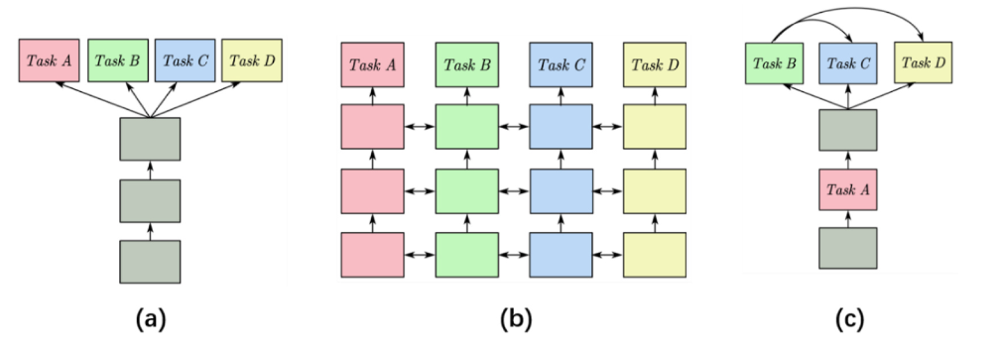

# 数字岩石分割和特征参数计算的多任务学习

数据集：https://www.digitalrocksportal.org/

代码：

主要内容：

Journal of Petroleum Science and Engineering 5.1

22年

---

“图像与计算”是数字岩石物理（DRP）的关键范式，两个主要过程相对独立。深度学习算法在数字岩石图像处理和数值计算领域得到了很好的应用，但不同任务的模型缺乏相关性，精度和效率还有较大的提升空间。多任务学习算法可以将图像处理和数值计算技术集成到同一个模型中，共享不同任务的有效信息，对于简化DRP工作流程、提高模型的计算精度具有重要意义。通过模拟DRP的工作序列，***设计了分布式多任务学习神经网络（***DMTNN），可以同时完成***数字岩石图像分割、岩石物理和弹性参数计算***。 DMTNN采用任务间串联和并联的策略，分割和岩石物理参数计算任务提供直观的低层特征作为辅助信息，以提高抽象高层目标的准确性。此外，采用动态权重策略解决训练过程中任务间相互干扰导致的收敛不平衡问题。为了验证所提出方法的有效性，使用六种不同的开源砂岩来形成训练集和测试集。结果表明，DMTNN 分割任务的平均像素精度（PA）为 0.97，孔隙率、剪切模量和体积模量的 R2 分数分别达到 0.92、0.74 和 0.79。此外，选择另一个完全未经训练的数字岩石数据作为交叉数据集，以验证所提出模型的鲁棒性。结果表明，DMTNN在跨数据集上：分割任务的PA可以达到0.95以上，弹性参数计算任务的相对误差低于传统CNN。

## 1.介绍

随着计算机技术的快速发展，结合新兴的高分辨率显微CT技术，数字岩石物理（DRP）已成为表征岩石物理性质的实用方法（Derzhi等，2011）。与岩石物理实验相比，DRP可以节省大量的财力。它可以在微观尺度上研究不同因素对岩石物性的影响，对于计算实验无法直接测量的物性具有充分的优势。 DRP“图像与计算”的关键范式是对天然岩石的孔隙空间和矿物基质进行成像和数字化，然后对该数字对象中的各种物理过程进行数值模拟，以获得渗透率、电导率和弹性等宏观岩石特性。模量（Andrâ等人，2013）。但完整的DRP工作流程需要丰富的图像处理和数值计算技术。 DRP 工作流程的基石是扫描岩石对象的分割（Andrâ等人，2013；Andrae 等人，2013），灰度图像的分割不是唯一的，因此分割算法需要手动交互和质量控制。 “计算”是DRP工作流程中的另一个关键点。 DRP通常采用数值模拟方法计算数字岩石数据的特征参数，主要包括有限元法（FEM）和传输波模拟（TWS）（Arns等，2002；Garboczi和Day，1995；Saenger和Bohlen） ，2004 年；Saenger 等人，2000 年；Saenger 和 Shapiro，2002 年）。数值模拟通常需要大量的计算资源和时间成本。此外，2D或3D数值模拟方法需要数字岩石图像的精确分割结果。虽然数字岩石图像分割任务与弹性参数预测任务密切相关，但方法和原理完全不同。 DRP工作流程存在顺序差异，需要更多的时间成本和专业技能才能获得完整有效的数字岩石信息。因此，寻找一种合适的方法来简化DRP的工作流程是非常有意义的。

近年来，人工智能蓬勃发展，已应用于自然语言处理（Jurafsky and Martin，2000；Sutskever et al.，2014；Turian et al.，2010）、模式识别（Karimpouli and Tahmasebi）等领域。 ，2019b；Ren et al.，2017；Woo et al.，2018）、生物信息学（Göokcen et al.，2019；Ronneberger et al.，2015）等领域。分析大数据、识别复杂模式和提取趋势的一种有效方法是通过深度学习算法（Tahmasebi 等人，2020）。深度学习算法对于数字岩石信息提取(Alqahtani et al., 2019; Andrae et al., 2013; Cui et al., 2020; Kamrava et al., 2020; Wu et al., 2018)、图像增强等具有实际意义。 （Kamrava 等人，2019）、岩石分类（Lima 等人，2019）和数字岩石重建（Mosser 等人，2017）。卷积神经网络（CNN）是近年来广泛使用的图像处理方法，它利用卷积层和池化层来提取图像信息并分析视觉特征。 CNN以数字岩石图像为输入，建立非线性映射关系，以任意尺度图像特征为输出。在 DRP 中，图像特征可以是原始数字岩石图像分割的结果、弹性参数、电性参数或其他岩石物理参数。然而，之前的研究表明，在有限的训练数据集下使用深度学习预测特征参数仍有很大的改进空间（Karimpouli and Tahmasebi，2019a，2019b）。我们认为有几个原因。首先，深度学习需要大量的数据来提取有效的特征（Zhu et al., 2012）。如果训练数据集不足，神经网络提取的图像信息有限，可能会陷入过拟合的陷阱。其次，神经网络训练过程中缺乏必要的先验信息约束，会影响网络的收敛速度，可能会停滞在局部极小值，进而产生较大的误差（Cui et al., 2020；Wu et al., 2020）。 ，2018）。第三，深度学习模型通常侧重于特定任务的优化。训练后的模型忽略了其他隐含的有效信息，导致鲁棒性较差。前人在有限的数字岩石数据集上做了大量的工作来提高深度学习模型的性能。 Karimouli 和 Tahmasebi（2019）应用混合模式和基于像素的模拟（HYPPS）方法来增强有限的数字岩石数据。 Wu和Yin(2018)在神经网络中加入孔隙度和比表面积作为物理约束，以提高渗透率的预测精度。 Cui and Cao(2020)将图像分割结果作为物理约束添加到CNN中进行弹性参数预测，提高了小规模训练数据集情况下特征参数的预测精度。 Alqahtani 和 Alzubaidi (2019) 设计了三个具有不同参数的卷积神经网络用于同步预测。前期研究结果表明，改进神经网络训练数据集、添加先验信息等方法有助于提高神经网络在特定任务中的性能，这对于深度学习方法在数字岩石领域的应用具有很大的启发

多任务学习为解决上述问题提供了一种新的方法，其目的是通过利用相关任务的训练信号中包含的特定领域信息来提高泛化能力。 （Caruana，1997；Ruder，2017；Vandenhende 等人，2020）。多任务学习是一种集成方法，允许多个任务通过同时训练相互交互。与单任务情况相比，多任务网络由于其固有的层共享而可以大大减少最终的内存占用。最重要的是，如果相关任务共享互补信息，它们就有可能提高性能。任务之间的信息交换可能有助于跨越潜在的局部最小值。多任务学习方法可以提高深度学习模型的鲁棒性。目前，多任务学习主要面临两个挑战。第一，网络架构：如何共享信息。一个高效的多任务网络必须关注特征共享部分和特定任务部分。它需要学习任务之间的通用表示（避免过度拟合）和每个任务的独特特征（避免欠拟合）。二、损失函数：如何平衡任务。多任务学习的损失函数分配每个任务损失的权重。在这个过程中，所有任务必须同等重要，简单的任务不能主导整个训练过程。手动设置权重效率低下且不是最优的，因此有必要自动设置这些权重以进行多任务处理。前期对这两个多任务问题的研究已经比较成熟，在计算机视觉（Vandenhende et al., 2020）、自然语言处理（Wang et al., 2018）、语音识别（Deng et al., 2018）、语音识别（Deng et al., 2020）等方面都有很好的应用。 ., 2013）、生物信息学（Widmer et al., 2010）等领域。在DRP工作流程中，可以采用多任务学习方法实现多个步骤的同时完成，可以大大减少工作量，具有一定的研究意义

在本研究中，设计了分布式多任务神经网络（DMTNN）。网络结构的设计模仿了DRP的工作流程，可以使图像处理和数值模拟顺利进行。** *DMTNN的输入是二维数字岩石图像，输出由四部分组成：数字岩石分割结果、孔隙率、体积模量和剪切模量。***在DRP中，岩石的弹性特性，如体积模量、剪切模量等，被认为是地震数据和地下参数之间的桥梁(Mavko等，2009)，这意味着弹性参数的预测为对于地震反演和岩石物理研究具有重要意义。由于弹性参数与数字岩石图像之间的逻辑关系复杂，导致模型预测困难，因此将这部分作为模型的主要任务。以弹性参数预测精度作为主要评价指标。数字岩石图像分割是 DRP 工作流程中非常重要的部分（Andrâ等人，2013）。数字岩石的孔隙度计算和分割是各项工作的基础。因此，它们被视为辅助任务，以提高主要任务的准确性并提供多角度信息。此外，本文对不同任务采用动态权重策略，给予性能较好的任务较低的权重，性能较差的任务较高的权重。通过动态权重，可以实现不同的任务优先级

[体积模量 - 维基百科，自由的百科全书 (wikipedia.org)](https://zh.wikipedia.org/wiki/%E4%BD%93%E7%A7%AF%E6%A8%A1%E9%87%8F)

[剪切模量 - 维基百科，自由的百科全书 (wikipedia.org)](https://zh.wikipedia.org/wiki/%E5%89%AA%E5%88%87%E6%A8%A1%E9%87%8F)

## 2.方法

总体工作流程如图1所示。在本研究中，我们使用开源数字岩石数据，其中包含原始数字岩石数据和二值图像数据。我们通过数值模拟方法计算了数字岩石的孔隙率、剪切模量和体积模量。我们以原始数字岩石数据作为模型的输入，利用迁移学习方法获得最优分割结果。然后传输分割结果来预测弹性参数和岩石物理参数

图 1. 总体工作流程。阈值分割算法和数值模拟方法提供了深度学习中四个任务所需的标签

### 2.1深度多任务模型

在深度学习的背景下，多任务学习是通过从多任务监督信号中学习共享表示来执行的。深层多任务架构通常通过隐藏层中的硬参数或软参数共享来完成。硬参数共享是多任务学习最常见的方法。***在实际应用中，参数集被分为共享部分和特定任务部分***，这大大降低了过拟合的风险（Baxter，1997；Kokkinos，2016；Lu et al.，2016）。另一方面，软参数共享，每个任务都有自己的参数和模型。软参数共享方法的一个问题是可扩展性，因为多任务网络的大小往往随着任务数量线性增长（Liu 等人，2018；Misra 等人，2016）。根据硬参数和软参数共享方法的优点，以及数字岩石数据和DRP任务的特点，我们提出了一种多任务学习网络。三个深度多任务模型如图2所示，我们的模型将在下一部分中介绍。

### 2.2DMTNN架构

在本研究中，设计并实现了分布式多任务神经网络（DMTNN）。模型结构如图2所示。分布式网络结构可以解决多种不同模式的任务组合训练带来的参数串扰问题。 ***DMTNN主要由分割网络、参数共享网络和信息提取网络三部分组成***。 DMTNN具有多级网络结构和动态失重功能。此外，网络输出的二值数字岩石图像的分割结果和孔隙度也作为低级辅助信息反映在网络结构中

图 2. 深度多任务模型。使用深度神经网络的多任务学习已细分为软参数共享方案和硬参数共享方案，分别如图2（a）和（b）所示。根据两种模型的优点以及DRP任务的特点，我们提出了一种新的多任务学习模型，如图2(c)所示

图 3. 模型架构。 DMTNN主要由分割网络、参数共享网络和信息提取网络三部分组成。最后网络输出三个特征参数，分别是孔隙率（phi）、剪切模量（miu）和体积模量（K）

#### 2.2.1 分割网络

分割网络采用改进的LinkNet（Woo et al., 2018）作为主要框架，通过迁移学习方法实现高精度分割。 LinkNet 是一个全卷积网络神经网络。全卷积神经网络可以接收任意尺寸的输入图像。使用上采样的策略，最终池化卷积层的输出可以恢复到与输入图像相同的大小，从而可以对每个像素产生预测。

分割网络如图3中的黑色虚线框所示。首先，参数初始化层接收灰色数字岩石图像，该初始化层由64通道、7×7内核大小和2步幅的卷积层和max-pooling层的stride为2，以获得大规模图像特征并达到参数初始化的效果。网络结构的左侧部分是用于特征提取的编码器，多个最大池化层实现了图像特征的多尺度特征识别。每个区域由4个3×3的卷积层组成，并通过残差结构连接，可以最大限度地提取图像特征并防止梯度消失。每次我们进行最大池化时，我们都会将输出像素的长度和宽度减半，并将特征通道加倍。网络结构的右半部分是解码器。每个区域将输出像素的长度和宽度加倍，并将特征通道减半。将解码器的输出与编码器的输入在通道维度上结合起来，在数量和质量上加厚特征通道维度，强化特征提取。网络的最后一层是1×1卷积层，用于输出最终结果（256 * 256 * 1分割图像）。

分割任务是本文的基础。数字岩石的精确两相分割是后续信息提取任务的前提。在多任务学习模型中，各个任务之间相互作用，无法保证单个任务收敛到最优。因此，在分割任务中，采用了迁移预训练网络的方法。灰度图像的分割过程本质上是图像有效信息的提取过程。作为辅助任务，为后续数字岩石参数预测奠定基础。

#### 2.2.2 参数共享网络

参数共享网络接收分割网络的输出并输出高维信息，如图3中的红色虚线框所示。参数共享网络由两个卷积模块组成。第一个卷积模块由两个具有 256 个通道和 3 × 3 内核大小的卷积神经网络组成，还具有 ReLU 激活函数层和 Batch Normalization 层（Ioffe 和 Szegedy，2015）。第二个卷积模块仅将卷积神经网络中的特征通道减半，其余部分不改变。最后，具有64个输入通道和1×1内核大小的卷积网络，输出256×256×64共享信息

#### 2.2.2 信息提取网络

信息提取网络由三个独立的子网络组成，如图3中蓝色虚线框所示。每个子网络接收来自参数共享网络的共享信息并输出预测的特征参数。孔隙度预测网络由两个特征提取模块和全连接网络组成。特征提取网络由两个提取特征的卷积神经网络和下采样层组成。通过ReLU激活函数和Batch Normalization方法进行卷积层之间的非线性映射。这部分网络提取的特征被视为有效特征，传输到弹性参数预测网络作为辅助信息，以提高主要任务的准确性

体积模量和剪切模量的预测网络是相同的。在每个特征提取模块之后，连接来自孔隙度预测网络的信息。然后将连接的信息通过信息传递到全连接层提取模块。最后，每个子网络输出一个特征参数，即孔隙率、剪切模量和体积模量。

### 2.3损失函数

在多任务学习中，每个任务都应该设置一个损失函数，然后将所有损失函数加权累加，形成整体损失函数。通过梯度反向传播来训练网络模型以优化整体损失函数。损失函数的一般定义如下：

本文中losstaskA、losstaskB和losstaskC分别代表孔隙率、剪切模量和体积模量预测任务的损失函数值。数字岩石图像分割任务采用迁移学习方法，不需要参与损失函数的优化。在对每个任务的损失进行权重分配的过程中，简单任务通常主导整个训练过程，从而导致简单任务的过拟合和复杂任务的欠拟合。必须确保所有任务都能得到优化。手动设置每个任务的权重（α，β，γ）效率低且工作量大。本研究采用动态权重策略，对难度较大的任务给予更大的权重和更高的优先级，从而缓解多任务训练的不平衡

#### 2.3.1分割模块的损失函数

对于二值分割任务，观测值y的值域为{0,1}。无论实际观测值是多少，都可以用{0,1}代替。显然，观测值y符合伯努利分布。伯努利分布只有一个参数 θ

如果数据集的分布为 D = {(x1,y1),(x2,y2),...(xn,yn)}，假设所有观测数据独立同分布，则观测到的对数似然等于

似然函数 l(θ) 是我们的目标函数，也称为二元交叉熵，它是所有观测数据的交叉熵之和。从优化神经网络模型的角度出发，我们得到交叉熵形式的损失函数，如下式所示，其中 yi 是观测值，p 是预测概率

#### 2.3.2回归模块的损失函数

本研究采用均方误差（MSE）作为回归模块（参数预测模块）的损失函数。 MSE损失函数用于计算预测数据与真实数据之间对应误差的均方和。其中yi是观测值，̂yi是神经网络的预测值。 C是一个常数，值为1000。目的是将回归模块损失函数的值缩小到与分割模块损失函数相同的数量级

#### 2.3.3动态权重策略

在本文的损失函数中，引入了关键绩效指标（KPI）作为评估单个任务以及任务难度的指标。对于每个任务Ti，选择合适的KPI：Ki∈[0,1]，如果Ki≥0.5可以认为该任务对于模型来说比较简单，否则比较困难。本文选择像素精度（PA）作为分割模块的KPI，选择R2-score作为参数预测模块。最后，计算每轮迭代中不同任务的KPI变化。评估标准的细节将在实验结果部分详细描述。构造动态权重W的函数表达式的想法来自于抑制简单样本在焦点损失中的应用(Guo et al., 2018; Lin et al., 2017)，其中KPI是可变的

等式中有两个超参数。 (8) 式中，σ 为控制因子。 σ越大，任务之间的权重差异越大。指数项γ是惩罚系数，可以是任意正整数。权重函数变化曲线如图4所示。

本文采用动态权重策略来解决不同优先级任务的问题。动态加权策略为训练不佳的任务赋予更高的权重，并优化模型梯度的更新方向。实验结果将在下一节中介绍。结合上述不同任务的损失函数和权重，本文使用的损失函数的形式如下

## 3.实验

### 3.1数据

材料准备是深度学习最重要的部分之一。数据集的质量往往决定神经网络训练的成败。我们使用来自 Digital Rocks Portal 的开源数字岩石数据。该数据集包含十一种不同砂岩孔隙结构的数字岩石。 3D数字岩石如图5所示，单个数据体是长宽高为1000×1000×1000的三维数字岩石，其中每个像素代表长度为2.25μm。为了验证多任务学习模型的有效性，本研究使用了六种不同的数字岩石数据作为训练和测试集，分别是Bandera Brown、Bandera Gray、Bentheimer、Berea、Berea Sister Gray、CastleGate。每种3D数字岩石数据可以沿固定维度切割1000张1000×1000像素大小的二维图像，我们使用6000张数字岩石图像来训练和测试神经网络。为了减少网络训练参数的规模，将1000像素的数字岩石图像减少到256张，其中5000个数据作为训练集，500个数据作为验证集，500个数据作为测试集。本研究中使用的六种不同的二维数字岩石数据如图 6 所示

图 6. 2D 数字岩石。 (a)-(f)分别是班德拉·布朗、班德拉·格雷、本特海默、伯里亚、伯里亚姐妹格雷、CastleGate。左图为原始数据，右图为groundtruth二值分割结果

### 3.2

在DRP中，当基础样本的体积至少为代表性基本体积（REV）的大小时，计算出的特征参数是有意义的（LI等，2019；Marco等，2016）。在研究中，每个二维灰度图像的尺寸为256×256像素，具有代表性，如图7所示。图7认为，当图像尺寸为200像素时，二维图像的孔隙率是恒定的。因此，当图像尺寸为 600 像素时，它是一个具有代表性的基本体积。因此，可以通过数值模拟的方法计算出该尺度二维图像的特征参数，计算结果可以大致反映数字岩石的特征

### 3.3对比实验

本研究设置了两组对比实验来验证DMTNN架构和动态权重策略的有效性。首先，比较传统CNN和DMTNN在相同数据集和权重策略下的性能。传统的CNN使用卷积层提取图像特征，然后将其传输到全连接层以拟合特定指标。本文使用的CNN架构如图8所示。其次，比较了相同网络结构下不同权重策略的性能差异。训练时设置了三种不同的重量策略。根据训练过程中不同任务的KPI变化，可以判断权重策略的表现

### 3.4训练 DMTNN 模型

DMTNN模型需要逐步训练。首先，训练分割模型并保存最佳模型。将最优的分割模型参数传递到整个网络，并冻结这部分的梯度以阻止反向传播。因此，分割模型可以准确地对数字岩石灰度图像进行二值分割，而不会受到后续任务的干扰。这部分可以看作是对灰度数字岩石图像进行有效的特征提取，为后续特征参数的预测提供先验信息约束。其次，设计参数共享网络，将从分割网络获得的二值图像传输到其中。该部分可以将256×256的单通道二值图像转换为256×256×64的高维共享特征，为下一步的多任务训练提供底层支持。最后，设计三个相同的卷积神经网络作为特征参数预测的信息提取网络，分别输出三个不同的数字岩石特征参数

本文使用的CNN参数总数约为1.7×106个，DMTNN参数总数约为2.2×107个，其中可学习参数总数约为1.10×107个，不可学习的参数数量约为1.15×107。本研究选择“自适应运动估计”（Kingma and Ba，2014）作为训练优化器，在100次迭代中完成梯度下降并优化损失函数。在训练过程中，采用手动控制优化器的学习率策略。在训练开始时，采用较大的学习率来提高模型的收敛速度并跨越可能的局部最小值。在训练后期，学习率逐渐降低，使模型向正确的方向收敛。神经网络训练和FEM数值模拟的时间成本对比如表1所示。本实验选择NVIDIA Quadro GV100作为DMTNN和CNN训练的GPU。数值模拟方法采用同一装置多核CPU并行计算

## 4.结果

### 4.1关键绩效指标

对于不同类别的任务，我们选择不同的KPI：Ki ∈ [0, 1]作为评价标准。分割部分的KPI是像素精度，表示预测类别正确的像素数占总像素数的比例。对于二值分割任务，对混淆矩阵进行计数：假阳性（FP）表示真实值是假的而模型认为是真的的像素数量；假阴性（FN）表示真实值为真而模型认为为假的像素数量； true Positive（TP）表示真实值为真且模型认为为真的像素数；假阴性（FN）表示真实值为真且模型认为为真的像素数量；真阴性（TN）表示真值为假且考虑的像素数模型错误。 TP和TN表示模型正确识别的像素数，FP和FN表示模型错误识别的像素数。 PA的表达式如下

选择R2-score作为回归（参数预测）部分的KPI，其中分子部分表示真实值与预测值的平方差之和，类似于均方误差；分母部分表示真实值与平均值的平方差之和，类似于方差 var. R2-score的值可以用来判断模型的好坏。值越高，模型的性能越好。反之，模型的性能就会越差。当R2-score小于0时，表示模型的性能低于真实值的平均值，因此一般认为取值范围为[0,1]。 R2-score表达式如下

### 4.2验证

#### 4.2.1分割模块

近年来，深度学习方法广泛应用于数字岩石图像分割。 2020年，Cui使用U-Net对灰度数字岩石图像进行分割，取得了良好的效果，PA可以达到0.95左右。本研究采用改进的LinkNet对二维灰度数字岩石图像进行分割。随机选取4张测试图像，分割结果如图9所示。当模型应用于测试集中的数字岩石图像时，PA在0.96到0.98之间，平均PA在0.97以上。与传统的U-Net卷积神经网络相比，模型的性能略有提升。与本文进行比较的阈值分割方法相比，分割网络的准确度稍低，因为它无法准确识别孔隙结构的复杂部分。深度学习模型不需要任何人工干预和专业技能，但准确率仍略有不足

图 9. DMTNN 的分割结果。左列显示灰度图像，中间列显示掩模，右列显示DMTNN的预测结果。平均 PA 为

#### 4.2.2 回归模块

用测试集测试训练后的模型是测试模型鲁棒性的最常见方法。本文选取500幅数字岩石图像作为测试集。我们对目标体积模量和剪切模量进行归一化，以消除损失函数计算中的数值尺度差距。另外，我们没有对目标孔隙率进行归一化，因为我们想用它作为辅助网络来提供准确有效的信息。孔隙率的有效范围在[0,1]之间，有意义的信息集中在[0,0.4]之间。孔隙率是一个具有物理意义的参数，也反映了图像分割后孔隙率与骨架的比例。该参数没有被归一化，有助于引导网络获取包含物理意义的信息。采用动态权重策略的CNN测试结果如图10所示。图7中的(a)、(b)和(c)三部分分别代表孔隙率(phi)、剪切模量(miu)和体积的测试结果模型测试中的模（K）预测任务。上半部分的直方图显示了残差分布，下半部分的散点图显示了真实观测值与预测值的分布比较。黑色虚线越接近，拟合效果越好。预测的孔隙率 R2 得分为 0.47，剪切模量 R2 得分为 0.64，体积模量 R2 得分为 0.58。

CNN网络结构相对简单，缺乏地球物理约束等辅助任务提供有效信息，因此无法高精度估计多个特征参数。使用相同的测试集对DMTNN进行测试，结果如图11所示。预测的孔隙率R2-score为0.92，剪切模量R2-score为0.74，体积模量R2-score为0.79。该网络结构加入二值图像和孔隙度的分割结果作为地球物理约束和辅助信息后，可以提高弹性模量的预测精度。为了更清楚地展示训练过程，我们画了损失函数曲线训练过程中的train-set和test-set，如图12所示

#### 4.2.3 动态权重策略的验证

为了验证动态权重策略的有效性，本文设计了两种固定权重训练策略。固定权重策略分别为Wphi:Wmiu:WK = 1 : 1 : 1和Wphi:Wmiu:WK = 1 : 10 : 3。训练过程中训练集的KPI曲线和任务权重分布如图13

当损失函数选择的权重策略为Wphi:Wmiu:WK=1:1:1时，如图13(b)所示，网络模型对于训练集上三个参数的收敛结果是完全不同的。该模型倾向于优化简单的任务。该结果与之前使用神经网络多输出模型预测数字岩石属性的结果类似（Alqahtani et al., 2019）。当损失函数选择策略为Wphi:Wmiu:WK = 1 : 10 : 3时，如图13(b)所示，训练集上三个参数的网络模型的收敛结果差距较小。由于权重较高，剪切模量的预测精度有所提高，R2-score为0.82，而体积模量的预测精度变化不大，R2-score约为0.86。然而，由于权重设置较小，孔隙度预测任务的准确性有所下降，R2-score约为0.89。实验结果表明，对学习困难的任务设置较高的损失权重可以起到优化作用，但会影响容易学习的任务

损失函数选择动态权重策略，如图13(c)所示。由于三个不同任务的损失权重处于动态变化，训练初期的稳定性不如固定权重策略。在训练初期，由于孔隙率预测任务的损失函数远小于弹性参数预测任务的损失函数，因此模型倾向于优化梯度较大的任务。动态权重策略赋予孔隙度预测任务更高的权重，使得收敛速度加快。训练后期，Wphi的数量级约为10 4，WK的数量级约为10 3，Wmiu的数量级约为10 2。不同任务之间的相对损失权重差异仍然存在，这使模型专注于困难的任务。从KPI变化图可以看出，经过100次迭代后，孔隙率R2-score约为0.94，体积模量约为0.88，剪切模量约为0.84。因此，动态权重策略可以在模型训练过程中考虑到不同任务的优化过程

#### 4.2.4DMTNN 稳健性验证

为了验证DMTNN的鲁棒性，我们使用跨数据集来测试本研究中使用的神经网络。选择第七个未经训练的砂岩数字岩石 CastleGate 作为测试数据。随机选取二十幅二维数字岩石图像作为网络的输入，比较CNN和DMTNN对于三个特征参数预测的相对误差。两种模型的性能如图14所示。图14（a-c）和（e-f）分别显示了CNN的孔隙率、剪切模量和体积模量的真实值与预测值之间的比较和 DMTNN。表2显示了CNN和DMTNN对groundtruth和预测值之间误差的统计。我们使用均方误差（MSE）、平均绝对误差（MAE）和相对误差作为判断模型稳健性的标准。与CNN模型相比，利用DMTNN模型预测数字岩石弹性参数的相对误差降低了10%以上。结果表明，DMTNN 比传统 CNN 模型具有更好的鲁棒性。

此外，DMTNN在跨数据集上具有良好的分割效果，平均PA可以达到0.95。原始数据、标签图像、模型预测如图15所示

## 5.讨论

多任务学习主要需要考虑和解决两个问题：一是模型架构，二是损失功能。模型架构的设计是工作的主体。本研究设计了一个分布式网络来保证任务之间的独立性和共享性并存。损失函数的设计是多任务学习中一项重要的优化工作。我们根据KPI的变化选择动态权重优化策略。验证集结果表明，多任务学习模型有助于简化DRP的工作流程。将多任务学习应用于数字岩石领域时，由于任务间参数共享带来的噪声过大，无法达到单任务模型的精度。因此，网络结构和权值分配的设计还有很大的改进空间。此外，我们证明增加训练轮次是提高网络模型精度的方法之一。目前深度学习方法在DRP中的应用还存在很多问题。数据的缺乏是制约神经网络模型准确性和鲁棒性的关键。浅层神经网络通常用于小规模数据集，以防止过拟合。因此，在有限的网络深度下高效提取图像特征是网络设计的重中之重。另一个重要的方法是数据增强。生成对抗网络（GAN）近年来发展迅速，成为2D或3D数字岩石重建的有效方法。本文在多任务学习模型中添加了孔隙和骨架的两阶段分割作为辅助任务。本质上，多相分割是对骨骼的进一步分割。更精确的细分有助于提供更多信息。但对于弹性参数的计算，固体骨架和孔隙填充材料的结构及其相应的模量对最终结果影响较大，而固体骨架相间的差异对预计算的精度影响相对较小。 - 措辞结果。具体影响值得进一步探讨。在今后的工作中，我们希望在两个方面实现优化。第一个是将多任务学习网络应用于3D数字岩石数据。三维神经网络的时间复杂度和空间复杂度均为O(N3)，比二维神经网络高一个数量级。此外，我们需要足够的数字岩石样本进行训练，生成对抗网络（GAN）值得考虑。第二是通过添加数据进一步扩展网络的鲁棒性。深度学习模型可以利用不同类型孔隙结构的数字岩石数据进行训练，更有效地提高泛化能力。

## 6.结论

本研究提出了一种分布式多任务学习网络（DMTNN），它将四个任务合并到一个网络中进行训练。在DMTNN中，数字岩石图像分割任务是整个网络的基础部分。数字岩石灰度数据高效、准确的二值分割本质上是对图像进行有效的信息提取。分割结果传输到参数共享层进行维度扩展，然后传输到并行的三个信息共享网络进行特征参数预测。在多任务损失函数设计中，为了平衡多任务对损失函数的贡献不同的问题，采用动态权重变化策略。实验结果表明，DMTNN结合动态权重策略能够准确实现数字岩石图像分割、孔隙度、剪切模量、体积模量四个部分的特征参数预测。与传统的数值模拟方法（如FEW方法）相比，多任务学习模型的训练花费的时间成本更少，并且几乎不需要任何成本来预测未训练的数据。与传统CNN相比，DMTNN不仅可以实现高效的二值分割，而且具有更高的精度。与单任务网络模型相比，多任务学习网络可以实现“单输入多输出”，这是单任务网络无法比拟的优势。跨数据集的结果表明，与传统的多输出CNN和单任务模型相比，DMTNN具有很强的鲁棒性

---

## 附录A

在附录A中，我们进行了一些对比实验，探讨多任务学习模型的准确性与网络结构之间的关系。我们主要讨论以下三个部分：首先是切分模块的作用。其次是网络深度与多任务模型鲁棒性的关系。三是单任务模型和多任务模型的优缺点

Cui增加图像分割结果作为CNN进行弹性参数预测的物理约束，提高了特征参数的预测精度。这启发我们将数字岩石图像的分割结果作为地球物理约束添加到神经网络中，这有助于卷积神经网络的收敛。另一方面，图像分割是DRP工作流程中非常重要和基础的部分，分割后的数字岩石图像需要作为数值模拟方法计算特征参数的输入数据。并且实验表明，与无分割的MTNN（MTNN_WS）模型相比，MTNN在数字岩石孔隙度的预测精度上有较大的提高。当不同任务同步训练时，将分割后的二值图像输入到卷积神经网络中，可以有效减少孔隙率预测的残差。同时，孔隙率预测网络作为辅助任务提供的信息更加准确

深度学习模型的准确率与网络结构的深度密切相关，但在高预测准确率的外衣下，永远无法避免过拟合的陷阱。在大型数据集中，例如 ImageNet，包含超过 100 层的深度神经网络已经实现了超越人类表现的分类。然而，由数千张数字岩石图像组成的训练集可能不适合深度网络。本文选择了四种不同深度的网络，并使用相同的数据集进行训练。测试集的预测结果如表A1所示。虽然深度神经网络在训练集上可以取得很好的效果，但随着深度的增加，网络呈现出过拟合的趋势，体现在测试集上的准确率较低。如何平衡网络深度和过拟合是深度学习方法与DRP结合的关键，这将是未来非常有意义的研究方向

目前，针对特定指标的优化仍然是深度学习方法的主要应用。多任务学习算法期望通过单一模型完成不同的任务，从而提高主要任务的效率或准确性。但实验表明，在相同的网络深度（不存在过拟合问题）下，单任务模型往往具有更高的准确率，实验结果如表A2所示。原因是模型训练过程中不同的任务会产生噪声。虽然噪声的产生会影响单个指标的计算精度，但有助于提高模型的鲁棒性

