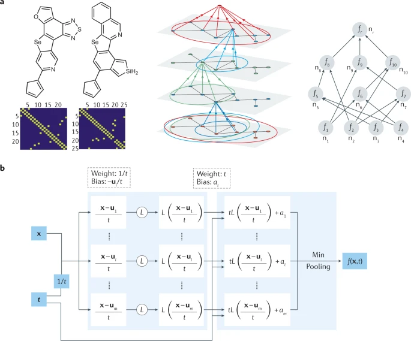
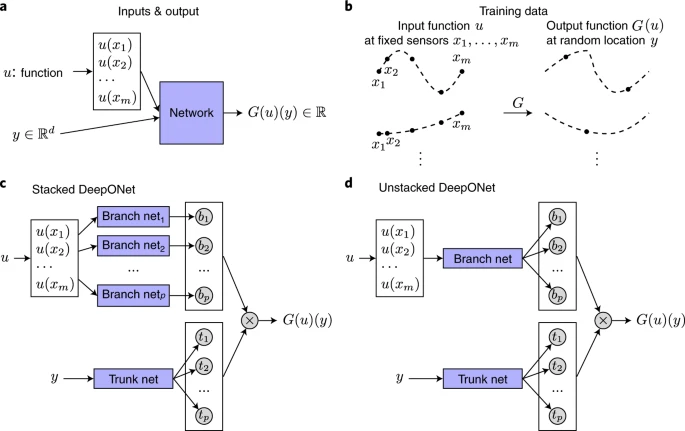
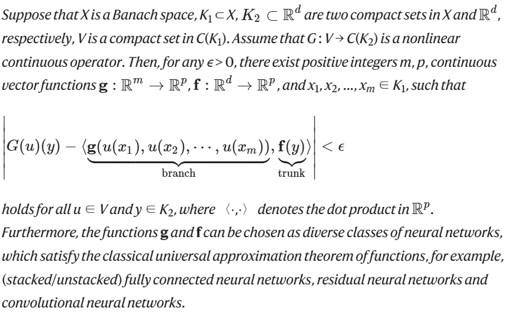
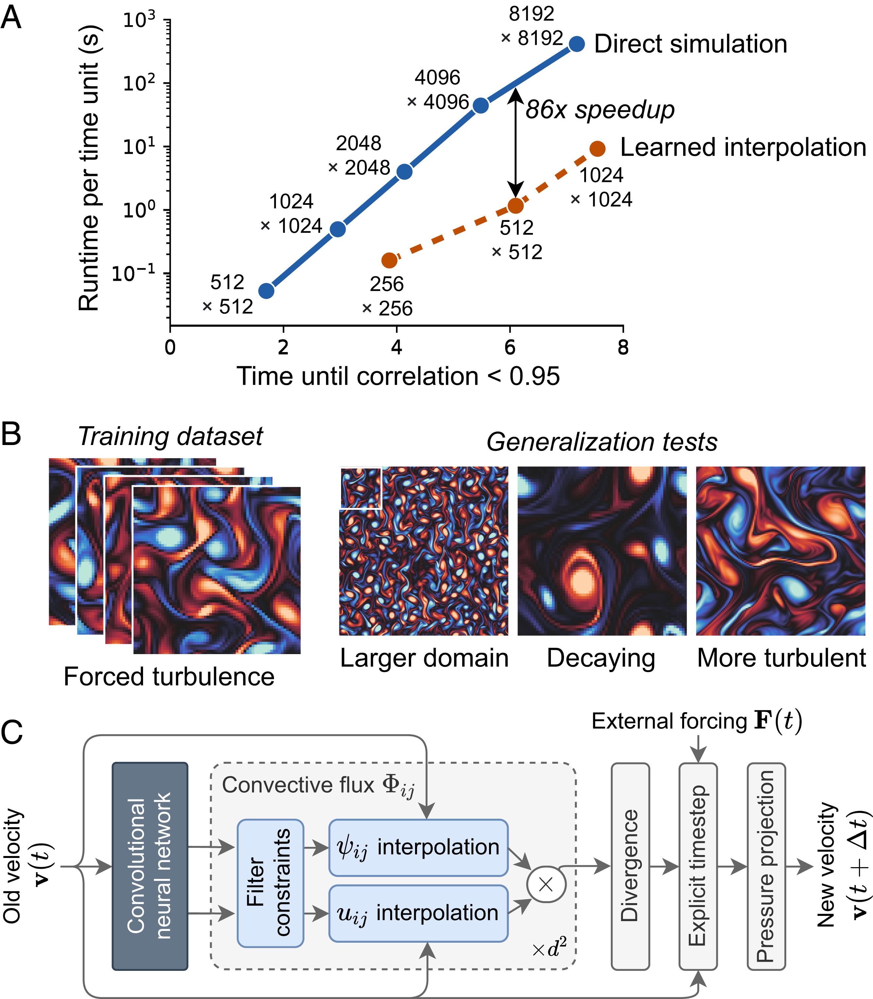
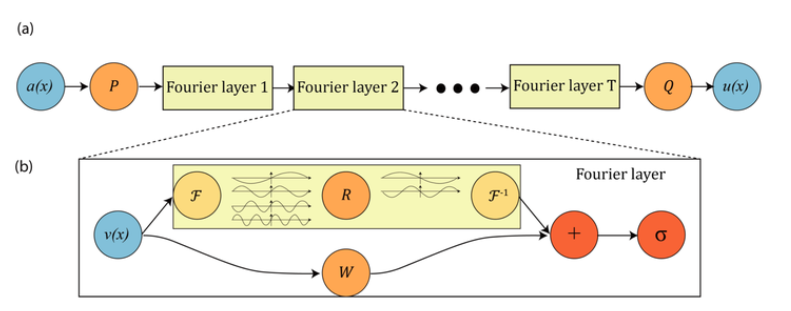
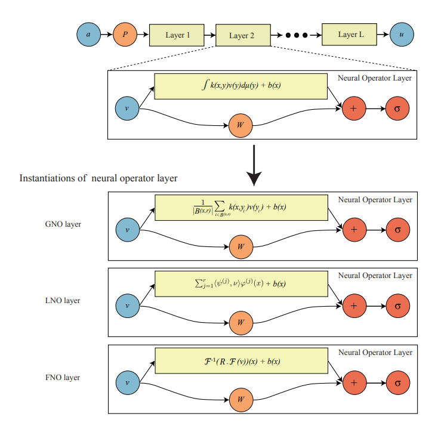

# [Physics-informed machine learning | Nature Reviews Physics](https://www.nature.com/articles/s42254-021-00314-5#Sec1)

这篇论文的主要内容是：

* [ **物理信息机器学习** ：一种将数据和数学物理模型无缝集成的方法，即使在部分理解、不确定和高维环境中也是如此。](https://edgeservices.bing.com/edgesvc/chat?udsframed=1&form=SHORUN&clientscopes=chat,noheader,udsedgeshop,channelstable,&shellsig=ecea736f8b330537b091ef89e481bb9f4c34ede8&setlang=zh-CN&lightschemeovr=1#sjevt%7CDiscover.Chat.SydneyClickPageCitation%7Cadpclick%7C0%7Cf8430dc7-54d2-484d-a954-466a4db5dd70%7C%7B%22sourceAttributions%22%3A%7B%22providerDisplayName%22%3A%22%E7%89%A9%E7%90%86%E4%BF%A1%E6%81%AF%E6%9C%BA%E5%99%A8%E5%AD%A6%E4%B9%A0%E6%97%A0%E7%BC%9D...%22%2C%22pageType%22%3A%22html%22%2C%22pageIndex%22%3A1%2C%22relatedPageUrl%22%3A%22https%253A%252F%252Fwww.nature.com%252Farticles%252Fs42254-021-00314-5%2523Sec5%22%2C%22lineIndex%22%3A30%2C%22highlightText%22%3A%22%E7%89%A9%E7%90%86%E4%BF%A1%E6%81%AF%E6%9C%BA%E5%99%A8%E5%AD%A6%E4%B9%A0%E6%97%A0%E7%BC%9D%E9%9B%86%E6%88%90%E6%95%B0%E6%8D%AE%E5%92%8C%E6%95%B0%E5%AD%A6%E7%89%A9%E7%90%86%E6%A8%A1%E5%9E%8B%EF%BC%8C%E5%8D%B3%E4%BD%BF%E5%9C%A8%E9%83%A8%E5%88%86%E7%90%86%E8%A7%A3%E3%80%81%E4%B8%8D%E7%A1%AE%E5%AE%9A%E5%92%8C%E9%AB%98%E7%BB%B4%E7%8E%AF%E5%A2%83%E4%B8%AD%E4%B9%9F%E6%98%AF%E5%A6%82%E6%AD%A4%E3%80%82%22%2C%22snippets%22%3A%5B%5D%7D%7D)[这种方法使用神经网络或其他基于内核的回归网络来实现。](https://edgeservices.bing.com/edgesvc/chat?udsframed=1&form=SHORUN&clientscopes=chat,noheader,udsedgeshop,channelstable,&shellsig=ecea736f8b330537b091ef89e481bb9f4c34ede8&setlang=zh-CN&lightschemeovr=1#sjevt%7CDiscover.Chat.SydneyClickPageCitation%7Cadpclick%7C1%7Cf8430dc7-54d2-484d-a954-466a4db5dd70%7C%7B%22sourceAttributions%22%3A%7B%22providerDisplayName%22%3A%22%E8%BF%99%E7%A7%8D%E7%89%A9%E7%90%86%E4%BF%A1%E6%81%AF%E5%AD%A6%E4%B9%A0%E9%9B%86%E6%88%90...%22%2C%22pageType%22%3A%22html%22%2C%22pageIndex%22%3A1%2C%22relatedPageUrl%22%3A%22https%253A%252F%252Fwww.nature.com%252Farticles%252Fs42254-021-00314-5%2523Sec5%22%2C%22lineIndex%22%3A28%2C%22highlightText%22%3A%22%E8%BF%99%E7%A7%8D%E7%89%A9%E7%90%86%E4%BF%A1%E6%81%AF%E5%AD%A6%E4%B9%A0%E9%9B%86%E6%88%90%E4%BA%86%EF%BC%88%E5%99%AA%E5%A3%B0%EF%BC%89%E6%95%B0%E6%8D%AE%E5%92%8C%E6%95%B0%E5%AD%A6%E6%A8%A1%E5%9E%8B%EF%BC%8C%E5%B9%B6%E9%80%9A%E8%BF%87%E7%A5%9E%E7%BB%8F%E7%BD%91%E7%BB%9C%E6%88%96%E5%85%B6%E4%BB%96%E5%9F%BA%E4%BA%8E%E5%86%85%E6%A0%B8%E7%9A%84%E5%9B%9E%E5%BD%92%E7%BD%91%E7%BB%9C%E5%AE%9E%E7%8E%B0%E5%AE%83%E4%BB%AC%E3%80%82%22%2C%22snippets%22%3A%5B%5D%7D%7D)
* **ML与物理嵌入的方式** ：有三种主要的方式，分别是 **观测偏差** 、**归纳偏差**和 **学习偏差** 。
* [ **观测偏差** ：通过使用反映基础物理学的数据或精心设计的数据增强程序来引入。](https://edgeservices.bing.com/edgesvc/chat?udsframed=1&form=SHORUN&clientscopes=chat,noheader,udsedgeshop,channelstable,&shellsig=ecea736f8b330537b091ef89e481bb9f4c34ede8&setlang=zh-CN&lightschemeovr=1#sjevt%7CDiscover.Chat.SydneyClickPageCitation%7Cadpclick%7C2%7Cf8430dc7-54d2-484d-a954-466a4db5dd70%7C%7B%22sourceAttributions%22%3A%7B%22providerDisplayName%22%3A%22%E8%A7%82%E6%B5%8B%E5%81%8F%E5%B7%AE%E5%8F%AF%E4%BB%A5%E7%9B%B4%E6%8E%A5%E9%80%9A%E8%BF%87...%22%2C%22pageType%22%3A%22html%22%2C%22pageIndex%22%3A1%2C%22relatedPageUrl%22%3A%22https%253A%252F%252Fwww.nature.com%252Farticles%252Fs42254-021-00314-5%2523Sec5%22%2C%22lineIndex%22%3A47%2C%22highlightText%22%3A%22%E8%A7%82%E6%B5%8B%E5%81%8F%E5%B7%AE%E5%8F%AF%E4%BB%A5%E7%9B%B4%E6%8E%A5%E9%80%9A%E8%BF%87%E4%BD%93%E7%8E%B0%E5%9F%BA%E7%A1%80%E7%89%A9%E7%90%86%E5%AD%A6%E7%9A%84%E6%95%B0%E6%8D%AE%E6%88%96%E7%B2%BE%E5%BF%83%E8%AE%BE%E8%AE%A1%E7%9A%84%E6%95%B0%E6%8D%AE%E5%A2%9E%E5%BC%BA%E7%A8%8B%E5%BA%8F%E6%9D%A5%E5%BC%95%E5%85%A5%E3%80%82%22%2C%22snippets%22%3A%5B%5D%7D%7D)[在这些数据上训练机器学习系统可以让它学习反映数据物理结构的函数、向量场和运算符。](https://edgeservices.bing.com/edgesvc/chat?udsframed=1&form=SHORUN&clientscopes=chat,noheader,udsedgeshop,channelstable,&shellsig=ecea736f8b330537b091ef89e481bb9f4c34ede8&setlang=zh-CN&lightschemeovr=1#sjevt%7CDiscover.Chat.SydneyClickPageCitation%7Cadpclick%7C3%7Cf8430dc7-54d2-484d-a954-466a4db5dd70%7C%7B%22sourceAttributions%22%3A%7B%22providerDisplayName%22%3A%22%E5%9C%A8%E6%AD%A4%E7%B1%BB%E6%95%B0%E6%8D%AE%E4%B8%8A%E8%AE%AD%E7%BB%83%E6%9C%BA%E5%99%A8...%22%2C%22pageType%22%3A%22html%22%2C%22pageIndex%22%3A1%2C%22relatedPageUrl%22%3A%22https%253A%252F%252Fwww.nature.com%252Farticles%252Fs42254-021-00314-5%2523Sec5%22%2C%22lineIndex%22%3A47%2C%22highlightText%22%3A%22%E5%9C%A8%E6%AD%A4%E7%B1%BB%E6%95%B0%E6%8D%AE%E4%B8%8A%E8%AE%AD%E7%BB%83%E6%9C%BA%E5%99%A8%E5%AD%A6%E4%B9%A0%20%EF%BC%88ML%EF%BC%89%20%E7%B3%BB%E7%BB%9F%E5%85%81%E8%AE%B8%E5%AE%83%E5%AD%A6%E4%B9%A0%E5%8F%8D%E6%98%A0%E6%95%B0%E6%8D%AE%E7%89%A9%E7%90%86%E7%BB%93%E6%9E%84%E7%9A%84%E5%87%BD%E6%95%B0%E3%80%81%E5%90%91%E9%87%8F%E5%9C%BA%E5%92%8C%E8%BF%90%E7%AE%97%E7%AC%A6%E3%80%82%22%2C%22snippets%22%3A%5B%5D%7D%7D)
* [ **归纳偏差** ：通过量身定制的干预将先前的假设合并到机器学习模型架构中，从而隐含地满足一组给定的物理定律，通常以某些数学约束的形式表示。](https://edgeservices.bing.com/edgesvc/chat?udsframed=1&form=SHORUN&clientscopes=chat,noheader,udsedgeshop,channelstable,&shellsig=ecea736f8b330537b091ef89e481bb9f4c34ede8&setlang=zh-CN&lightschemeovr=1#sjevt%7CDiscover.Chat.SydneyClickPageCitation%7Cadpclick%7C4%7Cf8430dc7-54d2-484d-a954-466a4db5dd70%7C%7B%22sourceAttributions%22%3A%7B%22providerDisplayName%22%3A%22%E5%BD%92%E7%BA%B3%E5%81%8F%E5%B7%AE%E5%AF%B9%E5%BA%94%E4%BA%8E%E5%85%88%E5%89%8D%E7%9A%84...%22%2C%22pageType%22%3A%22html%22%2C%22pageIndex%22%3A1%2C%22relatedPageUrl%22%3A%22https%253A%252F%252Fwww.nature.com%252Farticles%252Fs42254-021-00314-5%2523Sec5%22%2C%22lineIndex%22%3A48%2C%22highlightText%22%3A%22%E5%BD%92%E7%BA%B3%E5%81%8F%E5%B7%AE%E5%AF%B9%E5%BA%94%E4%BA%8E%E5%85%88%E5%89%8D%E7%9A%84%E5%81%87%E8%AE%BE%EF%BC%8C%E8%BF%99%E4%BA%9B%E5%81%87%E8%AE%BE%E5%8F%AF%E4%BB%A5%E9%80%9A%E8%BF%87%E9%87%8F%E8%BA%AB%E5%AE%9A%E5%88%B6%E7%9A%84%E5%B9%B2%E9%A2%84%E5%90%88%E5%B9%B6%E5%88%B0%20ML%20%E6%A8%A1%E5%9E%8B%E6%9E%B6%E6%9E%84%E4%B8%AD%EF%BC%8C%E5%9B%A0%E6%AD%A4%E6%89%80%E5%AF%BB%E6%B1%82%E7%9A%84%E9%A2%84%E6%B5%8B%E4%BF%9D%E8%AF%81%E9%9A%90%E5%90%AB%E5%9C%B0%E6%BB%A1%E8%B6%B3%E4%B8%80%E7%BB%84%E7%BB%99%E5%AE%9A%E7%9A%84%E7%89%A9%E7%90%86%E5%AE%9A%E5%BE%8B%EF%BC%8C%E9%80%9A%E5%B8%B8%E4%BB%A5%E6%9F%90%E4%BA%9B%E6%95%B0%E5%AD%A6%E7%BA%A6%E6%9D%9F%E7%9A%84%E5%BD%A2%E5%BC%8F%E8%A1%A8%E7%A4%BA%E3%80%82%22%2C%22snippets%22%3A%5B%5D%7D%7D)这些定律可以是对称性、不变性、守恒律等。
* [ **学习偏差** ：通过适当选择损失函数、约束和推理算法来引入，这些算法可以调节机器学习模型的训练阶段，以明确支持收敛到符合基础物理的解决方案。](https://edgeservices.bing.com/edgesvc/chat?udsframed=1&form=SHORUN&clientscopes=chat,noheader,udsedgeshop,channelstable,&shellsig=ecea736f8b330537b091ef89e481bb9f4c34ede8&setlang=zh-CN&lightschemeovr=1#sjevt%7CDiscover.Chat.SydneyClickPageCitation%7Cadpclick%7C5%7Cf8430dc7-54d2-484d-a954-466a4db5dd70%7C%7B%22sourceAttributions%22%3A%7B%22providerDisplayName%22%3A%22%E5%8F%AF%E4%BB%A5%E9%80%9A%E8%BF%87%E9%80%82%E5%BD%93%E9%80%89%E6%8B%A9%E6%8D%9F%E5%A4%B1...%22%2C%22pageType%22%3A%22html%22%2C%22pageIndex%22%3A1%2C%22relatedPageUrl%22%3A%22https%253A%252F%252Fwww.nature.com%252Farticles%252Fs42254-021-00314-5%2523Sec5%22%2C%22lineIndex%22%3A49%2C%22highlightText%22%3A%22%E5%8F%AF%E4%BB%A5%E9%80%9A%E8%BF%87%E9%80%82%E5%BD%93%E9%80%89%E6%8B%A9%E6%8D%9F%E5%A4%B1%E5%87%BD%E6%95%B0%E3%80%81%E7%BA%A6%E6%9D%9F%E5%92%8C%E6%8E%A8%E7%90%86%E7%AE%97%E6%B3%95%E6%9D%A5%E5%BC%95%E5%85%A5%E5%AD%A6%E4%B9%A0%E5%81%8F%E5%B7%AE%EF%BC%8C%E8%BF%99%E4%BA%9B%E7%AE%97%E6%B3%95%E5%8F%AF%E4%BB%A5%E8%B0%83%E8%8A%82%20ML%20%E6%A8%A1%E5%9E%8B%E7%9A%84%E8%AE%AD%E7%BB%83%E9%98%B6%E6%AE%B5%EF%BC%8C%E4%BB%A5%E6%98%8E%E7%A1%AE%E6%94%AF%E6%8C%81%E6%94%B6%E6%95%9B%E5%88%B0%E7%AC%A6%E5%90%88%E5%9F%BA%E7%A1%80%E7%89%A9%E7%90%86%E7%9A%84%E8%A7%A3%E5%86%B3%E6%96%B9%E6%A1%88%E3%80%82%22%2C%22snippets%22%3A%5B%5D%7D%7D)这些约束可以是积分、微分甚至分数方程。

  

# [Learning nonlinear operators via DeepONet based on the universal approximation theorem of operators | Nature Machine Intelligence](https://www.nature.com/articles/s42256-021-00302-5)

[AI与PDE（三）：大概是最好懂的DeepONet模型解析 - 知乎 (zhihu.com)](https://zhuanlan.zhihu.com/p/514148390)

  

* a，为了让网络学习算子 G : u ↦ G(u)，它需要两个输入 [u(x1), u(x2), …, u(xm)] 和 y。
* b，训练数据说明。对于每个输入函数 u，我们要求在相同的分散传感器 x1、x2、...、xm 处进行相同数量的评估。然而，我们不对输出函数评估的数量或位置施加任何限制。
* c、堆叠式DeepONet受定理1启发，具有1个主干网络和p个堆叠式分支网络。定理1构建的网络是一个堆叠式DeepONet，选择主干网作为宽度为p的单层网络，每个分支网作为宽度为n的单隐层网络。
* d、非堆叠DeepONet受定理2启发，有1个主干网络和1个分支网络。非堆叠式 DeepONet 可以视为堆叠式 DeepONet，其中所有分支网络共享同一组参数。

  
* **非线性运算符学习** ：作者提出了一个新的框架，DeepONet，使用深度神经网络从数据中学习非线性运算符。他们受到运算符的通用逼近定理的启发，设计了两个子网络，分支网络和主干网络，分别处理输入函数和输出位置。
* **DeepONet理论和架构** ：作者将通用逼近定理扩展到深度神经网络，并介绍了两个版本的DeepONet，堆叠和非堆叠。他们还讨论了如何生成数据和在不同空间中表示输入函数。
* **结果和讨论** ：作者通过学习16个不同的运算符（包括显式和隐式运算符、确定性和随机运算符、线性和非线性运算符）来展示DeepONet的能力和效率。他们将DeepONet与其他网络架构进行比较，显示出DeepONet具有小的泛化误差和快速的学习速度。

# [Machine learning–accelerated computational fluid dynamics | PNAS](https://www.pnas.org/doi/10.1073/pnas.2101784118#executive-summary-abstract)

# FOURIER NEURAL OPERATOR FOR PARAMETRIC PARTIAL DIFFERENTIAL EQUATIONS

[AI与PDE（四）：FNO与算子学习的范式 - 知乎 (zhihu.com)](https://zhuanlan.zhihu.com/p/520487599)

# [Neural Operator: Learning Maps Between Function Spaces With Applications to PDEs](https://www.jmlr.org/papers/volume24/21-1524/21-1524.pdf) 

# [PINNeik: Eikonal solution using physics-informed neural networks - ScienceDirect](https://www.sciencedirect.com/science/article/pii/S009830042100131X?via%3Dihub#abs0015)

# [ANI-1: an extensible neural network potential with DFT accuracy at force field computational cost - Chemical Science (RSC Publishing)](https://pubs.rsc.org/en/content/articlelanding/2017/SC/C6SC05720A)

# Physics-informed neural networks: A deep learning framework for solving forward and inverse problems involving nonlinear partial differential equations

# Deep Potential Molecular Dynamics: A Scalable Model with the Accuracy of Quantum Mechanics
